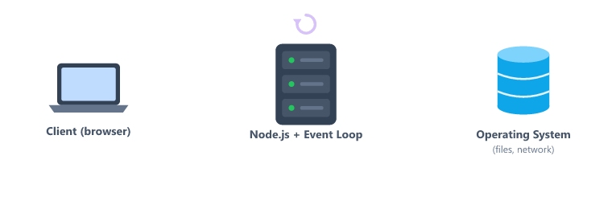
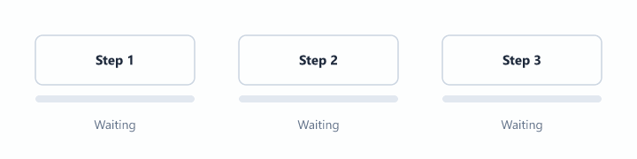
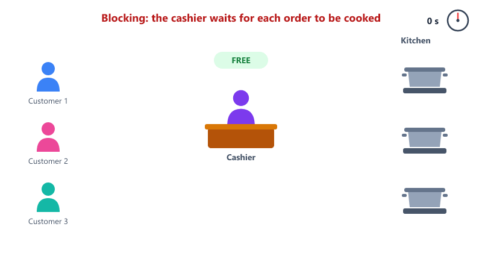
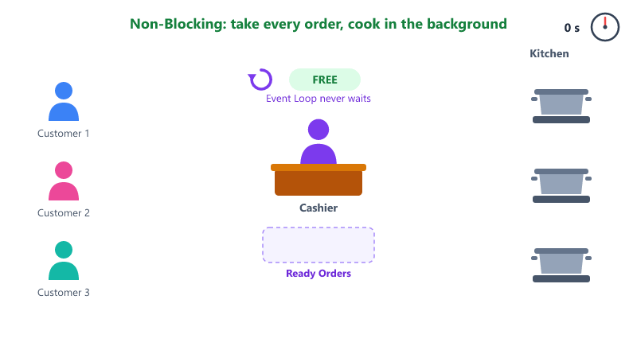
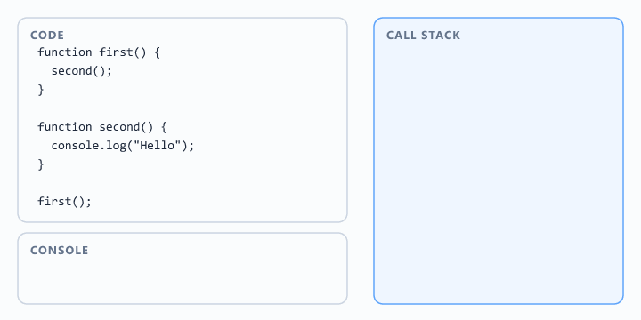
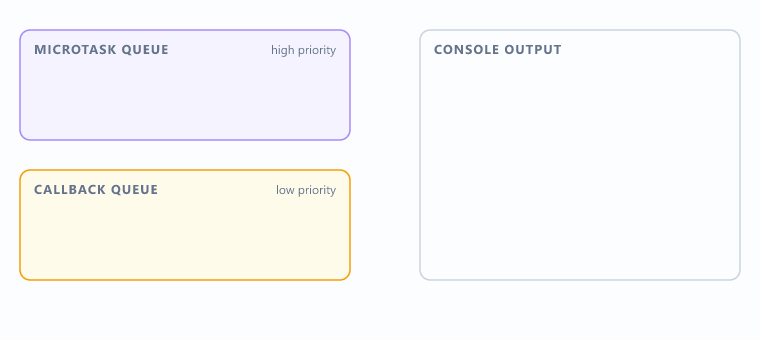
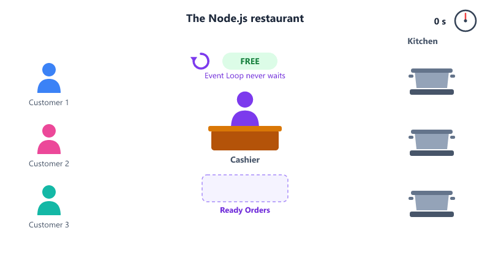
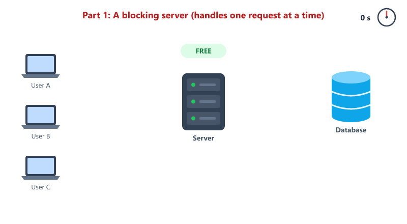
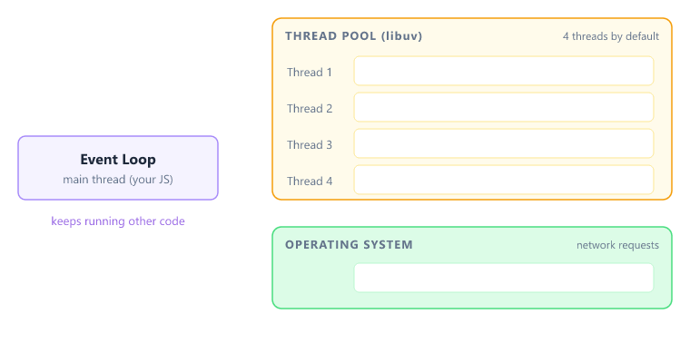

## Table of Contents

* [Why Learn How Node.js Works?](#why-learn-how-nodejs-works)
* [What Makes Node.js Different?](#what-makes-nodejs-different)
* [Single Threaded Architecture](#single-threaded-architecture)
* [Synchronous Programming](#synchronous-programming)
* [Asynchronous Programming](#asynchronous-programming)
* [Blocking Operations](#blocking-operations)
* [Non-Blocking Operations](#non-blocking-operations)
* [What is the Call Stack?](#what-is-the-call-stack)
* [What is the Event Loop?](#what-is-the-event-loop)
* [What is the Callback Queue?](#what-is-the-callback-queue)
* [How Event Loop Works](#how-event-loop-works)
* [setTimeout with 0 Delay](#settimeout-with-0-delay)
* [What is a Callback?](#what-is-a-callback)
* [Callback Hell](#callback-hell)
* [What is a Promise?](#what-is-a-promise)
* [async and await](#async-and-await)
* [Callback vs Promise vs async/await](#callback-vs-promise-vs-asyncawait)
* [Microtask Queue](#microtask-queue)
* [Restaurant Example](#restaurant-example)
* [How Node.js Handles Client Requests](#how-nodejs-handles-client-requests)
* [Node.js Architecture](#nodejs-architecture)
* [libuv and the Thread Pool](#libuv-and-the-thread-pool)
* [Blocking the Event Loop](#blocking-the-event-loop)
* [Why Node.js is Fast](#why-nodejs-is-fast)
* [Beginner Mistakes](#beginner-mistakes)
* [Practice Questions](#practice-questions)
* [Interview Questions](#interview-questions)

---

## Why Learn How Node.js Works?

Many beginners learn Node.js like this

```javascript
app.get("/users", () => {});
```

or

```javascript
fs.readFile();
```

The code works.

But they do not understand what happens behind the scenes.

A good backend developer should understand



This session focuses on understanding that process.

---

## What Makes Node.js Different?

Most backend technologies create multiple threads to handle multiple users.

Node.js uses a different approach.

Node.js uses


This combination allows Node.js to handle many requests efficiently.

---

## Single Threaded Architecture

One of the most common interview questions is

```text
Is Node.js Single Threaded?
```

Answer

```text
Yes
```

Node.js executes JavaScript code on a single main thread.

Many beginners think

```text
Single Thread -> Slow Application
```

This is incorrect.

Think about a restaurant.

Example

```text
One Cashier -> Handles Many Customers
```

The cashier does not cook food.

The cashier simply manages requests efficiently.

Node.js works similarly.

Important

Your JavaScript runs on one thread, but Node.js itself uses extra helper threads in the background for heavy work like reading files.

You will learn about them in [libuv and the Thread Pool](#libuv-and-the-thread-pool).

---

## Synchronous Programming

Synchronous code executes line by line.

Example

```javascript
console.log("Step 1");

console.log("Step 2");

console.log("Step 3");
```

Output

```text
Step 1
Step 2
Step 3
```

Execution Flow



Each operation waits for the previous operation to finish.

---

## Asynchronous Programming

Asynchronous code does not always wait.

Example

```javascript
console.log("Start");

setTimeout(() => {
  console.log("Timer Finished");
}, 2000);

console.log("End");
```

Output

```text
Start
End
Timer Finished
```

Many beginners expect

```text
Start
Timer Finished
End
```

But Node.js continues executing other code while the timer is running.

---

## Blocking Operations

Blocking means

```text
Wait Until Task Completes
```

Example

```text
Task 1 -> Wait -> Task 2
```

Real-Life Example



Everyone waits in line.

---

## Non-Blocking Operations

Non-blocking means:

```text
Start Task -> Continue Other Work
```

Real-Life Example



Nobody waits for cooking to finish before placing an order.

This is how Node.js handles many operations efficiently.

---

## What is the Call Stack?

The Call Stack keeps track of function execution.

Example

```javascript
function first() {
  second();
}

function second() {
  console.log("Hello");
}

first();
```

Call Stack Flow



Execution happens from top to bottom.

When a function completes, it is removed from the stack.

---

## What is the Event Loop?

The Event Loop is the heart of Node.js.

Its job is simple


The Event Loop constantly runs in the background.

Think of it as a manager that decides what should execute next.

---

## What is the Callback Queue?

When asynchronous tasks finish, they do not directly enter the Call Stack.

Instead they move into the Callback Queue.

Example

```javascript
setTimeout(() => {
  console.log("Done");
}, 1000);
```

Flow


---

## How Event Loop Works

Consider

```javascript
console.log("Start");

setTimeout(() => {
  console.log("Timer");
}, 1000);

console.log("End");
```

Watch it step by step


Step 1

```text
Start
```

moves into Call Stack and executes.

Step 2

```text
setTimeout()
```

is registered.

Node.js starts the timer separately.

Step 3

```text
End
```

executes immediately.

Current Output

```text
Start
End
```

Step 4

Timer completes.

Callback enters Callback Queue.

Step 5

Event Loop notices Call Stack is empty.

Step 6

Callback moves into Call Stack.

Final Output

```text
Start
End
Timer
```

---

## setTimeout with 0 Delay

What happens if the delay is 0?

```javascript
console.log("Start");

setTimeout(() => {
  console.log("Timer");
}, 0);

console.log("End");
```

Output

```text
Start
End
Timer
```

Even with 0 milliseconds, the callback still goes through the Callback Queue.

It runs only after the Call Stack is empty.

Important

```text
setTimeout(fn, 0) means "run as soon as possible", not "run immediately"
```

---

## What is a Callback?

A callback is a function passed to another function, to be called later.

Example

```javascript
function greet(name, callback) {
  console.log("Hello " + name);
  callback();
}

greet("John", () => {
  console.log("Greeting finished");
});
```

Output

```text
Hello John
Greeting finished
```

You have already used a callback

```javascript
setTimeout(() => {
  console.log("Timer");
}, 1000);
```

The arrow function is the callback. Node.js calls it when the timer finishes.

---

### Callback with a Delay

Let us build a small restaurant example.

```javascript
function orderFood(dish, callback) {
  setTimeout(() => {
    callback(dish + " is ready");
  }, 2000);
}

orderFood("Pizza", (message) => {
  console.log(message);
});

console.log("Order placed. Waiting...");
```

Output

```text
Order placed. Waiting...
Pizza is ready
```

Cooking takes 2 seconds, but Node.js does not wait. It prints the next line first, then calls the callback when the food is ready.

---

### Error-First Callbacks

What if the restaurant does not have the dish?

Node.js follows a common rule

```text
The first parameter of the callback is always the error
```

Example

```javascript
function orderFood(dish, callback) {
  setTimeout(() => {
    if (dish === "Pizza") {
      callback(null, "Pizza is ready");
    } else {
      callback("Sorry, we do not have " + dish, null);
    }
  }, 2000);
}

orderFood("Burger", (err, message) => {
  if (err) {
    console.log("Error:", err);
    return;
  }

  console.log(message);
});
```

Output

```text
Error: Sorry, we do not have Burger
```

| Parameter | Value when successful | Value when failed |
| --------- | --------------------- | ----------------- |
| err       | null                  | The error         |
| message   | The result            | null              |

Always check `err` first.

You will see this same `(err, data)` pattern in the File System session.

---

## Callback Hell

Callbacks work well for one task.

But when tasks must happen one after another, callbacks get nested inside callbacks.

```javascript
function step(message, callback) {
  setTimeout(() => {
    console.log(message);
    callback();
  }, 1000);
}

step("Order taken", () => {
  step("Food cooked", () => {
    step("Food packed", () => {
      step("Food delivered", () => {
        console.log("Customer is happy");
      });
    });
  });
});
```

Output (one line every second)

```text
Order taken
Food cooked
Food packed
Food delivered
Customer is happy
```

The code keeps moving to the right. This shape is called

```text
Callback Hell (Pyramid of Doom)
```

Problems

* Hard to read
* Hard to handle errors
* Hard to maintain

Promises were introduced to solve this problem.

---

## What is a Promise?

A Promise is an object that represents a result that will be available in the future.

Real-Life Example

```text
You order food online and get an Order ID.
The food is not ready yet, but you are promised it will arrive or you will be told it failed.
```

A Promise is always in one of three states


| State     | Meaning                |
| --------- | ---------------------- |
| Pending   | Still waiting          |
| Fulfilled | Completed successfully |
| Rejected  | Failed with an error   |

---

### Creating a Promise

Here is the same `orderFood` function, written with a Promise.

```javascript
function orderFood(dish) {
  return new Promise((resolve, reject) => {
    setTimeout(() => {
      if (dish === "Pizza") {
        resolve("Pizza is ready");
      } else {
        reject("Sorry, we do not have " + dish);
      }
    }, 2000);
  });
}
```

| Function  | Use it when       | Promise becomes |
| --------- | ----------------- | --------------- |
| resolve() | The task succeeds | Fulfilled       |
| reject()  | The task fails    | Rejected        |

Notice there is no callback parameter anymore. The function returns a Promise instead.

---

### Using a Promise

```javascript
orderFood("Pizza")
  .then((message) => {
    console.log(message);
  })
  .catch((err) => {
    console.log("Error:", err);
  });
```

Output

```text
Pizza is ready
```

Try `orderFood("Burger")` and the `.catch()` part runs instead.

| Method   | Runs when            |
| -------- | -------------------- |
| .then()  | Promise is fulfilled |
| .catch() | Promise is rejected  |

In real projects you will mostly use Promises that libraries create for you, such as database queries. You only need to know how to use them.

---

## async and await

async/await is a cleaner way to use Promises.

It lets asynchronous code read from top to bottom, like normal code.

```javascript
async function getDinner() {
  try {
    const message = await orderFood("Pizza");
    console.log(message);
  } catch (err) {
    console.log("Error:", err);
  }
}

getDinner();
```

Output

```text
Pizza is ready
```

| Keyword | Meaning                                              |
| ------- | ---------------------------------------------------- |
| async   | Put before a function so you can use await inside it |
| await   | Wait for a Promise to finish and get its result      |
| try     | Code that may fail                                   |
| catch   | Runs if something inside try fails                   |

Important

`await` pauses only the `getDinner` function.

The Event Loop keeps running, so Node.js can still do other work.

---

### Fixing Callback Hell with async/await

Remember the pyramid? Here is the same example with a Promise-based `step` function.

```javascript
function step(message) {
  return new Promise((resolve) => {
    setTimeout(() => {
      console.log(message);
      resolve();
    }, 1000);
  });
}

async function deliverOrder() {
  await step("Order taken");
  await step("Food cooked");
  await step("Food packed");
  await step("Food delivered");
  console.log("Customer is happy");
}

deliverOrder();
```

Same output, but the code is flat and easy to read.

You will use async/await in almost every session from MongoDB onwards.

---

## Callback vs Promise vs async/await

The same order written three ways

Callback

```javascript
orderFood("Pizza", (err, message) => {
  if (err) {
    console.log("Error:", err);
    return;
  }
  console.log(message);
});
```

Promise

```javascript
orderFood("Pizza")
  .then((message) => console.log(message))
  .catch((err) => console.log("Error:", err));
```

async/await

```javascript
async function getDinner() {
  try {
    const message = await orderFood("Pizza");
    console.log(message);
  } catch (err) {
    console.log("Error:", err);
  }
}
```

The callback version uses the callback `orderFood`. The other two use the Promise `orderFood`.

| Style       | Readability | Error Handling       | Where You Will See It   |
| ----------- | ----------- | -------------------- | ----------------------- |
| Callback    | Low         | Check err every time | Older code, fs module   |
| Promise     | Medium      | .catch()             | Libraries               |
| async/await | High        | try / catch          | Modern applications     |

All three are asynchronous and non-blocking. async/await is the most commonly used today.

---

## Microtask Queue

There is actually more than one queue.

| Queue           | Holds                        | Priority |
| --------------- | ---------------------------- | -------- |
| Microtask Queue | Promise callbacks (.then)    | Higher   |
| Callback Queue  | Timer callbacks (setTimeout) | Lower    |

The Event Loop always empties the Microtask Queue first.

Example

```javascript
console.log("Start");

setTimeout(() => {
  console.log("Timeout");
}, 0);

Promise.resolve().then(() => {
  console.log("Promise");
});

console.log("End");
```

`Promise.resolve()` creates a Promise that is already fulfilled, so its `.then()` callback is ready to run straight away.

Output

```text
Start
End
Promise
Timeout
```



Why?

1. `Start` and `End` are normal code, so they run first
2. The Promise callback is in the Microtask Queue, so it runs next
3. The timer callback is in the Callback Queue, so it runs last

---

## Restaurant Example

This is one of the easiest ways to understand Node.js.

Restaurant



Node.js Mapping

| Restaurant | Node.js                                  |
| ---------- | ---------------------------------------- |
| Cashier    | Event Loop                               |
| Kitchen    | Background Operations (OS / Thread Pool) |
| Customer   | Request                                  |
| Food       | Response                                 |

The cashier does not stop accepting orders while food is cooking.

Similarly, Node.js does not stop handling requests while waiting for operations to complete.

---

## How Node.js Handles Client Requests

A server receives requests from many users (clients) at the same time.

Most requests need slow work, like reading data from a database.

Let us compare a blocking server with a Node.js server.



### Blocking Server

* Handles one request at a time
* Waits while the database is working
* Other users wait in line

### Node.js Server

* Sends slow work to the background
* Is free to accept the next request immediately
* Finished work waits in the Callback Queue
* The Event Loop sends each response back to its user

| Question                        | Blocking Server   | Node.js Server         |
| ------------------------------- | ----------------- | ---------------------- |
| Does the server wait?           | Yes               | No                     |
| How many requests at once?      | One               | Many                   |
| What happens to other users?    | They wait in line | They are served        |
| Who sends the response?         | The server, later | The Event Loop         |

This is the restaurant example again

| Restaurant    | Server         |
| ------------- | -------------- |
| Customer      | User (client)  |
| Cashier       | Event Loop     |
| Kitchen       | Database       |
| Ready Orders  | Callback Queue |

You will build real servers in the HTTP Module session.

---

## Node.js Architecture

Simplified Architecture


The operating system handles many heavy operations.

Node.js manages communication between your application and the operating system.

---

### Inside the Node.js Runtime

The Node.js runtime is made of two main parts.

| Part  | Job                                                         |
| ----- | ----------------------------------------------------------- |
| V8    | Google's JavaScript engine. Runs your code                  |
| libuv | A library that gives Node.js its Event Loop and Thread Pool |

V8 is the same engine used in Google Chrome.

---

## libuv and the Thread Pool

Earlier we said Node.js is single threaded.

That is true for your JavaScript code.

But some tasks cannot be done without blocking, like reading a file from disk.

libuv sends these tasks to a Thread Pool.

```text
Thread Pool = A group of 4 background worker threads (by default)
```

Tasks handled by the Thread Pool

* Reading and writing files
* Hashing passwords (you will do this in Session 23)
* Compressing files

Tasks handled directly by the Operating System

* Network requests, like calling an API or talking to a database



So the complete answer is

```text
JavaScript execution is single threaded.
Node.js uses background threads for slow work like files.
```

This is the answer interviewers expect.

---

## Blocking the Event Loop

The Event Loop can only move callbacks when the Call Stack is empty.

If your own code takes a long time, nothing else can run.

Example

```javascript
console.log("Start");

setTimeout(() => {
  console.log("Timer (expected after 1 second)");
}, 1000);

// Date.now() gives the current time in milliseconds
// This loop keeps running for 5 seconds
const end = Date.now() + 5000;
while (Date.now() < end) {}

console.log("Loop finished");
```

Output

```text
Start
Loop finished
Timer (expected after 1 second)
```

The timer finished after 1 second, but its callback waited 5 seconds.

The while loop kept the Call Stack busy, so the Event Loop could not move the callback.

In a server, this means every user waits.

---

### What blocks the Event Loop?

* Long loops
* Heavy calculations
* "Sync" versions of functions that wait for slow work (you will meet these in the File System session)

Rule

```text
Keep each piece of JavaScript work short, and let Node.js do slow work in the background.
```

---

## Why Node.js is Fast

Node.js is fast because it uses


Benefits

* Handles many requests efficiently
* Uses fewer resources
* Suitable for APIs
* Suitable for Real-Time Applications
* Suitable for Streaming Applications

Not a good fit

* CPU-heavy work like video processing or large calculations, because it blocks the Event Loop

---

## Beginner Mistakes

### Mistake 1

Expecting setTimeout to run in written order.

```javascript
setTimeout(() => console.log("A"), 0);
console.log("B");
```

Incorrect expectation:

```text
A
B
```

Correct output:

```text
B
A
```

---

### Mistake 2

Forgetting `await`.

Incorrect:

```javascript
async function getDinner() {
  const message = orderFood("Pizza");
  console.log(message);
}
```

```text
Promise { <pending> }
```

You printed the Promise itself, not its result.

Correct:

```javascript
async function getDinner() {
  const message = await orderFood("Pizza");
  console.log(message);
}
```

---

### Mistake 3

Using `await` outside an async function.

Incorrect:

```javascript
function getDinner() {
  const message = await orderFood("Pizza");
}
```

```text
SyntaxError: await is only valid in async functions and the top level bodies of modules
```

Correct:

```javascript
async function getDinner() {
  const message = await orderFood("Pizza");
}
```

---

### Mistake 4

Not handling errors.

Incorrect:

```javascript
orderFood("Burger").then((message) => {
  console.log(message);
});
```

The Promise is rejected and nobody catches it, so Node.js stops the program with an error.

Correct:

```javascript
orderFood("Burger")
  .then((message) => console.log(message))
  .catch((err) => console.log("Error:", err));
```

With async/await, use `try` / `catch`.

---

## Practice Questions

### Question 1

What is the difference between synchronous and asynchronous code?

---

### Question 2

Why does Node.js use an Event Loop?

---

### Question 3

What is a Callback Queue?

---

### Question 4

Explain the restaurant example using Node.js concepts.

---

### Question 5

Predict the output, then run the code to check.

```javascript
console.log("1");

setTimeout(() => console.log("2"), 0);

Promise.resolve().then(() => console.log("3"));

console.log("4");
```

---

### Question 6

Using the Promise version of `orderFood`, write an async function that

1. Orders a Pizza and prints the message
2. Then orders a Burger and prints the error

Use `try` / `catch`.

---

### Question 7

Run the "Blocking the Event Loop" example.

Change the busy loop from 5000 to 2000 milliseconds. When does the timer print now? Why?

---

## Interview Questions

### Is Node.js Single Threaded?

Yes.

JavaScript execution happens on a single main thread.

---

### What is the Event Loop?

The Event Loop continuously checks the Call Stack and Callback Queue and manages task execution.

---

### What is Blocking Code?

Blocking code prevents the execution of other tasks until it finishes.

---

### What is Non-Blocking Code?

Non-blocking code allows other tasks to execute while waiting for an operation to complete.

---

### Why is Node.js Fast?

Because it uses the Event Loop and Non-Blocking I/O, which allows efficient handling of many requests.

---

### Is Node.js really single threaded?

JavaScript execution is single threaded.

But libuv uses a Thread Pool (4 threads by default) for slow tasks like reading files and hashing passwords. The operating system handles network requests.

---

### What is libuv?

libuv is a C library used by Node.js. It provides the Event Loop and the Thread Pool.

---

### What is the difference between a callback and a Promise?

A callback is a function passed to be called later.

A Promise is an object representing a future result. You handle success with .then() and errors with .catch(), and it avoids callback hell.

---

### What is the difference between the Microtask Queue and the Callback Queue?

The Microtask Queue holds Promise callbacks. The Callback Queue holds timer callbacks like setTimeout.

The Event Loop always empties the Microtask Queue first.

---

### Does setTimeout(fn, 0) run immediately?

No. The callback runs only after the current synchronous code finishes and the Call Stack is empty.

---

### What does async/await do?

async lets you use await inside a function. await waits for a Promise to finish and gives its result, without blocking the Event Loop.

---

### How can you block the Event Loop?

By running long synchronous work, such as long loops or heavy calculations. While that code runs, nothing else can.

---
