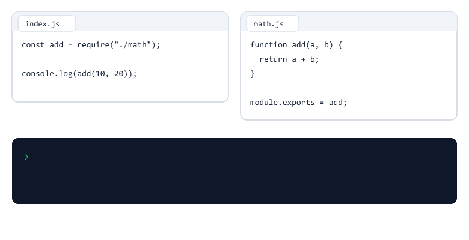
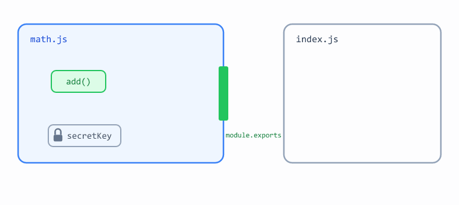
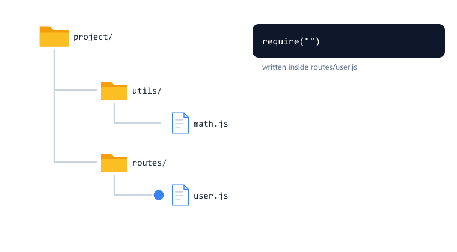

## Table of Contents

* [What is a Module?](#what-is-a-module)
* [Why Do We Need Modules?](#why-do-we-need-modules)
* [Creating Your First Module](#creating-your-first-module)
* [Using require()](#using-require)
* [Using module.exports](#using-moduleexports)
* [Module Scope](#module-scope)
* [Exporting Multiple Functions](#exporting-multiple-functions)
* [Using Destructuring](#using-destructuring)
* [Exporting Values and Objects](#exporting-values-and-objects)
* [The exports Shortcut](#the-exports-shortcut)
* [Types of Modules](#types-of-modules)
* [Understanding File Paths](#understanding-file-paths)
* [Requiring a Folder](#requiring-a-folder)
* [A Module Runs Only Once](#a-module-runs-only-once)
* [CommonJS vs ES Modules](#commonjs-vs-es-modules)
* [Beginner Mistakes](#beginner-mistakes)
* [Practice Exercises](#practice-exercises)
* [Interview Questions](#interview-questions)
* [Summary](#summary)

---

## What is a Module?

A module is simply a JavaScript file.

Example

```text
math.js
```

```text
user.js
```

```text
product.js
```

Each file can contain its own logic and functionality.

Think of modules as separate rooms in a house.


Each room has a different purpose.

Similarly, each module should have a specific responsibility.

---

## Why Do We Need Modules?

Imagine writing an entire application inside one file.


Problems

* Difficult to read
* Difficult to debug
* Difficult to maintain

Better Approach

```text
project/

├── index.js
├── math.js
├── user.js
└── product.js
```

Each file handles a specific task.

---

## Creating Your First Module

Create a file

```text
math.js
```

Add 

```javascript
function add(a, b) {
  return a + b;
}

module.exports = add;
```

---

Create another file 

```text
index.js
```

Add 

```javascript
const add = require("./math");

console.log(add(10, 20));
```

Run 

```bash
node index.js
```

Output

```text
30
```

Congratulations. You have created and used your first custom module.

---

## Using require()

The require() function is used to import code from another file.

Example

```javascript
const add = require("./math");
```

Explanation



| Part         | Meaning                                       |
| ------------ | --------------------------------------------- |
| require()    | Load another file                             |
| "./"         | Look in the same folder as this file          |
| "math"       | The file name. The `.js` extension is optional |
| const add    | Store whatever math.js exported               |

---

## Using module.exports

The module.exports object is used to share code with other files.

Example

```javascript
function add(a, b) {
  return a + b;
}

module.exports = add;
```

Explanation

Think of `module.exports` as the door of a room. Only what you put through the door can be used outside.

Without module.exports, other files cannot access the function.

---

## Module Scope

Everything inside a module is private by default.

math.js

```javascript
const secretKey = "abc123";

function add(a, b) {
  return a + b;
}

module.exports = add;
```

index.js

```javascript
const add = require("./math");

console.log(add(1, 2));
console.log(secretKey);
```

Output

```text
3
ReferenceError: secretKey is not defined
```



`add` was exported, so index.js can use it.

`secretKey` was not exported, so it stays private inside math.js.

This is useful. Two files can use the same variable name without breaking each other.

---

## Exporting Multiple Functions

math.js

```javascript
function add(a, b) {
  return a + b;
}

function subtract(a, b) {
  return a - b;
}

module.exports = {
  add,
  subtract
};
```

index.js

```javascript
const math = require("./math");

console.log(math.add(20, 10));

console.log(math.subtract(20, 10));
```

Output

```text
30

10
```

---

## Using Destructuring

Instead of

```javascript
const math = require("./math");

console.log(math.add(10, 5));
```

Use

```javascript
const { add } = require("./math");

console.log(add(10, 5));
```

Output

```text
15
```

This approach is commonly used in Node.js applications.

---

## Exporting Values and Objects

You can export anything, not only functions.

config.js

```javascript
const appName = "Student App";
const maxStudents = 50;

const admin = {
  name: "John",
  role: "admin"
};

module.exports = {
  appName,
  maxStudents,
  admin
};
```

index.js

```javascript
const { appName, maxStudents, admin } = require("./config");

console.log(appName);
console.log(maxStudents);
console.log(admin.name);
```

Output

```text
Student App
50
John
```

Keeping settings like this in one file is very common in real projects.

---

## The exports Shortcut

Node.js also gives you a shorter way to export many things.

math.js

```javascript
exports.add = (a, b) => a + b;

exports.subtract = (a, b) => a - b;
```

index.js

```javascript
const math = require("./math");

console.log(math.add(10, 5));
console.log(math.subtract(10, 5));
```

Output

```text
15
5
```

`exports.add = ...` adds `add` to the exported object, exactly like `module.exports.add = ...`.

You will see this style in later sessions, for example in controllers.

Important

Never replace `exports` itself

```javascript
exports = { add };
```

This exports nothing. Use `module.exports = { add };` instead.

| Want to export...        | Use                      |
| ------------------------ | ------------------------ |
| One thing                | module.exports = add     |
| Many things at once      | module.exports = { ... } |
| Many things, one by one  | exports.add = ...        |

---

## Types of Modules

Node.js has three types of modules.


| Type        | Where it comes from       | Example                       | Install? |
| ----------- | ------------------------- | ----------------------------- | -------- |
| Core        | Built into Node.js        | `require("fs")`               | No       |
| Local       | Files you write           | `require("./math")`           | No       |
| Third-party | Downloaded from npm       | `require("express")`          | Yes, `npm install express` |

### Core Modules

```javascript
const fs = require("fs");     // Work with files (Session 05)
const path = require("path"); // Work with file paths (Session 06)
const os = require("os");     // Get system information (Session 07)
```

### Local Modules

```javascript
const add = require("./math");
```

### Third-Party Modules

```bash
npm install express
```

```javascript
const express = require("express"); // Session 12
```

How does require() know which type it is?

| You write             | Node.js looks for                               |
| --------------------- | ----------------------------------------------- |
| `require("./math")`   | A file in your project (because of `./`)        |
| `require("fs")`       | A core module first, then the node_modules folder |
| `require("express")`  | Not a core module, so it looks in node_modules  |

Rule

```text
Your own files always start with ./ or ../
```

---

## Understanding File Paths

Real projects have folders inside folders.

```text
project/
├── index.js
├── utils/
│   └── math.js
└── routes/
    └── user.js
```

| Path    | Meaning              |
| ------- | -------------------- |
| `./`    | The current folder   |
| `../`   | Go up one folder     |

From index.js

```javascript
const { add } = require("./utils/math");
```

From routes/user.js

```javascript
const { add } = require("../utils/math");
```



The path always starts from the file that calls require(), not from where you run `node`.

You will see `../` a lot from Session 20 onwards, for example `require("../models/Student")`.

---

## Requiring a Folder

If you require a folder, Node.js loads the `index.js` file inside it.

```text
project/
├── app.js
└── utils/
    ├── index.js
    ├── math.js
    └── greet.js
```

utils/math.js

```javascript
function add(a, b) {
  return a + b;
}

module.exports = { add };
```

utils/greet.js

```javascript
function greet(name) {
  return "Hello " + name;
}

module.exports = { greet };
```

utils/index.js

```javascript
const { add } = require("./math");
const { greet } = require("./greet");

module.exports = { add, greet };
```

app.js

```javascript
const { add, greet } = require("./utils");

console.log(add(2, 3));
console.log(greet("John"));
```

Output

```text
5
Hello John
```

`require("./utils")` is the same as `require("./utils/index.js")`.

This lets one file collect everything from a folder.

---

## A Module Runs Only Once

config.js

```javascript
console.log("config.js is running");

module.exports = { appName: "Student App" };
```

index.js

```javascript
const config1 = require("./config");
const config2 = require("./config");

console.log(config1.appName);
console.log(config2.appName);
```

Output

```text
config.js is running
Student App
Student App
```

The message prints only once.

The first require() runs the file and remembers (caches) the result.

Every later require() of the same file gets the remembered result.

This is why a file like a database connection can be required in many places, but connects only once.

---

## CommonJS vs ES Modules

There are two ways to share code in Node.js.

CommonJS (used in this course)

```javascript
// math.js
function add(a, b) {
  return a + b;
}

module.exports = { add };

// index.js
const { add } = require("./math");
```

ES Modules (common in frontend and newer tutorials)

```javascript
// math.js
export function add(a, b) {
  return a + b;
}

// index.js
import { add } from "./math.js";
```

To use ES Modules, set `"type"` in package.json

```json
{
  "type": "module"
}
```

| Feature                 | CommonJS             | ES Modules              |
| ----------------------- | -------------------- | ----------------------- |
| Import                  | require()            | import                  |
| Export                  | module.exports       | export                  |
| package.json "type"     | "commonjs" (default) | "module"                |
| File extension in path  | Optional             | Required (`./math.js`)  |

Important

Do not mix both styles in one file.

This course uses CommonJS because most Node.js tutorials and libraries you will meet support it.

---

## Beginner Mistakes

### Mistake 1

Forgetting `./` for your own file.

Incorrect:

```javascript
const add = require("math");
```

```text
Error: Cannot find module 'math'
```

Without `./`, Node.js looks for a core module or a package in node_modules.

Correct:

```javascript
const add = require("./math");
```

---

### Mistake 2

Forgetting to export.

math.js

```javascript
function add(a, b) {
  return a + b;
}
```

index.js

```javascript
const add = require("./math");
console.log(add(1, 2));
```

```text
TypeError: add is not a function
```

Nothing was exported, so require() returned an empty object `{}`.

Correct:

Add `module.exports = add;` at the end of math.js.

---

### Mistake 3

Destructuring when only one function was exported.

math.js

```javascript
module.exports = add;
```

Incorrect:

```javascript
const { add } = require("./math");
```

```text
TypeError: add is not a function
```

Correct:

```javascript
const add = require("./math");
```

| Export style                  | Import style                       |
| ----------------------------- | ---------------------------------- |
| `module.exports = add`        | `const add = require("./math")`    |
| `module.exports = { add }`    | `const { add } = require("./math")` |

---

### Mistake 4

Wrong capital letters in the file name.

File name

```text
math.js
```

Incorrect:

```javascript
const add = require("./Math");
```

This may work on Windows, but fails on Linux and macOS, where most servers run.

Correct:

Always match the file name exactly.

---

### Mistake 5

Using `import` in a CommonJS project.

```javascript
import { add } from "./math.js";
```

```text
SyntaxError: Cannot use import statement outside a module
```

Correct:

Use `require()`, or set `"type": "module"` in package.json and use ES Modules everywhere.

---

## Practice Exercises

### Exercise 1

Create 

```text
greeting.js
```

Export a function that returns 

```text
Hello Student
```

Import it inside 

```text
index.js
```

and print the result.

---

### Exercise 2

Create 

```text
calculator.js
```

Add 

* add()
* subtract()

functions.

Export them and use them inside 

```text
index.js
```

---

### Exercise 3

Create 

```text
student.js
```

Export 

```javascript
{
  name: "John",
  age: 20
}
```

Import and print the object.

---

### Exercise 4

Create this structure

```text
project/
├── index.js
└── helpers/
    └── format.js
```

In format.js, export a function `toUpper(text)` that returns the text in capital letters.

Use it from index.js with the correct path.

---

### Exercise 5

Add a `console.log("Loading format.js")` at the top of format.js.

Require it two times in index.js.

How many times does the message print? Why?

---

### Exercise 6

Rewrite calculator.js from Exercise 2 using the `exports.add = ...` shortcut.

Make sure index.js still works without any changes.

---

## Interview Questions

### What is a module?

A module is a JavaScript file that contains reusable code.

---

### What is require()?

require() is used to import code from another module.

---

### What is module.exports?

module.exports is used to share code with other files.

---

### Why are modules important?

Modules help organize code and make applications easier to maintain.

---

### What are the types of modules in Node.js?

Core modules (built into Node.js, like fs), local modules (your own files), and third-party modules (installed from npm, like express).

---

### What is the difference between module.exports and exports?

exports is a shortcut that points to module.exports. You can add properties to it (exports.add = ...), but if you assign a new value to exports itself, nothing is exported. Assigning a new value always needs module.exports.

---

### What happens when you require the same module twice?

The module runs only the first time. Node.js caches the result and returns the same exported value on every later require().

---

### Are variables in a module global?

No. Every module has its own scope. Variables are private unless they are exported.

---

### What is the difference between CommonJS and ES Modules?

CommonJS uses require() and module.exports. ES Modules use import and export, and need "type": "module" in package.json.

---

## Summary

In this session, you learned

* What a module is
* Why modules are important
* How to create modules
* How to export code with module.exports and exports
* How to import code with require()
* Module scope (private variables)
* Core, local and third-party modules
* File paths with ./ and ../
* Requiring a folder with index.js
* Modules run only once (caching)
* CommonJS vs ES Modules

These concepts are used in every Node.js application.

---
