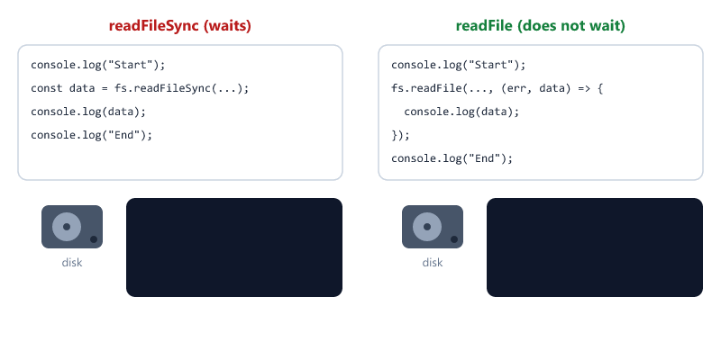

## Table of Contents

* [What is the File System Module?](#what-is-the-file-system-module)
* [Importing fs Module](#importing-fs-module)
* [Reading a File](#reading-a-file)
* [Creating a File](#creating-a-file)
* [Updating a File](#updating-a-file)
* [Deleting a File](#deleting-a-file)
* [Handling Errors](#handling-errors)
* [Sync vs Async Methods](#sync-vs-async-methods)
* [Using fs with async/await](#using-fs-with-asyncawait)
* [Three Ways to Read a File](#three-ways-to-read-a-file)
* [Working with Folders](#working-with-folders)
* [Reading and Writing JSON Files](#reading-and-writing-json-files)
* [Writing with Streams](#writing-with-streams)
* [Where Does Node.js Look for Files?](#where-does-nodejs-look-for-files)
* [Mini Example](#mini-example)
* [Quick Reference](#quick-reference)
* [Beginner Mistakes](#beginner-mistakes)
* [Practice Exercises](#practice-exercises)
* [Interview Questions](#interview-questions)

---

## What is the File System Module?

The File System Module allows Node.js to interact with files stored on your computer.

Using the fs module, we can


The fs module is a built-in Node.js module (a core module, as you learned in Session 04).

No installation is required.

---

## Importing fs Module

Before using the File System Module, import it 

```javascript
const fs = require("fs");
```

`fs` is short for File System.

---

## Reading a File

Create a file 

```text
student.txt
```

Content 

```text
Welcome To Node.js
```

Read the file 

```javascript
const fs = require("fs");

const data = fs.readFileSync("student.txt", "utf8");

console.log(data);
```

Output

```text
Welcome To Node.js
```

---

### What does "utf8" mean?

Files are stored as bytes (numbers).

`"utf8"` tells Node.js to turn those bytes into readable text.

Without it

```javascript
const data = fs.readFileSync("student.txt");

console.log(data);
```

Output

```text
<Buffer 57 65 6c 63 6f 6d 65 20 54 6f 20 4e 6f 64 65 2e 6a 73>
```

A Buffer is the raw bytes of the file. For text files, always pass `"utf8"`.

---

## Creating a File

Create a new file 

```javascript
const fs = require("fs");

fs.writeFileSync(
  "course.txt",
  "Node.js Learning Path"
);
```

Result

```text
course.txt
```

is created automatically.

Important

If the file already exists, `writeFileSync()` replaces everything inside it.

---

## Updating a File

Add content to an existing file 

```javascript
const fs = require("fs");

fs.appendFileSync(
  "course.txt",
  "\nSession 05 - File System Module"
);
```

Updated Content

```text
Node.js Learning Path
Session 05 - File System Module
```

`\n` means "new line".

| Method            | If file exists           | If file does not exist |
| ----------------- | ------------------------ | ---------------------- |
| writeFileSync()   | Replaces all content     | Creates it             |
| appendFileSync()  | Adds to the end          | Creates it             |

---

## Deleting a File

Delete a file 

```javascript
const fs = require("fs");

fs.unlinkSync("course.txt");
```

Result

course.txt is deleted.

Be careful. Deleted files do not go to the Recycle Bin.

---

## Handling Errors

What if the file does not exist?

```javascript
const fs = require("fs");

const data = fs.readFileSync("missing.txt", "utf8");
```

Output

```text
Error: ENOENT: no such file or directory, open '...\missing.txt'
```

The program crashes. (The message shows the full path to the file on your computer.)

`ENOENT` means "Error: NO ENTry", in other words, the file was not found.

Use `try` / `catch`, which you learned in Session 03

```javascript
const fs = require("fs");

try {
  const data = fs.readFileSync("missing.txt", "utf8");
  console.log(data);
} catch (err) {
  console.log("Could not read the file:", err.code);
}
```

Output

```text
Could not read the file: ENOENT
```

The program keeps running.

Common error codes

| Code   | Meaning                      |
| ------ | ---------------------------- |
| ENOENT | File or folder not found     |
| EEXIST | File or folder already exists |
| EACCES | No permission                |

---

## Sync vs Async Methods

Node.js provides two types of methods.



### Synchronous Method

```javascript
const fs = require("fs");

console.log("Start");

const data = fs.readFileSync("student.txt", "utf8");
console.log(data);

console.log("End");
```

Output

```text
Start
Welcome To Node.js
End
```

Node.js waits until the file is read. Nothing else can run during that time.

---

### Asynchronous Method

```javascript
const fs = require("fs");

console.log("Start");

fs.readFile("student.txt", "utf8", (err, data) => {
  if (err) {
    console.log("Error:", err.message);
    return;
  }

  console.log(data);
});

console.log("End");
```

Output

```text
Start
End
Welcome To Node.js
```

Node.js starts reading, continues with other work, and runs the callback when the file is ready.

This is the error-first callback from Session 03. Always check `err` first.

| Sync method        | Async method   |
| ------------------ | -------------- |
| fs.readFileSync()  | fs.readFile()  |
| fs.writeFileSync() | fs.writeFile() |
| fs.appendFileSync()| fs.appendFile()|
| fs.unlinkSync()    | fs.unlink()    |

Rule

Methods ending with `Sync` block the Event Loop. Use them only for small scripts or setup code that runs once at the start. Inside a server, use async methods.

---

## Using fs with async/await

Node.js also has a Promise version of fs.

```javascript
const fs = require("fs/promises");

async function readStudent() {
  try {
    const data = await fs.readFile("student.txt", "utf8");
    console.log(data);
  } catch (err) {
    console.log("Error:", err.message);
  }
}

readStudent();
```

Output

```text
Welcome To Node.js
```

It works with all the same methods

```javascript
const fs = require("fs/promises");

async function main() {
  await fs.writeFile("notes.txt", "Hello");
  await fs.appendFile("notes.txt", "\nWorld");

  const data = await fs.readFile("notes.txt", "utf8");
  console.log(data);

  await fs.unlink("notes.txt");
  console.log("notes.txt deleted");
}

main();
```

Output

```text
Hello
World
notes.txt deleted
```

The code reads from top to bottom, but it does not block the Event Loop.

---

## Three Ways to Read a File

| Style        | Import                     | Code                                          |
| ------------ | -------------------------- | --------------------------------------------- |
| Sync         | `require("fs")`            | `const data = fs.readFileSync(file, "utf8")`  |
| Callback     | `require("fs")`            | `fs.readFile(file, "utf8", (err, data) => {})` |
| async/await  | `require("fs/promises")`   | `const data = await fs.readFile(file, "utf8")` |

| Style        | Blocks?  | When to use                              |
| ------------ | -------- | ---------------------------------------- |
| Sync         | Yes      | Small scripts, setup code at startup     |
| Callback     | No       | Older code and some libraries            |
| async/await  | No       | Recommended for new code                 |

---

## Working with Folders

### Check if a file or folder exists

```javascript
const fs = require("fs");

console.log(fs.existsSync("student.txt"));
console.log(fs.existsSync("nothing.txt"));
```

Output

```text
true
false
```

---

### Create a folder

```javascript
const fs = require("fs");

fs.mkdirSync("uploads");
```

If the folder already exists, this throws an `EEXIST` error.

So real projects check first

```javascript
const fs = require("fs");

if (!fs.existsSync("uploads")) {
  fs.mkdirSync("uploads");
}
```

You will use this exact pattern in the File Uploads and Logging sessions.

---

### Create nested folders

```javascript
fs.mkdirSync("uploads/images/profiles", { recursive: true });
```

`recursive: true` creates every missing folder in the path, and does not throw an error if the folder already exists.

---

### List files in a folder

```javascript
const fs = require("fs");

const files = fs.readdirSync(".");

console.log(files);
```

Output (depends on your folder)

```text
[ 'index.js', 'student.txt', 'uploads' ]
```

`"."` means the current folder.

---

### Get file information

```javascript
const fs = require("fs");

const info = fs.statSync("student.txt");

console.log(info.size);
console.log(info.isFile());
console.log(info.isDirectory());
```

Output

```text
18
true
false
```

`size` is in bytes. "Welcome To Node.js" has 18 characters, so the file is 18 bytes.

---

### Delete a folder

```javascript
fs.rmSync("uploads", { recursive: true });
```

This deletes the folder and everything inside it. Use it carefully.

---

## Reading and Writing JSON Files

JSON is a text format for storing data. It looks like JavaScript objects.

students.json

```json
[
  { "id": 1, "name": "John" },
  { "id": 2, "name": "Sara" }
]
```

A JSON file is just text. To use it as data, convert it.

| Method             | Converts             |
| ------------------ | -------------------- |
| JSON.parse()       | Text  →  JavaScript  |
| JSON.stringify()   | JavaScript  →  Text  |


Example: add a new student

```javascript
const fs = require("fs");

// 1. Read the file as text
const text = fs.readFileSync("students.json", "utf8");

// 2. Convert text to a JavaScript array
const students = JSON.parse(text);

// 3. Change the data
students.push({ id: 3, name: "Mike" });

// 4. Convert back to text and save
fs.writeFileSync("students.json", JSON.stringify(students, null, 2));

console.log("Total students:", students.length);
```

Output

```text
Total students: 3
```

students.json now

```json
[
  {
    "id": 1,
    "name": "John"
  },
  {
    "id": 2,
    "name": "Sara"
  },
  {
    "id": 3,
    "name": "Mike"
  }
]
```

`JSON.stringify(students, null, 2)` adds 2 spaces of indentation so the file is easy to read.

You will use JSON.parse() and JSON.stringify() a lot when building APIs.

---

## Writing with Streams

`appendFileSync()` opens and closes the file every time.

When you write to the same file again and again, like a log file, a stream is better.

Think of a stream as a pipe that stays open. You keep pouring data in.

```javascript
const fs = require("fs");

const logFile = fs.createWriteStream("app.log", { flags: "a" });

logFile.write("Server started\n");
logFile.write("User logged in\n");
logFile.write("User logged out\n");

logFile.end();
```

app.log

```text
Server started
User logged in
User logged out
```

| Part          | Meaning                                       |
| ------------- | --------------------------------------------- |
| flags: "a"    | Append. Keep old content and add to the end   |
| .write()      | Add data to the file                          |
| .end()        | Close the stream when you are done            |

Run the program again and the three lines are added again, because of `flags: "a"`.

You will use createWriteStream() in the Logging session.

---

## Where Does Node.js Look for Files?

In Session 04 you learned that `require("./math")` starts from the file that calls it.

fs works differently.

```text
fs paths start from the folder where you run the node command
```

Example

```text
project/
├── data/
│   └── student.txt
└── scripts/
    └── read.js
```

scripts/read.js

```javascript
const fs = require("fs");

const data = fs.readFileSync("data/student.txt", "utf8");
console.log(data);
```

| You run                      | Works? |
| ---------------------------- | ------ |
| `node scripts/read.js` from project/ | Yes    |
| `node read.js` from scripts/ | No, ENOENT |

In Session 06 you will learn `path.join(__dirname, ...)`, which makes file paths work from any folder.

---

## Mini Example

Create 

```text
notes.txt
```

Write and read data

```javascript
const fs = require("fs");

fs.writeFileSync(
  "notes.txt",
  "Learning Node.js"
);

const data = fs.readFileSync(
  "notes.txt",
  "utf8"
);

console.log(data);
```

Output

```text
Learning Node.js
```

---

## Quick Reference

| Task                  | Sync                            | async/await (fs/promises)        |
| --------------------- | ------------------------------- | -------------------------------- |
| Read a file           | `fs.readFileSync(f, "utf8")`    | `await fs.readFile(f, "utf8")`   |
| Create / replace file | `fs.writeFileSync(f, text)`     | `await fs.writeFile(f, text)`    |
| Add to a file         | `fs.appendFileSync(f, text)`    | `await fs.appendFile(f, text)`   |
| Delete a file         | `fs.unlinkSync(f)`              | `await fs.unlink(f)`             |
| Rename a file         | `fs.renameSync(old, new)`       | `await fs.rename(old, new)`      |
| Create a folder       | `fs.mkdirSync(d, { recursive: true })` | `await fs.mkdir(d, { recursive: true })` |
| List a folder         | `fs.readdirSync(d)`             | `await fs.readdir(d)`            |
| File information      | `fs.statSync(f)`                | `await fs.stat(f)`               |
| Check if exists       | `fs.existsSync(f)`              | (use the Sync version)           |

---

## Beginner Mistakes

### Mistake 1

Forgetting `"utf8"`.

Incorrect:

```javascript
const data = fs.readFileSync("student.txt");
console.log(data);
```

```text
<Buffer 57 65 6c 63 6f ...>
```

Correct:

```javascript
const data = fs.readFileSync("student.txt", "utf8");
```

---

### Mistake 2

Using writeFileSync() to add content.

Incorrect:

```javascript
fs.writeFileSync("log.txt", "Line 1");
fs.writeFileSync("log.txt", "Line 2");
```

log.txt contains only

```text
Line 2
```

Correct:

```javascript
fs.writeFileSync("log.txt", "Line 1");
fs.appendFileSync("log.txt", "\nLine 2");
```

---

### Mistake 3

Using an async method like a sync method.

Incorrect:

```javascript
const fs = require("fs");

const data = fs.readFile("student.txt", "utf8");
console.log(data);
```

```text
TypeError [ERR_INVALID_ARG_TYPE]: The "cb" argument must be of type function.
```

`fs.readFile()` does not return the content. It needs a callback (`cb`) to give the content to later.

Correct:

```javascript
fs.readFile("student.txt", "utf8", (err, data) => {
  console.log(data);
});
```

or use `require("fs/promises")` with `await`.

---

### Mistake 4

Not handling missing files.

Incorrect:

```javascript
const data = fs.readFileSync("missing.txt", "utf8");
```

The program crashes with `ENOENT`.

Correct:

Wrap it in `try` / `catch`, or check with `fs.existsSync()` first.

---

### Mistake 5

Creating a folder that already exists.

Incorrect:

```javascript
fs.mkdirSync("uploads");
```

```text
Error: EEXIST: file already exists, mkdir '...\uploads'
```

The second time you run the program, it crashes.

Correct:

```javascript
if (!fs.existsSync("uploads")) {
  fs.mkdirSync("uploads");
}
```

or

```javascript
fs.mkdirSync("uploads", { recursive: true });
```

---

## Practice Exercises

### Exercise 1

Create 

```text
student.txt
```

Store 

```text
My Name Is John
```

using Node.js.

---

### Exercise 2

Read and display the contents of 

```text
student.txt
```

---

### Exercise 3

Append 

```text
I Am Learning Node.js
```

to the same file.

---

### Exercise 4

Delete 

```text
student.txt
```

using Node.js.

---

### Exercise 5

Try to read a file that does not exist.

Handle the error with `try` / `catch` and print a friendly message.

---

### Exercise 6

Rewrite Exercises 1 to 3 using `require("fs/promises")` and async/await.

---

### Exercise 7

Create a folder named `reports` only if it does not exist.

Create three files inside it, then print the list of files using `readdirSync()`.

---

### Exercise 8

Create `todos.json` with an empty array `[]`.

Write a program that

1. Reads the file
2. Adds a todo `{ "id": 1, "task": "Learn fs" }`
3. Saves the file

Run the program three times. What happens to the file?

---

## Interview Questions

### What is the fs module?

The fs module is a built-in Node.js module used to work with files and folders.

---

### Do we need to install fs?

No.

It comes bundled with Node.js.

---

### What is the difference between readFileSync() and readFile()?

readFileSync() is synchronous. It blocks until the file is read and returns the content.

readFile() is asynchronous. It does not block and gives the content to a callback.

---

### Which is preferred in production?

Asynchronous methods are generally preferred because they do not block the event loop.

---

### What is the difference between writeFile() and appendFile()?

writeFile() replaces the whole content of the file. appendFile() adds content to the end.

---

### What does ENOENT mean?

ENOENT means the file or folder was not found.

---

### What does the "utf8" argument do?

It tells Node.js to return the file content as text. Without it, Node.js returns a Buffer (raw bytes).

---

### How do you use fs with async/await?

Import the Promise version with require("fs/promises"), then use await fs.readFile(), await fs.writeFile() and so on inside an async function.

---

### What is the difference between JSON.parse() and JSON.stringify()?

JSON.parse() converts JSON text into a JavaScript object or array. JSON.stringify() converts a JavaScript object or array into JSON text.

---

### What is a write stream?

A write stream keeps a file open so you can write to it many times efficiently. It is created with fs.createWriteStream() and is commonly used for log files.

---
