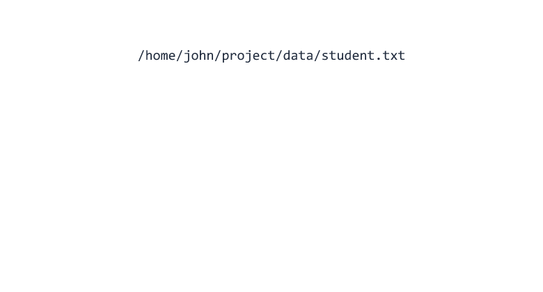
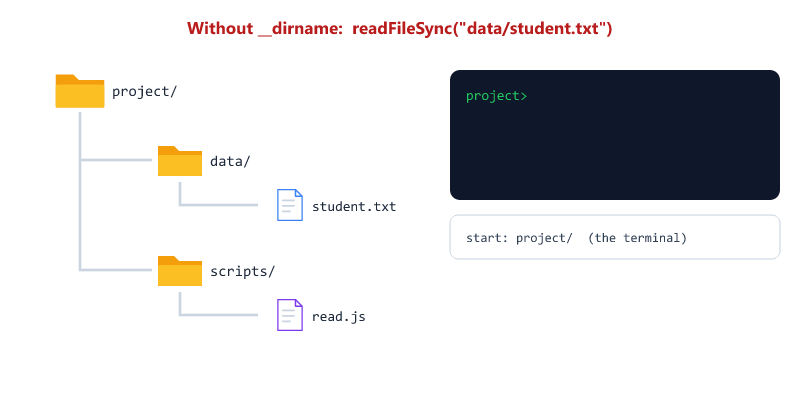

## Table of Contents

* [What is the Path Module?](#what-is-the-path-module)
* [Importing the Path Module](#importing-the-path-module)
* [Why Do We Need the Path Module?](#why-do-we-need-the-path-module)
* [path.join()](#pathjoin)
* [path.basename()](#pathbasename)
* [path.extname()](#pathextname)
* [path.dirname()](#pathdirname)
* [path.parse()](#pathparse)
* [__dirname and __filename](#__dirname-and-__filename)
* [Fixing File Paths with __dirname](#fixing-file-paths-with-__dirname)
* [path.resolve()](#pathresolve)
* [Real World Example](#real-world-example)
* [Real World Example: Uploaded Files](#real-world-example-uploaded-files)
* [Quick Reference](#quick-reference)
* [Beginner Mistakes](#beginner-mistakes)
* [Practice Exercises](#practice-exercises)
* [Interview Questions](#interview-questions)

---

## What is the Path Module?

The Path Module helps us work with file and folder paths.

It is a built-in Node.js module (a core module).

No installation is required.

A path is the address of a file. The Path Module can build an address, or read each part of it.


---

## Importing the Path Module

```javascript
const path = require("path");
```

---

## Why Do We Need the Path Module?

Imagine we have a file 

```text
project/
├── data/
│   └── student.txt
└── app.js
```

Without the Path Module 

```javascript
const filePath = "data/student.txt";
```

This may behave differently across operating systems.

Windows separates folders with `\`. macOS and Linux use `/`.

```text
Windows         data\student.txt
macOS / Linux   data/student.txt
```

With the Path Module 

```javascript
const filePath = path.join(
  "data",
  "student.txt"
);
```

Node.js automatically creates the correct path for the computer it runs on.


This matters because you often write code on Windows, but your server runs on Linux.

---

## path.join()

Used to join multiple path segments.

Example

```javascript
const path = require("path");

const filePath = path.join(
  "data",
  "student.txt"
);

console.log(filePath);
```

Output

```text
Windows         data\student.txt
macOS / Linux   data/student.txt
```


Purpose

```text
Join Multiple Path Segments
```

This is one of the most commonly used path methods.

---

### path.join() also cleans up paths

```javascript
const path = require("path");

console.log(path.join("data/", "/students/", "list.json"));
console.log(path.join("data", "..", "config", "app.json"));
```

Output (macOS / Linux)

```text
data/students/list.json
config/app.json
```

| Problem in the input | What path.join() does        |
| -------------------- | ---------------------------- |
| Extra slashes        | Removes them                 |
| `..`                 | Goes up one folder           |


---

## path.basename()

Used to get the file name.

Example

```javascript
const path = require("path");

const fileName = path.basename(
  "/data/student.txt"
);

console.log(fileName);
```

Output

```text
student.txt
```

Purpose

```text
Get File Name
```

To get the name without the extension, pass the extension as the second argument

```javascript
console.log(path.basename("/uploads/profile.jpg", ".jpg"));
```

Output

```text
profile
```

---

## path.extname()

Used to get the file extension.

Example

```javascript
const path = require("path");

const extension = path.extname(
  "student.txt"
);

console.log(extension);
```

Output

```text
.txt
```

Purpose

```text
Get File Extension
```

More examples

| Input            | path.extname() |
| ---------------- | -------------- |
| `photo.JPG`      | `.JPG`         |
| `archive.tar.gz` | `.gz`          |
| `README`         | `""` (empty)   |

Notice `.JPG` keeps its capital letters. Use `.toLowerCase()` before comparing extensions.

---

## path.dirname()

Used to get the directory path.

Example

```javascript
const path = require("path");

const directory = path.dirname(
  "/data/student.txt"
);

console.log(directory);
```

Output

```text
/data
```

Purpose

```text
Get Folder Path
```

---

## path.parse()

Used to get detailed information about a file path.

Example

```javascript
const path = require("path");

const fileInfo = path.parse(
  "/home/john/project/data/student.txt"
);

console.log(fileInfo);
```

Output

```text
{
  root: '/',
  dir: '/home/john/project/data',
  base: 'student.txt',
  ext: '.txt',
  name: 'student'
}
```

| Property | Meaning                      | Same as             |
| -------- | ---------------------------- | ------------------- |
| root     | Start of the path            |                     |
| dir      | Folder that holds the file   | path.dirname()      |
| base     | File name with extension     | path.basename()     |
| ext      | Extension                    | path.extname()      |
| name     | File name without extension  |                     |



Purpose

```text
Get Complete Path Information
```

---

## __dirname and __filename

Node.js gives every CommonJS file two special variables. You do not need to import them.

| Variable   | Holds                                          |
| ---------- | ---------------------------------------------- |
| __dirname  | Full path of the folder this file is in        |
| __filename | Full path of this file                         |

project/scripts/where.js

```javascript
console.log(__dirname);
console.log(__filename);
```

Output (Windows)

```text
C:\Users\John\project\scripts
C:\Users\John\project\scripts\where.js
```

Output (macOS / Linux)

```text
/home/john/project/scripts
/home/john/project/scripts/where.js
```


They always point to where the file is, no matter where you run `node` from.

Note: there are two underscores before `dirname` and `filename`.

---

## Fixing File Paths with __dirname

In Session 05 you saw this problem

```text
fs paths start from the folder where you run the node command
```

```text
project/
├── data/
│   └── student.txt
└── scripts/
    └── read.js
```

Without __dirname

```javascript
const data = fs.readFileSync("data/student.txt", "utf8");
```

| You run                              | Works?     |
| ------------------------------------ | ---------- |
| `node scripts/read.js` from project/ | Yes        |
| `node read.js` from scripts/         | No, ENOENT |

With __dirname

scripts/read.js

```javascript
const fs = require("fs");
const path = require("path");

const filePath = path.join(__dirname, "..", "data", "student.txt");

const data = fs.readFileSync(filePath, "utf8");
console.log(data);
```

| You run                              | Works? |
| ------------------------------------ | ------ |
| `node scripts/read.js` from project/ | Yes    |
| `node read.js` from scripts/         | Yes    |



How it works, one part at a time

| Part added    | Path so far                              |
| ------------- | ---------------------------------------- |
| `__dirname`   | `C:\Users\John\project\scripts`          |
| `".."`        | `C:\Users\John\project`                  |
| `"data"`      | `C:\Users\John\project\data`             |
| `"student.txt"` | `C:\Users\John\project\data\student.txt` |

Rule

```text
When reading or writing files, always build the path with path.join(__dirname, ...)
```

You will see this in later sessions, for example

```javascript
path.join(__dirname, "uploads")
path.join(__dirname, "views")
```

---

## path.resolve()

path.resolve() always returns a full (absolute) path.

```javascript
const path = require("path");

console.log(path.resolve("data", "student.txt"));
```

Output (if you run node from C:\Users\John\project)

```text
C:\Users\John\project\data\student.txt
```

| Method                        | Starts from                           |
| ----------------------------- | ------------------------------------- |
| path.join("data", "a.txt")    | Nothing. Just joins the parts         |
| path.resolve("data", "a.txt") | The folder where you run node         |
| path.join(__dirname, "data")  | The folder of the current file        |


`path.resolve()` still depends on where you run node. For files that belong to your project, prefer `path.join(__dirname, ...)`.

---

## Real World Example

Project Structure

```text
project/
├── data/
│   └── students.json
└── app.js
```

app.js

```javascript
const fs = require("fs");
const path = require("path");

const filePath = path.join(__dirname, "data", "students.json");

const students = JSON.parse(fs.readFileSync(filePath, "utf8"));

console.log(students.length + " students loaded");
```

Output (with the students.json file from Session 05)

```text
3 students loaded
```

This is how paths are commonly created in real applications.

---

## Real World Example: Uploaded Files

When users upload files, you usually

1. Check the extension
2. Give the file a new, unique name

```javascript
const path = require("path");

const originalName = "My Photo.JPG";

const ext = path.extname(originalName).toLowerCase();
const allowed = [".jpg", ".jpeg", ".png"];

if (allowed.includes(ext)) {
  const newName = Date.now() + ext;
  const savePath = path.join(__dirname, "uploads", newName);

  console.log("Saved as:", newName);
  console.log("Full path:", savePath);
} else {
  console.log("Only images are allowed");
}
```

Output (the number changes every time)

```text
Saved as: 1767225600000.jpg
Full path: C:\Users\John\project\uploads\1767225600000.jpg
```

| Code              | Why                                                  |
| ----------------- | ---------------------------------------------------- |
| `.toLowerCase()`  | `.JPG` and `.jpg` should both be accepted            |
| `Date.now()`      | Current time in milliseconds, so names do not clash  |


You will use this exact idea in the File Uploads session.

---

## Quick Reference

| Method / Variable                  | Example Output (macOS / Linux)       |
| ---------------------------------- | ------------------------------------ |
| `path.join("data", "a.txt")`       | `data/a.txt`                         |
| `path.basename("/data/a.txt")`     | `a.txt`                              |
| `path.basename("/data/a.txt", ".txt")` | `a`                              |
| `path.extname("a.txt")`            | `.txt`                               |
| `path.dirname("/data/a.txt")`      | `/data`                              |
| `path.parse("/data/a.txt")`        | `{ root, dir, base, ext, name }`     |
| `path.resolve("a.txt")`            | Full path from where you run node    |
| `path.sep`                         | `/` (Windows: `\`)                   |
| `__dirname`                        | Folder of the current file           |
| `__filename`                       | Full path of the current file        |

---

## Beginner Mistakes

### Mistake 1

Building paths with `+` and `/`.

Incorrect:

```javascript
const filePath = "data" + "/" + "student.txt";
```

Correct:

```javascript
const filePath = path.join("data", "student.txt");
```

---

### Mistake 2

Using a plain relative path for files.

Incorrect:

```javascript
fs.readFileSync("data/student.txt", "utf8");
```

Works only when you run node from the right folder.

Correct:

```javascript
fs.readFileSync(path.join(__dirname, "data", "student.txt"), "utf8");
```

---

### Mistake 3

Comparing extensions without lowercase.

Incorrect:

```javascript
if (path.extname("photo.JPG") === ".jpg") {
  // never runs
}
```

Correct:

```javascript
if (path.extname("photo.JPG").toLowerCase() === ".jpg") {
  // runs
}
```

---

### Mistake 4

Writing `__dirname` with one underscore.

Incorrect:

```javascript
console.log(_dirname);
```

```text
ReferenceError: _dirname is not defined
```

Correct:

```javascript
console.log(__dirname);
```

---

### Mistake 5

Using `__dirname` in an ES Module.

With `"type": "module"` in package.json

```text
ReferenceError: __dirname is not defined in ES module scope
```

`__dirname` exists only in CommonJS files (the style used in this course). In ES Modules, use `import.meta.dirname` instead.

---

## Practice Exercises

### Exercise 1

Create a path for the file students.json inside the data folder

```text
data/students.json
```

using 

```javascript
path.join()
```

---

### Exercise 2

Get the file name from 

```text
/uploads/profile.jpg
```

---

### Exercise 3

Get the extension from 

```text
resume.pdf
```

---

### Exercise 4

Get the directory path from 

```text
/data/students/student.txt
```

---

### Exercise 5

Create this structure

```text
project/
├── data/
│   └── notes.txt
└── scripts/
    └── read.js
```

Write read.js so it reads notes.txt using `__dirname`.

Run it from both the project folder and the scripts folder. Both must work.

---

### Exercise 6

Write a function `isImage(fileName)` that returns `true` for `.jpg`, `.jpeg` and `.png` files (any capital letters) and `false` for anything else.

Test it with `"cat.PNG"`, `"notes.txt"` and `"photo.jpeg"`.

---

### Exercise 7

Print `__dirname`, `__filename` and `path.basename(__filename)`.

What does each one show?

---

## Interview Questions

### What is the Path Module?

The Path Module is a built-in Node.js module used to work with file and folder paths.

---

### Do we need to install the Path Module?

No.

It comes bundled with Node.js.

---

### What does path.join() do?

It combines multiple path segments into a single path, using the correct separator for the operating system and cleaning up extra slashes and `..`.

---

### What does path.basename() return?

It returns the file name.

---

### What does path.extname() return?

It returns the file extension.

---

### What is __dirname?

A variable that holds the full path of the folder containing the current file. It is available in every CommonJS module.

---

### What is the difference between path.join() and path.resolve()?

path.join() only joins the parts. path.resolve() always returns an absolute path, starting from the folder where node was run.

---

### Why use path.join(__dirname, ...) instead of a relative path?

A relative path depends on the folder where you run node. A path built from __dirname always points to the same place, no matter where node is run from.

---

### Why not build paths with string concatenation?

Windows uses `\` and macOS/Linux use `/`. path.join() picks the right separator automatically, so the code works on every system.

---
