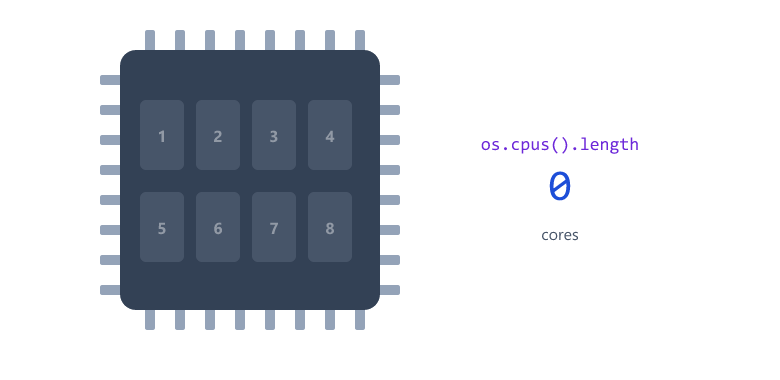

## Table of Contents

* [What is the OS Module?](#what-is-the-os-module)
* [Importing the OS Module](#importing-the-os-module)
* [Getting Platform Information](#getting-platform-information)
* [Getting System Architecture](#getting-system-architecture)
* [Getting Host Name](#getting-host-name)
* [Getting Memory Information](#getting-memory-information)
* [Converting Bytes to GB](#converting-bytes-to-gb)
* [Getting CPU Information](#getting-cpu-information)
* [More Useful OS Methods](#more-useful-os-methods)
* [os.EOL - Line Endings](#oseol---line-endings)
* [The process Object](#the-process-object)
* [os vs process](#os-vs-process)
* [Command Line Arguments with process.argv](#command-line-arguments-with-processargv)
* [Stopping a Program with process.exit()](#stopping-a-program-with-processexit)
* [Mini Example](#mini-example)
* [Real World Example: Live System Monitor](#real-world-example-live-system-monitor)
* [Beginner Mistakes](#beginner-mistakes)
* [Practice Exercises](#practice-exercises)
* [Interview Questions](#interview-questions)

---

## What is the OS Module?

The OS Module provides information about the operating system on which Node.js is running.

Using this module, we can get 


The OS Module is built into Node.js (a core module).

No installation is required.

Why is this useful?

* Show system information in an admin dashboard
* Check if the server is running low on memory
* Run different code on Windows and Linux
* Decide how many tasks to run at the same time, based on CPU cores

---

## Importing the OS Module

```javascript
const os = require("os");
```

`os` is short for Operating System.

---

## Getting Platform Information

The `platform()` method returns the operating system platform.

Example

```javascript
const os = require("os");

console.log(os.platform());
```

Possible Output

```text
win32
```

```text
linux
```

```text
darwin
```


Common Platforms

| Platform | Operating System |
| -------- | ---------------- |
| win32    | Windows          |
| linux    | Linux            |
| darwin   | macOS            |

Note: `win32` is returned on both 32-bit and 64-bit Windows.

Real use: run different code on different systems

```javascript
const os = require("os");

if (os.platform() === "win32") {
  console.log("Running on Windows");
} else {
  console.log("Running on Linux or macOS");
}
```

---

## Getting System Architecture

The `arch()` method returns the system architecture.

Example

```javascript
const os = require("os");

console.log(os.arch());
```

Output

```text
x64
```

| Value  | Meaning                                         |
| ------ | ----------------------------------------------- |
| x64    | 64-bit Intel or AMD processor (most PCs)        |
| arm64  | 64-bit ARM processor (Apple M1/M2/M3, many phones and cloud servers) |
| ia32   | Old 32-bit processor                            |

---

## Getting Host Name

The `hostname()` method returns the computer name.

Example

```javascript
const os = require("os");

console.log(os.hostname());
```

Output

```text
DESKTOP-ABC123
```

Your output will be different.


On servers, the host name helps you see which machine wrote a log message when you have many servers.

---

## Getting Memory Information

### Total Memory

```javascript
const os = require("os");

console.log(os.totalmem());
```

Output

```text
17071734784
```

The value is returned in bytes.

---

### Free Memory

```javascript
const os = require("os");

console.log(os.freemem());
```

Output

```text
8423454720
```

The value is returned in bytes.

| Method      | Returns                       |
| ----------- | ----------------------------- |
| totalmem()  | Total RAM in the computer     |
| freemem()   | RAM that is free right now    |

Used memory is the difference

```javascript
const os = require("os");

const used = os.totalmem() - os.freemem();

console.log(used);
```


---

## Converting Bytes to GB

Big numbers like `17071734784` are hard to read. Convert them to GB.

```text
1 KB = 1024 bytes
1 MB = 1024 KB
1 GB = 1024 MB
```

So to go from bytes to GB, divide by 1024 three times.


```javascript
const os = require("os");

function toGB(bytes) {
  return (bytes / 1024 / 1024 / 1024).toFixed(2);
}

const total = os.totalmem();
const free = os.freemem();
const used = total - free;

console.log("Total Memory:", toGB(total), "GB");
console.log("Free Memory:", toGB(free), "GB");
console.log("Used Memory:", ((used / total) * 100).toFixed(1), "%");
```

Output (yours will differ)

```text
Total Memory: 15.90 GB
Free Memory: 7.84 GB
Used Memory: 50.7 %
```

`toFixed(2)` keeps 2 numbers after the decimal point.

---

## Getting CPU Information

The `cpus()` method returns information about available CPUs.

Example

```javascript
const os = require("os");

console.log(os.cpus());
```

Output

```text
[
  {
    model: 'Intel...',
    speed: 2500
  }
]
```

This method returns detailed CPU information.

It returns an array with one item for each CPU core (logical core).

The most useful information

```javascript
const os = require("os");

const cpus = os.cpus();

console.log("Cores:", cpus.length);
console.log("Model:", cpus[0].model);
console.log("Speed:", cpus[0].speed, "MHz");
```

Output (yours will differ)

```text
Cores: 8
Model: 11th Gen Intel(R) Core(TM) i5-1145G7 @ 2.60GHz
Speed: 2611 MHz
```



Why does the number of cores matter?

Each core can work at the same time as the others. More cores means the computer can do more work in parallel. Some tools use `os.cpus().length` to decide how many copies of an app to run.

---

## More Useful OS Methods

| Method            | Returns                         | Example Output            |
| ----------------- | ------------------------------- | ------------------------- |
| `os.type()`       | Operating system name           | `Windows_NT`, `Linux`, `Darwin` |
| `os.release()`    | Operating system version        | `10.0.26100`              |
| `os.uptime()`     | Seconds since the computer started | `185644`               |
| `os.homedir()`    | Current user's home folder      | `C:\Users\John`           |
| `os.tmpdir()`     | Folder for temporary files      | `C:\Users\John\AppData\Local\Temp` |
| `os.userInfo()`   | Current user information        | `{ username: 'John', ... }` |

Uptime in hours

```javascript
const os = require("os");

const hours = (os.uptime() / 60 / 60).toFixed(1);

console.log("Computer has been on for", hours, "hours");
```

Output

```text
Computer has been on for 51.6 hours
```

---

## os.EOL - Line Endings

EOL means End Of Line. It is the invisible character(s) that start a new line in a text file.

| System         | os.EOL   |
| -------------- | -------- |
| Windows        | `\r\n`   |
| macOS / Linux  | `\n`     |

```javascript
const fs = require("fs");
const os = require("os");

const lines = ["Line 1", "Line 2", "Line 3"];

fs.writeFileSync("notes.txt", lines.join(os.EOL));
```

The file gets the correct line endings for the system it runs on, just like `path.join()` picks the correct separator.

---

## The process Object

`os` tells you about the computer.

`process` tells you about your running Node.js program.

`process` is global. You do not need to `require` it.

```javascript
console.log(process.platform);
console.log(process.version);
console.log(process.pid);
console.log(process.cwd());
```

Output (yours will differ)

```text
win32
v24.19.0
12345
C:\Users\John\project
```

| Property / Method        | Returns                                              |
| ------------------------ | ---------------------------------------------------- |
| `process.platform`       | Same as `os.platform()`                              |
| `process.version`        | Node.js version                                      |
| `process.pid`            | Process ID. A number the OS gives your running program |
| `process.cwd()`          | The folder where you ran `node` (Session 05 and 06)  |
| `process.uptime()`       | Seconds since your program started                   |
| `process.memoryUsage()`  | Memory used by your program                          |
| `process.argv`           | Command line arguments                               |
| `process.env`            | Environment variables (Session 16)                   |
| `process.exit()`         | Stop the program                                     |

---

## os vs process


| Question                         | Use                          |
| -------------------------------- | ---------------------------- |
| How much RAM does the computer have? | `os.totalmem()`          |
| How much RAM is my app using?    | `process.memoryUsage().rss`  |
| How long has the computer been on? | `os.uptime()`              |
| How long has my app been running? | `process.uptime()`          |

Memory used by your app

```javascript
const used = process.memoryUsage().rss;

console.log("My app uses", (used / 1024 / 1024).toFixed(1), "MB");
```

Output

```text
My app uses 34.3 MB
```

`rss` is the total memory the operating system has given to your program.

---

## Command Line Arguments with process.argv

You can pass extra words to your program when you run it.

greet.js

```javascript
console.log(process.argv);
```

Run

```bash
node greet.js John 25
```

Output

```text
[
  'C:\\Program Files\\nodejs\\node.exe',
  'C:\\Users\\John\\project\\greet.js',
  'John',
  '25'
]
```

| Index | Value                     |
| ----- | ------------------------- |
| 0     | Path to Node.js           |
| 1     | Path to your file         |
| 2     | First word you typed      |
| 3     | Second word you typed     |


Using the arguments

```javascript
const name = process.argv[2] || "Guest";

console.log("Hello " + name);
```

```bash
node greet.js John
```

```text
Hello John
```

```bash
node greet.js
```

```text
Hello Guest
```

All arguments are strings. `"25"` is text, not a number. Use `Number(process.argv[3])` if you need a number.

---

## Stopping a Program with process.exit()

`process.exit()` stops your program immediately.

```javascript
console.log("Start");

setTimeout(() => {
  console.log("This never prints");
}, 1000);

process.exit(0);
```

Output

```text
Start
```

The timer never runs, because the program stopped first.

The number is the exit code. It tells the terminal (and other tools) how the program ended.

| Exit code | Meaning                       |
| --------- | ----------------------------- |
| 0         | Success, everything was fine  |
| 1         | Something went wrong          |


Real use: stop if something important is missing

```javascript
const name = process.argv[2];

if (!name) {
  console.log("Please give a name: node greet.js John");
  process.exit(1);
}

console.log("Hello " + name);
```

You will see `process.exit(1)` in later sessions, for example when the database connection fails.

Normally you do not need process.exit(). Node.js stops by itself when there is no more work to do.

---

## Mini Example

Create 

```text
system-info.js
```

```javascript
const os = require("os");

console.log("Platform:", os.platform());

console.log("Architecture:", os.arch());

console.log("Host Name:", os.hostname());
```

Run

```bash
node system-info.js
```

Output

```text
Platform: win32

Architecture: x64

Host Name: DESKTOP-ABC123
```

Your output may differ.

---

## Real World Example: Live System Monitor

This program shows memory every 2 seconds, 5 times, then stops.

monitor.js

```javascript
const os = require("os");

function toGB(bytes) {
  return (bytes / 1024 / 1024 / 1024).toFixed(2);
}

let count = 0;

const timer = setInterval(() => {
  count++;

  const free = toGB(os.freemem());
  const appMemory = (process.memoryUsage().rss / 1024 / 1024).toFixed(1);

  console.log(`Check ${count}: Free RAM ${free} GB | App uses ${appMemory} MB`);

  if (count === 5) {
    clearInterval(timer);
    console.log("Monitor stopped");
  }
}, 2000);
```

Output (yours will differ)

```text
Check 1: Free RAM 7.84 GB | App uses 34.1 MB
Check 2: Free RAM 7.81 GB | App uses 34.3 MB
Check 3: Free RAM 7.83 GB | App uses 34.3 MB
Check 4: Free RAM 7.80 GB | App uses 34.4 MB
Check 5: Free RAM 7.82 GB | App uses 34.4 MB
Monitor stopped
```


| Code                          | Meaning                                         |
| ----------------------------- | ----------------------------------------------- |
| `setInterval(fn, 2000)`       | Run fn every 2000 ms. Like setTimeout, but repeats |
| `clearInterval(timer)`        | Stop the repeating timer                        |
| `` `Check ${count}` ``        | Template string. `${}` puts a value inside text |

Real servers often have a `/health` route that returns information like this. You will build one in later sessions.

---

## Beginner Mistakes

### Mistake 1

Forgetting the brackets.

Incorrect:

```javascript
console.log(os.platform);
```

```text
[Function: platform]
```

Correct:

```javascript
console.log(os.platform());
```

---

### Mistake 2

Reading memory as GB.

```javascript
console.log(os.totalmem());
```

```text
17071734784
```

This is not 17 billion GB. It is bytes. Divide by 1024 three times to get GB.

---

### Mistake 3

Expecting the same output on every computer.

`os.hostname()`, `os.cpus()`, memory and uptime are different on every machine. Never hard code them in your tests.

---

### Mistake 4

Using `require` for process.

Not needed:

```javascript
const process = require("process");
```

`process` is already available in every file.

---

### Mistake 5

Treating arguments as numbers.

Incorrect:

```javascript
const age = process.argv[3];
console.log(age + 1);
```

```bash
node greet.js John 25
```

```text
251
```

Correct:

```javascript
const age = Number(process.argv[3]);
console.log(age + 1);
```

```text
26
```

---

## Practice Exercises

### Exercise 1

Display the operating system platform.

Expected Method

```javascript
os.platform()
```

---

### Exercise 2

Display the system architecture.

Expected Method

```javascript
os.arch()
```

---

### Exercise 3

Display the host name of your computer.

Expected Method

```javascript
os.hostname()
```

---

### Exercise 4

Display 

```text
Total Memory

Free Memory
```

using the OS Module.

---

### Exercise 5

Show total and free memory in GB with 2 decimal places, and the used memory as a percentage.

---

### Exercise 6

Print the number of CPU cores and the CPU model.

---

### Exercise 7

Create `calc.js` that adds two numbers from the command line.

```bash
node calc.js 10 20
```

```text
30
```

If a number is missing, print a message and stop with `process.exit(1)`.

---

### Exercise 8

Write a program that prints how long your computer has been on (os.uptime) and how long your program has been running (process.uptime), both in seconds.

Why are they so different?

---

## Interview Questions

### What is the OS Module?

The OS Module is a built-in Node.js module used to get operating system information.

---

### Do we need to install the OS Module?

No.

It is included with Node.js.

---

### What does os.platform() return?

It returns the operating system platform.

Examples 

```text
win32

linux

darwin
```

---

### What does os.arch() return?

It returns the system architecture.

Example 

```text
x64
```

---

### What does os.hostname() return?

It returns the name of the computer.

---

### In which unit do os.totalmem() and os.freemem() return memory?

In bytes. Divide by 1024 three times to get GB.

---

### How do you get the number of CPU cores?

os.cpus().length

---

### What is the process object?

A global object that gives information about and control over the current Node.js program, such as its version, memory usage, command line arguments, environment variables and exit.

---

### What is the difference between os and process?

os gives information about the computer. process gives information about the running Node.js program.

---

### What is process.argv?

An array of the command line arguments. Index 0 is the Node.js path, index 1 is the file path, and your own arguments start at index 2.

---

### What does process.exit(1) mean?

It stops the program immediately with exit code 1, which means the program ended because of an error. Exit code 0 means success.

---

### What is os.EOL?

The end-of-line character for the current system: \r\n on Windows and \n on macOS and Linux.

---
