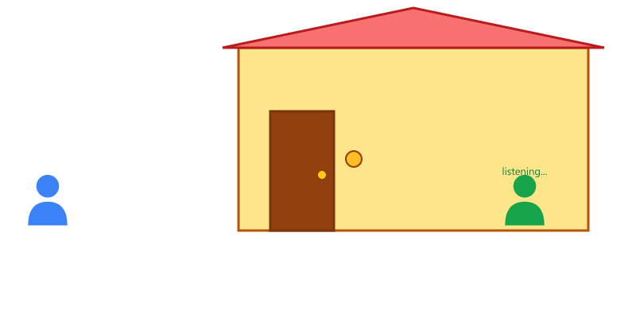
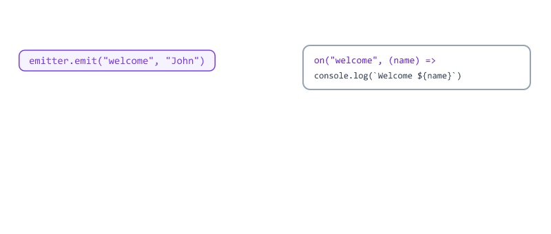
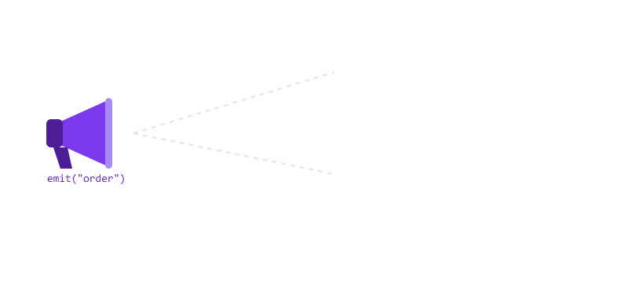
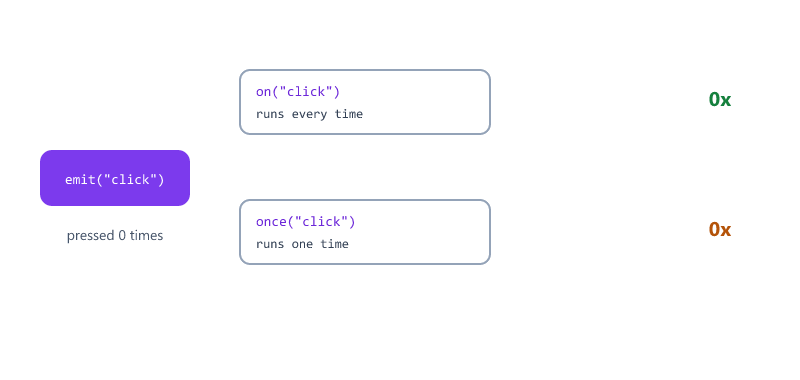
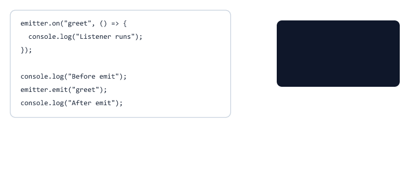
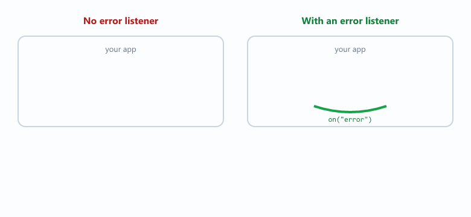
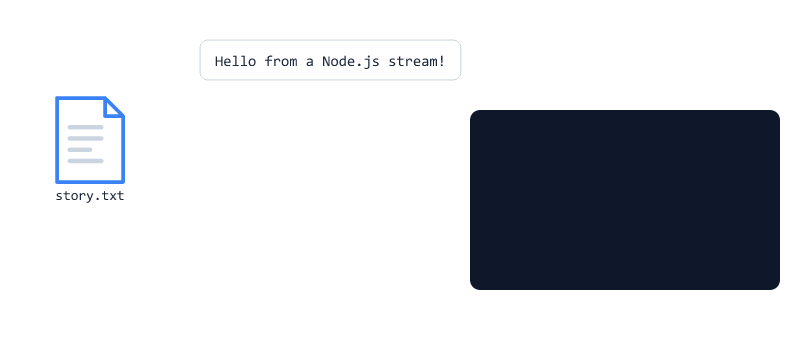
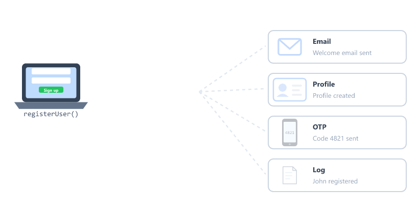
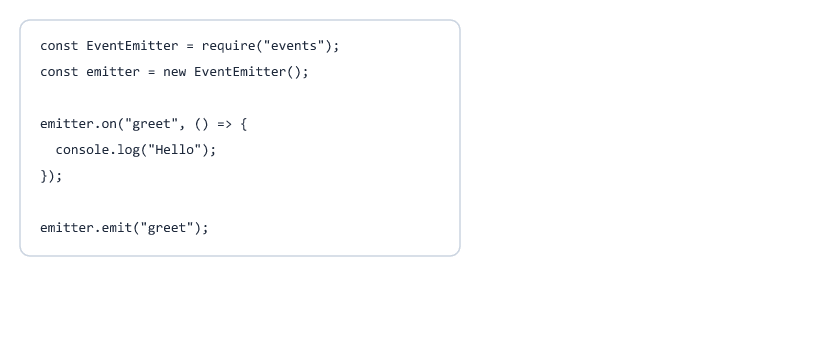

## Table of Contents

* [What is an Event?](#what-is-an-event)
* [Event Driven Programming](#event-driven-programming)
* [What is EventEmitter?](#what-is-eventemitter)
* [Creating Your First Event](#creating-your-first-event)
* [Listening to Events](#listening-to-events)
* [Triggering Events](#triggering-events)
* [Passing Data with Events](#passing-data-with-events)
* [Multiple Event Listeners](#multiple-event-listeners)
* [Listening Only Once with once()](#listening-only-once-with-once)
* [Removing Listeners with off()](#removing-listeners-with-off)
* [emit() Runs Listeners Immediately](#emit-runs-listeners-immediately)
* [The Special error Event](#the-special-error-event)
* [Events You Already Use](#events-you-already-use)
* [Reading a File in Chunks with Events](#reading-a-file-in-chunks-with-events)
* [Creating Your Own Event Class](#creating-your-own-event-class)
* [Real World Example](#real-world-example)
* [Sharing One Emitter Across Files](#sharing-one-emitter-across-files)
* [Event Flow Diagram](#event-flow-diagram)
* [Beginner Mistakes](#beginner-mistakes)
* [Practice Exercises](#practice-exercises)
* [Interview Questions](#interview-questions)
* [Summary](#summary)

---

## What is an Event?

An event is an action or occurrence that happens in an application.

Examples


Whenever something happens, an event can be triggered.

---

## Event Driven Programming

Node.js follows an event-driven architecture.

This means 

| Step | What happens               |
| ---- | -------------------------- |
| 1    | An event happens           |
| 2    | A listener notices it      |
| 3    | An action runs             |

Real-Life Example



The bell ringing is the event.

The person waiting inside is the listener.

Opening the door is the action.

You already know this idea from Session 03. The Event Loop waits for things to happen and then runs the right callback.

---

## What is EventEmitter?

Node.js provides a built-in class called 

```javascript
EventEmitter
```

It helps us create events, listen to them, and trigger them.

Import EventEmitter

```javascript
const EventEmitter = require("events");
```

`events` is a core module, so there is nothing to install.

Create an instance

```javascript
const emitter = new EventEmitter();
```

`new` creates a new object from the EventEmitter class. Think of `emitter` as your own little radio station.

---

## Creating Your First Event

Example

```javascript
const EventEmitter = require("events");

const emitter = new EventEmitter();

emitter.on("greet", () => {
  console.log("Hello Student");
});

emitter.emit("greet");
```

Output

```text
Hello Student
```


| Method  | Meaning                       |
| ------- | ----------------------------- |
| on()    | Listen for an event           |
| emit()  | Trigger (send) an event       |

---

## Listening to Events

The `on()` method is used to listen for an event.

Example

```javascript
emitter.on("login", () => {
  console.log("User Logged In");
});
```

Node.js waits until the event is triggered.

The first argument is the event name. The second argument is the callback (the listener) that runs when the event happens.

---

## Triggering Events

The `emit()` method is used to trigger an event.

Example

```javascript
emitter.emit("login");
```

Output

```text
User Logged In
```

`emit()` triggers the event, and every `on()` listener for that name runs its code.

`emit()` also returns `true` if someone was listening, and `false` if nobody was.

---

## Passing Data with Events

We can pass data when triggering an event.

Example

```javascript
const EventEmitter = require("events");

const emitter = new EventEmitter();

emitter.on("welcome", (name) => {
  console.log(`Welcome ${name}`);
});

emitter.emit("welcome", "John");
```

Output

```text
Welcome John
```



You can send more than one value

```javascript
emitter.on("order", (item, quantity, user) => {
  console.log(`${user} ordered ${quantity} x ${item}`);
});

emitter.emit("order", "Pizza", 2, "John");
```

Output

```text
John ordered 2 x Pizza
```

The values arrive in the same order you sent them.

Tip: when you have many values, send one object instead

```javascript
emitter.emit("order", { item: "Pizza", quantity: 2, user: "John" });
```

---

## Multiple Event Listeners

One event can have multiple listeners.

Example

```javascript
const EventEmitter = require("events");

const emitter = new EventEmitter();

emitter.on("order", () => {
  console.log("Order Received");
});

emitter.on("order", () => {
  console.log("Payment Processing");
});

emitter.emit("order");
```

Output

```text
Order Received

Payment Processing
```



Listeners run in the same order they were added.

---

## Listening Only Once with once()

`once()` works like `on()`, but the listener runs only the first time.

```javascript
const EventEmitter = require("events");

const emitter = new EventEmitter();

emitter.on("click", () => {
  console.log("on: clicked");
});

emitter.once("click", () => {
  console.log("once: clicked");
});

emitter.emit("click");
emitter.emit("click");
emitter.emit("click");
```

Output

```text
on: clicked
once: clicked
on: clicked
on: clicked
```



Real uses for once()

* Run setup code when the database connects for the first time
* Show a welcome message only on the first login

---

## Removing Listeners with off()

To stop listening, remove the listener with `off()`.

You must pass the same function you added, so give it a name.

```javascript
const EventEmitter = require("events");

const emitter = new EventEmitter();

function showMessage() {
  console.log("New message");
}

emitter.on("message", showMessage);

emitter.emit("message");

emitter.off("message", showMessage);

emitter.emit("message");

console.log("Listeners left:", emitter.listenerCount("message"));
```

Output

```text
New message
Listeners left: 0
```

The second emit() prints nothing, because nobody is listening anymore.

| Method                    | Meaning                                |
| ------------------------- | -------------------------------------- |
| on(name, fn)              | Add a listener                         |
| once(name, fn)            | Add a listener that runs one time      |
| off(name, fn)             | Remove a listener                      |
| emit(name, ...data)       | Trigger the event                      |
| listenerCount(name)       | How many listeners are there?          |

---

## emit() Runs Listeners Immediately

In Session 03 you learned that setTimeout callbacks wait in a queue.

Event listeners do not. `emit()` runs every listener right away, before the next line.

```javascript
const EventEmitter = require("events");

const emitter = new EventEmitter();

emitter.on("greet", () => {
  console.log("Listener runs");
});

console.log("Before emit");
emitter.emit("greet");
console.log("After emit");
```

Output

```text
Before emit
Listener runs
After emit
```



This means a slow listener blocks everything after `emit()`. Keep listeners short, or use async code inside them.

---

## The Special error Event

`"error"` is a special event name.

If you emit `"error"` and nobody is listening, Node.js crashes the program.

```javascript
const EventEmitter = require("events");

const emitter = new EventEmitter();

emitter.emit("error", new Error("Database connection lost"));

console.log("This never runs");
```

Output

```text
Error: Database connection lost
```

Always add an error listener

```javascript
const EventEmitter = require("events");

const emitter = new EventEmitter();

emitter.on("error", (err) => {
  console.log("Handled:", err.message);
});

emitter.emit("error", new Error("Database connection lost"));

console.log("App keeps running");
```

Output

```text
Handled: Database connection lost
App keeps running
```



You will see this in later sessions, for example `mongoose.connection.on("error", ...)`.

---

## Events You Already Use

Many built-in Node.js objects are EventEmitters. They all use `on()`.

| Object                       | Event       | When                         | Session |
| ---------------------------- | ----------- | ---------------------------- | ------- |
| `process`                    | `"exit"`    | The program is about to end  | 07      |
| `fs.createWriteStream()`     | `"finish"`  | All data has been written    | 05      |
| `fs.createReadStream()`      | `"data"`    | A piece of the file is ready | 08      |
| HTTP request (`req`)         | `"data"`, `"end"` | Data arrives from a user | 11 |
| Database connection          | `"connected"`, `"error"` | Database status changes | 19 |

process example

```javascript
process.on("exit", (code) => {
  console.log("Exiting with code", code);
});

console.log("Working...");
```

Output

```text
Working...
Exiting with code 0
```

Write stream example

```javascript
const fs = require("fs");

const stream = fs.createWriteStream("app.log");

stream.on("finish", () => {
  console.log("All data written");
});

stream.write("Line 1\n");
stream.end("Line 2\n");
```

Output

```text
All data written
```

Once you know EventEmitter, all of these work the same way.

---

## Reading a File in Chunks with Events

Big files are often read in small pieces (chunks) instead of all at once.

A read stream emits a `"data"` event for every chunk, and an `"end"` event when the file is finished.

story.txt

```text
Hello from a Node.js stream!
```

```javascript
const fs = require("fs");

const stream = fs.createReadStream("story.txt", {
  encoding: "utf8",
  highWaterMark: 10
});

stream.on("data", (chunk) => {
  console.log("Got chunk:", chunk);
});

stream.on("end", () => {
  console.log("Finished reading");
});
```

Output

```text
Got chunk: Hello from
Got chunk:  a Node.js
Got chunk:  stream!
Finished reading
```

`highWaterMark: 10` means chunks of 10 bytes. It is tiny here so you can see the chunks. The default is 64 KB.



Why this matters

When a user sends data to your server, it also arrives in chunks. In Session 11 you will write

```javascript
req.on("data", (chunk) => { /* add the chunk */ });
req.on("end", () => { /* all data has arrived */ });
```

It is exactly the same pattern.

---

## Creating Your Own Event Class

You can create your own class that has all the EventEmitter methods.

```javascript
const EventEmitter = require("events");

class Shop extends EventEmitter {
  placeOrder(item) {
    console.log("Order placed:", item);
    this.emit("orderPlaced", item);
  }
}

const shop = new Shop();

shop.on("orderPlaced", (item) => {
  console.log("Kitchen: start cooking", item);
});

shop.placeOrder("Pizza");
```

Output

```text
Order placed: Pizza
Kitchen: start cooking Pizza
```

| Code                         | Meaning                                                |
| ---------------------------- | ------------------------------------------------------ |
| `class Shop`                 | A blueprint for creating shop objects                  |
| `extends EventEmitter`       | Shop gets everything EventEmitter has (on, emit, ...)  |
| `placeOrder(item)`           | A method (function) that belongs to Shop               |
| `this.emit(...)`             | `this` is the current shop object, so it emits on itself |
| `new Shop()`                 | Create a shop object from the blueprint                |

You will see `extends` again in later sessions, for example `class AppError extends Error`.

---

## Real World Example

Imagine a user registration system.

When a user registers, several things must happen.



One event can trigger multiple actions.

```javascript
const EventEmitter = require("events");

const emitter = new EventEmitter();

emitter.on("userRegistered", (user) => {
  console.log(`Email: Welcome email sent to ${user.email}`);
});

emitter.on("userRegistered", (user) => {
  console.log(`Profile: Profile created for ${user.name}`);
});

emitter.on("userRegistered", (user) => {
  const otp = Math.floor(1000 + Math.random() * 9000);
  console.log(`OTP: Code ${otp} sent to ${user.email}`);
});

emitter.on("userRegistered", (user) => {
  console.log(`Log: ${user.name} registered`);
});

function registerUser(name, email) {
  const user = { name, email };
  console.log("User saved:", name);

  emitter.emit("userRegistered", user);
}

registerUser("John", "john@example.com");
```

Output (the OTP number changes every time)

```text
User saved: John
Email: Welcome email sent to john@example.com
Profile: Profile created for John
OTP: Code 4821 sent to john@example.com
Log: John registered
```

`registerUser()` does not need to know about emails, profiles or logs. It only announces "a user registered". New features can be added later by adding another listener, without changing `registerUser()`.

This makes applications easier to manage and scale.

---

## Sharing One Emitter Across Files

In real projects, listeners live in different files.

```text
project/
├── events.js
├── email.js
└── app.js
```

events.js

```javascript
const EventEmitter = require("events");

const emitter = new EventEmitter();

module.exports = emitter;
```

email.js

```javascript
const emitter = require("./events");

emitter.on("userRegistered", (user) => {
  console.log(`Welcome email sent to ${user.email}`);
});
```

app.js

```javascript
const emitter = require("./events");

require("./email");

emitter.emit("userRegistered", { name: "John", email: "john@example.com" });
```

Run

```bash
node app.js
```

Output

```text
Welcome email sent to john@example.com
```

Why does this work? In Session 04 you learned that a module runs only once. Every file that requires `./events` gets the same emitter object.

---

## Event Flow Diagram



| Step | Code                          | What happens                     |
| ---- | ----------------------------- | -------------------------------- |
| 1    | `new EventEmitter()`          | Create the emitter               |
| 2    | `emitter.on("greet", fn)`     | Register a listener              |
| 3    | `emitter.emit("greet")`       | Trigger the event                |
| 4    | `fn` runs                     | The listener executes            |

---

## Beginner Mistakes

### Mistake 1

Emitting before listening.

Incorrect:

```javascript
emitter.emit("greet");

emitter.on("greet", () => {
  console.log("Hello");
});
```

Nothing prints. When the event was emitted, nobody was listening yet.

Correct:

Always register listeners with `on()` before calling `emit()`.

---

### Mistake 2

Different event names.

Incorrect:

```javascript
emitter.on("userLogin", () => console.log("Logged in"));

emitter.emit("userlogin");
```

Nothing prints. Event names are case-sensitive. `userLogin` and `userlogin` are different events.

Correct:

Use exactly the same name in `on()` and `emit()`.

---

### Mistake 3

Removing an anonymous listener.

Incorrect:

```javascript
emitter.on("message", () => console.log("Hi"));

emitter.off("message", () => console.log("Hi"));
```

The listener is not removed. The two arrow functions look the same, but they are two different functions.

Correct:

```javascript
function sayHi() {
  console.log("Hi");
}

emitter.on("message", sayHi);
emitter.off("message", sayHi);
```

---

### Mistake 4

Emitting "error" without an error listener.

The program crashes. Always add `emitter.on("error", ...)` when an emitter might report errors.

---

### Mistake 5

Forgetting `new`.

Incorrect:

```javascript
const emitter = EventEmitter();
```

```text
TypeError: Cannot read properties of undefined (reading '_events')
```

The message is confusing, but the cause is simple: `new` is missing.

Correct:

```javascript
const emitter = new EventEmitter();
```

---

## Practice Exercises

### Exercise 1

Create an event named 

```text
studentJoined
```

Print 

```text
New Student Joined
```

when the event is triggered.

---

### Exercise 2

Create an event named 

```text
courseStarted
```

Pass the course name and display it.

Expected Output

```text
Course: Node.js
```

---

### Exercise 3

Create two listeners for 

```text
orderPlaced
```

Print different messages from each listener.

---

### Exercise 4

Create a `bellRang` event with `once()`.

Emit it three times. Confirm the message prints only once.

---

### Exercise 5

Read a text file with `fs.createReadStream()` and `highWaterMark: 5`.

Count how many `"data"` events happen, and print the count in the `"end"` listener.

---

### Exercise 6

Create a class `Timer` that extends EventEmitter.

Add a method `start(seconds)` that uses setInterval to emit a `"tick"` event every second, and a `"done"` event at the end.

```text
tick 1
tick 2
tick 3
done
```

---

### Exercise 7

Split the Real World Example into files: `events.js`, `email.js`, `log.js` and `app.js`.

---

## Interview Questions

### What is an event?

An event is an action or occurrence that happens within an application.

---

### What is EventEmitter?

EventEmitter is a built-in Node.js class used to create and handle events.

---

### What does emit() do?

The emit() method triggers an event.

---

### What does on() do?

The on() method listens for an event.

---

### Can one event have multiple listeners?

Yes.

A single event can trigger multiple listeners. They run in the order they were added.

---

### What is the difference between on() and once()?

on() runs the listener every time the event is emitted. once() runs it only the first time and then removes it.

---

### How do you remove a listener?

With emitter.off(eventName, listenerFunction). You must pass the same function that was added, so it needs a name.

---

### Are event listeners synchronous or asynchronous?

Synchronous. emit() calls every listener immediately, in order, before the next line of code runs.

---

### What happens if you emit an "error" event with no listener?

Node.js throws the error and the program crashes. Always listen for "error".

---

### Give examples of built-in objects that use events.

process (exit), file streams (data, end, finish), HTTP requests (data, end) and database connections (connected, error).

---

### How do you create a custom class that emits events?

Create a class that extends EventEmitter, then call this.emit() inside its methods.

---

## Summary

In this session, you learned

* What events are
* Event-driven programming
* EventEmitter
* Listening to events
* Triggering events
* Passing data with events
* Multiple event listeners
* once() and off()
* emit() runs listeners immediately
* The special error event
* Built-in objects that emit events
* Reading files in chunks with streams
* Creating your own class with extends
* Sharing one emitter across files

Events are one of the core concepts of Node.js and are used extensively in real-world applications.

---
