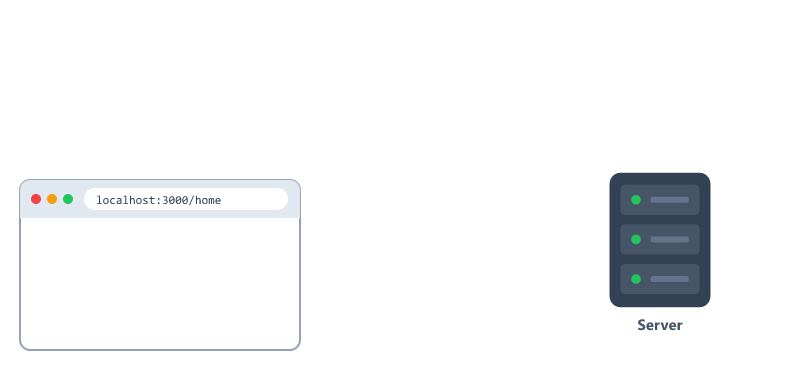
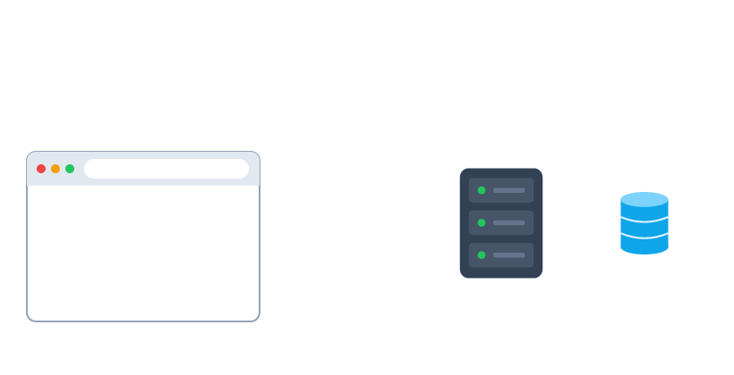
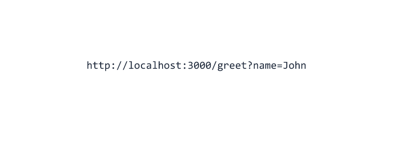
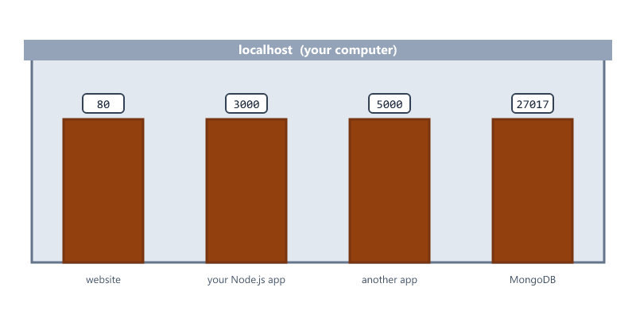
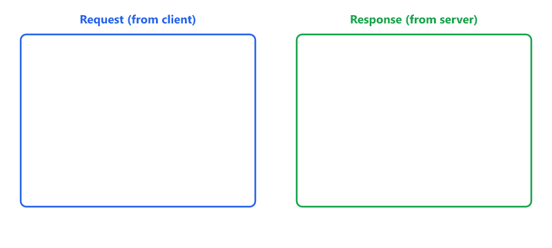
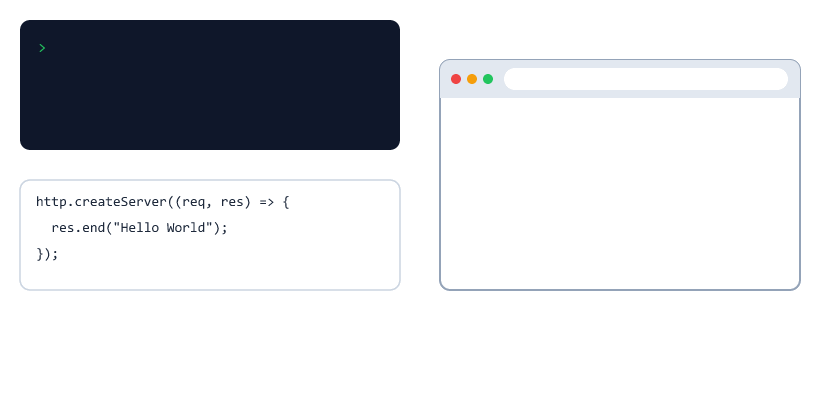
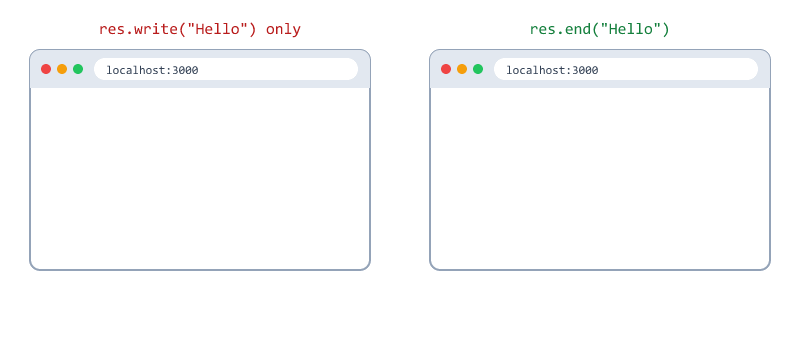
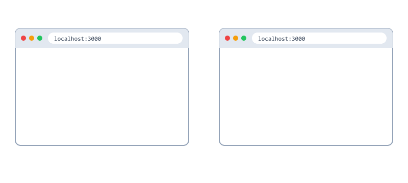
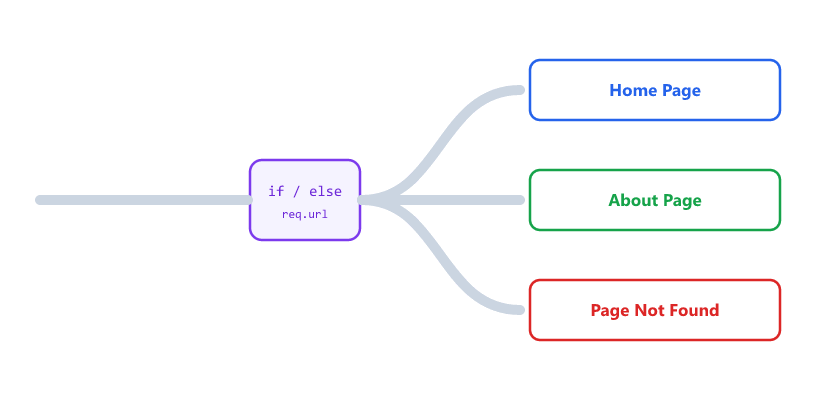
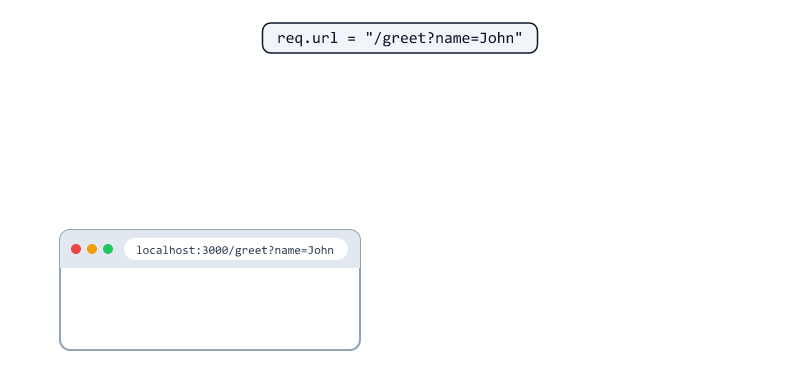

## Table of Contents

* [What is HTTP?](#what-is-http)
* [What is a Client?](#what-is-a-client)
* [What is a Server?](#what-is-a-server)
* [How HTTP Works](#how-http-works)
* [Understanding a URL](#understanding-a-url)
* [What are localhost and Ports?](#what-are-localhost-and-ports)
* [HTTP Methods](#http-methods)
* [What a Request and Response Look Like](#what-a-request-and-response-look-like)
* [Importing HTTP Module](#importing-http-module)
* [Creating Your First Server](#creating-your-first-server)
* [Understanding createServer()](#understanding-createserver)
* [Understanding Request and Response](#understanding-request-and-response)
* [Request Object](#request-object)
* [Response Object](#response-object)
* [Content-Type: Text or HTML?](#content-type-text-or-html)
* [Creating Routes](#creating-routes)
* [Route Flow](#route-flow)
* [Reading Query Strings](#reading-query-strings)
* [The Server is an EventEmitter](#the-server-is-an-eventemitter)
* [Serving an HTML File](#serving-an-html-file)
* [Complete Example](#complete-example)
* [Testing Your Server](#testing-your-server)
* [Stopping and Restarting the Server](#stopping-and-restarting-the-server)
* [Beginner Mistakes](#beginner-mistakes)
* [Practice Exercises](#practice-exercises)
* [Interview Questions](#interview-questions)
* [Summary](#summary)

---

## What is HTTP?

HTTP stands for 

```text
HyperText Transfer Protocol
```

HTTP is a communication protocol used between a client and a server.

A protocol is a set of rules both sides agree on, like a shared language.

Whenever you open a website, HTTP is used behind the scenes.



---

## What is a Client?

A client is an application that sends requests.

Examples


| Client               | Example                                   |
| -------------------- | ----------------------------------------- |
| Browser              | Chrome, Firefox, Edge                     |
| Mobile App           | A shopping app on your phone              |
| API testing tool     | Postman, or curl in the terminal          |
| Frontend Application | A React or Angular website                |

The client always starts the conversation by asking for data.

---

## What is a Server?

A server receives requests and sends responses.

| Who     | Does what                        | Example               |
| ------- | -------------------------------- | --------------------- |
| Client  | Sends a request                  | Asks for the homepage |
| Server  | Sends back a response            | Returns the HTML      |

A server never sends a response without a request first.

In this course, the server is the Node.js program you write.

---

## How HTTP Works

Simple Flow



| Step | Who    | What happens                        |
| ---- | ------ | ----------------------------------- |
| 1    | Client | Sends a request                     |
| 2    | Server | Processes the request               |
| 3    | Server | Sends a response                    |
| 4    | Client | Displays the result                 |

Real Example

When you open a video website, your browser sends a request. The video server processes it, finds the video data, and sends it back. Your browser shows the video.

---

## Understanding a URL

Every request is sent to a URL.



| Part         | Example         | Meaning                                    |
| ------------ | --------------- | ------------------------------------------ |
| Protocol     | `http://`       | The rules used to talk                     |
| Host         | `localhost`     | Which computer                             |
| Port         | `3000`          | Which program on that computer             |
| Path         | `/greet`        | Which page or resource                     |
| Query string | `?name=John`    | Extra information, as key=value pairs      |

In your Node.js code, `req.url` contains only the path and the query string: `/greet?name=John`.

---

## What are localhost and Ports?

`localhost` means "this computer". When you visit `http://localhost:3000`, the request never leaves your machine.

One computer can run many server programs at the same time. Each one listens on a different port.

Think of the computer as a building, and ports as numbered doors.



| Port  | Commonly used by          |
| ----- | ------------------------- |
| 80    | Websites (http)           |
| 443   | Websites (https)          |
| 3000  | Node.js apps in development |
| 27017 | MongoDB (Session 17)      |

Only one program can use a port at a time.

---

## HTTP Methods

The method tells the server what the client wants to do.

| Method | Meaning              | Example                 |
| ------ | -------------------- | ----------------------- |
| GET    | Read data            | Show all students       |
| POST   | Create new data      | Add a new student       |
| PUT    | Update existing data | Change a student's name |
| DELETE | Remove data          | Delete a student        |

When you type a URL in the browser, it always sends a GET request.

You will use all four methods in Session 11.

---

## What a Request and Response Look Like

HTTP messages are just text.

A request

```text
GET /greet?name=John HTTP/1.1
Host: localhost:3000
User-Agent: Mozilla/5.0 (Windows NT 10.0)
```

A response

```text
HTTP/1.1 200 OK
Content-Type: text/plain
Content-Length: 10

Hello John
```



| Part         | Request                     | Response                          |
| ------------ | --------------------------- | --------------------------------- |
| First line   | Method, path, version       | Version, status code, status text |
| Headers      | Extra information (`Host`, `User-Agent`) | Extra information (`Content-Type`) |
| Body         | Data sent by the client (for POST/PUT) | The content you send back |

Status codes tell the client how things went

| Range | Meaning       | Example                   |
| ----- | ------------- | ------------------------- |
| 2xx   | Success       | 200 OK, 201 Created       |
| 3xx   | Redirect      | 301 Moved Permanently     |
| 4xx   | Client error  | 404 Not Found             |
| 5xx   | Server error  | 500 Internal Server Error |

You will set status codes yourself in Session 10.

---

## Importing HTTP Module

The HTTP module is built into Node.js (a core module).

No installation is required.

Import it using

```javascript
const http = require("http");
```

---

## Creating Your First Server

Create

```text
server.js
```

Add

```javascript
const http = require("http");

const server = http.createServer(
  (req, res) => {
    res.end("Hello World");
  }
);

server.listen(3000, () => {
  console.log("Server Running On Port 3000");
});
```

Run

```bash
node server.js
```

Output

```text
Server Running On Port 3000
```

The terminal does not return to the prompt. The server keeps running and waits for requests.

Open

```text
http://localhost:3000
```

Response

```text
Hello World
```



The function passed to `listen()` runs once, when the server is ready.

Congratulations.

You have created your first HTTP server.

---

## Understanding createServer()

Example

```javascript
http.createServer((req, res) => {
  res.end("Hello World");
});
```

| Step | What happens                              |
| ---- | ----------------------------------------- |
| 1    | A request is received                     |
| 2    | Node.js runs your callback                |
| 3    | Your callback sends the response          |

Whenever a request arrives, Node.js executes the callback function.

It runs again for every request, from every user. This is the Event Loop from Session 03 at work.

---

## Understanding Request and Response

The callback receives two objects 

```javascript
(req, res)
```

| Object | Purpose           |
| ------ | ----------------- |
| req    | Incoming Request  |
| res    | Outgoing Response |

You read from `req`. You write to `res`.

---

## Request Object

Useful Properties

```javascript
req.url
```

Returns the requested URL (path and query string).

Example

```text
/about
```

---

```javascript
req.method
```

Returns the HTTP method.

Example

```text
GET

POST

PUT

DELETE
```

---

```javascript
req.headers
```

Returns the request headers as an object.

```javascript
const http = require("http");

const server = http.createServer((req, res) => {
  console.log(req.method, req.url);
  console.log("Browser:", req.headers["user-agent"]);

  res.end("Check the terminal");
});

server.listen(3000);
```

Terminal output after opening http://localhost:3000/about

```text
GET /about
Browser: Mozilla/5.0 (Windows NT 10.0; Win64; x64) ...
GET /favicon.ico
Browser: Mozilla/5.0 (Windows NT 10.0; Win64; x64) ...
```

Why two requests? Browsers automatically ask for `/favicon.ico`, the small icon shown in the browser tab. This is normal.

---

## Response Object

Used to send data back to the client.

Example

```javascript
res.end("Welcome");
```

Output

```text
Welcome
```

| Method / Property             | Purpose                                     |
| ----------------------------- | ------------------------------------------- |
| `res.write(data)`             | Send a piece of the response (can repeat)   |
| `res.end(data)`               | Send the last piece and finish the response |
| `res.setHeader(name, value)`  | Set a response header                       |
| `res.statusCode = 404`        | Set the status code (Session 10)            |

Sending in pieces

```javascript
res.write("Line 1\n");
res.write("Line 2\n");
res.end("Done");
```

Output

```text
Line 1
Line 2
Done
```

Important

Every request must end with `res.end()`. Without it, the browser keeps loading forever.



---

## Content-Type: Text or HTML?

The `Content-Type` header tells the browser what kind of data you are sending.

```javascript
const http = require("http");

const server = http.createServer((req, res) => {
  res.setHeader("Content-Type", "text/html");
  res.end("<h1>Hello</h1><p>Welcome to my server</p>");
});

server.listen(3000);
```



| Content-Type         | The browser shows                     |
| -------------------- | ------------------------------------- |
| `text/plain`         | The text exactly as it is, tags included |
| `text/html`          | A formatted web page                  |
| `application/json`   | JSON data (Session 10)                |

---

## Creating Routes

We can send different responses for different URLs.

Example

```javascript
const http = require("http");

const server = http.createServer(
  (req, res) => {
    if (req.url === "/") {
      res.end("Home Page");
    } else if (req.url === "/about") {
      res.end("About Page");
    } else {
      res.end("Page Not Found");
    }
  }
);

server.listen(3000);
```

---

## Route Flow



| URL              | Response        |
| ---------------- | --------------- |
| `/`              | Home Page       |
| `/about`         | About Page      |
| Anything else    | Page Not Found  |

---

## Reading Query Strings

A URL like `/greet?name=John` has a query string.

`req.url` gives you the whole thing as one string. Use the built-in `URL` class to split it into parts.

```javascript
const http = require("http");

const server = http.createServer((req, res) => {
  const url = new URL(req.url, "http://localhost:3000");

  if (url.pathname === "/greet") {
    const name = url.searchParams.get("name") || "Guest";
    res.end("Hello " + name);
  } else {
    res.end("Home Page");
  }
});

server.listen(3000);
```

| Visit                        | Response     |
| ---------------------------- | ------------ |
| `/greet?name=John`           | Hello John   |
| `/greet?name=Sara`           | Hello Sara   |
| `/greet`                     | Hello Guest  |



| Code                          | Value for `/greet?name=John` |
| ----------------------------- | ---------------------------- |
| `req.url`                     | `/greet?name=John`           |
| `url.pathname`                | `/greet`                     |
| `url.searchParams.get("name")`| `John`                       |

`URL` is global, like `process`. No require needed.

Compare routes with `url.pathname`, not `req.url`. Otherwise `/greet?name=John` would not match `"/greet"`.

---

## The Server is an EventEmitter

In Session 08 you learned about events. The HTTP server is an EventEmitter too.

These two servers are the same

```javascript
const server = http.createServer((req, res) => {
  res.end("Hello");
});
```

```javascript
const server = http.createServer();

server.on("request", (req, res) => {
  res.end("Hello");
});
```

Every time a request arrives, the server emits a `"request"` event, and your callback is the listener.

`req` is an EventEmitter as well. In Session 11 you will use `req.on("data")` and `req.on("end")` to read data sent by the client.

---

## Serving an HTML File

Writing HTML inside strings gets messy. Put it in a file instead, and use fs and path from Sessions 05 and 06.

```text
project/
├── public/
│   └── index.html
└── server.js
```

public/index.html

```html
<!DOCTYPE html>
<html>
  <head>
    <title>My Node.js Site</title>
  </head>
  <body>
    <h1>Welcome</h1>
    <p>This page was sent by Node.js</p>
  </body>
</html>
```

server.js

```javascript
const http = require("http");
const fs = require("fs");
const path = require("path");

const server = http.createServer((req, res) => {
  const filePath = path.join(__dirname, "public", "index.html");

  fs.readFile(filePath, "utf8", (err, html) => {
    if (err) {
      res.statusCode = 500;
      res.end("Something went wrong");
      return;
    }

    res.setHeader("Content-Type", "text/html");
    res.end(html);
  });
});

server.listen(3000, () => {
  console.log("Server Running On Port 3000");
});
```

This uses everything you have learned so far

| Code                         | Session |
| ---------------------------- | ------- |
| Async callback with `err`    | 03, 05  |
| `require()` core modules     | 04      |
| `fs.readFile()`              | 05      |
| `path.join(__dirname, ...)`  | 06      |
| `http.createServer()`        | 09      |

The async `fs.readFile()` does not block, so the server can handle other users while the file is being read.

---

## Complete Example

```javascript
const http = require("http");

const server = http.createServer(
  (req, res) => {
    if (req.url === "/") {
      res.end("Welcome To Node.js");
    } else if (req.url === "/contact") {
      res.end("Contact Us");
    } else {
      res.end("404 Not Found");
    }
  }
);

server.listen(3000, () => {
  console.log("Server Running On Port 3000");
});
```

Visit 

```text
http://localhost:3000

http://localhost:3000/contact
```

---

## Testing Your Server

| Tool         | How                                       | Good for               |
| ------------ | ----------------------------------------- | ---------------------- |
| Browser      | Type the URL                              | GET requests           |
| curl         | `curl http://localhost:3000/contact`      | Quick terminal tests   |
| Postman      | Desktop app                               | POST, PUT, DELETE      |

curl comes with Windows 10/11, macOS and Linux.

See the status line and headers with `-i`

```bash
curl -i http://localhost:3000/contact
```

```text
HTTP/1.1 200 OK
Date: Sat, 03 Oct 2026 10:00:00 GMT
Connection: keep-alive
Keep-Alive: timeout=5
Content-Length: 10

Contact Us
```

In the browser, open Developer Tools (F12), go to the Network tab, and reload the page to see every request and response.

---

## Stopping and Restarting the Server

| Action                    | How                                  |
| ------------------------- | ------------------------------------ |
| Stop the server           | Press `Ctrl + C` in the terminal     |
| See your code changes     | Stop and start again                 |
| Restart automatically     | `node --watch server.js` (Session 01) or `npm run dev` with nodemon (Session 02) |

A running server does not see your changes until it restarts.

---

## Beginner Mistakes

### Mistake 1

Forgetting `res.end()`.

Incorrect:

```javascript
http.createServer((req, res) => {
  res.write("Hello");
});
```

The browser keeps loading forever, because the response never finishes.

Correct:

```javascript
http.createServer((req, res) => {
  res.end("Hello");
});
```

---

### Mistake 2

Starting the server twice.

```text
Error: listen EADDRINUSE: address already in use :::3000
```

Another program (often your own server in another terminal) is already using port 3000.

Correct:

Stop the other server with `Ctrl + C`, or use a different port such as 3001.

---

### Mistake 3

Expecting changes without restarting.

You edit server.js, refresh the browser, and nothing changes.

Correct:

Restart the server, or use `node --watch server.js` or nodemon.

---

### Mistake 4

Comparing `req.url` when there is a query string.

Incorrect:

```javascript
if (req.url === "/greet") {
  // never matches /greet?name=John
}
```

Correct:

```javascript
const url = new URL(req.url, "http://localhost:3000");

if (url.pathname === "/greet") {
  // matches /greet and /greet?name=John
}
```

---

### Mistake 5

Sending HTML without a Content-Type.

```javascript
res.end("<h1>Hello</h1>");
```

Some browsers guess correctly, others show the tags as text.

Correct:

```javascript
res.setHeader("Content-Type", "text/html");
res.end("<h1>Hello</h1>");
```

---

### Mistake 6

Calling `res.end()` twice.

```javascript
if (req.url === "/") {
  res.end("Home");
}
res.end("Not Found");
```

For `/`, both lines run. The browser gets "Home", but then the second `res.end()` crashes the whole server

```text
Error [ERR_STREAM_WRITE_AFTER_END]: write after end
```

This is the unhandled "error" event from Session 08. After the crash, no user can reach the server.

Correct:

Use `else`, or `return` after sending a response.

---

## Practice Exercises

### Exercise 1

Create a server that returns 

```text
Hello Student
```

for every request.

---

### Exercise 2

Create routes 

```text
/

/about

/contact
```

Return different messages for each route.

---

### Exercise 3

Display 

```javascript
req.url
```

inside the console.

Visit different URLs and observe the output. Do you see `/favicon.ico`?

---

### Exercise 4

Display 

```javascript
req.method
```

inside the console.

---

### Exercise 5

Create a `/greet` route that reads `?name=` from the URL and responds with `Hello <name>`. If no name is given, respond with `Hello Guest`.

---

### Exercise 6

Create `/html` that returns an HTML page with a heading and a list of 3 items. Set the correct Content-Type.

---

### Exercise 7

Serve two HTML files from a `public` folder: `index.html` for `/` and `about.html` for `/about`.

---

### Exercise 8

Test your server with `curl -i`. Write down the status code and the headers you see.

---

## Interview Questions

### What is HTTP?

HTTP stands for HyperText Transfer Protocol and is used for communication between clients and servers.

---

### What is a Client?

A client sends requests to a server.

Examples 

```text
Browser

Mobile App

Postman
```

---

### What is a Server?

A server receives requests and sends responses.

---

### What is the purpose of createServer()?

It creates an HTTP server that can handle incoming requests.

---

### What is req?

The request object containing information about the incoming request.

---

### What is res?

The response object used to send data back to the client.

---

### What does res.end() do?

It sends the response and ends the request.

---

### What is a port?

A number that identifies a specific program on a computer. One computer can run many servers, each on its own port.

---

### What is localhost?

A name that means "this computer". Requests to localhost never leave your machine.

---

### What are the main HTTP methods?

GET (read), POST (create), PUT (update) and DELETE (remove).

---

### What is the Content-Type header?

A response header that tells the client what kind of data is being sent, for example text/plain, text/html or application/json.

---

### What is the difference between res.write() and res.end()?

res.write() sends part of the response and can be called many times. res.end() sends the final part and finishes the response. Every response must call res.end().

---

### How do you read query parameters with the http module?

Create a URL object with new URL(req.url, "http://localhost:3000") and use url.searchParams.get("name").

---

### What happens if you call res.end() twice?

The second call throws a "write after end" error. If nothing handles it, the whole server crashes.

---

### What does EADDRINUSE mean?

The port is already being used by another program, so the server cannot start on it.

---

### Why does the browser send a request to /favicon.ico?

Browsers automatically request the small icon shown in the browser tab.

---

## Summary

In this session, you learned 

* What HTTP is
* What a Client is
* What a Server is
* How requests and responses work
* The parts of a URL, localhost and ports
* HTTP methods and status code ranges
* How to create an HTTP server
* req.url, req.method and req.headers
* res.write(), res.end() and setHeader()
* Sending plain text and HTML
* How to create basic routes
* How to read query strings
* That the server is an EventEmitter
* How to serve an HTML file
* How to test, stop and restart a server

This is the foundation of backend development.

---
