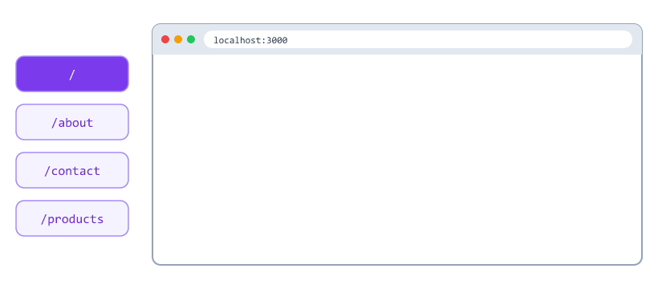
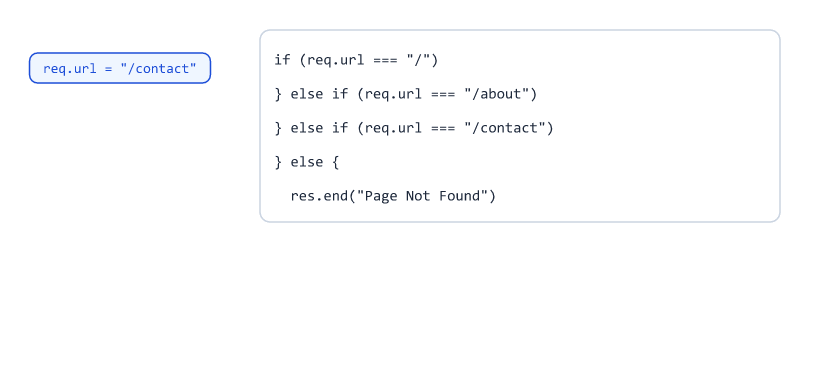
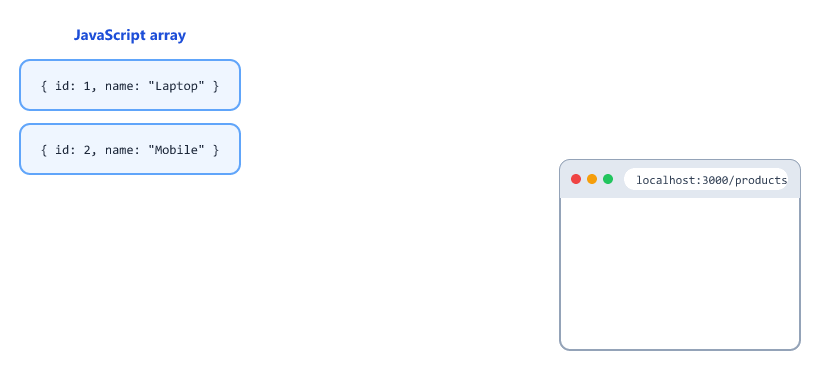
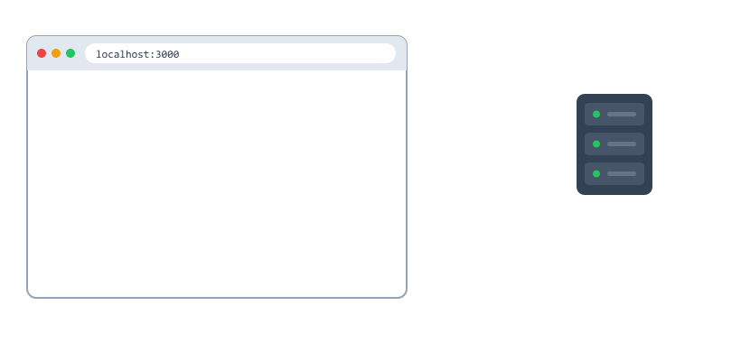
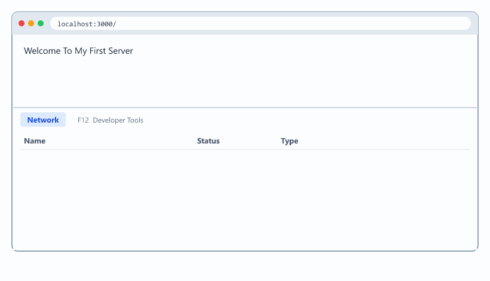
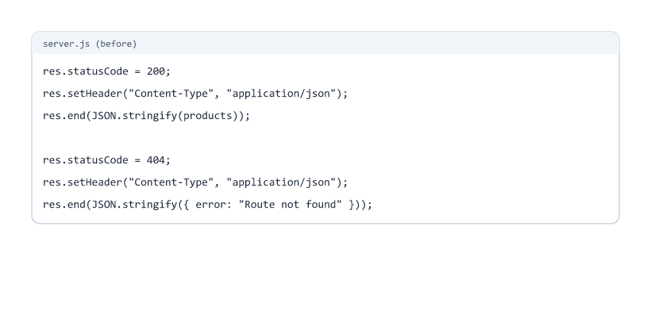
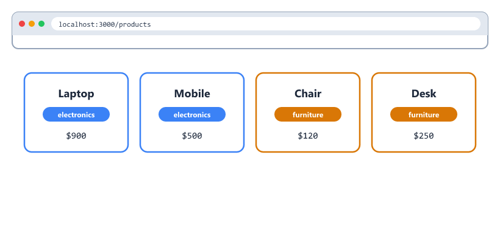
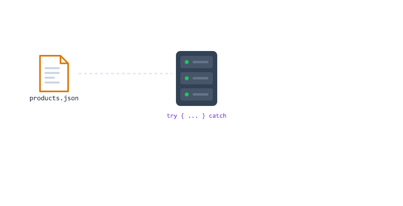

## Table of Contents

* [Project Overview](#project-overview)
* [Project Setup](#project-setup)
* [Project Structure](#project-structure)
* [Creating the Server](#creating-the-server)
* [Adding Routes](#adding-routes)
* [Route Flow](#route-flow)
* [Returning JSON Data](#returning-json-data)
* [Using Status Codes](#using-status-codes)
* [Handling 404 Routes](#handling-404-routes)
* [Complete Example](#complete-example)
* [Testing Routes](#testing-routes)
* [Making the Server Better](#making-the-server-better)
* [A Helper for JSON Responses](#a-helper-for-json-responses)
* [Checking the Method Too](#checking-the-method-too)
* [Filtering with Query Strings](#filtering-with-query-strings)
* [Loading Data from a JSON File](#loading-data-from-a-json-file)
* [Handling Server Errors (500)](#handling-server-errors-500)
* [Organizing Routes with an Object](#organizing-routes-with-an-object)
* [Improved Complete Example](#improved-complete-example)
* [Beginner Mistakes](#beginner-mistakes)
* [Practice Exercises](#practice-exercises)
* [Interview Questions](#interview-questions)
* [Summary](#summary)

---

## Project Overview

In the previous session, we created a simple server.

In this session, we will create a server with multiple routes.

Routes

```text
/

/about

/contact

/products
```

Each route will return a different response.



At the end of this session, you will improve the server so it looks and behaves like a real API.

---

## Project Setup

Use what you learned in Session 02.

```bash
mkdir first-server-project
cd first-server-project
npm init -y
```

Add a dev script to package.json so the server restarts automatically when you save

```json
{
  "scripts": {
    "start": "node server.js",
    "dev": "node --watch server.js"
  }
}
```

Run

```bash
npm run dev
```


You can also use nodemon (`"dev": "nodemon server.js"`) if you installed it in Session 02.

---

## Project Structure

```text
first-server-project/

├── server.js
└── package.json
```

---

## Creating the Server

Create

```text
server.js
```

Add

```javascript
const http = require("http");

const server = http.createServer((req, res) => {
  res.end("Server Running");
});

server.listen(3000, () => {
  console.log("Server Running On Port 3000");
});
```

Run

```bash
npm run dev
```

Open

```text
http://localhost:3000
```

---

## Adding Routes

We can check the requested URL using

```javascript
req.url
```

Example

```javascript
const http = require("http");

const server = http.createServer((req, res) => {
  if (req.url === "/") {
    res.end("Home Page");
  } else if (req.url === "/about") {
    res.end("About Page");
  } else if (req.url === "/contact") {
    res.end("Contact Page");
  } else {
    res.end("Page Not Found");
  }
});

server.listen(3000);
```

---

## Route Flow



| URL           | Response       |
| ------------- | -------------- |
| `/`           | Home Page      |
| `/about`      | About Page     |
| `/contact`    | Contact Page   |
| Anything else | Page Not Found |

Node.js checks the conditions from top to bottom and stops at the first one that is true.

---

## Returning JSON Data

Backend applications commonly return JSON.

Example Data

```javascript
const products = [
  {
    id: 1,
    name: "Laptop"
  },
  {
    id: 2,
    name: "Mobile"
  }
];
```

Response

```javascript
res.setHeader(
  "Content-Type",
  "application/json"
);

res.end(JSON.stringify(products));
```

Output

```json
[{"id":1,"name":"Laptop"},{"id":2,"name":"Mobile"}]
```

Most browsers show it nicely formatted

```json
[
  {
    "id": 1,
    "name": "Laptop"
  },
  {
    "id": 2,
    "name": "Mobile"
  }
]
```

Why JSON.stringify()?

`res.end()` can only send text (or raw bytes). A JavaScript array is not text, so we convert it first. You learned this in Session 05.



| Step | Code                          | What it is                  |
| ---- | ----------------------------- | --------------------------- |
| 1    | `products`                    | A JavaScript array          |
| 2    | `JSON.stringify(products)`    | JSON text                   |
| 3    | `res.end(...)`                | The text travels to the client |
| 4    | The client                    | Turns the text back into data |

`application/json` tells the client "this text is JSON".

---

## Using Status Codes

Status codes tell the client whether a request was successful.

Common Status Codes

| Code | Meaning      | When                              |
| ---- | ------------ | --------------------------------- |
| 200  | Success      | Everything worked                 |
| 201  | Created      | Something new was created (Session 11) |
| 400  | Bad Request  | The client sent wrong data        |
| 404  | Not Found    | The URL or item does not exist    |
| 500  | Server Error | Something broke on the server     |


Example

```javascript
res.statusCode = 200;

res.end("Success");
```

If you do not set it, Node.js uses 200.

Set the status code before calling `res.end()`.

---

## Handling 404 Routes

When a route does not exist

```javascript
res.statusCode = 404;

res.end("Page Not Found");
```

Example

```javascript
if (req.url === "/") {
  res.end("Home Page");
} else {
  res.statusCode = 404;

  res.end("Page Not Found");
}
```



Why does 404 matter if the page already says "Page Not Found"?

People read the text. Programs read the status code. A mobile app or a search engine only looks at 404 to know the page does not exist.

---

## Complete Example

```javascript
const http = require("http");

const products = [
  {
    id: 1,
    name: "Laptop"
  },
  {
    id: 2,
    name: "Mobile"
  }
];

const server = http.createServer((req, res) => {
  if (req.url === "/") {
    res.statusCode = 200;

    res.end("Welcome To My First Server");
  } else if (req.url === "/about") {
    res.statusCode = 200;

    res.end("About Page");
  } else if (req.url === "/contact") {
    res.statusCode = 200;

    res.end("Contact Page");
  } else if (req.url === "/products") {
    res.statusCode = 200;

    res.setHeader(
      "Content-Type",
      "application/json"
    );

    res.end(JSON.stringify(products));
  } else {
    res.statusCode = 404;

    res.end("Page Not Found");
  }
});

server.listen(3000, () => {
  console.log("Server Running On Port 3000");
});
```

---

## Testing Routes



| Visit                              | Status | Output                       |
| ---------------------------------- | ------ | ---------------------------- |
| `http://localhost:3000/`           | 200    | Welcome To My First Server   |
| `http://localhost:3000/about`      | 200    | About Page                   |
| `http://localhost:3000/contact`    | 200    | Contact Page                 |
| `http://localhost:3000/products`   | 200    | The products JSON            |
| `http://localhost:3000/random`     | 404    | Page Not Found               |

The page text does not show the status code. To see it

* Browser: press F12, open the Network tab, refresh the page, and look at the Status column
* Terminal: `curl -i http://localhost:3000/random`

```text
HTTP/1.1 404 Not Found
Date: Sat, 03 Oct 2026 10:00:00 GMT
Connection: keep-alive
Keep-Alive: timeout=5
Content-Length: 14

Page Not Found
```

---

## Making the Server Better

The server works, but it has some problems

* The same three lines (status, header, JSON.stringify) are repeated
* Any method (GET, POST, DELETE) gets the same answer
* The data is stuck inside server.js
* If something breaks, the server crashes
* A long if/else chain is hard to read

The next sections fix each problem, one at a time.

---

## A Helper for JSON Responses

Write the repeated code once, in a function.

```javascript
function sendJSON(res, statusCode, data) {
  res.statusCode = statusCode;
  res.setHeader("Content-Type", "application/json");
  res.end(JSON.stringify(data));
}
```

Now every JSON response is one line

```javascript
sendJSON(res, 200, products);

sendJSON(res, 404, { error: "Route not found" });
```



APIs should answer with JSON even for errors, so the client always gets the same kind of data.

In Session 12, Express gives you this for free: `res.status(404).json({ error: "Route not found" })`.

---

## Checking the Method Too

`/products` should only answer GET requests.

```javascript
if (req.method === "GET" && req.url === "/products") {
  sendJSON(res, 200, products);
}
```

A POST to /products will now fall through to 404. In Session 11 you will add POST, PUT and DELETE routes.

---

## Filtering with Query Strings

Let us give each product a category

```javascript
const products = [
  { id: 1, name: "Laptop", category: "electronics", price: 900 },
  { id: 2, name: "Mobile", category: "electronics", price: 500 },
  { id: 3, name: "Chair", category: "furniture", price: 120 },
  { id: 4, name: "Desk", category: "furniture", price: 250 }
];
```

Use the URL class from Session 09 to read `?category=`

```javascript
const url = new URL(req.url, "http://localhost:3000");

if (req.method === "GET" && url.pathname === "/products") {
  const category = url.searchParams.get("category");

  if (category) {
    const filtered = products.filter((p) => p.category === category);
    sendJSON(res, 200, filtered);
  } else {
    sendJSON(res, 200, products);
  }
}
```

| Visit                                  | Result               |
| -------------------------------------- | -------------------- |
| `/products`                            | All 4 products       |
| `/products?category=furniture`         | Chair and Desk       |
| `/products?category=electronics`       | Laptop and Mobile    |
| `/products?category=toys`              | `[]` (empty list)    |



`filter()` keeps the items where the function returns `true`.

An empty list is still a success (200). The request was fine, there are just no matches.

---

## Loading Data from a JSON File

Keeping data inside server.js gets messy. Move it to a file.

```text
first-server-project/
├── data/
│   └── products.json
├── package.json
└── server.js
```

data/products.json

```json
[
  { "id": 1, "name": "Laptop", "category": "electronics", "price": 900 },
  { "id": 2, "name": "Mobile", "category": "electronics", "price": 500 },
  { "id": 3, "name": "Chair", "category": "furniture", "price": 120 },
  { "id": 4, "name": "Desk", "category": "furniture", "price": 250 }
]
```

Read it with fs/promises (Session 05) and path (Session 06)

```javascript
const fs = require("fs/promises");
const path = require("path");

const dataFile = path.join(__dirname, "data", "products.json");

async function getProducts() {
  const text = await fs.readFile(dataFile, "utf8");
  return JSON.parse(text);
}
```

Inside the server callback

```javascript
const server = http.createServer(async (req, res) => {
  if (req.method === "GET" && req.url === "/products") {
    const products = await getProducts();
    sendJSON(res, 200, products);
  }
});
```

The callback is now `async`, so it can use `await`. Reading the file does not block other users.

---

## Handling Server Errors (500)

What if products.json is missing or broken?

`await getProducts()` throws an error. If nothing catches it, the request never gets a response.

Use try / catch from Session 03

```javascript
const server = http.createServer(async (req, res) => {
  try {
    if (req.method === "GET" && req.url === "/products") {
      const products = await getProducts();
      sendJSON(res, 200, products);
    } else {
      sendJSON(res, 404, { error: "Route not found" });
    }
  } catch (err) {
    console.log("Error:", err.message);
    sendJSON(res, 500, { error: "Something went wrong" });
  }
});
```



Important

Log the real error in the terminal for yourself, but send a simple message to the client. Never send internal details like file paths to users.

---

## Organizing Routes with an Object

A long if/else chain is hard to read. Store the routes in an object instead.

```javascript
const routes = {
  "GET /": (req, res) => sendJSON(res, 200, { message: "Welcome" }),
  "GET /about": (req, res) => sendJSON(res, 200, { message: "About us" }),
  "GET /products": async (req, res) => sendJSON(res, 200, await getProducts())
};
```

Find the route with the method and the path

```javascript
const url = new URL(req.url, "http://localhost:3000");
const key = req.method + " " + url.pathname;
const handler = routes[key];

if (handler) {
  await handler(req, res);
} else {
  sendJSON(res, 404, { error: "Route not found" });
}
```

| Request             | key                  | Found? |
| ------------------- | -------------------- | ------ |
| GET /about          | `"GET /about"`       | Yes    |
| GET /products       | `"GET /products"`    | Yes    |
| POST /products      | `"POST /products"`   | No, 404 |

Adding a new route is now one line. Express (Session 12) works in a very similar way.

---

## Improved Complete Example

server.js

```javascript
const http = require("http");
const fs = require("fs/promises");
const path = require("path");

const PORT = 3000;
const dataFile = path.join(__dirname, "data", "products.json");

function sendJSON(res, statusCode, data) {
  res.statusCode = statusCode;
  res.setHeader("Content-Type", "application/json");
  res.end(JSON.stringify(data));
}

async function getProducts() {
  const text = await fs.readFile(dataFile, "utf8");
  return JSON.parse(text);
}

const routes = {
  "GET /": async (req, res, url) => {
    sendJSON(res, 200, { message: "Welcome To My First Server" });
  },

  "GET /about": async (req, res, url) => {
    sendJSON(res, 200, { message: "About Page" });
  },

  "GET /contact": async (req, res, url) => {
    sendJSON(res, 200, { message: "Contact Page" });
  },

  "GET /products": async (req, res, url) => {
    const products = await getProducts();
    const category = url.searchParams.get("category");

    if (category) {
      sendJSON(res, 200, products.filter((p) => p.category === category));
    } else {
      sendJSON(res, 200, products);
    }
  }
};

const server = http.createServer(async (req, res) => {
  const url = new URL(req.url, `http://localhost:${PORT}`);
  const handler = routes[req.method + " " + url.pathname];

  console.log(req.method, req.url);

  try {
    if (handler) {
      await handler(req, res, url);
    } else {
      sendJSON(res, 404, { error: "Route not found" });
    }
  } catch (err) {
    console.log("Error:", err.message);
    sendJSON(res, 500, { error: "Something went wrong" });
  }
});

server.listen(PORT, () => {
  console.log(`Server Running On Port ${PORT}`);
});
```

| Request                              | Status | Response                                  |
| ------------------------------------ | ------ | ----------------------------------------- |
| GET /                                | 200    | `{"message":"Welcome To My First Server"}` |
| GET /products                        | 200    | All products                              |
| GET /products?category=furniture     | 200    | Chair and Desk                            |
| GET /random                          | 404    | `{"error":"Route not found"}`             |
| GET /products (file deleted)         | 500    | `{"error":"Something went wrong"}`        |

This server now has everything a small real API needs: JSON responses, correct status codes, data in a file, filtering, error handling and clean routes.

---

## Beginner Mistakes

### Mistake 1

Sending an array or object directly.

Incorrect:

```javascript
res.end(products);
```

```text
TypeError [ERR_INVALID_ARG_TYPE]: The "chunk" argument must be of type string or an instance of Buffer or Uint8Array. Received an instance of Array
```

The server crashes.

Correct:

```javascript
res.end(JSON.stringify(products));
```

---

### Mistake 2

Setting the status code after `res.end()`.

Incorrect:

```javascript
res.end("Page Not Found");
res.statusCode = 404;
```

There is no error, but the client still receives 200. The response was already sent.

Correct:

```javascript
res.statusCode = 404;
res.end("Page Not Found");
```

---

### Mistake 3

Setting a header after `res.end()`.

Incorrect:

```javascript
res.end(JSON.stringify(products));
res.setHeader("Content-Type", "application/json");
```

```text
Error [ERR_HTTP_HEADERS_SENT]: Cannot set headers after they are sent to the client
```

You will see this exact error message again in Express. It always means "you tried to change the response after it was sent".

Correct:

Set the status and headers first, call `res.end()` last.

---

### Mistake 4

Expecting `/about/` to match `"/about"`.

```javascript
if (req.url === "/about") { ... }
```

`/about/` (with a slash at the end) and `/About` (capital A) are different strings, so they get 404.

---

### Mistake 5

Forgetting the JSON Content-Type.

```javascript
res.end(JSON.stringify(products));
```

The data arrives, but the client does not know it is JSON. Many tools will treat it as plain text.

Correct:

```javascript
res.setHeader("Content-Type", "application/json");
res.end(JSON.stringify(products));
```

---

### Mistake 6

Using 404 for "no results".

`/products?category=toys` with no matches is not "not found". The route exists and worked. Send `200` with an empty array `[]`.

---

## Practice Exercises

### Exercise 1

Create routes 

```text
/

/about

/services
```

Return different responses for each route.

---

### Exercise 2

Create 

```text
/students
```

Return the following JSON

```json
[
  {
    "id": 1,
    "name": "John"
  },
  {
    "id": 2,
    "name": "Alex"
  }
]
```

---

### Exercise 3

Handle invalid routes using 

```text
404
```

status code.

---

### Exercise 4

Print the requested URL in the terminal.

Example

```javascript
console.log(req.url);
```

---

### Exercise 5

Write a `sendJSON(res, statusCode, data)` helper and use it for every response, including 404.

---

### Exercise 6

Add `?maxPrice=300` to `/products`. Return only products with a price less than or equal to maxPrice.

Remember: query values are strings. Use `Number()`.

---

### Exercise 7

Move the students from Exercise 2 into `data/students.json` and read them with fs/promises.

Rename the file to test that your server returns 500 instead of crashing.

---

### Exercise 8

Rewrite your if/else routes as a routes object like in "Organizing Routes with an Object".

---

## Interview Questions

### What is a route?

A route is a URL path used to access a specific resource.

Example

```text
/

/about

/products
```

---

### What is req.url?

It returns the requested URL path, including any query string.

---

### Why do we use JSON?

JSON is the most common format used to exchange data between clients and servers.

---

### What is a status code?

A status code tells the client whether a request was successful or failed.

---

### What does status code 404 mean?

The requested resource was not found.

---

### Why do we need JSON.stringify() before res.end()?

res.end() only accepts strings or raw bytes. JSON.stringify() converts a JavaScript object or array into a JSON string.

---

### What is the Content-Type for JSON?

application/json

---

### What is the difference between 404 and 500?

404 means the client asked for something that does not exist (client error). 500 means the server failed while handling a valid request (server error).

---

### What does "Cannot set headers after they are sent to the client" mean?

The code tried to set a header or status after the response was already sent with res.end(). Headers and status must be set first.

---

### Should an API send errors as plain text or JSON?

JSON, for example { "error": "Route not found" }, so the client always receives the same kind of data.

---

### Why use a routes object instead of if/else?

It is shorter, easier to read, and adding a route only needs one new line. It is also similar to how Express organizes routes.

---

## Summary

In this session, you learned

* How to set up a server project with npm and auto restart
* How to create a multi-route server
* How to handle URLs
* How to send JSON responses
* How to use status codes (200, 201, 400, 404, 500)
* How to handle invalid routes
* How to test status codes with DevTools and curl
* How to write a sendJSON helper
* How to check the method and the path
* How to filter data with query strings
* How to load data from a JSON file
* How to handle server errors with 500
* How to organize routes with an object

You have now built your first small backend application using only Node.js.

---
