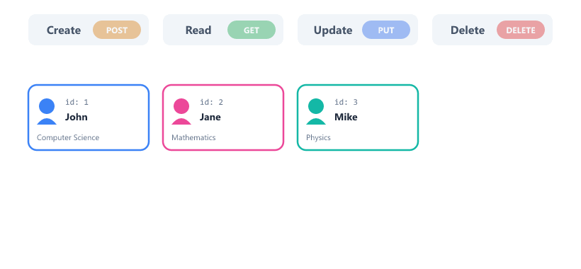
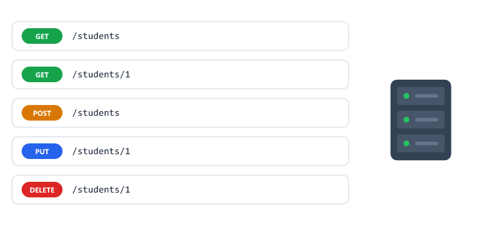
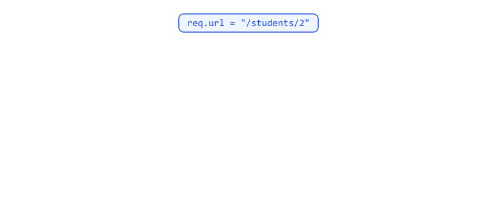
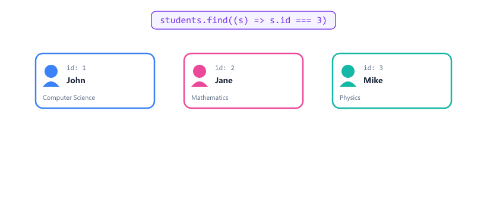
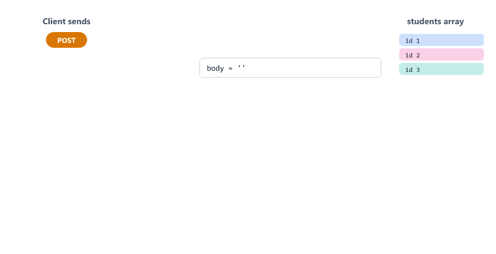
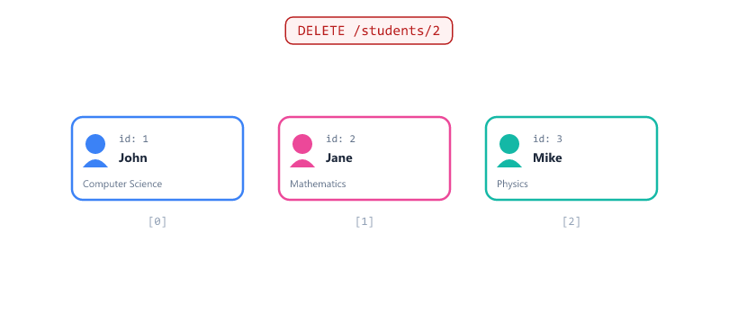
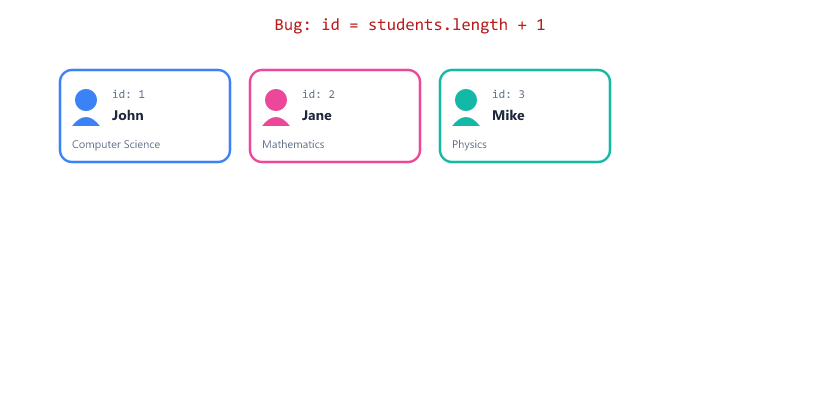
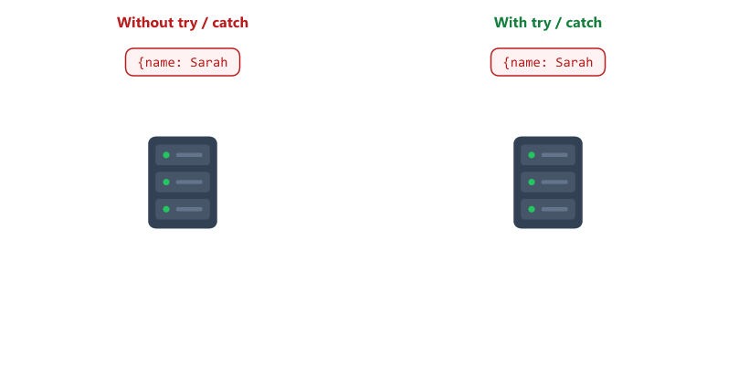
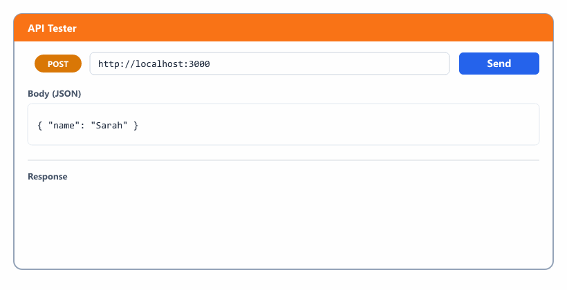
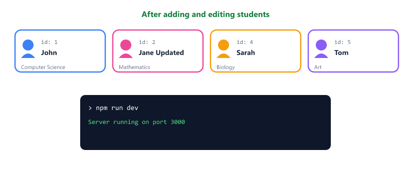

## Table of Contents

* [What is CRUD](#what-is-crud)
* [Understanding REST API](#understanding-rest-api)
* [Setting Up the Project](#setting-up-the-project)
* [Our Dummy Data](#our-dummy-data)
* [Array Methods We Will Use](#array-methods-we-will-use)
* [GET - Get All Students](#get---get-all-students)
* [GET - Get One Student](#get---get-one-student)
* [Reading the Request Body](#reading-the-request-body)
* [POST - Add a New Student](#post---add-a-new-student)
* [PUT - Update a Student](#put---update-a-student)
* [DELETE - Remove a Student](#delete---remove-a-student)
* [The Duplicate ID Bug](#the-duplicate-id-bug)
* [Bad JSON Can Crash Your Server](#bad-json-can-crash-your-server)
* [Complete Code](#complete-code)
* [Testing Your API](#testing-your-api)
* [Where Does the Data Go?](#where-does-the-data-go)
* [HTTP Status Codes](#http-status-codes)
* [Beginner Mistakes](#beginner-mistakes)
* [Practice Exercises](#practice-exercises)
* [Interview Questions](#interview-questions)
* [Summary](#summary)

---

## What is CRUD

CRUD is a word we use in backend development

It stands for

| Letter | Word   |
| ------ | ------ |
| C      | Create |
| R      | Read   |
| U      | Update |
| D      | Delete |

Think of a student management system



| Operation | In a student system                 | HTTP Method |
| --------- | ----------------------------------- | ----------- |
| Create    | Add a new student to the list       | POST        |
| Read      | See all students or one student     | GET         |
| Update    | Change student information          | PUT         |
| Delete    | Remove a student from the list      | DELETE      |

Every backend application needs these four operations

Instagram posts, shopping carts, to-do lists and bank accounts are all CRUD

---

## Understanding REST API

REST API is just a way to build web applications

We use different URLs for different things

| URL         | Works with |
| ----------- | ---------- |
| /students   | Students   |
| /products   | Products   |
| /users      | Users      |

We also use HTTP methods (Session 09) to say what to do

Our API will look like this

| What we want to do | Method | URL |
| ------------------ | ------ | --- |
| Get all students | GET | /students |
| Get one student | GET | /students/1 |
| Add a student | POST | /students |
| Update a student | PUT | /students/1 |
| Delete a student | DELETE | /students/1 |

The number at the end like /students/1 is the student id



REST naming rules

| Good             | Bad                    | Why                                  |
| ---------------- | ---------------------- | ------------------------------------ |
| GET /students    | GET /getStudents       | The method already says "get"        |
| POST /students   | POST /addStudent       | The method already says "add"        |
| DELETE /students/1 | GET /deleteStudent?id=1 | Use the DELETE method for deleting |
| /students        | /student               | Use plural nouns                     |

---

## Setting Up the Project

Open your terminal

Create a new folder

```bash
mkdir student-api
```

Go inside the folder

```bash
cd student-api
```

Create a package.json file

```bash
npm init -y
```

Add a dev script to package.json (Session 10)

```json
{
  "scripts": {
    "dev": "node --watch server.js"
  }
}
```

Create a file named server.js

Now open server.js in your code editor

First line to import http module

```javascript
const http = require("http");
```

---

## Our Dummy Data

We will store students in an array

An array works like a temporary database

```javascript
let students = [
  {
    id: 1,
    name: "John Doe",
    age: 20,
    course: "Computer Science"
  },
  {
    id: 2,
    name: "Jane Smith",
    age: 22,
    course: "Mathematics"
  },
  {
    id: 3,
    name: "Mike Johnson",
    age: 21,
    course: "Physics"
  }
];

let nextId = 4;
```

Each student has

| Field  | Meaning              |
| ------ | -------------------- |
| id     | A unique number      |
| name   | Student name         |
| age    | Student age          |
| course | What they are studying |

`nextId` is the id the next new student will get. You will see why we need it in [The Duplicate ID Bug](#the-duplicate-id-bug).

We will add, update, and delete from this array

---

## Array Methods We Will Use

| Method                 | What it does                                   | Example result         |
| ---------------------- | ---------------------------------------------- | ---------------------- |
| `find(fn)`             | Returns the first item where fn is true        | The student object     |
| `findIndex(fn)`        | Returns the position of that item, or -1       | `1`                    |
| `push(item)`           | Adds an item to the end                        | Array is one longer    |
| `splice(index, 1)`     | Removes 1 item at that position                | Array is one shorter   |
| `{ ...a, ...b }`       | Copies a, then overwrites with b (spread)      | A merged object        |

```javascript
const student = students.find((s) => s.id === 2);
console.log(student.name);

const index = students.findIndex((s) => s.id === 2);
console.log(index);
```

Output

```text
Jane Smith
1
```

Index 1 because arrays start counting at 0.

---

## GET - Get All Students

When someone visits http://localhost:3000/students

We want to send back all students

```javascript
if (req.url === "/students" && req.method === "GET") {
  res.statusCode = 200;
  res.setHeader("Content-Type", "application/json");
  res.end(JSON.stringify(students));
}
```

| Code                          | Meaning                                |
| ----------------------------- | -------------------------------------- |
| `req.url === "/students"`     | Is the URL /students?                  |
| `req.method === "GET"`        | Is the request type GET?               |
| `res.statusCode = 200`        | Everything is OK                       |
| `res.setHeader(...)`          | Tell the client we are sending JSON    |
| `JSON.stringify(students)`    | Convert the array to a JSON string     |

Try visiting http://localhost:3000/students in your browser

You will see all students

---

## GET - Get One Student

When someone visits http://localhost:3000/students/1

We want to send back only the student with id 1

We need to get the id from the URL

| URL           | id |
| ------------- | -- |
| /students/1   | 1  |
| /students/2   | 2  |
| /students/3   | 3  |

Here is the code

```javascript
if (req.url.startsWith("/students/") && req.method === "GET") {
  const parts = req.url.split("/");
  const id = Number(parts[2]);

  const student = students.find((s) => s.id === id);

  res.setHeader("Content-Type", "application/json");

  if (student) {
    res.statusCode = 200;
    res.end(JSON.stringify(student));
  } else {
    res.statusCode = 404;
    res.end(JSON.stringify({ message: "Student not found" }));
  }
}
```

Let me explain each line



| Code                                    | Meaning                                              |
| --------------------------------------- | ---------------------------------------------------- |
| `req.url.startsWith("/students/")`      | Does the URL start with /students/?                  |
| `req.url.split("/")`                    | `"/students/1"` becomes `["", "students", "1"]`      |
| `Number(parts[2])`                      | Take the third item and turn "1" into the number 1   |
| `students.find((s) => s.id === id)`     | Find the student with a matching id                  |

Why `Number()`? Everything in a URL is text. `"1" === 1` is false, so without it no student would ever be found.



If student exists

* Send status 200
* Send the student data

If student does not exist

* Send status 404
* Send error message

---

## Reading the Request Body

For POST and PUT, the client sends data in the request body.

The body does not arrive all at once. It arrives in chunks, just like the read stream from Session 08.

```javascript
let body = "";

req.on("data", (chunk) => {
  body += chunk.toString();
});

req.on("end", () => {
  // all chunks have arrived, body is complete
});
```

| Code                         | Meaning                                         |
| ---------------------------- | ----------------------------------------------- |
| `let body = ""`              | Empty string to collect the data                |
| `req.on("data", ...)`        | Runs for every chunk. Add it to body            |
| `chunk.toString()`           | A chunk is raw bytes (a Buffer). Turn it into text |
| `req.on("end", ...)`         | Runs once, when all data has arrived            |



---

## POST - Add a New Student

When someone wants to add a new student

They send data in the request body

```javascript
if (req.url === "/students" && req.method === "POST") {
  let body = "";

  req.on("data", (chunk) => {
    body += chunk.toString();
  });

  req.on("end", () => {
    res.setHeader("Content-Type", "application/json");

    let data;

    try {
      data = JSON.parse(body);
    } catch (err) {
      res.statusCode = 400;
      res.end(JSON.stringify({ message: "Invalid JSON" }));
      return;
    }

    if (!data.name) {
      res.statusCode = 400;
      res.end(JSON.stringify({ message: "Name is required" }));
      return;
    }

    const newStudent = {
      id: nextId++,
      name: data.name,
      age: data.age,
      course: data.course
    };

    students.push(newStudent);

    res.statusCode = 201;
    res.end(JSON.stringify(newStudent));
  });
}
```

| Code                         | Meaning                                         |
| ---------------------------- | ----------------------------------------------- |
| `JSON.parse(body)`           | Turn the JSON text into an object               |
| `try / catch`                | If the JSON is broken, send 400 instead of crashing |
| `if (!data.name)`            | Name is required. Send 400 if it is missing     |
| `id: nextId++`               | Use nextId, then add 1 to it for next time      |
| `students.push(newStudent)`  | Add to our array                                |
| `res.statusCode = 201`       | Created successfully                            |

We copy only the fields we expect (name, age, course). This stops users from sending their own id or extra fields.

To test POST, you cannot use the browser address bar

You need Postman, curl, or a small Node.js script (see [Testing Your API](#testing-your-api))

Example request body

```json
{
  "name": "Sarah Wilson",
  "age": 23,
  "course": "Biology"
}
```

Response (201 Created)

```json
{
  "id": 4,
  "name": "Sarah Wilson",
  "age": 23,
  "course": "Biology"
}
```

---

## PUT - Update a Student

When someone wants to update a student

They send the new data in the request body

We need the student id from the URL

```javascript
if (req.url.startsWith("/students/") && req.method === "PUT") {
  const parts = req.url.split("/");
  const id = Number(parts[2]);

  let body = "";

  req.on("data", (chunk) => {
    body += chunk.toString();
  });

  req.on("end", () => {
    res.setHeader("Content-Type", "application/json");

    let updatedData;

    try {
      updatedData = JSON.parse(body);
    } catch (err) {
      res.statusCode = 400;
      res.end(JSON.stringify({ message: "Invalid JSON" }));
      return;
    }

    const index = students.findIndex((s) => s.id === id);

    if (index !== -1) {
      students[index] = { ...students[index], ...updatedData, id };

      res.statusCode = 200;
      res.end(JSON.stringify(students[index]));
    } else {
      res.statusCode = 404;
      res.end(JSON.stringify({ message: "Student not found" }));
    }
  });
}
```

| Code                                       | Meaning                                    |
| ------------------------------------------ | ------------------------------------------ |
| `students.findIndex((s) => s.id === id)`   | Find the position of the student           |
| `index !== -1`                             | -1 means "not found"                       |
| `{ ...students[index], ...updatedData, id }` | Old fields, then new fields on top, then keep the original id |


Why `, id` at the end? Without it, a client could send `{ "id": 99 }` and change the student's id.

Example request body to update name

```json
{
  "name": "John Updated"
}
```

Response

```json
{
  "id": 1,
  "name": "John Updated",
  "age": 20,
  "course": "Computer Science"
}
```

Only the name changed. The other fields were kept.

PUT vs PATCH

Strictly, PUT means "replace the whole student" and PATCH means "change only some fields". Our PUT works like PATCH because it keeps the old fields. Many real APIs do this, but you will see both methods in the real world.

---

## DELETE - Remove a Student

When someone wants to delete a student

We need the student id from the URL

```javascript
if (req.url.startsWith("/students/") && req.method === "DELETE") {
  const parts = req.url.split("/");
  const id = Number(parts[2]);

  const index = students.findIndex((s) => s.id === id);

  res.setHeader("Content-Type", "application/json");

  if (index !== -1) {
    students.splice(index, 1);

    res.statusCode = 200;
    res.end(JSON.stringify({ message: "Student deleted successfully" }));
  } else {
    res.statusCode = 404;
    res.end(JSON.stringify({ message: "Student not found" }));
  }
}
```

| Code                         | Meaning                                |
| ---------------------------- | -------------------------------------- |
| `findIndex(...)`             | Find the position of the student       |
| `students.splice(index, 1)`  | Remove 1 item at that position         |



Some APIs answer a delete with `204 No Content` and an empty body instead of 200 and a message. Both are fine.

---

## The Duplicate ID Bug

Many tutorials create ids like this

```javascript
newStudent.id = students.length + 1;
```

It looks fine, until you delete someone.

| Step                 | ids in the array | students.length + 1 |
| -------------------- | ---------------- | ------------------- |
| Start                | 1, 2, 3          | 4                   |
| DELETE /students/1   | 2, 3             | 3                   |
| POST a new student   | 2, 3, 3          | Duplicate id 3!     |

Now two students have id 3. `GET /students/3` and `DELETE /students/3` will pick the wrong one.



The fix is a counter that only goes up

```javascript
let nextId = 4;

const newStudent = { id: nextId++, ... };
```

Deleted ids are never reused. Real databases (Session 17) create unique ids for you.

---

## Bad JSON Can Crash Your Server

What if a client sends broken JSON?

```text
{name: Sarah
```

`JSON.parse()` throws a SyntaxError. Inside `req.on("end")`, nothing catches it, so the whole server crashes. One bad request takes the API down for every user.



That is why the POST and PUT code wraps `JSON.parse()` in `try / catch` and returns `400 Bad Request`.

---

## Complete Code

The code above repeats the same lines many times. Here is the complete server.js, cleaned up with the `sendJSON` helper and the URL class from Session 10.

```javascript
const http = require("http");

let students = [
  { id: 1, name: "John Doe", age: 20, course: "Computer Science" },
  { id: 2, name: "Jane Smith", age: 22, course: "Mathematics" },
  { id: 3, name: "Mike Johnson", age: 21, course: "Physics" }
];

let nextId = 4;

function sendJSON(res, statusCode, data) {
  res.statusCode = statusCode;
  res.setHeader("Content-Type", "application/json");
  res.end(JSON.stringify(data));
}

// Collect the body chunks and turn them into an object
function readBody(req) {
  return new Promise((resolve, reject) => {
    let body = "";

    req.on("data", (chunk) => {
      body += chunk.toString();
    });

    req.on("end", () => {
      try {
        resolve(body ? JSON.parse(body) : {});
      } catch (err) {
        reject(new Error("Invalid JSON"));
      }
    });
  });
}

const server = http.createServer(async (req, res) => {
  const url = new URL(req.url, "http://localhost:3000");
  const parts = url.pathname.split("/");
  const isOneStudent = parts[1] === "students" && parts.length === 3;
  const id = Number(parts[2]);

  try {
    // GET all students
    if (req.method === "GET" && url.pathname === "/students") {
      return sendJSON(res, 200, students);
    }

    // GET one student
    if (req.method === "GET" && isOneStudent) {
      const student = students.find((s) => s.id === id);

      if (!student) {
        return sendJSON(res, 404, { message: "Student not found" });
      }

      return sendJSON(res, 200, student);
    }

    // POST add new student
    if (req.method === "POST" && url.pathname === "/students") {
      const data = await readBody(req);

      if (!data.name) {
        return sendJSON(res, 400, { message: "Name is required" });
      }

      const newStudent = {
        id: nextId++,
        name: data.name,
        age: data.age,
        course: data.course
      };

      students.push(newStudent);

      return sendJSON(res, 201, newStudent);
    }

    // PUT update student
    if (req.method === "PUT" && isOneStudent) {
      const index = students.findIndex((s) => s.id === id);

      if (index === -1) {
        return sendJSON(res, 404, { message: "Student not found" });
      }

      const data = await readBody(req);

      students[index] = { ...students[index], ...data, id };

      return sendJSON(res, 200, students[index]);
    }

    // DELETE student
    if (req.method === "DELETE" && isOneStudent) {
      const index = students.findIndex((s) => s.id === id);

      if (index === -1) {
        return sendJSON(res, 404, { message: "Student not found" });
      }

      students.splice(index, 1);

      return sendJSON(res, 200, { message: "Student deleted successfully" });
    }

    // Route not found
    sendJSON(res, 404, { message: "Route not found" });
  } catch (err) {
    if (err.message === "Invalid JSON") {
      return sendJSON(res, 400, { message: "Invalid JSON" });
    }

    console.log(err);
    sendJSON(res, 500, { message: "Something went wrong" });
  }
});

server.listen(3000, () => {
  console.log("Server running on port 3000");
  console.log("Try these URLs");
  console.log("GET    http://localhost:3000/students");
  console.log("GET    http://localhost:3000/students/1");
  console.log("POST   http://localhost:3000/students");
  console.log("PUT    http://localhost:3000/students/1");
  console.log("DELETE http://localhost:3000/students/1");
});
```

What is new here

| Code                              | Why                                                                 |
| --------------------------------- | ------------------------------------------------------------------- |
| `readBody(req)`                   | Wraps the data/end events in a Promise (Session 03), so we can use `await` |
| `return sendJSON(...)`            | `return` stops the function, so we never send two responses (Session 09) |
| `parts.length === 3`              | Matches `/students/1` but not `/students/1/extra`                   |
| `url.pathname`                    | Ignores query strings like `?sort=name` (Session 09)                |
| One `try / catch`                 | Bad JSON gives 400, any other error gives 500                       |

---

## Testing Your API

Run the server

```bash
npm run dev
```

### Testing GET requests

Open your browser and visit

```text
http://localhost:3000/students
```

You will see all students

```text
http://localhost:3000/students/1
```

You will see student with id 1

### Testing POST, PUT, DELETE

The browser address bar only sends GET requests

For POST, PUT and DELETE use one of these



#### Option 1: Postman

Download Postman from https://www.postman.com

1. Choose the method (POST)
2. Enter the URL `http://localhost:3000/students`
3. Open Body, choose raw and JSON
4. Type the JSON and press Send

#### Option 2: curl

curl commands are written differently depending on your terminal.

macOS, Linux, or Git Bash on Windows

```bash
curl -X POST http://localhost:3000/students -H "Content-Type: application/json" -d '{"name":"Sarah","age":23,"course":"Biology"}'

curl -X PUT http://localhost:3000/students/1 -H "Content-Type: application/json" -d '{"name":"John Updated"}'

curl -X DELETE http://localhost:3000/students/1
```

Windows Command Prompt (inner quotes need a backslash)

```bash
curl -X POST http://localhost:3000/students -H "Content-Type: application/json" -d "{\"name\":\"Sarah\",\"age\":23,\"course\":\"Biology\"}"
```

Windows PowerShell (in PowerShell 5, `curl` is a different command, so use Invoke-RestMethod)

```powershell
Invoke-RestMethod -Method Post -Uri http://localhost:3000/students -ContentType "application/json" -Body '{"name":"Sarah","age":23,"course":"Biology"}'

Invoke-RestMethod -Method Put -Uri http://localhost:3000/students/1 -ContentType "application/json" -Body '{"name":"John Updated"}'

Invoke-RestMethod -Method Delete -Uri http://localhost:3000/students/1
```

#### Option 3: A Node.js test script (works everywhere)

Node.js has a built-in `fetch()` function. Open a second terminal and create test-api.js

```javascript
const BASE = "http://localhost:3000/students";

async function test() {
  const created = await fetch(BASE, {
    method: "POST",
    headers: { "Content-Type": "application/json" },
    body: JSON.stringify({ name: "Sarah", age: 23, course: "Biology" })
  });
  console.log("POST", created.status, await created.json());

  const updated = await fetch(BASE + "/1", {
    method: "PUT",
    headers: { "Content-Type": "application/json" },
    body: JSON.stringify({ name: "John Updated" })
  });
  console.log("PUT", updated.status, await updated.json());

  const deleted = await fetch(BASE + "/2", { method: "DELETE" });
  console.log("DELETE", deleted.status, await deleted.json());

  const all = await fetch(BASE);
  console.log("GET", all.status, await all.json());
}

test();
```

Run it while the server is running

```bash
node test-api.js
```

Output

```text
POST 201 { id: 4, name: 'Sarah', age: 23, course: 'Biology' }
PUT 200 { id: 1, name: 'John Updated', age: 20, course: 'Computer Science' }
DELETE 200 { message: 'Student deleted successfully' }
GET 200 [
  { id: 1, name: 'John Updated', age: 20, course: 'Computer Science' },
  { id: 3, name: 'Mike Johnson', age: 21, course: 'Physics' },
  { id: 4, name: 'Sarah', age: 23, course: 'Biology' }
]
```

`fetch()` returns a Promise, so we use `await` (Session 03). `JSON.stringify()` turns the object into the body text.

---

## Where Does the Data Go?

Our students live in a JavaScript array, in memory.

When the server restarts (including every save with `--watch`), the array goes back to the 3 starting students. Everything you added, changed or deleted is gone.



| Storage                        | Survives a restart? | Session |
| ------------------------------ | ------------------- | ------- |
| Array in memory                | No                  | 11      |
| JSON file with fs              | Yes                 | 05, 10  |
| Database (MongoDB)             | Yes                 | 17      |

This is fine for learning. Real applications use a database, which you will learn soon.

---

## HTTP Status Codes

Status codes tell the client what happened

| Code | Meaning | When to use |
| ---- | ------- | ----------- |
| 200 | OK | Everything worked |
| 201 | Created | New student was added |
| 204 | No Content | Worked, nothing to send back (sometimes used for DELETE) |
| 400 | Bad Request | The client sent invalid data (bad JSON, missing name) |
| 404 | Not Found | Student does not exist |
| 500 | Server Error | Something broke on server |

Always use the correct status code

---

## Beginner Mistakes

### Mistake 1

Comparing a text id with a number id.

Incorrect:

```javascript
const id = parts[2];
students.find((s) => s.id === id);
```

`"1" === 1` is false, so the student is never found.

Correct:

```javascript
const id = Number(parts[2]);
```

---

### Mistake 2

Creating ids with `students.length + 1`.

After a delete, two students can get the same id. Use a `nextId` counter.

---

### Mistake 3

Calling `JSON.parse()` without try / catch.

One request with broken JSON crashes the whole server. Always catch it and return 400.

---

### Mistake 4

Using the body before it has arrived.

Incorrect:

```javascript
let body = "";
req.on("data", (chunk) => { body += chunk; });

const data = JSON.parse(body);
```

`body` is still empty here. The data event has not happened yet (Session 03: async code runs later).

Correct:

Use the data inside `req.on("end", ...)`, or `await readBody(req)`.

---

### Mistake 5

Letting the client change the id.

```javascript
students[index] = { ...students[index], ...updatedData };
```

A body of `{ "id": 99 }` changes the id. Add `, id` at the end to keep the original.

---

### Mistake 6

Copying curl commands into the wrong terminal.

Commands with `\` at the end of lines and single quotes only work in bash (macOS, Linux, Git Bash). In Windows PowerShell 5, `curl` is not real curl. Use the Windows versions from [Testing Your API](#testing-your-api).

---

### Mistake 7

Route order.

```javascript
if (req.url.startsWith("/students/")) { /* get one */ }
else if (req.url === "/students/count") { /* never runs */ }
```

`/students/count` starts with `/students/`, so the first route catches it. Put more specific routes first.

---

## Practice Exercises

### Exercise 1

Create a products API

Each product should have

```text
id
name
price
category
```

Implement all CRUD operations

### Exercise 2

Add validation to POST request

Check that price is a number greater than 0

If not, return status 400 with message "Price must be a positive number"

### Exercise 3

When getting a student that does not exist

Return status 404 with message "Student not found"

Test it with `/students/999` and with `/students/abc`

### Exercise 4

Add a new route

```text
GET /students/count
```

Return the total number of students

Remember Mistake 7: this route must be checked before the "get one student" route

Example response

```json
{
  "totalStudents": 3
}
```

### Exercise 5

Delete student 1, then add a new student. Check that the new id is 4, not 3.

### Exercise 6

Send broken JSON with POST and check that you get 400 and the server keeps running.

### Exercise 7

Save the students to `data/students.json` (Session 05) after every POST, PUT and DELETE, and load them when the server starts. Now restart the server. Is your data still there?

### Exercise 8

Write a test-api.js script with fetch() that runs all five CRUD requests and prints each status code.

---

## Interview Questions

### What does CRUD stand for

Create, Read, Update, Delete

### What is the difference between GET and POST

GET retrieves data

POST sends new data

### What is the difference between PUT and POST

POST creates a new resource

PUT updates an existing resource

### What is the difference between PUT and PATCH

PUT replaces the whole resource. PATCH changes only the fields you send.

### What status code does POST return

201 Created

### What status code does GET return

200 OK

### When do you return 400

When the client sends invalid data, for example broken JSON or a missing required field

### Can we test POST requests in browser

Not from the address bar

The address bar only sends GET requests

We need Postman, curl, or fetch()

### How do you read the request body with the http module

Listen to req.on("data") to collect the chunks and req.on("end") to know when all data has arrived, then JSON.parse() the result

### Why is students.length + 1 a bad way to create ids

After a delete, the length goes down, so a new item can get an id that already exists. Use a counter that only goes up, or let a database create ids.

### What does idempotent mean

A request is idempotent if sending it many times has the same effect as sending it once. GET, PUT and DELETE are idempotent. POST is not: sending it twice creates two students.

### What happens to the data when the server restarts

Data stored in a variable is lost. It needs a file or a database to survive a restart.

---

## Summary

In this session, you learned

* What CRUD operations are
* How to create a REST API and name its routes
* GET to retrieve students
* POST to add new students
* PUT to update students
* DELETE to remove students
* How to read the request body in chunks
* find, findIndex, push, splice and the spread operator
* How to avoid duplicate ids
* How to stop bad JSON from crashing the server
* How to use an array as a database, and why data is lost on restart
* HTTP status codes including 400
* How to test your API with Postman, curl and fetch()

You have built your first complete backend API
