## Table of Contents

* [What is Express.js](#what-is-expressjs)
* [Why Use Express](#why-use-express)
* [Installing Express](#installing-express)
* [Your First Express Server](#your-first-express-server)
* [How Express Handles a Request](#how-express-handles-a-request)
* [The Big Picture](#the-big-picture)
* [Express Routes](#express-routes)
* [The req and res Objects](#the-req-and-res-objects)
* [Sending JSON Responses](#sending-json-responses)
* [Setting Status Codes](#setting-status-codes)
* [Sending an HTML Page](#sending-an-html-page)
* [Redirecting to Another Page](#redirecting-to-another-page)
* [GET Requests in Express](#get-requests-in-express)
* [POST Requests in Express](#post-requests-in-express)
* [PUT Requests in Express](#put-requests-in-express)
* [DELETE Requests in Express](#delete-requests-in-express)
* [URL Parameters in Express](#url-parameters-in-express)
* [Filtering with Query Parameters](#filtering-with-query-parameters)
* [What Express Does for You Automatically](#what-express-does-for-you-automatically)
* [Your Own 404 for Unknown Routes](#your-own-404-for-unknown-routes)
* [Choosing the Port](#choosing-the-port)
* [Complete Student API with Express](#complete-student-api-with-express)
* [Comparing HTTP Module vs Express](#comparing-http-module-vs-express)
* [Testing Your Express API](#testing-your-express-api)
* [Mini Project: Random Quote API](#mini-project-random-quote-api)
* [Express 4 vs Express 5](#express-4-vs-express-5)
* [Beginner Mistakes](#beginner-mistakes)
* [Practice Exercises](#practice-exercises)
* [Interview Questions](#interview-questions)

---

## What is Express.js

Express.js is a framework for Node.js

A framework gives you ready-made tools

Think of it like this

| Without Express                  | With Express                          |
| -------------------------------- | ------------------------------------- |
| Node.js is like raw bricks and cement | Express is like a house blueprint with tools |
| You build every wall yourself    | The structure is ready, you add the rooms |

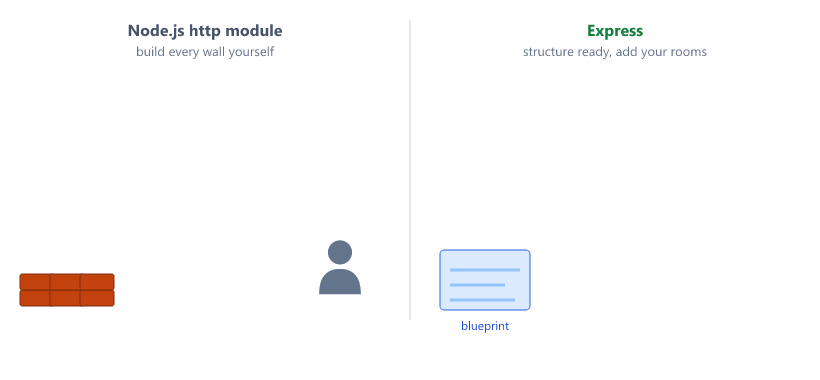

Express makes building web applications easier

It is the most popular Node.js framework

Millions of developers use Express

Important

Express is not a different language. It is a package (a third-party module from Session 04) written in JavaScript, and it uses the `http` module from Session 09 underneath.

---

## Why Use Express

Remember our server code from Session 11

We had to write many lines of code

We had to manually check req.url and req.method

We had to manually split the URL to get the id

We had to manually collect POST data chunk by chunk

We had to write our own sendJSON helper

Express solves these problems

| Problem in Session 11                     | Express gives you          |
| ----------------------------------------- | -------------------------- |
| `if (req.url === ... && req.method === ...)` | `app.get("/students", ...)` |
| `req.url.split("/")` and `Number(parts[2])` | `req.params.id`           |
| `req.on("data")`, `req.on("end")`, `JSON.parse()` | `req.body`           |
| Our own `sendJSON()` helper               | `res.status(201).json(...)` |
| try / catch around `JSON.parse()`         | Bad JSON gets 400 automatically |

Let me show you the difference

With HTTP module, we wrote

```javascript
if (req.url === "/students" && req.method === "GET") {
  // lots of code
}
```

With Express, we write

```javascript
app.get("/students", (req, res) => {
  // shorter code
});
```

Much cleaner

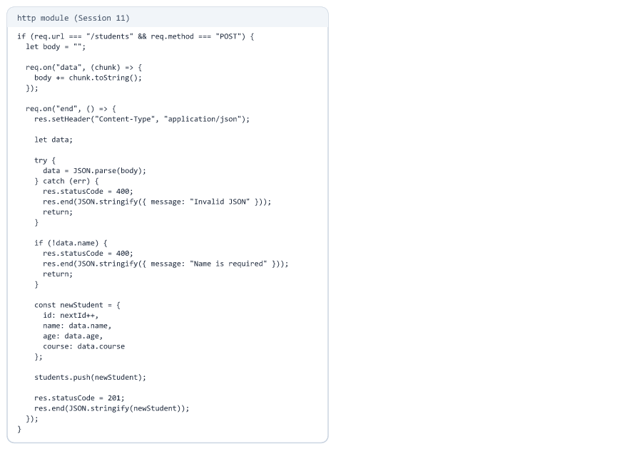

---

## Installing Express

First, create a new project

```bash
mkdir express-student-api
cd express-student-api
npm init -y
```

Now install Express

```bash
npm install express
```

This adds express to your package.json dependencies

```json
{
  "dependencies": {
    "express": "^5.2.1"
  }
}
```

Your version number may be a little higher. This course uses Express 5. Many older tutorials online use Express 4, and a few things work differently (see [Express 4 vs Express 5](#express-4-vs-express-5)).

Add a dev script so the server restarts when you save (Session 10)

```json
{
  "scripts": {
    "dev": "node --watch server.js"
  }
}
```

Now create a file named server.js

---

## Your First Express Server

Here is the simplest Express server

```javascript
const express = require("express");
const app = express();

app.get("/", (req, res) => {
  res.send("Hello from Express");
});

app.listen(3000, (err) => {
  if (err) {
    console.log("Could not start server:", err.message);
    return;
  }

  console.log("Server running on port 3000");
});
```

Let me explain each line

| Code                                  | Meaning                                  |
| ------------------------------------- | ---------------------------------------- |
| `require("express")`                  | Import Express                           |
| `const app = express()`               | Create an Express application            |
| `app.get("/", (req, res) => { })`     | Handle GET requests to /                 |
| `res.send("Hello from Express")`      | Send the response                        |
| `app.listen(3000, (err) => { })`      | Start the server on port 3000            |
| `if (err)`                            | Express 5 gives you the error if the server could not start |

Why check `err`? In Express 5, if port 3000 is already in use, the callback still runs, with the error inside `err`. Without the check, your terminal would say "Server running" even though it is not. See [Mistake 6](#mistake-6).

Run the server

```bash
npm run dev
```

Open browser and visit http://localhost:3000

You will see "Hello from Express"


---

## How Express Handles a Request

Express keeps a list of your routes. For every request, it looks for a route with the same method and path.

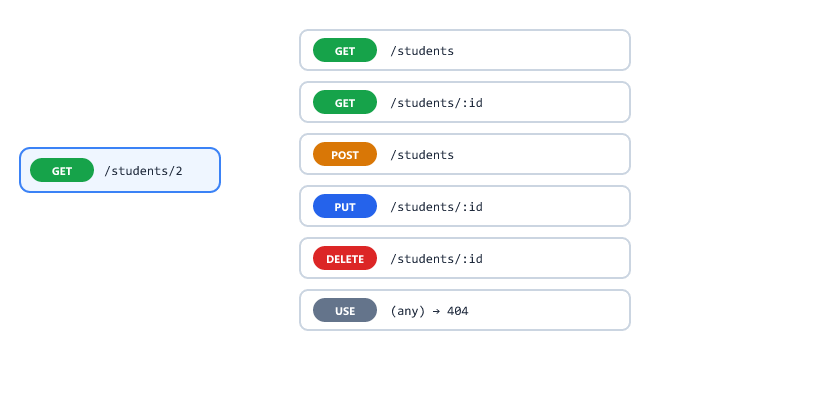

| Step | What happens                                               |
| ---- | ---------------------------------------------------------- |
| 1    | A request arrives, for example `GET /students`             |
| 2    | Express checks your routes from top to bottom              |
| 3    | The first route with the same method and path runs         |
| 4    | Your handler sends the response                            |
| 5    | If no route matches, Express sends 404 "Cannot GET /..."   |

This is the same idea as the routes object you built in Session 10, but Express does it for you.

---

## The Big Picture

Where does Express sit when someone uses your app?

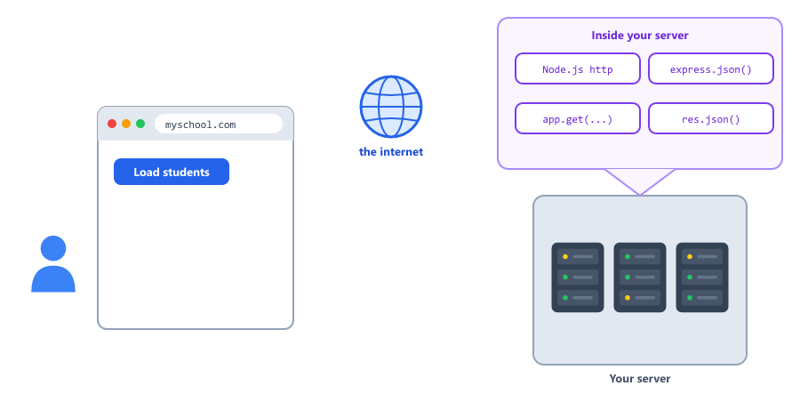

| Step | Where                 | What happens                                      |
| ---- | --------------------- | ------------------------------------------------- |
| 1    | The user's browser    | The user clicks a button or opens a URL           |
| 2    | The internet          | The request travels to your server                |
| 3    | Your server computer  | Node.js receives it (the `http` module)           |
| 4    | Express               | Reads the body, finds the matching route          |
| 5    | Your route handler    | Runs your code and calls `res.json()`             |
| 6    | Back to the browser   | The page updates with the data                    |

You only write step 5. Express and Node.js do the rest.

---

## Express Routes

Routes in Express are very simple

```javascript
app.get("/about", (req, res) => {
  res.send("About Page");
});

app.get("/contact", (req, res) => {
  res.send("Contact Page");
});

app.post("/data", (req, res) => {
  res.send("Data received");
});
```

The pattern is always

```text
app.METHOD(PATH, HANDLER)
```

| Part    | Meaning                                     | Examples                    |
| ------- | ------------------------------------------- | --------------------------- |
| METHOD  | The HTTP method, in lowercase               | get, post, put, delete      |
| PATH    | The URL path                                | /students, /about           |
| HANDLER | The function that runs when the route matches | `(req, res) => { ... }`   |

You will learn much more about routes in Session 13.

---

## The req and res Objects

Every handler receives `req` (the request) and `res` (the response), just like in Session 09. Express adds many helpful properties and methods to them.

What you can read from req

| Property             | Example URL / request          | Value                   |
| -------------------- | ------------------------------ | ----------------------- |
| `req.params`         | `/students/2` with route `/students/:id` | `{ id: "2" }` |
| `req.query`          | `/search?name=John`            | `{ name: "John" }`      |
| `req.body`           | POST with JSON body            | `{ name: "Sarah" }`     |
| `req.method`         | Any request                    | `"GET"`                 |
| `req.path`           | `/search?name=John`            | `"/search"`             |
| `req.get("User-Agent")` | Any request                 | The browser name        |

What you can send with res

| Method                        | Sends                                      |
| ----------------------------- | ------------------------------------------ |
| `res.send("text")`            | Text or HTML                               |
| `res.json(data)`              | JSON (sets the Content-Type for you)       |
| `res.status(404)`             | Sets the status code (use it before json or send) |
| `res.status(201).json(data)`  | Status and JSON together                   |
| `res.sendStatus(204)`         | Only a status code, no body                |

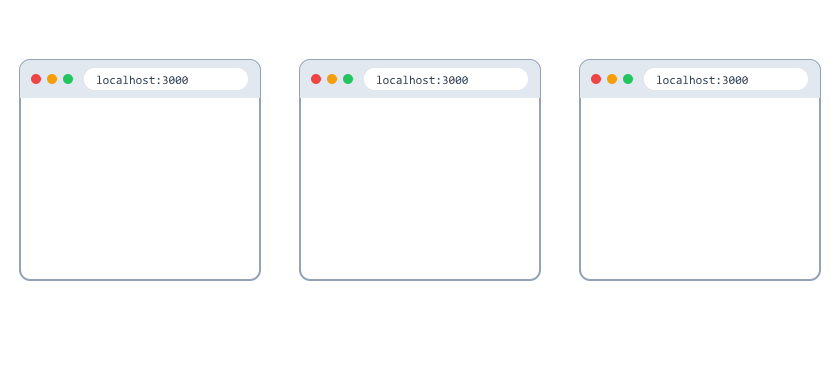

Every request must get exactly one response. Calling `res.json()` or `res.send()` ends it.

---

## Sending JSON Responses

In Session 11, we used JSON.stringify()

In Express, we use res.json()

```javascript
app.get("/user", (req, res) => {
  const user = {
    name: "John",
    age: 25
  };

  res.json(user);
});
```

Output

```json
{"name":"John","age":25}
```

Express automatically

| Step | What res.json() does for you                   |
| ---- | ---------------------------------------------- |
| 1    | Converts the object to JSON (`JSON.stringify`) |
| 2    | Sets the header `Content-Type: application/json` |
| 3    | Sends the response (`res.end`)                 |

Much easier than before

---

## Setting Status Codes

`res.status()` sets the status code. It returns `res`, so you can chain `.json()` right after it.

```javascript
res.status(201).json(newStudent);

res.status(404).json({ message: "Student not found" });

res.status(400).json({ message: "Name is required" });
```

If you do not call `res.status()`, Express uses 200.

`res.status()` alone sends nothing. You must still call `json()` or `send()`, or the browser keeps loading (Session 09).

---

## Sending an HTML Page

Express can send a whole HTML file, not only JSON.

```text
express-student-api/
├── public/
│   └── index.html
├── package.json
└── server.js
```

public/index.html

```html
<!DOCTYPE html>
<html>
  <head>
    <title>Student Portal</title>
  </head>
  <body>
    <h1>Welcome to the Student Portal</h1>
    <p>This page was sent by Express.</p>
  </body>
</html>
```

server.js

```javascript
const path = require("path");

app.get("/", (req, res) => {
  res.sendFile(path.join(__dirname, "public", "index.html"));
});
```

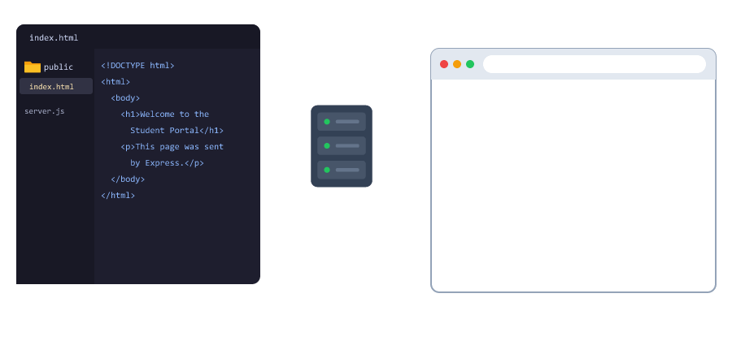

| Code                                             | Meaning                                              |
| ------------------------------------------------ | ---------------------------------------------------- |
| `res.sendFile(...)`                              | Read a file and send it with the right Content-Type  |
| `path.join(__dirname, "public", "index.html")`   | The full path to the file (Session 06)               |

Compare with Session 09, where you used `fs.readFile()`, `setHeader()` and `res.end()`. `res.sendFile()` does all of that in one line.

`res.sendFile()` needs a full (absolute) path. A path like `"public/index.html"` throws

```text
TypeError: path must be absolute or specify root to res.sendFile
```

That is why we use `path.join(__dirname, ...)`.

---

## Redirecting to Another Page

Sometimes a page moves. Send the browser to the new address with `res.redirect()`.

```javascript
app.get("/old-page", (req, res) => {
  res.redirect("/new-page");
});

app.get("/new-page", (req, res) => {
  res.send("This is the new page");
});
```

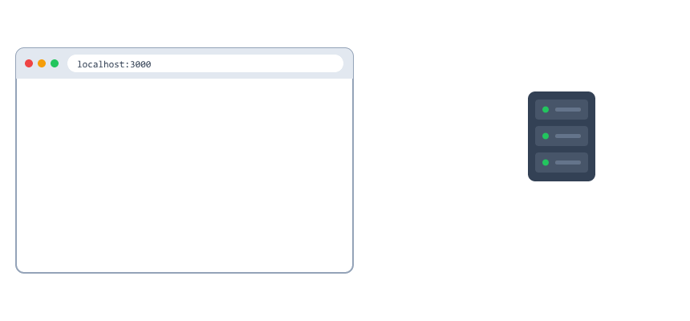

What happens

| Step | Who     | What                                                          |
| ---- | ------- | ------------------------------------------------------------- |
| 1    | Browser | Asks for `/old-page`                                          |
| 2    | Express | Answers `302 Found` with the header `Location: /new-page`     |
| 3    | Browser | Automatically asks for `/new-page`                            |
| 4    | Express | Sends "This is the new page"                                  |

The user only sees the address bar change. Redirects are used after a login, after submitting a form, or when a page moves.

---

## GET Requests in Express

Remember our GET all students from Session 11

Let me show you the Express version

```javascript
let students = [
  {
    id: 1,
    name: "John Doe",
    age: 20,
    course: "Computer Science"
  },
  {
    id: 2,
    name: "Jane Smith",
    age: 22,
    course: "Mathematics"
  }
];

app.get("/students", (req, res) => {
  res.json(students);
});
```

That is it

No status code to set manually (Express uses 200 by default)

No JSON.stringify()

No Content-Type header

Just res.json()

---

## POST Requests in Express

In Session 11, we had to collect data chunk by chunk

Express makes this easy with a middleware called express.json()

First, add this line before your routes

```javascript
app.use(express.json());
```

This tells Express to automatically read and parse JSON from the request body

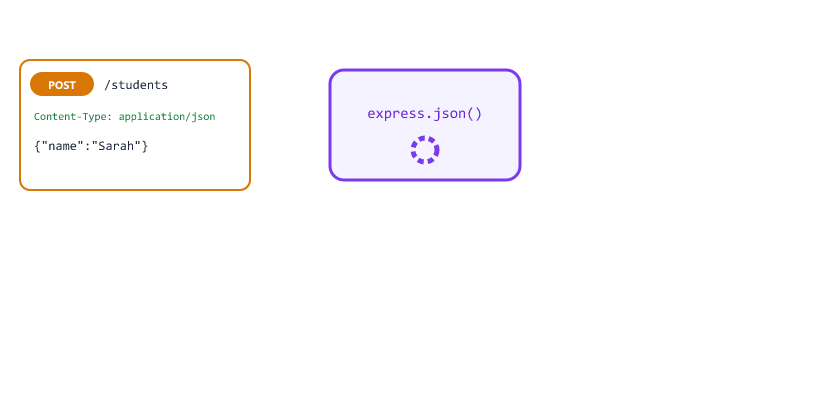

`express.json()` is middleware: a function that runs before your routes. You will learn all about middleware in Session 14.

It only reads requests that have the header `Content-Type: application/json`. If the header is missing, `req.body` is `undefined`.

Now POST request looks like this

```javascript
let nextId = 3;

app.post("/students", (req, res) => {
  const { name, age, course } = req.body || {};

  if (!name) {
    return res.status(400).json({ message: "Name is required" });
  }

  const newStudent = { id: nextId++, name, age, course };

  students.push(newStudent);

  res.status(201).json(newStudent);
});
```

| Code                                   | Meaning                                                      |
| -------------------------------------- | ------------------------------------------------------------ |
| `const { name, age, course } = req.body \|\| {}` | Destructuring (Session 04). Take only these 3 fields. If req.body is undefined, use an empty object so it does not crash |
| `if (!name)`                           | Name is required                                             |
| `return res.status(400).json(...)`     | `return` stops the function so we do not also send 201       |
| `id: nextId++`                         | A unique id that is never reused (Session 11)                |
| `res.status(201).json(newStudent)`     | 201 Created, with the new student                            |

Compare this with Session 11

We no longer need

* `let body = ""`
* `req.on("data")`
* `req.on("end")`
* `JSON.parse()` with try / catch

Express does all of that for us

req.body contains the incoming data

---

## PUT Requests in Express

PUT request is also simpler

```javascript
app.put("/students/:id", (req, res) => {
  const id = Number(req.params.id);
  const updatedData = req.body || {};

  const index = students.findIndex((s) => s.id === id);

  if (index === -1) {
    return res.status(404).json({ message: "Student not found" });
  }

  students[index] = { ...students[index], ...updatedData, id };

  res.json(students[index]);
});
```

Notice the :id in the URL

```text
/students/:id
```

Express captures this for us

We access it using req.params.id

No need to split the URL manually

`req.params.id` is text, like everything in a URL, so we still use `Number()`. The `, id` at the end keeps the original id (Session 11).

---

## DELETE Requests in Express

DELETE request is also very clean

```javascript
app.delete("/students/:id", (req, res) => {
  const id = Number(req.params.id);

  const index = students.findIndex((s) => s.id === id);

  if (index === -1) {
    return res.status(404).json({ message: "Student not found" });
  }

  students.splice(index, 1);

  res.json({ message: "Student deleted successfully" });
});
```

---

## URL Parameters in Express

Express makes it easy to get data from URLs

There are two common ways

Route Parameters

```text
/students/1
/students/2
```

Access using req.params

```javascript
app.get("/students/:id", (req, res) => {
  const id = req.params.id;
  res.json({ id });
});
```

Visiting /students/2 returns

```json
{"id":"2"}
```

Query Parameters

```text
/search?name=John&age=20
```

Access using req.query

```javascript
app.get("/search", (req, res) => {
  const name = req.query.name;
  const age = req.query.age;
  res.json({ name, age });
});
```

Visiting /search?name=John&age=20 returns

```json
{"name":"John","age":"20"}
```

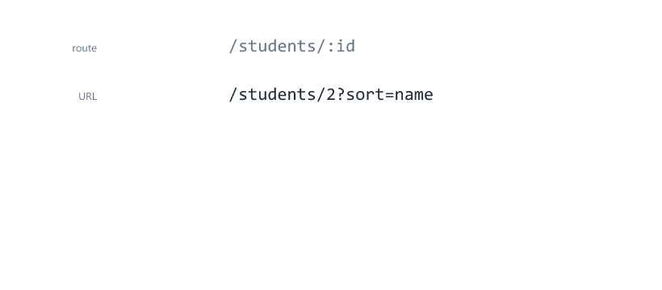

| Use                | When                                      | Example                   |
| ------------------ | ----------------------------------------- | ------------------------- |
| Route parameter    | It identifies one thing                   | `/students/2`             |
| Query parameter    | It filters, sorts or searches             | `/students?course=Physics` |

Both always give you strings. `"2"` and `"20"` are text, so use `Number()` when you need a number.

---

## Filtering with Query Parameters

Query parameters are perfect for filters. Add a `course` filter to GET /students.

```javascript
app.get("/students", (req, res) => {
  const course = req.query.course;

  if (course) {
    const filtered = students.filter(
      (s) => s.course.toLowerCase() === course.toLowerCase()
    );
    return res.json(filtered);
  }

  res.json(students);
});
```

| Request                          | Result                                  |
| -------------------------------- | --------------------------------------- |
| `/students`                      | All students                            |
| `/students?course=Physics`       | Only Physics students                   |
| `/students?course=physics`       | Same, because we compare in lowercase   |
| `/students?course=Art`           | `[]` (empty list, still 200)            |


Real apps do this all the time. When you tap a category in a shopping app, it sends a request like `/products?category=shoes`.

---

## What Express Does for You Automatically

Express protects your server from many problems that crashed or broke our Session 11 server.

| Situation                                    | Session 11 (http module)    | Express 5                              |
| -------------------------------------------- | --------------------------- | -------------------------------------- |
| Client sends broken JSON                     | Crashed without try / catch | 400 Bad Request automatically          |
| URL has no matching route                    | We wrote our own 404        | 404 "Cannot GET /..." automatically    |
| Your handler throws an error                 | The whole server crashed    | 500 for that request, server keeps running |
| An `async` handler throws an error           | The whole server crashed    | 500 for that request, server keeps running |


These automatic error pages are HTML and show details meant for developers. In Session 15 and Session 24 you will replace them with clean JSON errors.

---

## Your Own 404 for Unknown Routes

Express's default 404 is an HTML page. An API should answer with JSON.

Add this after all your routes

```javascript
app.use((req, res) => {
  res.status(404).json({ message: "Route not found" });
});
```

`app.use()` with no path runs for every request that reaches it. Because it is last, only requests that matched no route reach it.

Important

Many Express 4 tutorials write `app.get("*", ...)` or `app.all("*", ...)` for this. In Express 5 that line crashes the server when it starts

```text
TypeError: Missing parameter name at index 1: *
```

Use `app.use((req, res) => { ... })` at the end instead.

---

## Choosing the Port

So far we wrote `3000` directly. When you put your app online, the hosting company decides the port and gives it to your app in an environment variable called `PORT`.

```javascript
const PORT = process.env.PORT || 3000;

app.listen(PORT, (err) => {
  if (err) {
    console.log("Could not start server:", err.message);
    return;
  }

  console.log(`Server running on port ${PORT}`);
});
```

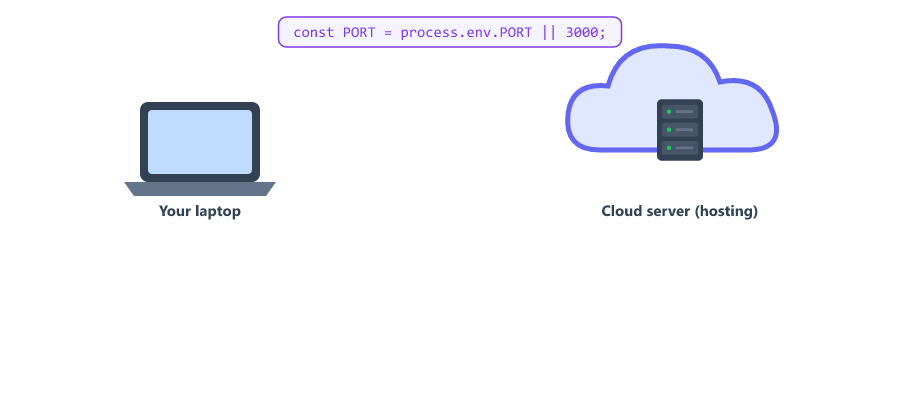

| Where the app runs  | process.env.PORT   | Port used |
| ------------------- | ------------------ | --------- |
| Your laptop         | not set            | 3000      |
| A cloud server      | for example 8080   | 8080      |

`process.env` holds environment variables (Session 07). `||` means "use the right side if the left side is empty". You will learn how to set your own environment variables in Session 16.

---

## Complete Student API with Express

Here is the complete server.js using Express

```javascript
const express = require("express");
const app = express();

app.use(express.json());

let students = [
  {
    id: 1,
    name: "John Doe",
    age: 20,
    course: "Computer Science"
  },
  {
    id: 2,
    name: "Jane Smith",
    age: 22,
    course: "Mathematics"
  },
  {
    id: 3,
    name: "Mike Johnson",
    age: 21,
    course: "Physics"
  }
];

let nextId = 4;

// GET all students
app.get("/students", (req, res) => {
  res.json(students);
});

// GET one student
app.get("/students/:id", (req, res) => {
  const id = Number(req.params.id);
  const student = students.find((s) => s.id === id);

  if (!student) {
    return res.status(404).json({ message: "Student not found" });
  }

  res.json(student);
});

// POST add new student
app.post("/students", (req, res) => {
  const { name, age, course } = req.body || {};

  if (!name) {
    return res.status(400).json({ message: "Name is required" });
  }

  const newStudent = { id: nextId++, name, age, course };
  students.push(newStudent);

  res.status(201).json(newStudent);
});

// PUT update student
app.put("/students/:id", (req, res) => {
  const id = Number(req.params.id);
  const index = students.findIndex((s) => s.id === id);

  if (index === -1) {
    return res.status(404).json({ message: "Student not found" });
  }

  students[index] = { ...students[index], ...(req.body || {}), id };

  res.json(students[index]);
});

// DELETE student
app.delete("/students/:id", (req, res) => {
  const id = Number(req.params.id);
  const index = students.findIndex((s) => s.id === id);

  if (index === -1) {
    return res.status(404).json({ message: "Student not found" });
  }

  students.splice(index, 1);

  res.json({ message: "Student deleted successfully" });
});

// Unknown routes
app.use((req, res) => {
  res.status(404).json({ message: "Route not found" });
});

app.listen(3000, (err) => {
  if (err) {
    console.log("Could not start server:", err.message);
    return;
  }

  console.log("Server running on port 3000");
  console.log("Student API with Express");
});
```

---

## Comparing HTTP Module vs Express

Let me show you the difference side by side

Session 11 with HTTP module

```javascript
if (req.url === "/students" && req.method === "GET") {
  res.statusCode = 200;
  res.setHeader("Content-Type", "application/json");
  res.end(JSON.stringify(students));
}
```

Express version

```javascript
app.get("/students", (req, res) => {
  res.json(students);
});
```

| Task                    | HTTP module (Session 11)                 | Express                          |
| ----------------------- | ---------------------------------------- | -------------------------------- |
| Match a route           | `if (req.method === ... && req.url === ...)` | `app.get(path, handler)`     |
| Get the id              | `req.url.split("/")`, `parts[2]`         | `req.params.id`                  |
| Read the body           | `readBody()` with data/end events        | `app.use(express.json())`, `req.body` |
| Send JSON               | `sendJSON(res, 200, data)` (our helper)  | `res.json(data)`                 |
| Unknown route           | Our own 404 code                         | Automatic, or `app.use(...)` at the end |
| Broken JSON             | Our own try / catch                      | Automatic 400                    |

The Session 11 server needed two helper functions (`sendJSON` and `readBody`), manual URL splitting, and its own try / catch for bad JSON. The Express version needs none of them. Less code to write yourself means fewer places for mistakes.

Express saves time and reduces mistakes

---

## Testing Your Express API

Run the server

```bash
npm run dev
```

Test GET requests in browser

```text
http://localhost:3000/students
http://localhost:3000/students/1
```

Test POST, PUT, DELETE with the same tools you used in Session 11

The best part: the `test-api.js` script from Session 11 works without changing a single line, because the API behaves exactly the same.

```bash
node test-api.js
```

```text
POST 201 { id: 4, name: 'Sarah', age: 23, course: 'Biology' }
PUT 200 { id: 1, name: 'John Updated', age: 20, course: 'Computer Science' }
DELETE 200 { message: 'Student deleted successfully' }
GET 200 [
  { id: 1, name: 'John Updated', age: 20, course: 'Computer Science' },
  { id: 3, name: 'Mike Johnson', age: 21, course: 'Physics' },
  { id: 4, name: 'Sarah', age: 23, course: 'Biology' }
]
```

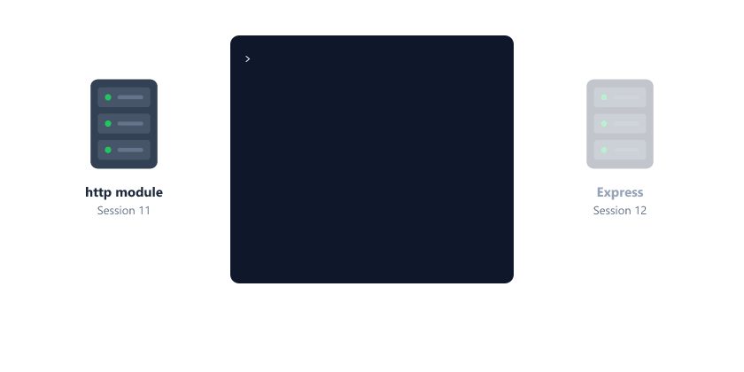

Postman: choose Body, then raw, then JSON. Postman then adds the `Content-Type: application/json` header for you. If you choose Text instead, `req.body` will be `undefined`.

curl: macOS, Linux and Git Bash

```bash
curl -X POST http://localhost:3000/students -H "Content-Type: application/json" -d '{"name":"Sarah","age":23,"course":"Biology"}'

curl -X PUT http://localhost:3000/students/1 -H "Content-Type: application/json" -d '{"name":"John Updated"}'

curl -X DELETE http://localhost:3000/students/1
```

Windows: use the Command Prompt or PowerShell versions from [Session 11](11-crud-operations-dummy-data.md#testing-your-api).

Everything works the same as before

But the code is much cleaner

---

## Mini Project: Random Quote API

A small, fun API you can build in 5 minutes. A phone app could use it to show a "Quote of the Day".

server.js

```javascript
const express = require("express");
const app = express();

const quotes = [
  { id: 1, text: "First, solve the problem. Then, write the code.", author: "John Johnson" },
  { id: 2, text: "Code is like humor. When you have to explain it, it is bad.", author: "Cory House" },
  { id: 3, text: "Simplicity is the soul of efficiency.", author: "Austin Freeman" },
  { id: 4, text: "Make it work, make it right, make it fast.", author: "Kent Beck" }
];

// All quotes
app.get("/quotes", (req, res) => {
  res.json(quotes);
});

// One random quote (must be before /quotes/:id)
app.get("/quotes/random", (req, res) => {
  const index = Math.floor(Math.random() * quotes.length);
  res.json(quotes[index]);
});

// One quote by id
app.get("/quotes/:id", (req, res) => {
  const quote = quotes.find((q) => q.id === Number(req.params.id));

  if (!quote) {
    return res.status(404).json({ message: "Quote not found" });
  }

  res.json(quote);
});

app.listen(3000, (err) => {
  if (err) {
    console.log("Could not start server:", err.message);
    return;
  }

  console.log("Quote API running on port 3000");
});
```

Open http://localhost:3000/quotes/random and refresh a few times. You get a different quote each time.

```json
{"id":3,"text":"Simplicity is the soul of efficiency.","author":"Austin Freeman"}
```

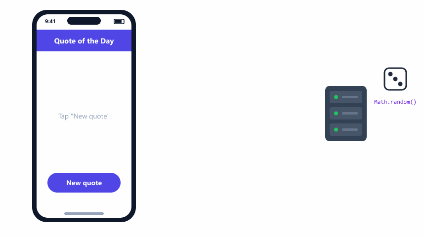

| Code                                  | Meaning                                         |
| ------------------------------------- | ----------------------------------------------- |
| `Math.random()`                       | A random number from 0 up to (not including) 1  |
| `Math.random() * quotes.length`       | A random number from 0 up to (not including) 4  |
| `Math.floor(...)`                     | Round down, so we get 0, 1, 2 or 3              |
| `quotes[index]`                       | The quote at that position                      |

Why must `/quotes/random` come before `/quotes/:id`? Express checks routes from top to bottom. If `/quotes/:id` came first, it would catch `/quotes/random` with `id = "random"`, and you would get "Quote not found".

Try it yourself

* Add 3 more quotes of your own
* Add `GET /quotes/count` that returns `{ "total": 4 }` (where must it go?)
* Add `?author=Kent Beck` filtering to `GET /quotes`

---

## Express 4 vs Express 5

You will find many Express 4 examples online. These are the differences that affect beginners.

| Topic                        | Express 4                       | Express 5 (this course)                     |
| ---------------------------- | ------------------------------- | ------------------------------------------- |
| Catch-all route              | `app.get("*", ...)`             | Crashes. Use `app.use((req, res) => ...)` at the end |
| Optional parameter           | `/users/:id?`                   | Crashes. Use `/users{/:id}` (Session 13)    |
| Error in an `async` handler  | Server could crash              | Express catches it and sends 500            |
| `req.body` with no JSON body | `{}`                            | `undefined`                                 |
| Port already in use          | Error thrown                    | Error passed to the `app.listen` callback   |

If an online example does not work, check whether it was written for Express 4.

---

## Beginner Mistakes

### Mistake 1

Forgetting `app.use(express.json())`.

```javascript
app.post("/students", (req, res) => {
  console.log(req.body);
});
```

```text
undefined
```

Without it, Express never reads the body.

Correct:

Add `app.use(express.json());` before your routes.

---

### Mistake 2

Sending JSON without the Content-Type header.

In Postman, choosing Text instead of JSON, or in curl, forgetting `-H "Content-Type: application/json"`.

`req.body` is `undefined`, and `req.body.name` throws

```text
TypeError: Cannot read properties of undefined (reading 'name')
```

Express catches it and answers 500, but the student is not saved.

Correct:

Send the header, and in your code use `const { name } = req.body || {};`

---

### Mistake 3

Forgetting that params are strings.

Incorrect:

```javascript
const student = students.find((s) => s.id === req.params.id);
```

`"1" === 1` is false, so the student is never found.

Correct:

```javascript
const id = Number(req.params.id);
const student = students.find((s) => s.id === id);
```

---

### Mistake 4

Using `*` for a catch-all route.

```javascript
app.all("*", (req, res) => {
  res.status(404).json({ message: "Route not found" });
});
```

```text
TypeError: Missing parameter name at index 1: *
```

The server does not even start. This is Express 4 syntax.

Correct:

```javascript
app.use((req, res) => {
  res.status(404).json({ message: "Route not found" });
});
```

---

### Mistake 5

Sending two responses.

```javascript
app.post("/students", (req, res) => {
  if (!req.body.name) {
    res.status(400).json({ message: "Name is required" });
  }
  res.status(201).json(req.body);
});
```

```text
Error [ERR_HTTP_HEADERS_SENT]: Cannot set headers after they are sent to the client
```

The first response was sent, then the code kept going.

Correct:

```javascript
if (!req.body.name) {
  return res.status(400).json({ message: "Name is required" });
}
```

---

### Mistake 6

Trusting the "Server running" message.

```javascript
app.listen(3000, () => {
  console.log("Server running on port 3000");
});
```

If another server already uses port 3000, Express 5 still calls this function, and it prints "Server running on port 3000". But nothing is listening, and the browser cannot connect.

Correct:

```javascript
app.listen(3000, (err) => {
  if (err) {
    console.log("Could not start server:", err.message);
    return;
  }

  console.log("Server running on port 3000");
});
```

```text
Could not start server: listen EADDRINUSE: address already in use :::3000
```

---

### Mistake 7

Putting the 404 handler before your routes.

```javascript
app.use((req, res) => {
  res.status(404).json({ message: "Route not found" });
});

app.get("/students", (req, res) => {
  res.json(students);
});
```

Every request gets 404, because the 404 handler catches everything that reaches it, and it is first.

Correct:

Put `app.use(...)` for 404 after all routes.

---

### Mistake 8

Using `res.status(201)` alone.

```javascript
res.status(201);
```

Nothing is sent and the request keeps loading. Always finish with `.json()` or `.send()`.

---

### Mistake 9

Giving `res.sendFile()` a relative path.

```javascript
res.sendFile("public/index.html");
```

```text
TypeError: path must be absolute or specify root to res.sendFile
```

Correct:

```javascript
res.sendFile(path.join(__dirname, "public", "index.html"));
```

---

### Mistake 10

Putting a fixed route after a route parameter.

```javascript
app.get("/quotes/:id", ...);
app.get("/quotes/random", ...);
```

`/quotes/random` is caught by `/quotes/:id` first, with `id = "random"`. Put fixed paths like `/quotes/random` before `/quotes/:id`.

---

## Practice Exercises

### Exercise 1

Create a new Express server

Add a route

```text
GET /welcome
```

Return the message "Welcome to Express"

### Exercise 2

Create a products array

Implement GET /products to return all products

### Exercise 3

Add a POST route to add new products

Use req.body to get the data

Use a nextId counter, and return 400 if the product name is missing

### Exercise 4

Add a route parameter

```text
GET /users/:userId
```

Return the userId from the URL as a number

Example: /users/5 should return { "userId": 5 }

Hint: without `Number()` you get { "userId": "5" }

### Exercise 5

Add GET /products/search?maxPrice=500 that returns products with a price up to maxPrice

### Exercise 6

Add a JSON 404 handler for unknown routes. Test it with /something

### Exercise 7

Run the test-api.js script from Session 11 against your Express server. Do you get the same output?

### Exercise 8

Start your server twice in two terminals. What does the second terminal print? Does your `app.listen` callback handle it?

---

## Interview Questions

### What is Express.js

Express.js is a framework for Node.js that helps build web applications and APIs with less code

### Why do we use Express

Express makes it easier to build web servers with less code. It handles routing, reading the request body, sending JSON and many errors for you

### What does app.use(express.json()) do

It is middleware that reads the request body and parses JSON into req.body, for requests with Content-Type: application/json

### How do you get data from URL parameters

Using req.params

Example: req.params.id

### How do you get data from query strings

Using req.query

Example: req.query.name

### Are req.params and req.query values numbers or strings

Always strings. Use Number() to convert them

### What is the difference between res.send() and res.json()

res.send() can send text, HTML, or an object

res.json() always sends JSON and sets the correct header

### How do you send a status code with JSON in Express

res.status(404).json({ message: "Not found" })

### What happens in Express when no route matches

Express sends a 404 response. You can send your own JSON 404 with app.use((req, res) => { ... }) after all routes

### How do you write a catch-all route in Express 5

Use app.use((req, res) => { ... }) at the end. The Express 4 style app.get("*") throws an error in Express 5

### How do you send an HTML file with Express

res.sendFile(path.join(__dirname, "public", "index.html")). The path must be absolute

### What does res.redirect() do

It sends a 302 status with a Location header. The browser then requests the new URL automatically

### Why use process.env.PORT || 3000

Hosting services choose the port and pass it in the PORT environment variable. On your own computer it is not set, so 3000 is used

### What does "Cannot set headers after they are sent to the client" mean

The code tried to send a second response for the same request. Use return when sending an early response

---
