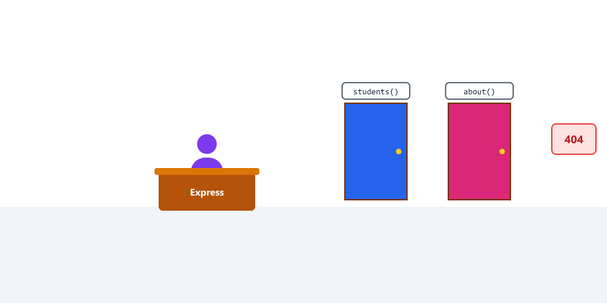
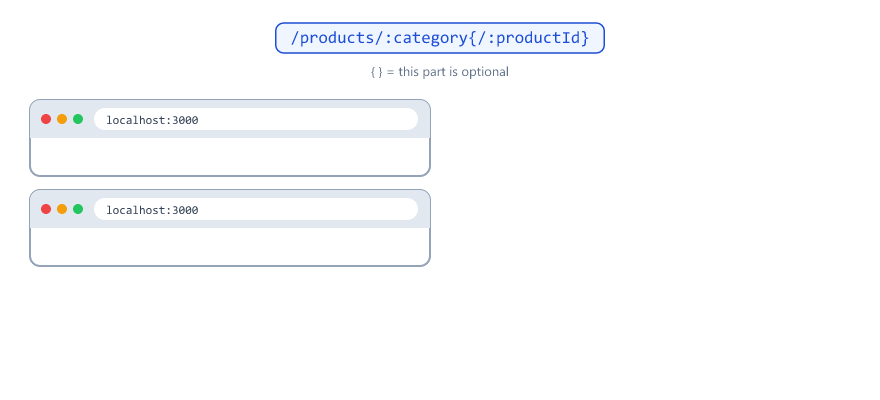
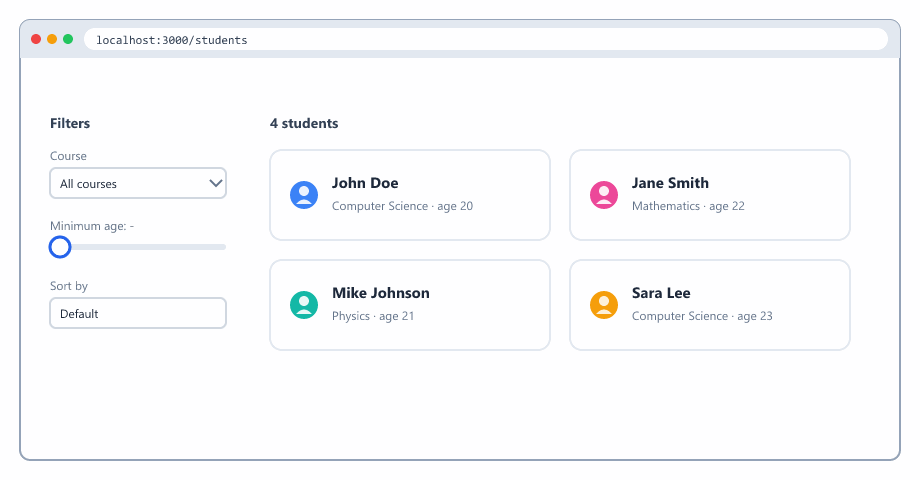
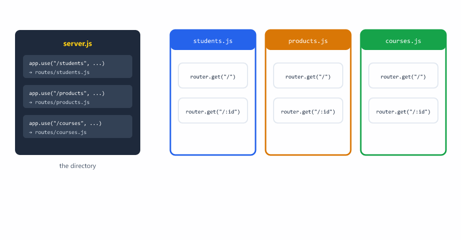
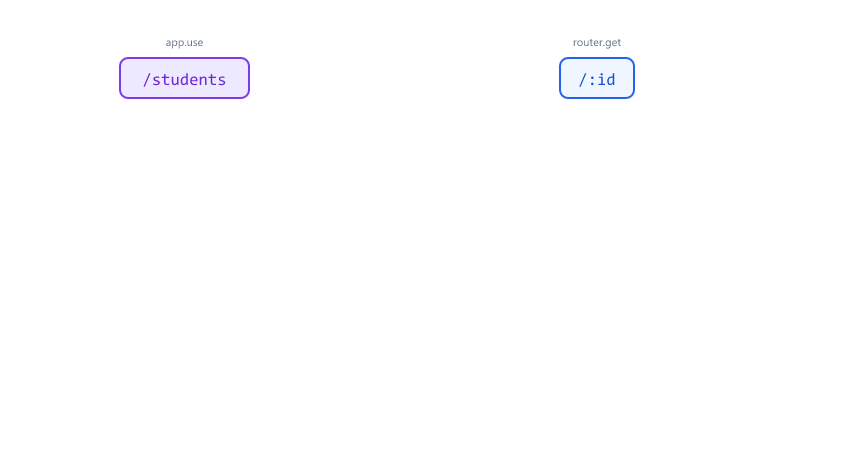
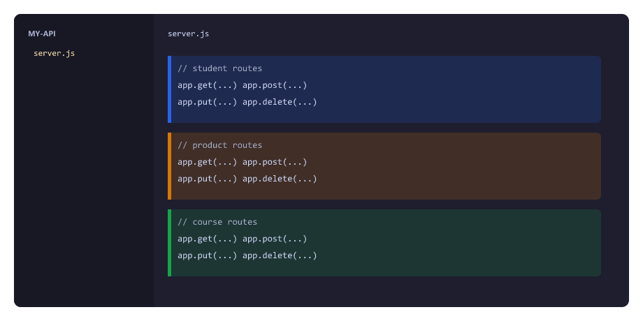
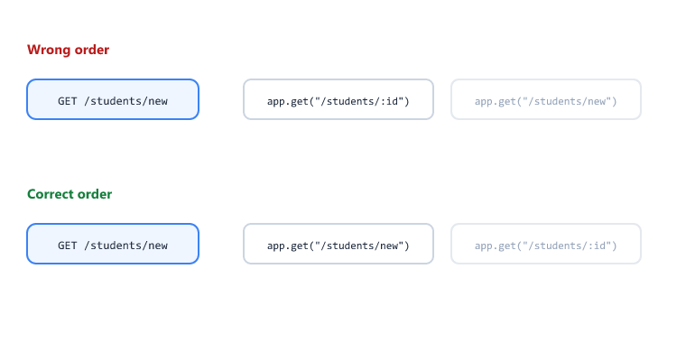

## Table of Contents

* [What is Routing](#what-is-routing)
* [Basic Routes in Express](#basic-routes-in-express)
* [How Express Matches a URL](#how-express-matches-a-url)
* [Route Parameters](#route-parameters)
* [Multiple Route Parameters](#multiple-route-parameters)
* [Optional Route Parameters](#optional-route-parameters)
* [Query Parameters](#query-parameters)
* [Filtering and Sorting with Query Parameters](#filtering-and-sorting-with-query-parameters)
* [Pagination with page and limit](#pagination-with-page-and-limit)
* [Route with Multiple HTTP Methods](#route-with-multiple-http-methods)
* [Chaining Methods with app.route()](#chaining-methods-with-approute)
* [Organizing Routes](#organizing-routes)
* [Router Paths Are Relative](#router-paths-are-relative)
* [Using an /api Prefix](#using-an-api-prefix)
* [Route Files Complete Example](#route-files-complete-example)
* [Complete Example with Multiple Route Files](#complete-example-with-multiple-route-files)
* [Route Order Matters](#route-order-matters)
* [Express 5 Route Syntax](#express-5-route-syntax)
* [Beginner Mistakes](#beginner-mistakes)
* [Practice Exercises](#practice-exercises)
* [Interview Questions](#interview-questions)
* [Summary](#summary)

---

## What is Routing

Routing means deciding what happens when someone visits a URL

Example

| URL           | What happens               |
| ------------- | -------------------------- |
| /students     | Show all students          |
| /students/1   | Show student with id 1     |
| /about        | Show about page            |

Routing connects a URL to a function

Think of it like a receptionist



| Visitor asks for | Receptionist sends them to |
| ---------------- | -------------------------- |
| /students        | The students function      |
| /about           | The about function         |
| Something unknown | "Sorry, not found" (404)  |

Express makes routing very easy

---

## Basic Routes in Express

Here are the most common routes

```javascript
const express = require("express");
const app = express();

// Home page
app.get("/", (req, res) => {
  res.send("Welcome to Home Page");
});

// About page
app.get("/about", (req, res) => {
  res.send("About Us");
});

// Contact page
app.get("/contact", (req, res) => {
  res.send("Contact Us");
});

// Products page
app.get("/products", (req, res) => {
  res.send("List of Products");
});

app.listen(3000, (err) => {
  if (err) {
    console.log("Could not start server:", err.message);
    return;
  }

  console.log("Server running on port 3000");
});
```

Each route has three parts

| Part               | Meaning            |
| ------------------ | ------------------ |
| `app.get()`        | HTTP method        |
| `"/about"`         | URL path           |
| `(req, res) => {}` | Function that runs |

You can use any URL you want

---

## How Express Matches a URL

A few rules that surprise beginners

| Rule                                   | Example                                                |
| -------------------------------------- | ------------------------------------------------------ |
| Capital letters do not matter          | `/About` matches `app.get("/about", ...)`              |
| A slash at the end does not matter     | `/about/` matches `app.get("/about", ...)`             |
| The query string is ignored for matching | `/about?x=1` matches `app.get("/about", ...)`        |
| The method must match                  | `POST /about` does not match `app.get("/about", ...)`  |
| Routes are checked from top to bottom  | The first match wins                                   |

This is different from the http module in Session 10, where `/about/` and `/About` did not match `"/about"`.

---

## Route Parameters

Route parameters let you capture values from the URL

Use a colon : before the parameter name

Example

```javascript
app.get("/students/:id", (req, res) => {
  const id = req.params.id;
  res.send(`Student ID is ${id}`);
});
```


| Visit             | req.params.id |
| ----------------- | ------------- |
| /students/5       | `"5"`         |
| /students/100     | `"100"`       |
| /students/abc     | `"abc"`       |

The value is always a string. `"5"` is text, not the number 5.

You can name the parameter anything

```javascript
app.get("/products/:productId", (req, res) => {
  const productId = req.params.productId;
  res.send(`Product ID is ${productId}`);
});

app.get("/users/:userId", (req, res) => {
  const userId = req.params.userId;
  res.send(`User ID is ${userId}`);
});
```

Real world example with student data

```javascript
app.get("/students/:id", (req, res) => {
  const id = Number(req.params.id);

  const student = students.find((s) => s.id === id);

  if (!student) {
    return res.status(404).json({ message: "Student not found" });
  }

  res.json(student);
});
```

`Number()` turns `"5"` into `5`, so it can match the number id in our data (Session 11).

---

## Multiple Route Parameters

You can use multiple parameters in one route

```javascript
app.get("/students/:studentId/courses/:courseId", (req, res) => {
  const studentId = req.params.studentId;
  const courseId = req.params.courseId;

  res.json({
    studentId: studentId,
    courseId: courseId
  });
});
```

Visit /students/5/courses/10

You will get

```json
{
  "studentId": "5",
  "courseId": "10"
}
```

This is useful for nested resources, for example "course 10 of student 5"

Each `:name` catches one part of the path, between two slashes

---

## Optional Route Parameters

Sometimes you want a parameter to be optional

In Express 5, put the optional part inside curly braces `{ }`

```javascript
app.get("/products/:category{/:productId}", (req, res) => {
  const category = req.params.category;
  const productId = req.params.productId;

  if (productId) {
    res.send(`Category ${category}, Product ${productId}`);
  } else {
    res.send(`Category ${category}, All Products`);
  }
});
```

Now both URLs work

| Visit                         | req.params                                   | Response                          |
| ----------------------------- | -------------------------------------------- | --------------------------------- |
| /products/electronics         | `{ category: "electronics" }`                | Category electronics, All Products |
| /products/electronics/123     | `{ category: "electronics", productId: "123" }` | Category electronics, Product 123 |



Important

Express 4 tutorials write this as `/:productId?` with a question mark. In Express 5 that crashes the server when it starts

```text
TypeError: Unexpected ? at index 30: /products/:category/:productId?
```

Use `{/:productId}` instead.

---

## Query Parameters

Query parameters come after a question mark in the URL

Example URL

```text
/students?course=Computer&age=20
```

The query parameters are

| Key    | Value      |
| ------ | ---------- |
| course | `Computer` |
| age    | `"20"`     |

Express puts all query parameters in req.query

```javascript
app.get("/students", (req, res) => {
  const course = req.query.course;
  const age = req.query.age;

  res.json({ course, age });
});
```

Visit /students?course=Computer&age=20

You will get

```json
{
  "course": "Computer",
  "age": "20"
}
```

Like route parameters, query values are always strings.

Spaces in a URL

A URL cannot contain a real space. Browsers turn a space into `%20` (or `+`), and Express turns it back

| You type in the browser              | The URL that is sent                  | req.query.course       |
| ------------------------------------ | ------------------------------------- | ---------------------- |
| `/students?course=Computer Science`  | `/students?course=Computer%20Science` | `"Computer Science"`   |

If a key appears twice, like `?tag=a&tag=b`, req.query.tag is an array: `["a", "b"]`.

---

## Filtering and Sorting with Query Parameters

Our data for the next examples

```javascript
const students = [
  { id: 1, name: "John Doe", age: 20, course: "Computer Science" },
  { id: 2, name: "Jane Smith", age: 22, course: "Mathematics" },
  { id: 3, name: "Mike Johnson", age: 21, course: "Physics" },
  { id: 4, name: "Sara Lee", age: 23, course: "Computer Science" }
];
```

Real world example with filtering and sorting

```javascript
app.get("/students", (req, res) => {
  let result = students;

  // Filter by course if provided
  if (req.query.course) {
    result = result.filter(
      (s) => s.course.toLowerCase() === req.query.course.toLowerCase()
    );
  }

  // Filter by minimum age if provided
  if (req.query.minAge) {
    const minAge = Number(req.query.minAge);

    if (Number.isNaN(minAge)) {
      return res.status(400).json({ message: "minAge must be a number" });
    }

    result = result.filter((s) => s.age >= minAge);
  }

  // Sort if asked
  if (req.query.sort === "name") {
    result = [...result].sort((a, b) => a.name.localeCompare(b.name));
  } else if (req.query.sort === "age") {
    result = [...result].sort((a, b) => a.age - b.age);
  }

  res.json(result);
});
```

Now you can use

| URL                                              | Result                                   |
| ------------------------------------------------ | ---------------------------------------- |
| `/students?course=Computer Science`              | John and Sara                            |
| `/students?minAge=21`                            | Jane, Mike and Sara                      |
| `/students?course=Mathematics&minAge=20`         | Jane                                     |
| `/students?sort=name`                            | Jane, John, Mike, Sara (A to Z)          |
| `/students?minAge=21&sort=age`                   | Mike (21), Jane (22), Sara (23)          |
| `/students?minAge=abc`                           | 400 "minAge must be a number"            |



| Code                                    | Meaning                                                      |
| --------------------------------------- | ------------------------------------------------------------ |
| `Number.isNaN(minAge)`                  | `Number("abc")` is `NaN` (Not a Number). Reject it with 400  |
| `[...result]`                           | A copy of the array. `sort()` changes the array it is called on, so we sort a copy |
| `a.name.localeCompare(b.name)`          | Compares two strings alphabetically                          |
| `a.age - b.age`                         | Sorts numbers from small to big                              |

Each filter is optional. The client can use any of them, in any combination.

---

## Pagination with page and limit

Imagine 10,000 students. Sending all of them at once is slow. Apps show a few at a time, like "page 1, page 2".

```javascript
app.get("/students", (req, res) => {
  const page = Number(req.query.page) || 1;
  const limit = Number(req.query.limit) || 2;

  const start = (page - 1) * limit;
  const data = students.slice(start, start + limit);

  res.json({
    page,
    limit,
    total: students.length,
    totalPages: Math.ceil(students.length / limit),
    data
  });
});
```

Visit /students?page=2&limit=2

```json
{
  "page": 2,
  "limit": 2,
  "total": 4,
  "totalPages": 2,
  "data": [
    { "id": 3, "name": "Mike Johnson", "age": 21, "course": "Physics" },
    { "id": 4, "name": "Sara Lee", "age": 23, "course": "Computer Science" }
  ]
}
```


| page | limit | start = (page - 1) * limit | slice(start, start + limit) |
| ---- | ----- | -------------------------- | --------------------------- |
| 1    | 2     | 0                          | items 0 and 1               |
| 2    | 2     | 2                          | items 2 and 3               |
| 3    | 2     | 4                          | nothing, `[]`               |

`Number(req.query.page) || 1` means "use the page from the URL, or 1 if it is missing". `Math.ceil()` rounds up, so 5 students with limit 2 is 3 pages.

You will use the same idea with a database in Session 20.

---

## Route with Multiple HTTP Methods

Same URL can behave differently based on HTTP method

```javascript
let nextId = 5;

// GET all students
app.get("/students", (req, res) => {
  res.json(students);
});

// POST add new student
app.post("/students", (req, res) => {
  const { name, age, course } = req.body || {};

  if (!name) {
    return res.status(400).json({ message: "Name is required" });
  }

  const newStudent = { id: nextId++, name, age, course };
  students.push(newStudent);

  res.status(201).json(newStudent);
});

// DELETE all students
app.delete("/students", (req, res) => {
  students.length = 0;
  res.json({ message: "All students deleted" });
});
```

The URL is same /students

But behavior changes based on GET, POST, DELETE


`students.length = 0` empties the array. It works even if `students` was created with `const`.

---

## Chaining Methods with app.route()

When several methods share the same path, write the path once with `app.route()`

```javascript
app.route("/students")
  .get((req, res) => {
    res.json(students);
  })
  .post((req, res) => {
    res.status(201).json({ message: "Student added" });
  });
```

This is exactly the same as writing `app.get("/students", ...)` and `app.post("/students", ...)`. It just avoids typing the path twice.

A method you did not add, like `PUT /students`, gets 404.

Routers have the same feature: `router.route("/")`. You will see it in the Mini Project (Session 30).

---

## Organizing Routes

As your app grows, you will have many routes

Instead of putting all routes in one file, organize them

Project structure

```text
my-app/
├── server.js
├── routes/
│   ├── students.js
│   ├── products.js
│   └── users.js
```

Create a route file routes/students.js

```javascript
const express = require("express");
const router = express.Router();

// All student routes go here
router.get("/", (req, res) => {
  res.json({ message: "Get all students" });
});

router.get("/:id", (req, res) => {
  res.json({ message: `Get student ${req.params.id}` });
});

router.post("/", (req, res) => {
  res.json({ message: "Add new student" });
});

module.exports = router;
```

In your main server.js

```javascript
const express = require("express");
const app = express();

const studentRoutes = require("./routes/students");

app.use("/students", studentRoutes);

app.listen(3000, (err) => {
  if (err) {
    console.log("Could not start server:", err.message);
    return;
  }

  console.log("Server running on port 3000");
});
```

Now when someone visits /students

Express sends it to the student routes file

This keeps your code clean



| Code                                  | Meaning                                              |
| ------------------------------------- | ---------------------------------------------------- |
| `express.Router()`                    | Creates a mini app that only holds routes            |
| `module.exports = router`             | Share the router with other files (Session 04)       |
| `require("./routes/students")`        | Load it in server.js                                 |
| `app.use("/students", studentRoutes)` | Every URL that starts with /students goes to this router |

---

## Router Paths Are Relative

Inside a router, paths are written relative to where the router is mounted.



| In server.js                          | In routes/students.js | Full URL         |
| ------------------------------------- | --------------------- | ---------------- |
| `app.use("/students", studentRoutes)` | `router.get("/")`     | GET /students    |
| `app.use("/students", studentRoutes)` | `router.get("/:id")`  | GET /students/7  |
| `app.use("/students", studentRoutes)` | `router.post("/")`    | POST /students   |

That is why the route file uses `"/"`, not `"/students"`. If you wrote `router.get("/students")`, the full URL would be `/students/students`.

---

## Using an /api Prefix

Real projects often put all API routes under `/api`. It separates data routes from web pages.

```javascript
app.use("/api/students", studentRoutes);
app.use("/api/products", productRoutes);
```

| Route file says     | Full URL              |
| ------------------- | --------------------- |
| `router.get("/")`   | GET /api/students     |
| `router.get("/:id")` | GET /api/students/7  |

The route file does not change at all. Only the mount path in server.js changes. You will see `/api/...` URLs from Session 16 onwards.

Some APIs add a version too, like `/api/v1/students`, so a new version can be added later without breaking old apps.

---

## Route Files Complete Example

routes/students.js

```javascript
const express = require("express");
const router = express.Router();

let students = [
  {
    id: 1,
    name: "John Doe",
    age: 20,
    course: "Computer Science"
  },
  {
    id: 2,
    name: "Jane Smith",
    age: 22,
    course: "Mathematics"
  }
];

let nextId = 3;

// GET all students
router.get("/", (req, res) => {
  res.json(students);
});

// GET one student
router.get("/:id", (req, res) => {
  const id = Number(req.params.id);
  const student = students.find((s) => s.id === id);

  if (!student) {
    return res.status(404).json({ message: "Student not found" });
  }

  res.json(student);
});

// POST add student
router.post("/", (req, res) => {
  const { name, age, course } = req.body || {};

  if (!name) {
    return res.status(400).json({ message: "Name is required" });
  }

  const newStudent = { id: nextId++, name, age, course };
  students.push(newStudent);

  res.status(201).json(newStudent);
});

// PUT update student
router.put("/:id", (req, res) => {
  const id = Number(req.params.id);
  const index = students.findIndex((s) => s.id === id);

  if (index === -1) {
    return res.status(404).json({ message: "Student not found" });
  }

  students[index] = { ...students[index], ...(req.body || {}), id };

  res.json(students[index]);
});

// DELETE student
router.delete("/:id", (req, res) => {
  const id = Number(req.params.id);
  const index = students.findIndex((s) => s.id === id);

  if (index === -1) {
    return res.status(404).json({ message: "Student not found" });
  }

  students.splice(index, 1);

  res.json({ message: "Student deleted successfully" });
});

module.exports = router;
```

server.js

```javascript
const express = require("express");
const app = express();

app.use(express.json());

const studentRoutes = require("./routes/students");

app.use("/students", studentRoutes);

// Unknown routes (Session 12)
app.use((req, res) => {
  res.status(404).json({ message: "Route not found" });
});

app.listen(3000, (err) => {
  if (err) {
    console.log("Could not start server:", err.message);
    return;
  }

  console.log("Server running on port 3000");
});
```

Now all student related code is in one file

`app.use(express.json())` must come before `app.use("/students", ...)`, so the body is ready when the router runs.

---

## Complete Example with Multiple Route Files

Project structure

```text
my-api/
├── server.js
├── routes/
│   ├── students.js
│   ├── products.js
│   └── courses.js
```



server.js

```javascript
const express = require("express");
const app = express();

app.use(express.json());

const studentRoutes = require("./routes/students");
const productRoutes = require("./routes/products");
const courseRoutes = require("./routes/courses");

app.use("/students", studentRoutes);
app.use("/products", productRoutes);
app.use("/courses", courseRoutes);

app.use((req, res) => {
  res.status(404).json({ message: "Route not found" });
});

app.listen(3000, (err) => {
  if (err) {
    console.log("Could not start server:", err.message);
    return;
  }

  console.log("Server running on port 3000");
});
```

routes/products.js

```javascript
const express = require("express");
const router = express.Router();

let products = [
  {
    id: 1,
    name: "Laptop",
    price: 50000
  },
  {
    id: 2,
    name: "Mobile",
    price: 15000
  }
];

let nextId = 3;

router.get("/", (req, res) => {
  res.json(products);
});

router.post("/", (req, res) => {
  const { name, price } = req.body || {};

  if (!name) {
    return res.status(400).json({ message: "Name is required" });
  }

  const newProduct = { id: nextId++, name, price };
  products.push(newProduct);

  res.status(201).json(newProduct);
});

module.exports = router;
```

routes/courses.js

```javascript
const express = require("express");
const router = express.Router();

const courses = [
  { id: 1, title: "Node.js Basics" },
  { id: 2, title: "Express Routing" }
];

router.get("/", (req, res) => {
  res.json(courses);
});

module.exports = router;
```

Now your code is organized and easy to maintain

---

## Route Order Matters

Express checks routes in order

Always put specific routes before general routes

Correct order

```javascript
// Specific route first
app.get("/students/new", (req, res) => {
  res.send("New student form");
});

// General route with parameter next
app.get("/students/:id", (req, res) => {
  res.send(`Student ${req.params.id}`);
});
```

Wrong order

```javascript
// This will catch /students/new
app.get("/students/:id", (req, res) => {
  res.send(`Student ${req.params.id}`);
});

// This will never run because above route catches it
app.get("/students/new", (req, res) => {
  res.send("New student form");
});
```

With the wrong order, `/students/new` shows "Student new", because `:id` happily catches the word "new".



Remember to put specific routes first

The same rule applies to the 404 handler: it must be the very last.

---

## Express 5 Route Syntax

Older tutorials use Express 4 syntax. These patterns changed in Express 5, and the old ones crash the server when it starts.

| You want                         | Express 4 (old)          | Express 5 (this course)         |
| -------------------------------- | ------------------------ | ------------------------------- |
| An optional parameter            | `/users/:id?`            | `/users{/:id}`                  |
| Match everything (404)           | `app.get("*", ...)`      | `app.use((req, res) => ...)` at the end |
| Many path parts                  | `/files/*`               | `/files/*filepath`              |
| Only numbers in a parameter      | `/users/:id(\\d+)`       | Not supported. Check with `Number()` in the handler |

With `/files/*filepath`, a visit to `/files/a/b/c.txt` gives `req.params.filepath` as an array: `["a", "b", "c.txt"]`.

---

## Beginner Mistakes

### Mistake 1

Using the Express 4 optional parameter.

```javascript
app.get("/products/:category/:productId?", ...);
```

```text
TypeError: Unexpected ? at index 30: /products/:category/:productId?
```

Correct:

```javascript
app.get("/products/:category{/:productId}", ...);
```

---

### Mistake 2

Writing the full path inside a router.

Incorrect:

```javascript
// routes/students.js
router.get("/students/:id", ...);

// server.js
app.use("/students", studentRoutes);
```

The URL becomes `/students/students/5`.

Correct:

```javascript
router.get("/:id", ...);
```

---

### Mistake 3

Forgetting `module.exports = router`.

```text
TypeError: argument handler must be a function
```

`require("./routes/students")` returned an empty object `{}`, because nothing was exported (Session 04).

Correct:

End every route file with `module.exports = router;`

---

### Mistake 4

Forgetting `app.use(express.json())`, or adding it after the routers.

`req.body` is `undefined` inside the router. Put `app.use(express.json())` before `app.use("/students", ...)`.

---

### Mistake 5

Using a query number without checking it.

```javascript
result = result.filter((s) => s.age >= req.query.minAge);
```

`req.query.minAge` is a string. With `minAge=21` it happens to work, because JavaScript quietly turns `"21"` into a number when comparing. But with `minAge=abc` every comparison is `false`, so the client silently gets an empty list instead of a clear error.

Correct:

Use `Number()`, and return 400 if the result is `NaN`.

---

### Mistake 6

Sorting the original array.

```javascript
result = students.sort((a, b) => a.age - b.age);
```

`sort()` changes `students` itself, so every later request sees the new order.

Correct:

```javascript
result = [...students].sort((a, b) => a.age - b.age);
```

---

### Mistake 7

A specific route below a parameter route.

`/students/new` placed after `/students/:id` never runs. Put fixed paths first.

---

## Practice Exercises

### Exercise 1

Create a route

```text
GET /users/:userId
```

Return the userId as JSON, as a number

### Exercise 2

Create a route with query parameters

```text
GET /search?q=nodejs
```

Return the search term as JSON

Return 400 if q is missing

### Exercise 3

Create two route files

```text
routes/books.js
routes/authors.js
```

Import them in server.js under `/api/books` and `/api/authors`

### Exercise 4

Create a route with multiple parameters

```text
GET /store/:category/:itemId
```

Return both parameters as JSON

Then make `itemId` optional with the Express 5 syntax

### Exercise 5

Create a filter route

```text
GET /products?minPrice=100&maxPrice=500
```

Return only products within the price range

Return 400 if a price is not a number

### Exercise 6

Add `?sort=price` to Exercise 5, sorting from cheapest to most expensive

### Exercise 7

Add pagination with `?page=` and `?limit=` to your products route. Test page 1, page 2 and a page that does not exist

### Exercise 8

Rewrite the GET and POST routes of a route file with `router.route("/")`

---

## Interview Questions

### What is routing in Express

Routing is deciding what happens when a user visits a specific URL with a specific HTTP method

### What is the difference between route parameters and query parameters

Route parameters are part of the URL path like /users/5. They identify one thing

Query parameters come after ? like /users?course=Physics. They filter, sort or page through results

### How do you access route parameters

Using req.params

### How do you access query parameters

Using req.query

### Are route and query parameters strings or numbers

Always strings. Convert them with Number() when you need numbers

### How do you make a route parameter optional in Express 5

Wrap it in curly braces: /products/:category{/:productId}

### Why do we organize routes into separate files

To keep code clean and maintainable. Each file handles one kind of resource

### What is the purpose of express.Router()

It creates a mini app that holds a group of routes. It is exported from a route file and mounted in the main app with app.use()

### If a router is mounted with app.use("/students", router), what URL does router.get("/:id") handle

/students/:id. Router paths are relative to the mount path

### What does app.route() do

It lets you chain several methods (get, post, put, delete) on the same path, so the path is written only once

### How does pagination work

The client sends page and limit. The server skips (page - 1) * limit items and returns the next limit items, plus the total so the client knows how many pages exist

### Why does route order matter

Express uses the first route that matches. A route with a parameter like /students/:id would catch /students/new if it came first

---

## Summary

In this session, you learned

* What routing is
* How to create basic routes
* How Express matches URLs (case, trailing slash, method)
* How to use route parameters with :
* How to use multiple parameters
* How to make parameters optional with Express 5 syntax
* How to use query parameters with ?
* How to filter, sort and paginate with query parameters
* How to handle several methods on one URL, and app.route()
* How to organize routes into separate files with express.Router()
* That router paths are relative to the mount path
* How to use an /api prefix
* The importance of route order
* The Express 5 route syntax changes

You can now build organized and clean Express applications

---
