## Table of Contents

* [What is Middleware](#what-is-middleware)
* [How Middleware Works](#how-middleware-works)
* [The Three Choices of a Middleware](#the-three-choices-of-a-middleware)
* [Creating Your First Middleware](#creating-your-first-middleware)
* [Application Level Middleware](#application-level-middleware)
* [Middleware for One Path](#middleware-for-one-path)
* [Route Level Middleware](#route-level-middleware)
* [Middleware Order Matters](#middleware-order-matters)
* [Built-in Middleware](#built-in-middleware)
* [Third Party Middleware](#third-party-middleware)
* [Logger Middleware Example](#logger-middleware-example)
* [Measuring Response Time](#measuring-response-time)
* [Adding Data to req](#adding-data-to-req)
* [Authentication Middleware Example](#authentication-middleware-example)
* [Middleware Factories](#middleware-factories)
* [Multiple Middleware Functions](#multiple-middleware-functions)
* [Global vs Specific Middleware](#global-vs-specific-middleware)
* [Error-Handling Middleware](#error-handling-middleware)
* [Complete Example with Multiple Middleware](#complete-example-with-multiple-middleware)
* [Middleware Flow Summary](#middleware-flow-summary)
* [Beginner Mistakes](#beginner-mistakes)
* [Practice Exercises](#practice-exercises)
* [Interview Questions](#interview-questions)

---

## What is Middleware

Middleware is a function that runs between the request and response

Think of it like a security checkpoint at an airport

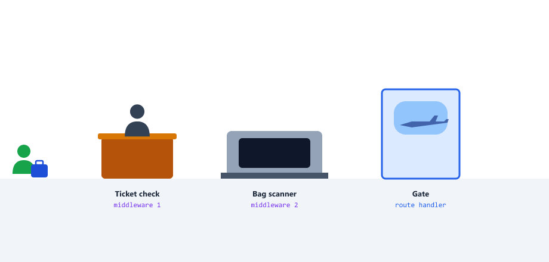

| Airport                         | Express                          |
| ------------------------------- | -------------------------------- |
| Passenger                       | The request                      |
| Ticket check, bag scanner       | Middleware functions             |
| "Go ahead to the next desk"     | `next()`                         |
| "You cannot pass"               | Middleware sends a response early (for example 401) |
| The gate                        | The route handler                |

Every middleware function has access to

| Parameter | Meaning                                        |
| --------- | ---------------------------------------------- |
| req       | Request object                                 |
| res       | Response object                                |
| next      | A function that passes control to the next step |

The next function tells Express to move to the next middleware

You have already used middleware: `app.use(express.json())` from Session 12 is middleware.

---

## How Middleware Works

The request moves through the middleware functions one by one, in the order you added them, like a box on a conveyor belt

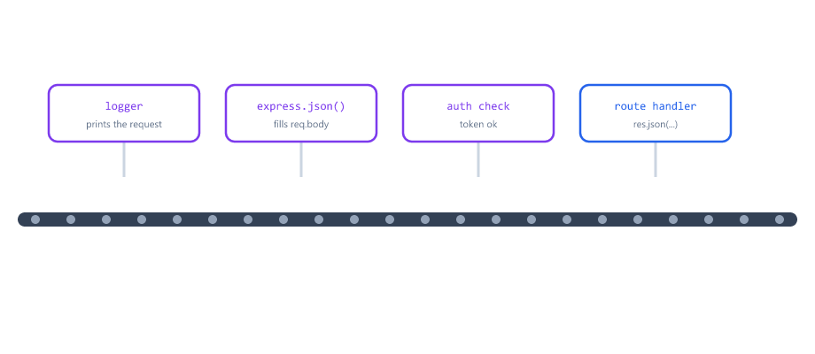

| Step | Who                | What happens                         |
| ---- | ------------------ | ------------------------------------ |
| 1    | Client             | Sends a request                      |
| 2    | Middleware 1       | Does something, then calls `next()`  |
| 3    | Middleware 2       | Does something, then calls `next()`  |
| 4    | Route handler      | Sends the response                   |
| 5    | Client             | Gets the response                    |

Middleware can

* Log requests
* Check authentication
* Parse data
* Handle errors
* Add data to the req object
* End the request early

---

## The Three Choices of a Middleware

Every middleware must do exactly one of these

| Choice                       | Code                                       | Result                                  |
| ---------------------------- | ------------------------------------------ | --------------------------------------- |
| Pass it on                   | `next()`                                   | The next middleware or route runs       |
| Answer now                   | `res.status(401).json({ ... })`            | The request ends here                   |
| Report an error              | `next(err)`                                | Jump to the error-handling middleware   |

If it does none of these, the request hangs. The browser keeps loading until it gives up.

---

## Creating Your First Middleware

A middleware function looks like this

```javascript
function myMiddleware(req, res, next) {
  console.log("Middleware running");
  next();
}
```

To use it, add it to your app

```javascript
const express = require("express");
const app = express();

// This middleware runs for every request
app.use(myMiddleware);

app.get("/", (req, res) => {
  res.send("Home Page");
});

app.listen(3000);
```

Every time someone visits any route

1. Middleware runs first
2. Then the route handler runs

You will see "Middleware running" in the terminal for every request

---

## Application Level Middleware

Application level middleware runs for every request

Use app.use()

```javascript
const express = require("express");
const app = express();

// This runs for every request
app.use((req, res, next) => {
  console.log(`Request made to ${req.url}`);
  next();
});

app.get("/", (req, res) => {
  res.send("Home");
});

app.get("/about", (req, res) => {
  res.send("About");
});

app.listen(3000);
```

When someone visits /about

```text
Request made to /about
```

is printed in the terminal, then "About" is sent to the browser

This is useful for logging

---

## Middleware for One Path

Give `app.use()` a path, and the middleware only runs for URLs that start with that path

```javascript
const express = require("express");
const app = express();

const logMiddleware = (req, res, next) => {
  console.log(`Logging ${req.method} request to ${req.originalUrl}`);
  next();
};

// This middleware only runs for URLs starting with /students
app.use("/students", logMiddleware);

app.get("/students", (req, res) => {
  res.json({ message: "Students list" });
});

app.get("/teachers", (req, res) => {
  // logMiddleware does NOT run for this route
  res.json({ message: "Teachers list" });
});

app.listen(3000);
```

Now logMiddleware runs for /students, /students/5 and any other URL starting with /students

`req.originalUrl` is the full URL. Inside `app.use("/students", ...)`, `req.url` has the `/students` part removed.

---

## Route Level Middleware

Route level middleware is added inside one route, between the path and the handler

```javascript
const checkAge = (req, res, next) => {
  console.log("Checking age");
  next();
};

app.get("/movies/adult", checkAge, (req, res) => {
  res.send("Adult movies");
});
```

`checkAge` runs only for `GET /movies/adult`. Other routes, and other methods on the same path, do not run it.

| Where you add it                 | Runs for                                   |
| -------------------------------- | ------------------------------------------ |
| `app.use(fn)`                    | Every request                              |
| `app.use("/students", fn)`       | Every URL starting with /students, any method |
| `app.get("/students", fn, handler)` | Only GET /students                      |

---

## Middleware Order Matters

Express runs middleware and routes from top to bottom. Something added later cannot help something that already ran.

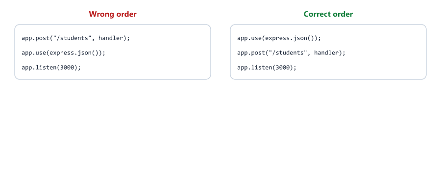

| Put it                         | Why                                                          |
| ------------------------------ | ------------------------------------------------------------ |
| Loggers first                  | So every request is logged, even ones that fail later        |
| `express.json()` before routes | Routes need `req.body` to be ready                           |
| Routes in the middle           |                                                              |
| 404 handler after routes       | It catches everything that reaches it (Session 12)           |
| Error handler last             | It catches errors from everything above it                   |

---

## Built-in Middleware

Express comes with some built-in middleware

### express.json()

Parses JSON data from request body

```javascript
app.use(express.json());

app.post("/user", (req, res) => {
  console.log(req.body.name);
  res.send("User received");
});
```

Without this, req.body would be undefined

### express.urlencoded()

Parses form data from HTML forms

```javascript
app.use(express.urlencoded({ extended: true }));

app.post("/form", (req, res) => {
  console.log(req.body);
  res.send("Form data received");
});
```

An HTML form like this

```html
<form action="/form" method="POST">
  <input name="name" value="Sarah">
  <input name="course" value="Biology">
  <button>Send</button>
</form>
```

sends `name=Sarah&course=Biology`, and `req.body` becomes

```text
{ name: 'Sarah', course: 'Biology' }
```

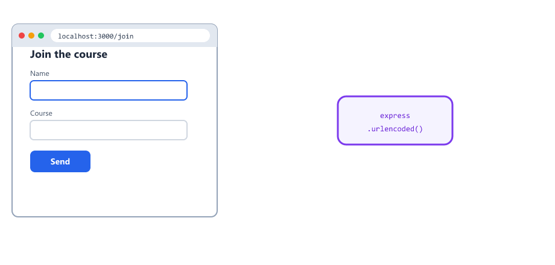

| Middleware               | Reads requests with this Content-Type   | Sent by          |
| ------------------------ | --------------------------------------- | ---------------- |
| `express.json()`         | `application/json`                      | APIs, apps, fetch |
| `express.urlencoded()`   | `application/x-www-form-urlencoded`     | HTML forms       |

### express.static()

Serves static files like HTML, CSS, images

```javascript
const path = require("path");

app.use(express.static(path.join(__dirname, "public")));

// Now any file in public folder can be accessed
// http://localhost:3000/style.css
// http://localhost:3000/logo.png
```

Create a public folder with your files

```text
project/
├── public/
│   ├── index.html
│   ├── style.css
│   └── logo.png
└── server.js
```

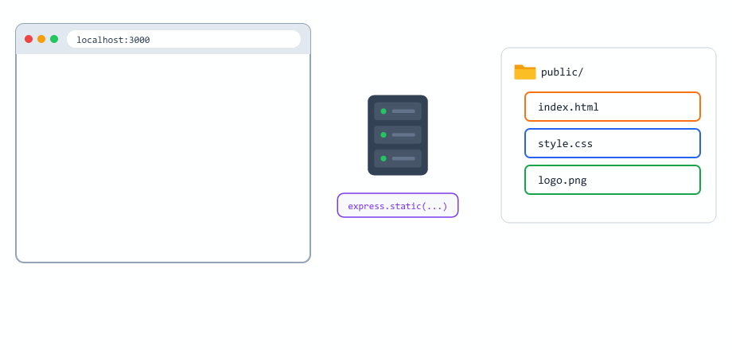

| Visit                                | File sent                  |
| ------------------------------------ | -------------------------- |
| `http://localhost:3000/`             | public/index.html          |
| `http://localhost:3000/style.css`    | public/style.css           |
| `http://localhost:3000/logo.png`     | public/logo.png            |

Notice the URL does not include `public`.

We use `path.join(__dirname, "public")` instead of just `"public"`, so it works no matter where you run node from (Session 06).

You can also give it a URL prefix: `app.use("/uploads", express.static(path.join(__dirname, "uploads")))`. You will use this in the File Uploads session.

---

## Third Party Middleware

You can install middleware from npm

Popular third party middleware

| Package              | What it does                                         | Used in session |
| -------------------- | ---------------------------------------------------- | --------------- |
| morgan               | Logs every request                                   | 26, 29, 30      |
| cors                 | Lets web pages from other addresses call your API    | 29, 30          |
| helmet               | Adds security headers to every response              | 29, 30          |
| express-rate-limit   | Limits how many requests one user can send           | 29, 30          |

Install them all at once (Session 02)

```bash
npm install morgan cors helmet express-rate-limit
```

### morgan

```javascript
const express = require("express");
const morgan = require("morgan");
const app = express();

app.use(morgan("tiny"));

app.get("/", (req, res) => {
  res.send("Home Page");
});

app.listen(3000);
```

Now every request is automatically logged

Output example

```text
GET / 200 9 - 2.646 ms
GET /about 200 5 - 1.069 ms
POST /users 201 48 - 5.872 ms
```

| Part      | Meaning                       |
| --------- | ----------------------------- |
| GET       | Method                        |
| /about    | URL                           |
| 200       | Status code                   |
| 5         | Size of the response in bytes |
| 1.069 ms  | How long the server took      |

You will learn more about morgan in the Logging session.

### cors

A web page on one address (for example a React app on `http://localhost:5173`) is not allowed to read data from a different address (your API on `http://localhost:3000`) unless the API says it is OK. The browser enforces this rule, called CORS (Cross-Origin Resource Sharing).

```javascript
const cors = require("cors");

app.use(cors());
```

`cors()` adds the header `Access-Control-Allow-Origin: *` to every response, which tells browsers "any website may use this API".

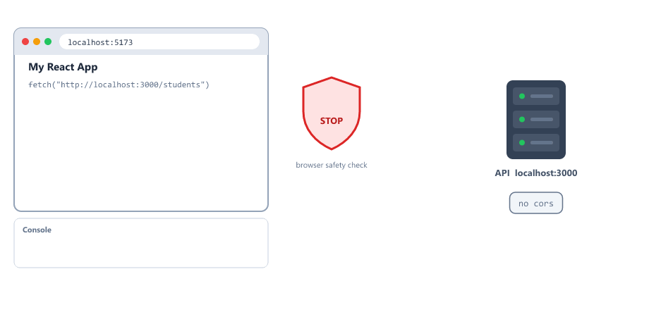

Testing with Postman, curl or fetch from Node.js is never blocked. CORS only matters for web pages running in a browser.

### helmet

```javascript
const helmet = require("helmet");

app.use(helmet());
```

helmet adds headers that protect browsers from common attacks, and removes the `X-Powered-By: Express` header (no need to tell attackers what you use)

| Header added by helmet          | Protects against                          |
| ------------------------------- | ----------------------------------------- |
| `Content-Security-Policy`       | Loading scripts from places you did not allow |
| `X-Frame-Options: SAMEORIGIN`   | Your page being hidden inside another site |
| `X-Content-Type-Options: nosniff` | The browser guessing file types         |
| `Strict-Transport-Security`     | Using http instead of https               |

### express-rate-limit

```javascript
const rateLimit = require("express-rate-limit");

const limiter = rateLimit({
  windowMs: 60 * 1000,
  limit: 3,
  message: { message: "Too many requests, try again later" }
});

app.use("/api", limiter);
```

| Option      | Meaning                                      |
| ----------- | -------------------------------------------- |
| windowMs    | The time window, in milliseconds (60 * 1000 = 1 minute) |
| limit       | Requests allowed per user in that window     |
| message     | What to send after the limit                 |

After 3 requests in one minute, the same user gets `429 Too Many Requests` and a `Retry-After: 60` header.

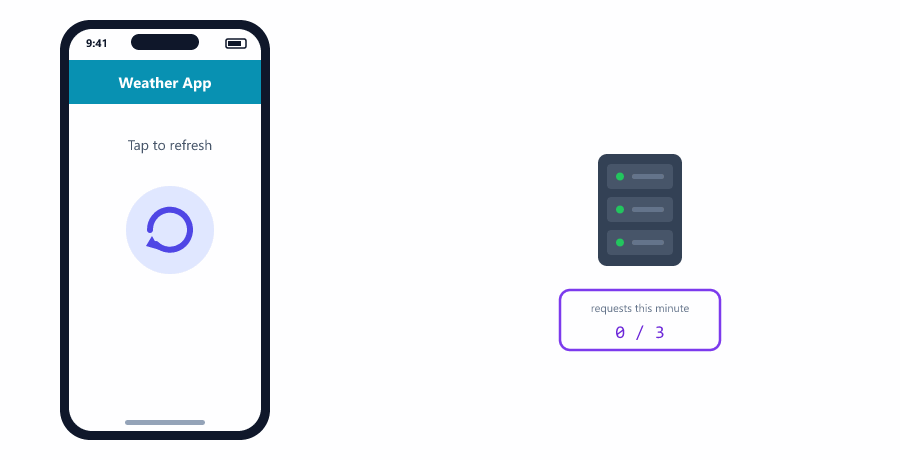

Older tutorials use `max` instead of `limit`. Both work, `limit` is the current name.

---

## Logger Middleware Example

Create your own logger middleware

```javascript
const express = require("express");
const app = express();

const logger = (req, res, next) => {
  const timestamp = new Date().toISOString();
  console.log(`[${timestamp}] ${req.method} ${req.url}`);
  next();
};

app.use(logger);

app.get("/", (req, res) => {
  res.send("Home Page");
});

app.get("/students", (req, res) => {
  res.json({ message: "Students" });
});

app.listen(3000);
```

Terminal output when someone visits /students

```text
[2026-10-04T10:30:00.000Z] GET /students
```

This helps you track what users are doing

---

## Measuring Response Time

The logger above runs before the route, so it cannot know the status code or how long the request took.

`res` is an EventEmitter (Session 08). It emits `"finish"` when the response has been sent.

```javascript
const timer = (req, res, next) => {
  const start = Date.now();

  res.on("finish", () => {
    const ms = Date.now() - start;
    console.log(`${req.method} ${req.originalUrl} ${res.statusCode} ${ms}ms`);
  });

  next();
};

app.use(timer);
```

Output

```text
GET /students 200 3ms
POST /students 201 5ms
GET /nothing 404 1ms
```

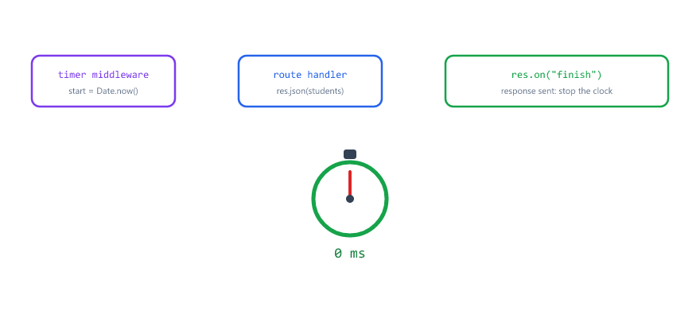

This is how morgan works inside.

---

## Adding Data to req

Middleware can attach information to `req`. Every middleware and route after it can read it.

```javascript
const addRequestTime = (req, res, next) => {
  req.requestTime = new Date().toISOString();
  next();
};

const addUser = (req, res, next) => {
  req.user = { name: "John", role: "admin" };
  next();
};

app.get("/profile", addRequestTime, addUser, (req, res) => {
  res.json({ user: req.user, time: req.requestTime });
});
```

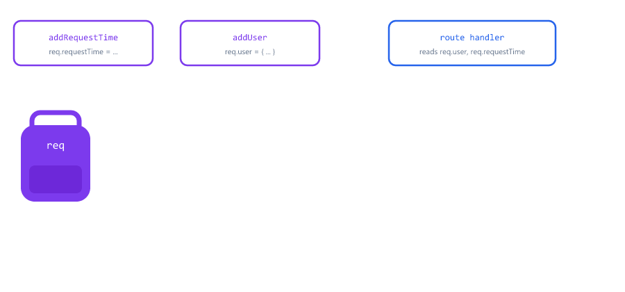

Think of `req` as a backpack the request carries through every station. In Session 22, an authentication middleware will put the logged-in user into `req.user` exactly like this.

---

## Authentication Middleware Example

Create middleware to check if user is logged in

```javascript
const express = require("express");
const app = express();

// Fake authentication middleware
const isAuthenticated = (req, res, next) => {
  const token = req.headers.authorization;

  if (token !== "my-secret-token") {
    return res.status(401).json({ message: "Not authorized" });
  }

  next(); // User is authenticated, continue
};

// Public route - no authentication needed
app.get("/", (req, res) => {
  res.send("Welcome to our website");
});

// Protected route - needs authentication
app.get("/dashboard", isAuthenticated, (req, res) => {
  res.json({ message: "Welcome to your dashboard" });
});

// Admin route - needs authentication
app.get("/admin", isAuthenticated, (req, res) => {
  res.json({ message: "Admin panel" });
});

app.listen(3000);
```

Now to access /dashboard or /admin

You must send a request with header

```text
Authorization: my-secret-token
```

Otherwise you get "Not authorized"

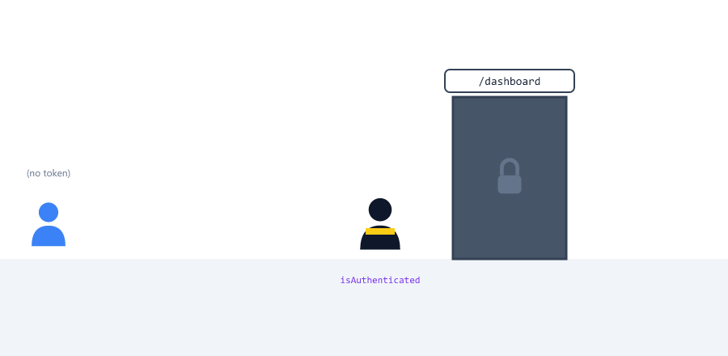

Test it with fetch (Session 11)

```javascript
const res = await fetch("http://localhost:3000/dashboard", {
  headers: { Authorization: "my-secret-token" }
});
console.log(res.status, await res.json());
```

This is a fake token for learning. Real apps use JWT tokens, usually sent as `Authorization: Bearer <token>` (Session 22).

---

## Middleware Factories

Sometimes you want the same check with a different setting, for example "only admins" and "only teachers".

A middleware factory is a function that returns a middleware

```javascript
const requireRole = (role) => {
  return (req, res, next) => {
    if (req.user.role !== role) {
      return res.status(403).json({ message: "Forbidden" });
    }
    next();
  };
};

app.get("/admin", addUser, requireRole("admin"), (req, res) => {
  res.send("Admin area");
});

app.get("/grades", addUser, requireRole("teacher"), (req, res) => {
  res.send("Grades");
});
```

| Status | Meaning                                                   |
| ------ | --------------------------------------------------------- |
| 401    | Unauthorized: we do not know who you are (no or bad token) |
| 403    | Forbidden: we know who you are, but you are not allowed   |

`requireRole("admin")` runs once, when the server starts, and returns the real middleware. You will see this pattern as `authorize("admin")` in Session 22.

---

## Multiple Middleware Functions

You can add multiple middleware for one route

They run in order

```javascript
const express = require("express");
const app = express();

const middleware1 = (req, res, next) => {
  console.log("Middleware 1 running");
  next();
};

const middleware2 = (req, res, next) => {
  console.log("Middleware 2 running");
  next();
};

const middleware3 = (req, res, next) => {
  console.log("Middleware 3 running");
  next();
};

// All three middleware run before the route handler
app.get("/protected", middleware1, middleware2, middleware3, (req, res) => {
  res.send("All middleware ran");
});

app.listen(3000);
```

When someone visits /protected, the console shows

```text
Middleware 1 running
Middleware 2 running
Middleware 3 running
```

Then "All middleware ran" is sent

---

## Global vs Specific Middleware

Global middleware runs for every route

```javascript
app.use((req, res, next) => {
  console.log("This runs for every route");
  next();
});
```

Specific middleware runs only for certain routes

```javascript
// Only runs for /students routes
app.use("/students", (req, res, next) => {
  console.log("Only for students");
  next();
});

// Only runs for this specific route
app.get("/admin", (req, res, next) => {
  console.log("Only for admin");
  next();
}, (req, res) => {
  res.send("Admin page");
});
```

Protecting a whole route file

```javascript
const adminRoutes = require("./routes/admin");

app.use("/admin", isAuthenticated, adminRoutes);
```

Every route inside routes/admin.js is now protected. Inside a router file you can also write `router.use(isAuthenticated)`.

---

## Error-Handling Middleware

An error handler is a middleware with four parameters. The first one is the error.

```javascript
app.get("/boom", (req, res) => {
  throw new Error("Something broke");
});

app.get("/async-boom", async (req, res) => {
  throw new Error("Async broke");
});

app.get("/next-error", (req, res, next) => {
  next(new Error("Passed to next"));
});

// Error handler: four parameters, added last
app.use((err, req, res, next) => {
  console.log("Error:", err.message);
  res.status(500).json({ message: "Something went wrong" });
});
```

All three routes answer with the same clean JSON

```json
{"message":"Something went wrong"}
```

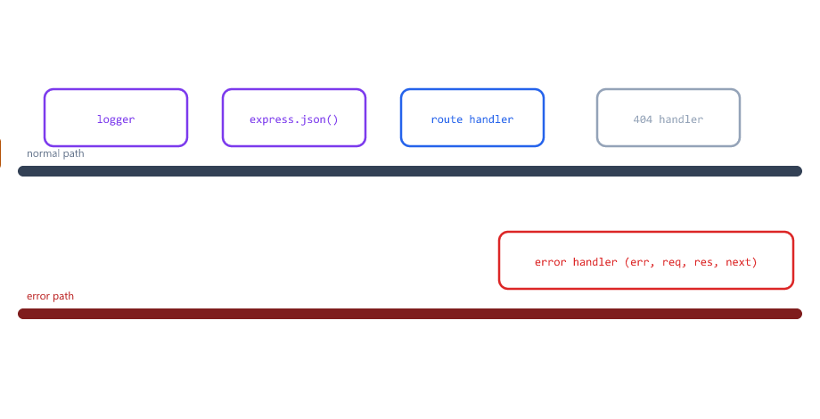

| How the error happens         | Reaches the error handler?            |
| ----------------------------- | ------------------------------------- |
| `throw` in a route            | Yes                                   |
| `throw` in an `async` route   | Yes (Express 5)                       |
| `next(err)`                   | Yes                                   |

Express knows it is an error handler only because it has exactly four parameters. Even if you do not use `next`, you must write it. You will build complete error handling in Session 24.

---

## Complete Example with Multiple Middleware

```javascript
const express = require("express");
const app = express();

// Global middleware - runs for every request
app.use((req, res, next) => {
  console.log(`[1] Global middleware`);
  next();
});

// Another global middleware
app.use((req, res, next) => {
  console.log(`[2] Logger: ${req.method} ${req.url}`);
  next();
});

// Built-in middleware
app.use(express.json());

// Route specific middleware
const checkApiKey = (req, res, next) => {
  const apiKey = req.headers["x-api-key"];

  if (apiKey !== "12345") {
    return res.status(401).json({ message: "Invalid API key" });
  }

  console.log(`[3] API key valid`);
  next();
};

// Public route - no API key needed
app.get("/", (req, res) => {
  res.send("Home Page");
});

// Protected route - needs API key
app.get("/data", checkApiKey, (req, res) => {
  res.json({ message: "Secret data" });
});

// Route with multiple middleware
const logTime = (req, res, next) => {
  req.requestTime = new Date().toISOString();
  next();
};

const logUser = (req, res, next) => {
  console.log(`User requested at ${req.requestTime}`);
  next();
};

app.get("/profile", logTime, logUser, (req, res) => {
  res.json({ message: "Profile page", time: req.requestTime });
});

// 404 for unknown routes
app.use((req, res) => {
  res.status(404).json({ message: "Route not found" });
});

// Error handler - always last
app.use((err, req, res, next) => {
  console.log("Error:", err.message);
  res.status(500).json({ message: "Something went wrong" });
});

app.listen(3000, (err) => {
  if (err) {
    console.log("Could not start server:", err.message);
    return;
  }

  console.log("Server running on port 3000");
});
```

---

## Middleware Flow Summary

| Order | Runs                                   | Example                         |
| ----- | -------------------------------------- | ------------------------------- |
| 1     | Global middleware                      | Logger, helmet, cors            |
| 2     | Body parsers                           | `express.json()`                |
| 3     | Path middleware                        | `app.use("/admin", isAuthenticated)` |
| 4     | Route level middleware                 | `checkApiKey`                   |
| 5     | Route handler                          | Sends the response              |
| 6     | 404 handler (if no route matched)      | `app.use((req, res) => ...)`    |
| 7     | Error handler (if something failed)    | `app.use((err, req, res, next) => ...)` |

---

## Beginner Mistakes

### Mistake 1

Forgetting `next()`.

```javascript
app.use((req, res, next) => {
  console.log("Request received");
});
```

The request never reaches a route. The browser keeps loading.

Correct:

Call `next()` at the end.

---

### Mistake 2

Calling `next()` and also sending a response.

```javascript
app.get("/page", (req, res, next) => {
  next();
  res.send("Page");
}, (req, res) => {
  res.send("Second");
});
```

```text
Error [ERR_HTTP_HEADERS_SENT]: Cannot set headers after they are sent to the client
```

The next function already sent "Second". Then `res.send("Page")` tries to send again.

Correct:

Either call `next()` or send a response, never both.

---

### Mistake 3

Forgetting `return` after an early response.

```javascript
const isAuthenticated = (req, res, next) => {
  if (req.headers.authorization !== "my-secret-token") {
    res.status(401).json({ message: "Not authorized" });
  }
  next();
};
```

Without `return`, `next()` still runs, so the protected route runs too, and the server tries to answer twice.

Correct:

```javascript
return res.status(401).json({ message: "Not authorized" });
```

---

### Mistake 4

Adding `express.json()` after the routes.

`req.body` is `undefined` in every route above it. Put body parsers at the top.

---

### Mistake 5

Writing an error handler with three parameters.

```javascript
app.use((err, req, res) => {
  res.status(500).json({ message: "Something went wrong" });
});
```

Express does not see it as an error handler. Your JSON is never sent, and Express shows its own HTML error page instead.

Correct:

```javascript
app.use((err, req, res, next) => { ... });
```

---

### Mistake 6

Using a relative folder for express.static.

```javascript
app.use(express.static("public"));
```

It only works when you run node from the project folder.

Correct:

```javascript
app.use(express.static(path.join(__dirname, "public")));
```

---

## Practice Exercises

### Exercise 1

Create a middleware that logs

* Request method
* Request URL
* Timestamp

Use this middleware for all routes

### Exercise 2

Create an authentication middleware

It should check for a header called "auth-token"

If token is "secret123", allow access

If not, return 401 with message "Invalid token"

### Exercise 3

Create a middleware that adds a property to req object

```javascript
req.user = { name: "John", role: "admin" };
```

Then access this in the route handler

### Exercise 4

Use express-rate-limit to allow only 3 requests per minute to `/api`

After 3 requests, the user should get 429 with message "Too many requests"

### Exercise 5

Use morgan middleware for logging

Install morgan and add it to your app

Compare your custom logger with morgan

### Exercise 6

Write a timer middleware with `res.on("finish")` that prints the status code and how long each request took

### Exercise 7

Create a `requireRole(role)` middleware factory. Protect `/admin` for "admin" and `/grades` for "teacher"

### Exercise 8

Serve a `public` folder with an index.html, a style.css and an image using express.static. Open all three in the browser

### Exercise 9

Add an error handler. Create a route that throws an error and check that you get your JSON message, not an HTML page

---

## Interview Questions

### What is middleware in Express

Middleware is a function that runs between the request and response

### What parameters does a middleware function receive

req, res, and next

### What does the next() function do

It tells Express to move to the next middleware or route handler

### What happens if you don't call next() in middleware

If the middleware also does not send a response, the request hangs and never completes

### What is the difference between app.use() and app.get()

app.use() runs middleware for all HTTP methods, for every path that starts with the given path

app.get() runs only for GET requests on that exact path

### What are some built-in middleware in Express

express.json()

express.urlencoded()

express.static()

### What is third party middleware

Middleware created by other developers that you install via npm

Examples: morgan, cors, helmet, express-rate-limit

### What is CORS

A browser rule that stops a web page from reading data from a different address unless the server allows it. The cors middleware adds the headers that allow it

### What is the difference between 401 and 403

401 means the user is not identified (no or invalid token). 403 means the user is identified but not allowed to do this

### How is an error-handling middleware different from normal middleware

It has four parameters (err, req, res, next) and is added after all routes. Express calls it when a route throws an error or calls next(err)

### What is a middleware factory

A function that takes settings and returns a middleware, like requireRole("admin")

### Why does middleware order matter

Express runs middleware from top to bottom. Body parsers must come before routes, and the 404 and error handlers must come last

---
