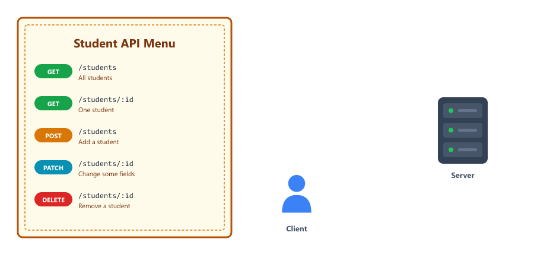
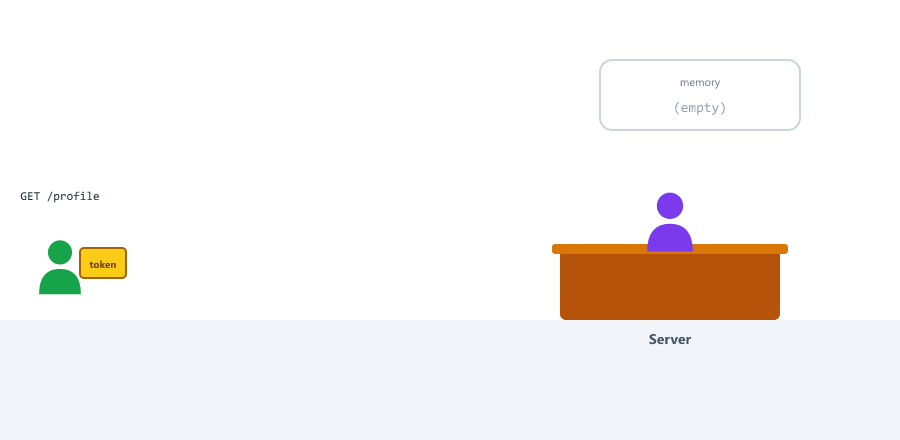
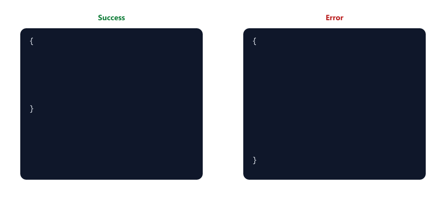
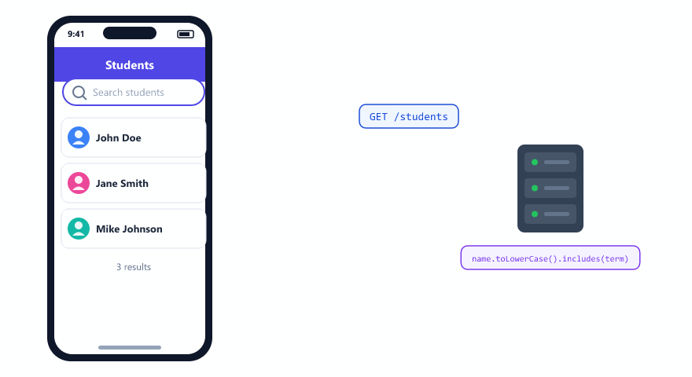
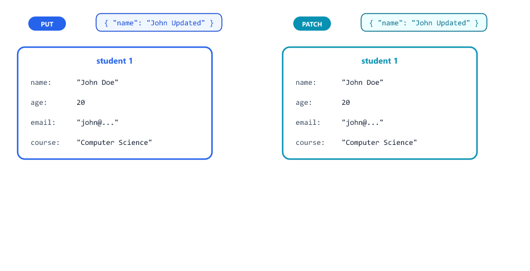
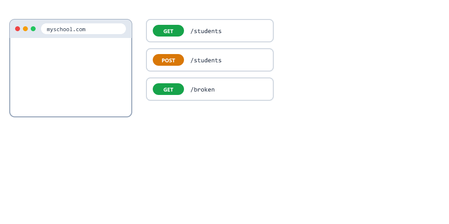

## Table of Contents

* [What is a REST API](#what-is-a-rest-api)
* [REST API Rules](#rest-api-rules)
* [Collections and Items](#collections-and-items)
* [REST is Stateless](#rest-is-stateless)
* [Setting Up the Project](#setting-up-the-project)
* [A Consistent Response Format](#a-consistent-response-format)
* [GET All Students](#get-all-students)
* [Searching with a Query](#searching-with-a-query)
* [GET Single Student](#get-single-student)
* [POST Create Student](#post-create-student)
* [Adding Validation](#adding-validation)
* [Duplicate Data and 409 Conflict](#duplicate-data-and-409-conflict)
* [PUT Replace Student](#put-replace-student)
* [PATCH Update Some Fields](#patch-update-some-fields)
* [DELETE Remove Student](#delete-remove-student)
* [Proper Status Codes](#proper-status-codes)
* [Error Handling](#error-handling)
* [Complete Code with Error Handling](#complete-code-with-error-handling)
* [Testing the API](#testing-the-api)
* [Beginner Mistakes](#beginner-mistakes)
* [Practice Exercises](#practice-exercises)
* [Interview Questions](#interview-questions)

---

## What is a REST API

REST API is a way to build web services

REST stands for Representational State Transfer

It is not a tool or library

It is a set of rules that most backend applications follow

Think of REST API like a restaurant menu



| Restaurant                         | REST API                                 |
| ---------------------------------- | ---------------------------------------- |
| The menu lists every dish          | The API lists every endpoint             |
| You order "one pizza"              | You send `GET /students/1`               |
| The waiter brings exactly that     | The server sends exactly that data       |
| Every restaurant menu looks similar | Every REST API follows the same rules   |

A good REST API is predictable

If you know how one REST API works, you know how most work

---

## REST API Rules

Rule 1 - Use proper HTTP methods

| Method | Meaning                      |
| ------ | ---------------------------- |
| GET    | Get data                     |
| POST   | Create new data              |
| PUT    | Replace existing data        |
| PATCH  | Change some fields           |
| DELETE | Remove data                  |

Rule 2 - Use proper status codes

| Code | Meaning      |
| ---- | ------------ |
| 200  | Success      |
| 201  | Created      |
| 400  | Bad request  |
| 404  | Not found    |
| 409  | Conflict     |
| 500  | Server error |

Rule 3 - Use nouns for endpoints, not verbs

| Good        | Bad              |
| ----------- | ---------------- |
| /students   | /getAllStudents  |
| /products   | /fetchProducts   |

The HTTP method is already the verb.

Rule 4 - Use plural names

| Good        | Bad        |
| ----------- | ---------- |
| /students   | /student   |
| /products   | /product   |

Rule 5 - Use nested resources for related data

```text
/students/5/courses
/students/5/courses/2
```


---

## Collections and Items

Every REST URL points to either a collection (a list) or an item (one thing in that list).

| URL              | Type        | GET            | POST        | PUT / PATCH   | DELETE      |
| ---------------- | ----------- | -------------- | ----------- | ------------- | ----------- |
| /students        | Collection  | All students   | Add one     | Not used      | Not used    |
| /students/5      | Item        | Student 5      | Not used    | Change student 5 | Remove student 5 |
| /students/5/courses | Collection inside an item | Courses of student 5 | Add a course to student 5 | | |


Once you know this table, you can guess the endpoints of almost any REST API.

---

## REST is Stateless

Stateless means the server does not remember anything about you between requests. Every request must carry everything the server needs.



| Not stateless                                | Stateless (REST)                                    |
| -------------------------------------------- | --------------------------------------------------- |
| "Remember I logged in? Now give me my profile" | "Here is my token. Give me my profile"            |

This is why, in Session 22, every request to a protected route sends a token in the Authorization header.

Because no request depends on an earlier one, you can run many copies of the same server and any copy can answer any request.

---

## Setting Up the Project

Create a new project

```bash
mkdir rest-api-express
cd rest-api-express
npm init -y
npm install express
```

Create a file named server.js

Our data will be stored in an array

```javascript
const express = require("express");
const app = express();

app.use(express.json());

let students = [
  {
    id: 1,
    name: "John Doe",
    age: 20,
    course: "Computer Science",
    email: "john@example.com"
  },
  {
    id: 2,
    name: "Jane Smith",
    age: 22,
    course: "Mathematics",
    email: "jane@example.com"
  },
  {
    id: 3,
    name: "Mike Johnson",
    age: 21,
    course: "Physics",
    email: "mike@example.com"
  }
];

let nextId = 4;

app.listen(3000, (err) => {
  if (err) {
    console.log("Could not start server:", err.message);
    return;
  }

  console.log("REST API running on port 3000");
});
```

`nextId` gives every new student a unique id, even after deletes (Session 11).

---

## A Consistent Response Format

In this lesson, every response has the same shape

| Field     | When                      | Meaning                               |
| --------- | ------------------------- | ------------------------------------- |
| success   | Always                    | `true` if it worked, `false` if not   |
| data      | On success                | The student, or the list of students  |
| count     | For lists                 | How many items are in `data`          |
| message   | On errors, and on delete  | A short explanation for humans        |
| errors    | When validation fails     | A list of every problem               |



The frontend can then always check `success` first, and always find the data in `data`.

---

## GET All Students

This endpoint returns all students

```javascript
app.get("/students", (req, res) => {
  res.status(200).json({
    success: true,
    count: students.length,
    data: students
  });
});
```

Response when you visit /students

```json
{
  "success": true,
  "count": 3,
  "data": [
    {
      "id": 1,
      "name": "John Doe",
      "age": 20,
      "course": "Computer Science",
      "email": "john@example.com"
    }
  ]
}
```

(Only the first student is shown here to keep it short. The real response has all 3.)

| Field   | Meaning                              |
| ------- | ------------------------------------ |
| success | Tells client if request worked       |
| count   | Tells client how many items returned |
| data    | The actual data                      |

This is a common pattern in REST APIs

---

## Searching with a Query

A search box in an app usually sends the text as a query parameter (Session 13)

```javascript
app.get("/students", (req, res) => {
  let result = students;

  if (req.query.search) {
    const term = req.query.search.toLowerCase();
    result = result.filter((s) => s.name.toLowerCase().includes(term));
  }

  res.status(200).json({
    success: true,
    count: result.length,
    data: result
  });
});
```

| Request                       | Result                            |
| ----------------------------- | --------------------------------- |
| `/students?search=jo`         | John Doe and Mike Johnson         |
| `/students?search=SMITH`      | Jane Smith                        |
| `/students?search=zzz`        | `count: 0`, `data: []`            |



`includes()` checks if one string is inside another. Using `toLowerCase()` on both sides makes the search ignore capital letters.

---

## GET Single Student

This endpoint returns one student by id

```javascript
app.get("/students/:id", (req, res) => {
  const id = Number(req.params.id);
  const student = students.find((s) => s.id === id);

  if (!student) {
    return res.status(404).json({
      success: false,
      message: `Student with id ${req.params.id} not found`
    });
  }

  res.status(200).json({
    success: true,
    data: student
  });
});
```

When student exists, visit /students/1

```json
{
  "success": true,
  "data": {
    "id": 1,
    "name": "John Doe",
    "age": 20,
    "course": "Computer Science",
    "email": "john@example.com"
  }
}
```

When student does not exist, visit /students/999

```json
{
  "success": false,
  "message": "Student with id 999 not found"
}
```

---

## POST Create Student

This endpoint creates a new student

```javascript
app.post("/students", (req, res) => {
  const { name, age, course, email } = req.body || {};

  const newStudent = {
    id: nextId++,
    name,
    age,
    course: course || "Not specified",
    email
  };

  students.push(newStudent);

  res.status(201).json({
    success: true,
    data: newStudent
  });
});
```

Send a POST request to /students with this body

```json
{
  "name": "Sarah Wilson",
  "age": 23,
  "course": "Biology",
  "email": "sarah@example.com"
}
```

Response

```json
{
  "success": true,
  "data": {
    "id": 4,
    "name": "Sarah Wilson",
    "age": 23,
    "course": "Biology",
    "email": "sarah@example.com"
  }
}
```

Notice we use status 201 for created

This version saves anything the client sends, even an empty name. The next section fixes that.

---

## Adding Validation

We should validate data before saving

Never trust data from the client. A user can type anything, and a bug in an app can send anything.

Here is what goes wrong without validation

| Request body                                 | Without validation            |
| -------------------------------------------- | ----------------------------- |
| `{ "age": 20 }`                              | Saved with no name            |
| `{ "name": "   ", ... }`                     | Saved with a blank name       |
| `{ "name": "X", "age": "abc", ... }`         | Saved with age "abc"          |

`"abc" < 18` and `"abc" > 60` are both `false` in JavaScript, so a simple range check does not catch it. We must check the type too.

Write the rules once, in a function

```javascript
function validateStudent(student) {
  const errors = [];

  if (typeof student.name !== "string" || student.name.trim() === "") {
    errors.push("Name is required");
  }

  if (typeof student.age !== "number" || student.age < 18 || student.age > 60) {
    errors.push("Age must be a number between 18 and 60");
  }

  if (typeof student.email !== "string" || !student.email.includes("@")) {
    errors.push("A valid email is required");
  }

  return errors;
}
```

| Code                         | Meaning                                              |
| ---------------------------- | ---------------------------------------------------- |
| `typeof x !== "string"`      | x is missing or not text                             |
| `name.trim() === ""`         | Only spaces. `trim()` removes spaces at both ends    |
| `typeof x !== "number"`      | x is missing, or text like "23" or "abc"             |
| `email.includes("@")`        | A very simple email check                            |
| `return errors`              | An empty array means everything is valid             |

Use it in POST

```javascript
app.post("/students", (req, res) => {
  const { name, age, course, email } = req.body || {};

  const newStudent = {
    id: nextId,
    name,
    age,
    course: course || "Not specified",
    email
  };

  const errors = validateStudent(newStudent);

  if (errors.length > 0) {
    return res.status(400).json({
      success: false,
      message: "Validation failed",
      errors
    });
  }

  nextId++;
  students.push(newStudent);

  res.status(201).json({
    success: true,
    data: newStudent
  });
});
```

Now if someone sends `{ "age": "abc" }`

```json
{
  "success": false,
  "message": "Validation failed",
  "errors": [
    "Name is required",
    "Age must be a number between 18 and 60",
    "A valid email is required"
  ]
}
```


Returning all errors at once lets the app show every problem together, instead of one at a time.

`nextId++` only runs after validation passes, so failed requests do not use up ids.

---

## Duplicate Data and 409 Conflict

Two students should not share an email. That is not "bad data" (400), the data is fine. It conflicts with data that already exists, so we use `409 Conflict`.

```javascript
const emailTaken = students.some((s) => s.email === newStudent.email);

if (emailTaken) {
  return res.status(409).json({
    success: false,
    message: "Email already exists"
  });
}
```

`some()` returns `true` if at least one item matches.


| Problem                        | Status |
| ------------------------------ | ------ |
| Missing or wrong fields        | 400    |
| Valid data, but already exists | 409    |

---

## PUT Replace Student

PUT replaces the whole student. The client must send every field, just like when creating.

```javascript
app.put("/students/:id", (req, res) => {
  const id = Number(req.params.id);
  const index = students.findIndex((s) => s.id === id);

  if (index === -1) {
    return res.status(404).json({
      success: false,
      message: `Student with id ${req.params.id} not found`
    });
  }

  const { name, age, course, email } = req.body || {};
  const replaced = { id, name, age, course: course || "Not specified", email };

  const errors = validateStudent(replaced);

  if (errors.length > 0) {
    return res.status(400).json({ success: false, message: "Validation failed", errors });
  }

  if (students.some((s) => s.email === email && s.id !== id)) {
    return res.status(409).json({ success: false, message: "Email already exists" });
  }

  students[index] = replaced;

  res.status(200).json({
    success: true,
    data: students[index]
  });
});
```

`s.id !== id` lets a student keep their own email. Only another student's email is a conflict.

If you send only `{ "name": "John Updated" }` to PUT, you get 400, because age and email are missing. That is correct for PUT. To change one field, use PATCH.

---

## PATCH Update Some Fields

PATCH changes only the fields you send. Everything else stays the same.

```javascript
app.patch("/students/:id", (req, res) => {
  const id = Number(req.params.id);
  const index = students.findIndex((s) => s.id === id);

  if (index === -1) {
    return res.status(404).json({
      success: false,
      message: `Student with id ${req.params.id} not found`
    });
  }

  const body = req.body || {};
  const updated = { ...students[index] };

  for (const key of ["name", "age", "course", "email"]) {
    if (body[key] !== undefined) {
      updated[key] = body[key];
    }
  }

  const errors = validateStudent(updated);

  if (errors.length > 0) {
    return res.status(400).json({ success: false, message: "Validation failed", errors });
  }

  if (students.some((s) => s.email === updated.email && s.id !== id)) {
    return res.status(409).json({ success: false, message: "Email already exists" });
  }

  students[index] = updated;

  res.status(200).json({
    success: true,
    data: updated
  });
});
```

Send a PATCH request to /students/1 with this body

```json
{
  "name": "John Updated",
  "age": 21
}
```

Response

```json
{
  "success": true,
  "data": {
    "id": 1,
    "name": "John Updated",
    "age": 21,
    "course": "Computer Science",
    "email": "john@example.com"
  }
}
```



| Code                                    | Meaning                                                      |
| --------------------------------------- | ------------------------------------------------------------ |
| `{ ...students[index] }`                | Start from a copy of the current student                     |
| `for (const key of [...])`              | Go through the fields that are allowed to change             |
| `body[key] !== undefined`               | Only use fields the client actually sent                     |
| `validateStudent(updated)`              | Check the final student, so PATCH cannot save bad data either |

The list `["name", "age", "course", "email"]` means the client can never change `id`, or add fields we do not want.

| Method | Body needs           | Missing fields          |
| ------ | -------------------- | ----------------------- |
| PUT    | Every field          | Validation fails (400)  |
| PATCH  | Only what changes    | Stay as they were       |

---

## DELETE Remove Student

This endpoint removes a student

```javascript
app.delete("/students/:id", (req, res) => {
  const id = Number(req.params.id);

  const index = students.findIndex((s) => s.id === id);

  if (index === -1) {
    return res.status(404).json({
      success: false,
      message: `Student with id ${req.params.id} not found`
    });
  }

  students.splice(index, 1);

  res.status(200).json({
    success: true,
    message: `Student with id ${id} deleted successfully`
  });
});
```

Send a DELETE request to /students/1

Response

```json
{
  "success": true,
  "message": "Student with id 1 deleted successfully"
}
```

Some APIs answer a delete with `res.sendStatus(204)`: status 204 No Content and an empty body. Both are correct REST.

---

## Proper Status Codes

Always use the correct status code

| Status Code | Meaning | When to use |
| ----------- | ------- | ----------- |
| 200 | OK | GET, PUT, PATCH, DELETE successful |
| 201 | Created | POST successful |
| 204 | No Content | Successful, nothing to send back |
| 400 | Bad Request | Validation failed, missing fields |
| 401 | Unauthorized | Not logged in |
| 403 | Forbidden | Logged in but no permission |
| 404 | Not Found | Resource does not exist |
| 409 | Conflict | Duplicate data, like an email that already exists |
| 500 | Server Error | Something broke on server |

Example usage

```javascript
// Success
res.status(200).json({ success: true });

// Created
res.status(201).json({ success: true });

// Bad request
res.status(400).json({ success: false, message: "Invalid data" });

// Not found
res.status(404).json({ success: false, message: "Not found" });

// Conflict
res.status(409).json({ success: false, message: "Already exists" });

// Server error
res.status(500).json({ success: false, message: "Server error" });
```

---

## Error Handling

Sometimes things go wrong

We should handle errors properly

Create a global error handler (Session 14). Add it after all routes.

```javascript
// This catches all errors
app.use((err, req, res, next) => {
  // express.json() could not read the body
  if (err.type === "entity.parse.failed") {
    return res.status(400).json({
      success: false,
      message: "Request body is not valid JSON"
    });
  }

  console.error(err.stack);

  res.status(500).json({
    success: false,
    message: "Something went wrong on the server"
  });
});
```

In Express 5 you do not need try / catch just to reach the error handler. Errors in normal and `async` routes go there automatically

```javascript
app.get("/broken", async (req, res) => {
  throw new Error("Database is down");
});
```

Response

```json
{
  "success": false,
  "message": "Something went wrong on the server"
}
```



Use try / catch only when you want to handle a specific error yourself, for example to send a better message.

Why the `entity.parse.failed` check? Without your own handler, Express answers bad JSON with 400 by itself (Session 12). Once you add a handler, every error comes to you, so bad JSON would become a 500. The check keeps it a 400, because the mistake is in the request, not the server.

`err.stack` is printed in the terminal for you to debug. The client only gets a simple message, never the stack. A stack shows file paths and code that attackers should not see.

---

## Complete Code with Error Handling

```javascript
const express = require("express");
const app = express();

app.use(express.json());

let students = [
  {
    id: 1,
    name: "John Doe",
    age: 20,
    course: "Computer Science",
    email: "john@example.com"
  },
  {
    id: 2,
    name: "Jane Smith",
    age: 22,
    course: "Mathematics",
    email: "jane@example.com"
  },
  {
    id: 3,
    name: "Mike Johnson",
    age: 21,
    course: "Physics",
    email: "mike@example.com"
  }
];

let nextId = 4;

function validateStudent(student) {
  const errors = [];

  if (typeof student.name !== "string" || student.name.trim() === "") {
    errors.push("Name is required");
  }

  if (typeof student.age !== "number" || student.age < 18 || student.age > 60) {
    errors.push("Age must be a number between 18 and 60");
  }

  if (typeof student.email !== "string" || !student.email.includes("@")) {
    errors.push("A valid email is required");
  }

  return errors;
}

function notFound(res, id) {
  return res.status(404).json({
    success: false,
    message: `Student with id ${id} not found`
  });
}

// GET all students (with optional search)
app.get("/students", (req, res) => {
  let result = students;

  if (req.query.search) {
    const term = req.query.search.toLowerCase();
    result = result.filter((s) => s.name.toLowerCase().includes(term));
  }

  res.status(200).json({
    success: true,
    count: result.length,
    data: result
  });
});

// GET single student
app.get("/students/:id", (req, res) => {
  const student = students.find((s) => s.id === Number(req.params.id));

  if (!student) {
    return notFound(res, req.params.id);
  }

  res.status(200).json({ success: true, data: student });
});

// POST create student
app.post("/students", (req, res) => {
  const { name, age, course, email } = req.body || {};
  const newStudent = { id: nextId, name, age, course: course || "Not specified", email };

  const errors = validateStudent(newStudent);

  if (errors.length > 0) {
    return res.status(400).json({ success: false, message: "Validation failed", errors });
  }

  if (students.some((s) => s.email === email)) {
    return res.status(409).json({ success: false, message: "Email already exists" });
  }

  nextId++;
  students.push(newStudent);

  res.status(201).json({ success: true, data: newStudent });
});

// PUT replace student
app.put("/students/:id", (req, res) => {
  const id = Number(req.params.id);
  const index = students.findIndex((s) => s.id === id);

  if (index === -1) {
    return notFound(res, req.params.id);
  }

  const { name, age, course, email } = req.body || {};
  const replaced = { id, name, age, course: course || "Not specified", email };

  const errors = validateStudent(replaced);

  if (errors.length > 0) {
    return res.status(400).json({ success: false, message: "Validation failed", errors });
  }

  if (students.some((s) => s.email === email && s.id !== id)) {
    return res.status(409).json({ success: false, message: "Email already exists" });
  }

  students[index] = replaced;

  res.status(200).json({ success: true, data: replaced });
});

// PATCH update some fields
app.patch("/students/:id", (req, res) => {
  const id = Number(req.params.id);
  const index = students.findIndex((s) => s.id === id);

  if (index === -1) {
    return notFound(res, req.params.id);
  }

  const body = req.body || {};
  const updated = { ...students[index] };

  for (const key of ["name", "age", "course", "email"]) {
    if (body[key] !== undefined) {
      updated[key] = body[key];
    }
  }

  const errors = validateStudent(updated);

  if (errors.length > 0) {
    return res.status(400).json({ success: false, message: "Validation failed", errors });
  }

  if (students.some((s) => s.email === updated.email && s.id !== id)) {
    return res.status(409).json({ success: false, message: "Email already exists" });
  }

  students[index] = updated;

  res.status(200).json({ success: true, data: updated });
});

// DELETE student
app.delete("/students/:id", (req, res) => {
  const id = Number(req.params.id);
  const index = students.findIndex((s) => s.id === id);

  if (index === -1) {
    return notFound(res, req.params.id);
  }

  students.splice(index, 1);

  res.status(200).json({
    success: true,
    message: `Student with id ${id} deleted successfully`
  });
});

// Handle 404 for unknown routes
app.use((req, res) => {
  res.status(404).json({
    success: false,
    message: `Route ${req.originalUrl} not found`
  });
});

// Global error handler
app.use((err, req, res, next) => {
  // express.json() could not read the body
  if (err.type === "entity.parse.failed") {
    return res.status(400).json({
      success: false,
      message: "Request body is not valid JSON"
    });
  }

  console.error(err.stack);

  res.status(500).json({
    success: false,
    message: "Something went wrong on the server"
  });
});

app.listen(3000, (err) => {
  if (err) {
    console.log("Could not start server:", err.message);
    return;
  }

  console.log("REST API running on port 3000");
  console.log("Try these endpoints");
  console.log("GET    http://localhost:3000/students");
  console.log("GET    http://localhost:3000/students/1");
  console.log("POST   http://localhost:3000/students");
  console.log("PUT    http://localhost:3000/students/1");
  console.log("PATCH  http://localhost:3000/students/1");
  console.log("DELETE http://localhost:3000/students/1");
});
```

---

## Testing the API

Start the server

```bash
npm run dev
```

GET requests work in the browser

```text
http://localhost:3000/students
http://localhost:3000/students/1
http://localhost:3000/students?search=jo
```

For POST, PUT, PATCH and DELETE, use Postman or a test script with fetch (Session 11). This script tests the happy paths and the errors

test-api.js

```javascript
const BASE = "http://localhost:3000/students";

async function send(method, url, body) {
  const res = await fetch(url, {
    method,
    headers: { "Content-Type": "application/json" },
    body: body ? JSON.stringify(body) : undefined
  });
  const data = await res.json();
  console.log(method, url.replace(BASE, "/students"), res.status, JSON.stringify(data));
}

async function test() {
  await send("POST", BASE, { name: "Sarah", age: 23, course: "Biology", email: "sarah@example.com" });
  await send("POST", BASE, { name: "", age: "abc" });
  await send("POST", BASE, { name: "Copy", age: 30, email: "sarah@example.com" });
  await send("PATCH", BASE + "/1", { name: "John Updated" });
  await send("PUT", BASE + "/1", { name: "Only name" });
  await send("DELETE", BASE + "/2");
  await send("GET", BASE + "/2");
}

test();
```

Output

```text
POST /students 201 {"success":true,"data":{"id":4,"name":"Sarah","age":23,"course":"Biology","email":"sarah@example.com"}}
POST /students 400 {"success":false,"message":"Validation failed","errors":["Name is required","Age must be a number between 18 and 60","A valid email is required"]}
POST /students 409 {"success":false,"message":"Email already exists"}
PATCH /students/1 200 {"success":true,"data":{"id":1,"name":"John Updated","age":20,"course":"Computer Science","email":"john@example.com"}}
PUT /students/1 400 {"success":false,"message":"Validation failed","errors":["Age must be a number between 18 and 60","A valid email is required"]}
DELETE /students/2 200 {"success":true,"message":"Student with id 2 deleted successfully"}
GET /students/2 404 {"success":false,"message":"Student with id 2 not found"}
```

curl on macOS, Linux or Git Bash

```bash
curl -X POST http://localhost:3000/students -H "Content-Type: application/json" -d '{"name":"Sarah","age":23,"course":"Biology","email":"sarah@example.com"}'

curl -X PATCH http://localhost:3000/students/1 -H "Content-Type: application/json" -d '{"name":"John Updated"}'

curl -X DELETE http://localhost:3000/students/1
```

On Windows, use the Command Prompt or PowerShell commands from [Session 11](11-crud-operations-dummy-data.md#testing-your-api).

---

## Beginner Mistakes

### Mistake 1

Only checking that a field exists.

```javascript
if (!age) { ... }
if (age < 18 || age > 60) { ... }
```

`"abc"` passes both checks. Check the type with `typeof` too.

---

### Mistake 2

Using `||` to keep old values.

```javascript
age: age || students[index].age
```

If the client sends `0` or an empty string on purpose, `||` ignores it, because `0` and `""` count as false. Check `!== undefined` instead.

---

### Mistake 3

Validating only POST.

If PUT and PATCH do not validate, anyone can save bad data by creating a valid student and then changing it. Validate the final object in every route that saves data.

---

### Mistake 4

Using 400 for duplicates.

A duplicate email is not badly formed data. Use `409 Conflict`.

---

### Mistake 5

Sending the error stack to the client.

```javascript
res.status(500).json({ message: err.stack });
```

The stack shows file paths and code. Log it on the server, send a simple message to the client.

---

### Mistake 6

Letting the client change the id.

Copying the whole `req.body` into the student lets the client send `"id": 99`. Copy only the fields you allow.

---

## Practice Exercises

### Exercise 1

Create a products API with validation

Each product should have

```text
id
name
price
category
```

Add validation

* Name is required
* Price must be a number greater than 0
* Category is required

Return all errors at once

### Exercise 2

Add a filter feature to GET /products

```text
GET /products?category=electronics
GET /products?minPrice=100
GET /products?maxPrice=500
```

### Exercise 3

Add a search feature

```text
GET /products?search=lap
```

Return products whose name contains the search term, ignoring capital letters

### Exercise 4

Add pagination (Session 13)

```text
GET /students?page=1&limit=2
```

Return only the requested page of results, plus `page`, `limit` and `total`

### Exercise 5

Add PUT and PATCH to your products API

Test that PUT with only a name fails, and PATCH with only a name works

### Exercise 6

Do not allow two products with the same name. Return 409

### Exercise 7

Add a nested route `GET /students/:id/courses` that returns a course list for one student

### Exercise 8

Write a test-api.js script that checks every status code your API can return: 200, 201, 400, 404 and 409

---

## Interview Questions

### What does REST stand for

Representational State Transfer

### What are the main HTTP methods in REST API

GET, POST, PUT, PATCH, DELETE

### What status code is returned for a successful GET request

200 OK

### What status code is returned for a successful POST request

201 Created

### What is the difference between PUT and PATCH

PUT replaces the entire resource, so every field must be sent

PATCH updates only the fields sent

### Why should we use plural names for endpoints

It is a REST convention and makes the API predictable

Example: /students instead of /student

### What should you return when a resource is not found

404 status code with a message explaining the resource was not found

### Why is validation important

To prevent invalid data from being saved to the database. The server must never trust data from the client

### What does stateless mean in REST

The server does not remember earlier requests. Every request carries everything needed, for example a token

### When do you use 409 Conflict

When the data is valid but conflicts with existing data, like a duplicate email

### What is the difference between a collection and an item in REST

A collection is a list, like /students. An item is one thing in it, like /students/5

### Why use a consistent response format

So the client can handle every response the same way, for example always checking success and reading data

---
