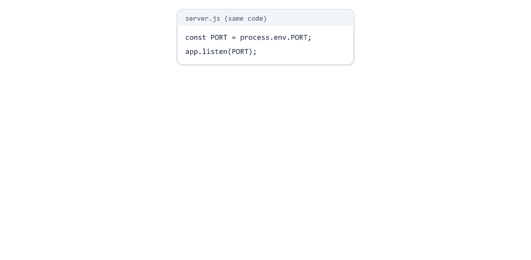
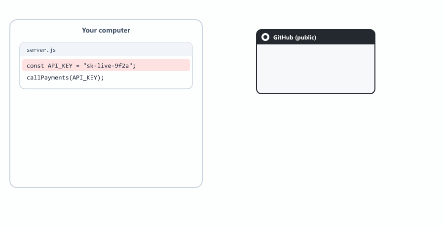
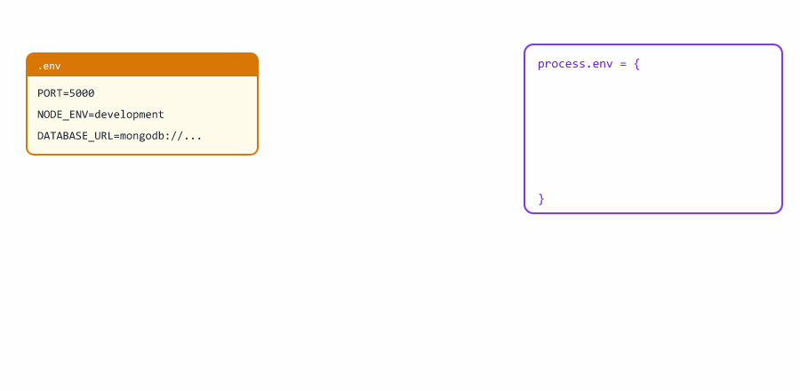
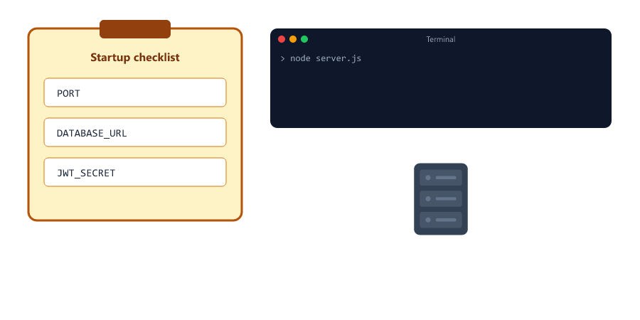
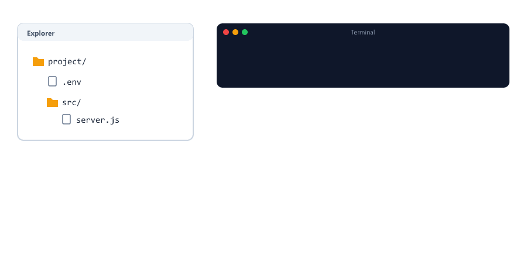
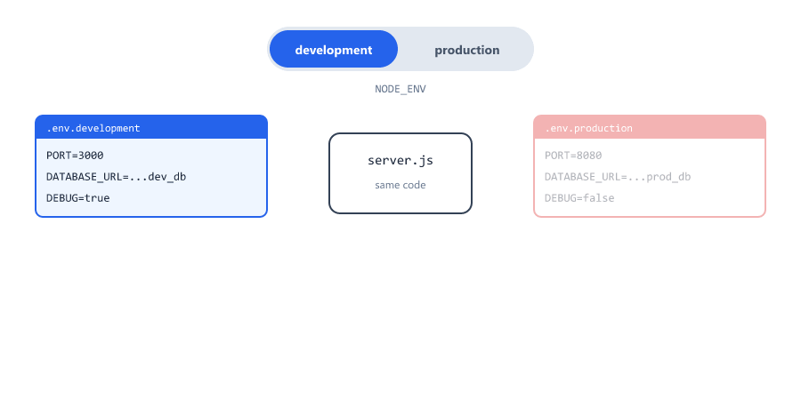
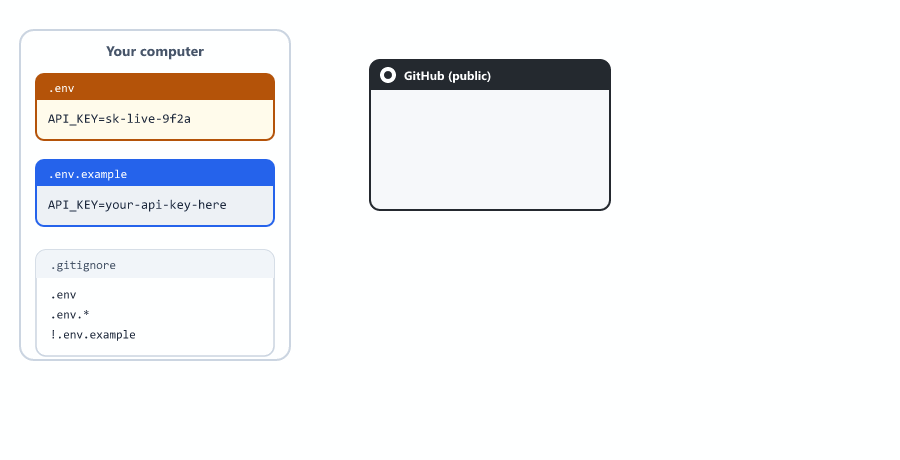

## Table of Contents

* [What are Environment Variables](#what-are-environment-variables)
* [Why Do We Need Environment Variables](#why-do-we-need-environment-variables)
* [What is dotenv](#what-is-dotenv)
* [Installing dotenv](#installing-dotenv)
* [Creating .env File](#creating-env-file)
* [Loading Environment Variables](#loading-environment-variables)
* [Accessing Environment Variables](#accessing-environment-variables)
* [Using process.env](#using-processenv)
* [Every Value is a String](#every-value-is-a-string)
* [Default Values](#default-values)
* [Required Variables](#required-variables)
* [Where dotenv Looks for .env](#where-dotenv-looks-for-env)
* [Which Value Wins](#which-value-wins)
* [Environment Variables in Express](#environment-variables-in-express)
* [Different Environments](#different-environments)
* [What NODE_ENV Changes](#what-node_env-changes)
* [A Config File](#a-config-file)
* [Important Rules for .env](#important-rules-for-env)
* [If You Commit a Secret by Mistake](#if-you-commit-a-secret-by-mistake)
* [Complete Example](#complete-example)
* [Environment Variables in Different Operating Systems](#environment-variables-in-different-operating-systems)
* [Built-in Alternative: node --env-file](#built-in-alternative-node---env-file)
* [Common Environment Variables](#common-environment-variables)
* [Beginner Mistakes](#beginner-mistakes)
* [Practice Exercises](#practice-exercises)
* [Interview Questions](#interview-questions)

---

## What are Environment Variables

Environment variables are values that live outside your code

They are stored in the system where your application runs

Think of them like settings for your application



Examples of environment variables

| Variable      | Meaning                                         |
| ------------- | ----------------------------------------------- |
| PORT          | Which port the server runs on                   |
| DATABASE_URL  | Where your database is located                  |
| API_KEY       | Secret key for external services                |
| NODE_ENV      | Current environment (development, production)   |

Environment variables are key-value pairs

```text
PORT=3000
DATABASE_URL=mongodb://localhost:27017/myapp
API_KEY=abc123secret
```

You have already met one: in Session 12 you wrote `process.env.PORT || 3000`.

---

## Why Do We Need Environment Variables

Hardcoding values in your code is a bad practice

Bad example - hardcoded values

```javascript
const PORT = 3000;
const DATABASE_URL = "mongodb://localhost:27017/school";
const API_KEY = "my-secret-key-123";
```

Problems with hardcoding

* Cannot change without editing code
* Different developers need different settings
* Secret keys are visible in code
* Cannot have different settings for different computers
* Cannot share code safely



Good example - using environment variables

```javascript
const PORT = process.env.PORT;
const DATABASE_URL = process.env.DATABASE_URL;
const API_KEY = process.env.API_KEY;
```

Benefits

* No hardcoded values
* Each developer can have their own .env file
* Secret keys are not in the code
* Easy to change settings
* Safe to share code on GitHub

---

## What is dotenv

dotenv is a npm package

It loads environment variables from a .env file into process.env

Without dotenv, you would have to set environment variables manually every time you open a terminal (see [Environment Variables in Different Operating Systems](#environment-variables-in-different-operating-systems))

This is annoying and easy to forget

dotenv makes it simple

Create a .env file with your variables

```text
PORT=5000
DATABASE_URL=mongodb://localhost:27017/mydb
```

dotenv loads them automatically



---

## Installing dotenv

Create a new project

```bash
mkdir env-demo
cd env-demo
npm init -y
```

Install express and dotenv together (Session 02)

```bash
npm install express dotenv
```

Now you have dotenv in your project

---

## Creating .env File

Create a file named .env in your project root (the same folder as package.json)

Important - The name must be exactly .env

Add your variables

```text
PORT=3000
NODE_ENV=development
API_KEY=my-super-secret-key-123
DATABASE_URL=mongodb://localhost:27017/school
ADMIN_EMAIL=admin@example.com
```

Each line is one variable

The usual style is `KEY=value`, with the key in CAPITAL letters and no spaces around `=`

Lines starting with `#` are comments

```text
# Server settings
PORT=3000
```

---

## Loading Environment Variables

There are two ways to load dotenv

Method 1 - Require and configure at the top of your file

```javascript
require("dotenv").config();

const express = require("express");
const app = express();

console.log(process.env.PORT);
```

Output

```text
◇ injected env (5) from .env
3000
```

The first line is printed by dotenv itself. It tells you it found your .env file and loaded 5 variables. If you do not want this message, use `require("dotenv").config({ quiet: true })`.

Method 2 - Import if using ES modules (Session 04)

```javascript
import "dotenv/config";
```

For beginners, Method 1 is easier

The config() function reads your .env file and loads variables

Always put dotenv at the very top of your file, before any code that reads `process.env`

---

## Accessing Environment Variables

Once loaded, all variables are available in process.env

```javascript
require("dotenv").config({ quiet: true });

console.log(process.env.PORT);
console.log(process.env.NODE_ENV);
console.log(process.env.API_KEY);
console.log(process.env.DATABASE_URL);
console.log(process.env.ADMIN_EMAIL);
```

Output

```text
3000
development
my-super-secret-key-123
mongodb://localhost:27017/school
admin@example.com
```

process.env is an object

All environment variables become properties of this object

A variable that does not exist is `undefined`

---

## Using process.env

Access variables using dot notation

```javascript
const port = process.env.PORT;
const dbUrl = process.env.DATABASE_URL;
```

Or using bracket notation

```javascript
const port = process.env["PORT"];
```

Most developers use dot notation

Now you can use these variables in your code

```javascript
require("dotenv").config();
const express = require("express");

const app = express();
const PORT = process.env.PORT;

app.get("/", (req, res) => {
  res.send("Server using environment variables");
});

app.listen(PORT, (err) => {
  if (err) {
    console.log("Could not start server:", err.message);
    return;
  }

  console.log(`Server running on port ${PORT}`);
});
```

---

## Every Value is a String

This surprises almost every beginner. Every environment variable is text, even if it looks like a number or a boolean.

.env

```text
PORT=3000
DEBUG=false
MAX_STUDENTS=50
```

```javascript
require("dotenv").config({ quiet: true });

console.log(typeof process.env.PORT);
console.log(process.env.MAX_STUDENTS + 10);

if (process.env.DEBUG) {
  console.log("Debug is ON");
}
```

Output

```text
string
5010
Debug is ON
```


| Value in .env   | What you get   | Problem                                         |
| --------------- | -------------- | ----------------------------------------------- |
| `MAX_STUDENTS=50` | `"50"`       | `"50" + 10` is `"5010"`, not 60                 |
| `DEBUG=false`   | `"false"`      | A non-empty string is truthy, so `if` runs      |

Convert values yourself

```javascript
const maxStudents = Number(process.env.MAX_STUDENTS);
const debug = process.env.DEBUG === "true";

console.log(maxStudents + 10);
console.log(debug);
```

Output

```text
60
false
```

`app.listen()` accepts the port as a string, so `process.env.PORT` works there without converting.

---

## Default Values

Sometimes an environment variable might not exist

You should provide a default value

Use the OR operator ||

```javascript
const PORT = process.env.PORT || 3000;
const DB_URL = process.env.DATABASE_URL || "mongodb://localhost:27017/default";
```

If process.env.PORT exists, it uses that value

If not, it uses 3000

This is good practice for settings that have a sensible default, like the port

Your app will still work even if someone forgets to set a variable

---

## Required Variables

Some values must never have a default. A secret key or a database password must be set on purpose. If it is missing, stop the app immediately with a clear message, using `process.exit(1)` from Session 07.

```javascript
require("dotenv").config({ quiet: true });

const required = ["JWT_SECRET", "DATABASE_URL"];

for (const name of required) {
  if (!process.env[name]) {
    console.error(`FATAL ERROR: ${name} is not defined in .env`);
    process.exit(1);
  }
}
```

Output if JWT_SECRET is missing

```text
FATAL ERROR: JWT_SECRET is not defined in .env
```



| Kind of setting           | Example                 | Missing?                     |
| ------------------------- | ----------------------- | ---------------------------- |
| Has a safe default        | PORT, NODE_ENV          | Use a default with `\|\|`    |
| Secret or must be chosen  | JWT_SECRET, DATABASE_URL | Stop with `process.exit(1)` |

Failing at startup is much better than failing later, when a user tries to log in.

`process.env[name]` uses bracket notation because the name is inside a variable.

---

## Where dotenv Looks for .env

By default, dotenv looks for `.env` in the folder where you run the `node` command, not the folder of your file. This is the same problem you saw with fs in Session 05.

```text
project/
├── .env
└── src/
    └── server.js
```

| You run                         | Result                   |
| ------------------------------- | ------------------------ |
| `node src/server.js` from project/ | .env is found         |
| `node server.js` from src/      | .env is not found, every value is undefined |



Fix it with path.join and __dirname from Session 06

```javascript
const path = require("path");

require("dotenv").config({ path: path.join(__dirname, "..", ".env") });
```

If your server.js is in the same folder as .env, use `path.join(__dirname, ".env")`.

---

## Which Value Wins

If a variable is already set in the system (or in the terminal), dotenv does not replace it.

```bash
PORT=9999 node server.js
```

Even if .env says `PORT=3000`, `process.env.PORT` is `"9999"`.

This is on purpose. Hosting companies set variables like PORT on their servers, and your .env file must not overwrite them. (The `PORT=9999 node ...` style only works in bash. See [Environment Variables in Different Operating Systems](#environment-variables-in-different-operating-systems) for Windows.)

---

## Environment Variables in Express

Here is a complete Express server using environment variables

```javascript
require("dotenv").config();
const express = require("express");

const app = express();

const PORT = process.env.PORT || 5000;
const NODE_ENV = process.env.NODE_ENV || "development";

app.use(express.json());

app.get("/", (req, res) => {
  res.json({
    message: "Server is running",
    environment: NODE_ENV,
    port: PORT
  });
});

app.get("/config", (req, res) => {
  // Never send secret keys to client
  // This is just for demonstration
  res.json({
    nodeEnv: NODE_ENV
    // Do NOT send API keys to client in real apps
  });
});

app.listen(PORT, (err) => {
  if (err) {
    console.log("Could not start server:", err.message);
    return;
  }

  console.log(`Server running in ${NODE_ENV} mode on port ${PORT}`);
});
```

---

## Different Environments

Most applications have different environments

| Environment  | Used for                                    |
| ------------ | ------------------------------------------- |
| development  | Coding and testing on your computer         |
| staging      | Testing before going live                   |
| production   | Live application used by real users         |

Each environment has different settings

.env.development

```text
PORT=3000
DATABASE_URL=mongodb://localhost:27017/dev_db
DEBUG=true
```

.env.production

```text
PORT=8080
DATABASE_URL=mongodb://prod-server:27017/prod_db
DEBUG=false
```



You can create different .env files for different environments

Then load the correct one based on NODE_ENV

```javascript
const env = process.env.NODE_ENV || "development";

if (env === "development") {
  require("dotenv").config({ path: ".env.development" });
} else if (env === "production") {
  require("dotenv").config({ path: ".env.production" });
} else {
  require("dotenv").config();
}
```

NODE_ENV itself cannot come from these files, because it decides which file to load. It is set in the terminal or by the hosting company.

For beginners, start with just one .env file

---

## What NODE_ENV Changes

`NODE_ENV=production` is not just a label. Express (and many packages) behave differently.

For example, when a route throws an error, Express's default error page shows

| NODE_ENV       | The user sees                                         |
| -------------- | ----------------------------------------------------- |
| development    | `Error: Secret database password is wrong` and the full stack |
| production     | `Internal Server Error`                               |


Details help you while coding, but in production they would show your code and secrets to strangers. Always run real servers with `NODE_ENV=production`.

You can use it in your own code too

```javascript
const isProduction = process.env.NODE_ENV === "production";

if (!isProduction) {
  console.log("Debug info:", req.body);
}
```

---

## A Config File

Instead of reading `process.env` everywhere, read it once in a config file, convert the types, and export one object (Session 04).

config.js

```javascript
const path = require("path");

require("dotenv").config({ path: path.join(__dirname, ".env"), quiet: true });

const config = {
  port: Number(process.env.PORT) || 3000,
  env: process.env.NODE_ENV || "development",
  jwtSecret: process.env.JWT_SECRET,
  rateLimit: Number(process.env.RATE_LIMIT) || 100,
  isProduction: process.env.NODE_ENV === "production"
};

if (!config.jwtSecret) {
  console.error("FATAL ERROR: JWT_SECRET is not defined in .env");
  process.exit(1);
}

module.exports = config;
```

server.js

```javascript
const config = require("./config");

console.log(config.port, config.isProduction);
```

| Benefit                      | Why                                           |
| ---------------------------- | --------------------------------------------- |
| One place                    | Every setting is listed in one file           |
| Correct types                | Numbers are numbers, booleans are booleans    |
| Checked at startup           | Missing secrets stop the app immediately      |
| Loaded once                  | A module runs only once (Session 04)          |

You will see this pattern again in Project Structure Best Practices (Session 29).

---

## Important Rules for .env

Rule 1 - Never commit .env to GitHub

Add .env to .gitignore

```text
# .gitignore
node_modules/
.env
.env.*
!.env.example
```

| Line             | Meaning                                           |
| ---------------- | ------------------------------------------------- |
| `.env`           | Ignore the .env file                              |
| `.env.*`         | Ignore .env.development, .env.production and so on |
| `!.env.example`  | But do NOT ignore .env.example (`!` means "except") |

Without the last line, `.env.*` would also hide .env.example from Git.

Rule 2 - Create a .env.example file

Share this file with your team

.env.example

```text
PORT=3000
NODE_ENV=development
DATABASE_URL=mongodb://localhost:27017/mydb
API_KEY=your-api-key-here
```

Team members copy .env.example to .env

Then fill in their own values



Rule 3 - Use quotes when a value has special characters

Simple values do not need quotes. But a `#` starts a comment, so it cuts the value

```text
API_KEY=abc#123
```

gives `"abc"`. With quotes

```text
API_KEY="abc#123"
```

gives `"abc#123"`. Use quotes for values with `#`, or spaces at the start or end.

| In .env                   | process.env value |
| ------------------------- | ----------------- |
| `APP_NAME=My Express App` | `"My Express App"` |
| `API_KEY=abc#123`         | `"abc"`           |
| `API_KEY="abc#123"`       | `"abc#123"`       |

Rule 4 - Restart server after changing .env

Changes to .env only take effect when you restart the server

With dotenv, `node --watch` restarts when your .js files change, not when .env changes. Stop it with Ctrl + C and start it again. (With `node --watch --env-file=.env`, shown below, Node.js does restart when .env changes.)

---

## If You Commit a Secret by Mistake

Deleting the .env file in a new commit is not enough. Git keeps every old version, so the secret is still in the history, and bots scan GitHub for leaked keys within minutes.

What to do

1. Change the secret right away (create a new API key, change the password)
2. Then add .env to .gitignore and remove it from Git

```bash
git rm --cached .env
```

`--cached` removes the file from Git but keeps it on your computer.

---

## Complete Example

Project structure

```text
env-demo/
├── .env
├── .env.example
├── .gitignore
├── package.json
└── server.js
```

.env file

```text
PORT=4000
NODE_ENV=development
JWT_SECRET=my-jwt-secret-key
EMAIL_HOST=smtp.gmail.com
EMAIL_PORT=587
EMAIL_USER=admin@myapp.com
EMAIL_PASS=email-password-here
RATE_LIMIT=100
```

.env.example file (share this on GitHub)

```text
PORT=3000
NODE_ENV=development
JWT_SECRET=your-jwt-secret-key
EMAIL_HOST=smtp.gmail.com
EMAIL_PORT=587
EMAIL_USER=your-email@example.com
EMAIL_PASS=your-email-password
RATE_LIMIT=100
```

.gitignore file

```text
node_modules/
.env
.env.*
!.env.example
.DS_Store
```

server.js

```javascript
const path = require("path");
require("dotenv").config({ path: path.join(__dirname, ".env"), quiet: true });

const express = require("express");

const app = express();

// Get all configuration from environment variables
const PORT = Number(process.env.PORT) || 3000;
const NODE_ENV = process.env.NODE_ENV || "development";
const JWT_SECRET = process.env.JWT_SECRET;
const RATE_LIMIT = Number(process.env.RATE_LIMIT) || 100;

// Check if required variables exist
if (!JWT_SECRET) {
  console.error("FATAL ERROR: JWT_SECRET is not defined");
  process.exit(1);
}

app.use(express.json());

// Route to show config (without secrets)
app.get("/api/config", (req, res) => {
  res.json({
    environment: NODE_ENV,
    port: PORT,
    rateLimit: RATE_LIMIT
    // Never send JWT_SECRET or passwords to client
  });
});

app.get("/api/health", (req, res) => {
  res.json({
    status: "OK",
    environment: NODE_ENV,
    timestamp: new Date().toISOString()
  });
});

app.listen(PORT, (err) => {
  if (err) {
    console.log("Could not start server:", err.message);
    return;
  }

  console.log(`=================================`);
  console.log(`Server started successfully`);
  console.log(`=================================`);
  console.log(`Environment: ${NODE_ENV}`);
  console.log(`Port: ${PORT}`);
  console.log(`Rate limit: ${RATE_LIMIT} requests per minute`);
  console.log(`=================================`);
  console.log(`Visit http://localhost:${PORT}/api/health`);
});
```

Run the server

```bash
node server.js
```

Output

```text
=================================
Server started successfully
=================================
Environment: development
Port: 4000
Rate limit: 100 requests per minute
=================================
Visit http://localhost:4000/api/health
```

Visit http://localhost:4000/api/config

```json
{"environment":"development","port":4000,"rateLimit":100}
```

`port` and `rateLimit` are real numbers now, because we used `Number()`.

A health route like `/api/health` is used by hosting companies to check that your app is alive (Session 07's monitor idea).

---

## Environment Variables in Different Operating Systems

Setting environment variables without .env, for the current terminal only

| Terminal                 | Set a variable          | Then run          |
| ------------------------ | ----------------------- | ----------------- |
| Windows Command Prompt   | `set PORT=5000`         | `node server.js`  |
| Windows PowerShell       | `$env:PORT=5000`        | `node server.js`  |
| macOS / Linux / Git Bash | `export PORT=5000`      | `node server.js`  |
| macOS / Linux / Git Bash, one command only | `PORT=5000 node server.js` | |

When you close the terminal, the variable is gone

This is why dotenv is better

Works the same on all operating systems

---

## Built-in Alternative: node --env-file

Node.js 20.6 and newer (this course uses Node.js 24) can read a .env file without installing any package

```bash
node --env-file=.env server.js
```

Or inside your code

```javascript
process.loadEnvFile(".env");

console.log(process.env.PORT);
```

You can put it in a script in package.json (Session 02)

```json
{
  "scripts": {
    "start": "node --env-file=.env server.js",
    "dev": "node --watch --env-file=.env server.js"
  }
}
```

| Option                  | Install needed | Notes                                       |
| ----------------------- | -------------- | ------------------------------------------- |
| dotenv                  | Yes            | Works on every Node.js version. Very common in existing projects |
| `node --env-file`       | No             | Built into Node.js 20.6+. If the file is missing, node stops with an error. With `--watch`, it restarts when .env changes |

Both read the same .env format. This course uses dotenv because you will see it in almost every project and tutorial.

---

## Common Environment Variables

Here are variables most projects use

| Variable        | Meaning                              |
| --------------- | ------------------------------------ |
| PORT            | Server port number                   |
| NODE_ENV        | development, staging, production     |
| DATABASE_URL    | Database connection string           |
| JWT_SECRET      | Secret key for JWT tokens (Session 22) |
| API_KEY         | External API keys                    |
| CORS_ORIGIN     | Allowed domains for CORS (Session 14) |
| LOG_LEVEL       | debug, info, warn, error (Session 26) |
| SESSION_SECRET  | Secret for session management        |
| EMAIL_HOST      | SMTP server for emails               |
| EMAIL_USER      | Email account username               |
| EMAIL_PASS      | Email account password               |
| REDIS_URL       | Redis connection string              |
| AWS_ACCESS_KEY  | AWS access key                       |
| AWS_SECRET_KEY  | AWS secret key                       |

---

## Beginner Mistakes

### Mistake 1

Requiring dotenv after reading process.env.

```javascript
const PORT = process.env.PORT;
require("dotenv").config();
```

`PORT` was read before .env was loaded, so it is `undefined`. Put `require("dotenv").config()` on the first line.

---

### Mistake 2

Treating values as numbers or booleans.

`DEBUG=false` is the string `"false"`, which is truthy. Compare with `=== "true"`, and use `Number()` for numbers.

---

### Mistake 3

Naming the file wrong.

`env`, `.env.txt` (Windows can hide the .txt), or `config.env` are not found. The file must be exactly `.env`. In VS Code, check the name in the file explorer.

---

### Mistake 4

Running node from another folder.

dotenv cannot find .env and every value is `undefined`. Use `path.join(__dirname, ".env")`.

---

### Mistake 5

A `#` in a value without quotes.

`PASSWORD=abc#123` gives `"abc"`. Write `PASSWORD="abc#123"`.

---

### Mistake 6

Ignoring .env.example with `.env.*`.

Add `!.env.example` to .gitignore so your team can see which variables are needed.

---

### Mistake 7

Printing all variables.

```javascript
console.log(process.env);
```

This prints every secret into your logs. Log only what you need.

---

## Practice Exercises

### Exercise 1

Create a new Express project

Add a .env file with

```text
PORT=5000
APP_NAME=My Express App
```

Use these variables in your server

### Exercise 2

Add validation to check if required environment variables exist

If PORT is missing, use 3000 as default

If JWT_SECRET is missing, stop the app with a clear message

### Exercise 3

Create three different .env files

```text
.env.development
.env.staging
.env.production
```

Load the correct file based on NODE_ENV

Run it with each NODE_ENV value from the table in [Environment Variables in Different Operating Systems](#environment-variables-in-different-operating-systems)

### Exercise 4

Create a config.js file that exports a config object with correct types

```javascript
const config = {
  port: Number(process.env.PORT) || 3000,
  env: process.env.NODE_ENV || "development",
  jwtSecret: process.env.JWT_SECRET,
  isProduction: process.env.NODE_ENV === "production"
};
```

Use this config object throughout your app

### Exercise 5

Add a route /api/env-check

Return which environment variables are set, as true or false

Do NOT return secret values

Example: `{ "PORT": true, "JWT_SECRET": true, "EMAIL_PASS": false }`

### Exercise 6

Put `DEBUG=false` in .env and write `if (process.env.DEBUG)`. Why does it run? Fix it

### Exercise 7

Run your server with `node --env-file=.env server.js` instead of dotenv. Does it work the same?

---

## Interview Questions

### What are environment variables

Environment variables are values stored outside your code that configure your application

### Why should we use environment variables

To avoid hardcoding values, keep secrets safe, and have different settings for different environments

### What is dotenv

dotenv is an npm package that loads environment variables from a .env file into process.env

### What should you never do with .env files

Never commit .env files to GitHub or share them publicly

### What is the purpose of .env.example

To show other developers what environment variables are needed without sharing actual secret values

### How do you access environment variables in Node.js

Using process.env.VARIABLE_NAME

### What type are environment variable values

Always strings. Numbers and booleans must be converted, for example Number(process.env.PORT) and process.env.DEBUG === "true"

### What happens if you change .env while the server is running

The changes do not take effect until you restart the server

### Why should you provide default values for environment variables

So your application still works if someone forgets to set a variable that has a safe default, like PORT

### Which variables should not have defaults

Secrets like JWT_SECRET or database passwords. If they are missing, the app should stop at startup with a clear error

### Does dotenv overwrite variables that are already set

No. Variables already set in the system or terminal win over the .env file

### What does NODE_ENV=production change

Many libraries behave differently. For example, Express hides error details from users in production

### How can you load a .env file without dotenv

With Node.js 20.6 and newer: node --env-file=.env server.js, or process.loadEnvFile()

### What should you do if you accidentally pushed a secret to GitHub

Change (rotate) the secret immediately, because it stays in the Git history. Then remove the file and add it to .gitignore

---
