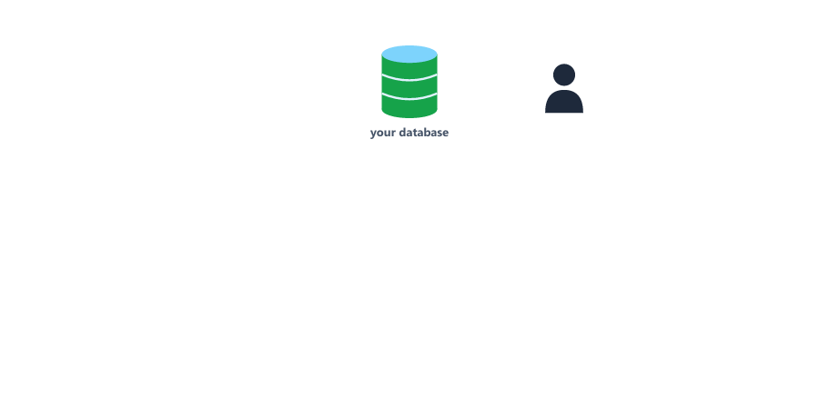
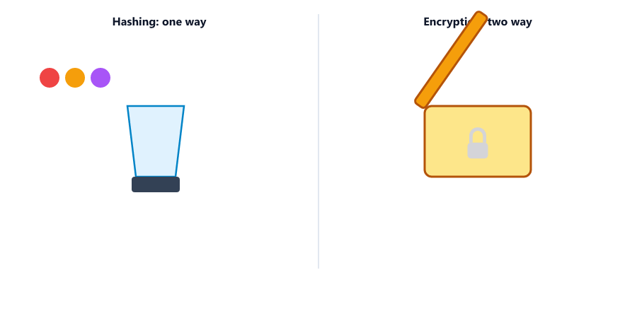
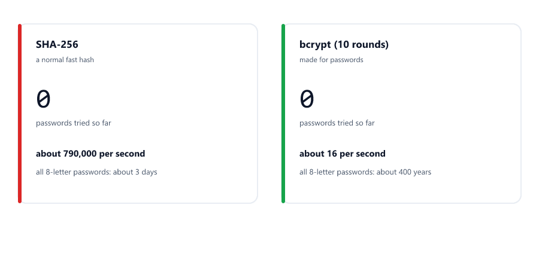
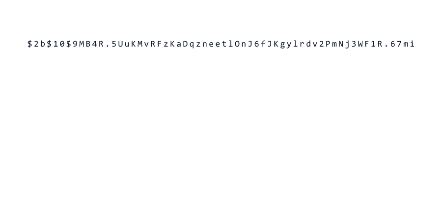
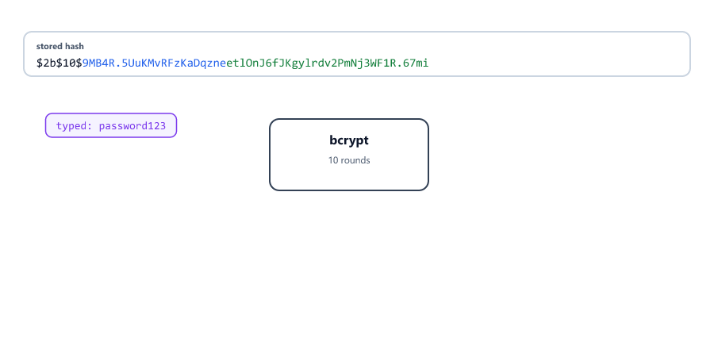
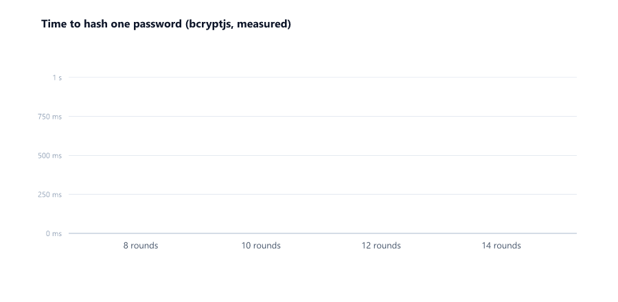
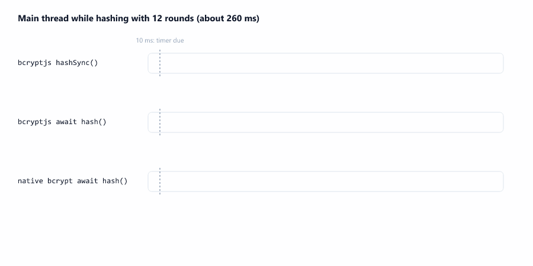
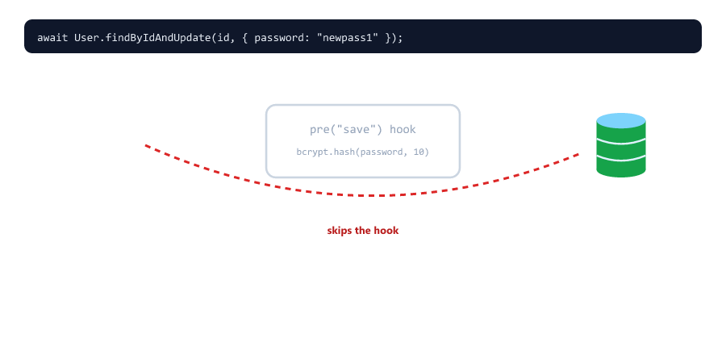

## Table of Contents

* [Why Password Hashing](#why-password-hashing)
* [Hashing vs Encryption](#hashing-vs-encryption)
* [Why Not a Normal Hash Like SHA-256](#why-not-a-normal-hash-like-sha-256)
* [What is bcrypt](#what-is-bcrypt)
* [How bcrypt Works](#how-bcrypt-works)
* [Installing bcrypt](#installing-bcrypt)
* [Hashing a Password](#hashing-a-password)
* [Comparing a Password](#comparing-a-password)
* [Salt and genSalt](#salt-and-gensalt)
* [Salt Rounds](#salt-rounds)
* [Do Not Block the Event Loop](#do-not-block-the-event-loop)
* [The 72-Byte Limit](#the-72-byte-limit)
* [Complete Password Management Example](#complete-password-management-example)
* [bcrypt in Express (Review from Session 22)](#bcrypt-in-express-review-from-session-22)
* [Changing a Password Safely](#changing-a-password-safely)
* [Logging Out Old Tokens After a Password Change](#logging-out-old-tokens-after-a-password-change)
* [Security Best Practices](#security-best-practices)
* [Beginner Mistakes](#beginner-mistakes)
* [Practice Exercises](#practice-exercises)
* [Interview Questions](#interview-questions)

---

## Why Password Hashing

Storing passwords in plain text is dangerous

Never do this

```javascript
const user = {
  name: "John",
  password: "123456" // DANGER! Never do this
};
```

What if someone gets access to your database? It happens to big companies every year: a stolen backup, a leaked .env, a bug in a query.



With plain text passwords

* The attacker sees every password immediately
* They can log in as any user
* Most people reuse passwords, so the attacker also tries them on email, banking and social media

Solution - Hash the password

* The user enters `"123456"`
* The server turns it into a hash like `$2b$10$9MB4R.5UuKMvRFzKaDqzne...`
* Only the hash is stored
* When the user logs in, the server hashes what they typed and checks it against the stored hash
* A stolen hash cannot be turned back into the password

The server never needs to know the real password after registration. It only needs to check if a typed password is the same one.

---

## Hashing vs Encryption

People often confuse hashing and encryption

| Feature                  | Hashing                          | Encryption                         |
| ------------------------ | -------------------------------- | ---------------------------------- |
| Direction                | One-way: cannot be reversed      | Two-way: can be decrypted          |
| Needs a key              | No                               | Yes, and whoever has the key can read everything |
| Output length            | Always the same length           | Grows with the input               |
| Used for                 | Passwords, checking files        | HTTPS, encrypted files, messages   |



Think of hashing like making a smoothie

* Put in fruits, get a smoothie
* You cannot get the fruits back from the smoothie
* The same fruits always make the same taste, so you can check "was this made from these fruits?"

Think of encryption like a lockbox

* Put an item in the box and lock it with a key
* Anyone with the key gets the item back

Passwords should be **hashed**, not encrypted. If passwords were encrypted, an attacker who also steals the key (often stored on the same server) could read all of them.

---

## Why Not a Normal Hash Like SHA-256

Node.js has a built-in `crypto` module (Session 22 used it to make a secret) that can make SHA-256 hashes. Why not use that?

sha-demo.js

```javascript
const crypto = require("crypto");

function sha256(text) {
  return crypto.createHash("sha256").update(text).digest("hex");
}

console.log(sha256("123456"));
console.log(sha256("123456"));

// How many guesses per second?
let count = 0;
const start = Date.now();
while (Date.now() - start < 1000) {
  sha256("guess" + count);
  count++;
}
console.log("SHA-256 guesses in 1 second:", count);
```

Output

```text
8d969eef6ecad3c29a3a629280e686cf0c3f5d5a86aff3ca12020c923adc6c92
8d969eef6ecad3c29a3a629280e686cf0c3f5d5a86aff3ca12020c923adc6c92
SHA-256 guesses in 1 second: 792593
```

Two big problems

| Problem                         | Why it matters                                                  |
| ------------------------------- | --------------------------------------------------------------- |
| Same password → same hash       | Everyone with `123456` has the same hash. Attackers keep huge ready-made lists of hashes for common passwords (**rainbow tables**), so a hash like this is simply looked up, not cracked |
| Far too fast                    | One laptop core tries about 790,000 passwords per second. Graphics cards try billions |



SHA-256 is a great tool for checking that a file was not changed. It was designed to be fast, which is exactly what you do **not** want for passwords.

---

## What is bcrypt

bcrypt is a hashing method designed specifically for passwords

| Feature                       | What it does                                                    |
| ----------------------------- | --------------------------------------------------------------- |
| Slow on purpose               | About 16 guesses per second on the same laptop (we measured, see [Salt Rounds](#salt-rounds)) |
| Random salt                   | The same password gives a different hash every time. Rainbow tables are useless |
| Adjustable cost (rounds)      | When computers get faster, you raise the number to stay slow    |
| Everything in one string      | The salt and the cost are stored inside the hash, nothing extra to save |

How much does "slow" help? Take a password of 8 lowercase letters. There are 26 to the power of 8, about 209 billion, possible passwords

| Method               | Guesses per second (one laptop core) | Time to try them all |
| -------------------- | ------------------------------------ | -------------------- |
| SHA-256              | ~790,000                             | about 3 days         |
| bcrypt, 10 rounds    | ~16                                  | about 400 years      |

Real attackers use many machines, so the real numbers are smaller, but the difference stays huge.

---

## How bcrypt Works

When hashing

1. Create a random **salt** (16 random bytes)
2. Mix the password and the salt
3. Run the slow bcrypt algorithm `2^rounds` times
4. Put the version, the rounds, the salt and the result into one string

A real bcrypt hash from this session

```text
$2b$10$9MB4R.5UuKMvRFzKaDqzneetlOnJ6fJKgylrdv2PmNj3WF1R.67mi
```



| Part                                   | Meaning                                         |
| -------------------------------------- | ----------------------------------------------- |
| `$2b$`                                 | bcrypt version                                  |
| `10$`                                  | Rounds (cost): the work is repeated 2^10 = 1024 times |
| `9MB4R.5UuKMvRFzKaDqzne`               | The salt (22 characters)                        |
| `etlOnJ6fJKgylrdv2PmNj3WF1R.67mi`      | The hash itself (31 characters)                 |

The whole string is always 60 characters. The salt is not secret: it only makes every hash unique. Because it is stored inside the hash, bcrypt can find it again when checking a password.

---

## Installing bcrypt

There are two packages

| Package    | Written in              | Install                          | Speed                 |
| ---------- | ----------------------- | -------------------------------- | --------------------- |
| `bcryptjs` | Plain JavaScript        | Always works, nothing to compile | Slower, runs on the main thread |
| `bcrypt`   | C++ (native)            | Uses prebuilt files; rarely, it needs build tools | Faster, runs in the libuv thread pool (Session 03) |

Both make the same `$2b$` hashes, and they have the same functions, so you can switch later by changing one `require`.

For beginners, bcryptjs is easier

```bash
npm install bcryptjs
```

We use bcryptjs in this session (and in Session 22). For a busy production server, the native `bcrypt` package is the better choice, see [Do Not Block the Event Loop](#do-not-block-the-event-loop).

```bash
npm install bcrypt
```

With npm 11 you may see `npm warn allow-scripts bcrypt@6.0.0 (install: node-gyp-build)` when installing `bcrypt`. npm now asks before running install scripts. We tested it: bcrypt still worked, because it finds its prebuilt file when it is first used.

---

## Hashing a Password

hash-demo.js

```javascript
const bcrypt = require("bcryptjs");

async function main() {
  const password = "password123";

  const hash1 = await bcrypt.hash(password, 10);
  const hash2 = await bcrypt.hash(password, 10);

  console.log("Hash 1:", hash1);
  console.log("Hash 2:", hash2);
  console.log("Same hash?", hash1 === hash2);

  console.log("Check hash 1:", await bcrypt.compare(password, hash1));
  console.log("Check hash 2:", await bcrypt.compare(password, hash2));
  console.log("Wrong password:", await bcrypt.compare("Password123", hash1));
}

main();
```

Output (your hashes will be different)

```text
Hash 1: $2b$10$9MB4R.5UuKMvRFzKaDqzneetlOnJ6fJKgylrdv2PmNj3WF1R.67mi
Hash 2: $2b$10$aWdHB8dEGP/7Ggkl8oVix.v31uVjAx5FUNlEiir.Y8hsCscVADICu
Same hash? false
Check hash 1: true
Check hash 2: true
Wrong password: false
```

| Code                         | Meaning                                                   |
| ---------------------------- | --------------------------------------------------------- |
| `bcrypt.hash(password, 10)`  | Make a new salt with 10 rounds and hash the password      |
| `await`                      | Hashing takes time, so it returns a Promise (Session 03)  |

The same password gave two different hashes (different salts), yet both are correct. And `"Password123"` with a capital P is a different password.

bcryptjs also has a callback style, `bcrypt.hash(password, 10, (err, hash) => { ... })`, which you may see in old tutorials. `await` is easier to read.

---

## Comparing a Password

When a user logs in, you have the typed password and the stored hash. You **cannot** do `hash(typed) === storedHash`, because a new hash would have a new salt. Use `bcrypt.compare()`

```javascript
const isMatch = await bcrypt.compare(typedPassword, storedHash);
```



How bcrypt.compare works

1. Read the rounds and the salt from the stored hash
2. Hash the typed password with the **same** salt and rounds
3. Compare the result with the stored hash
4. Return `true` or `false`

`compare()` throws if one of the values is not a string

| Call                                     | Result                                            |
| ---------------------------------------- | ------------------------------------------------- |
| `compare("x", undefined)`                | `Error: Illegal arguments: string, undefined`     |
| `compare({ $gt: "" }, hash)`             | `Error: Illegal arguments: object, string`        |

The first one is the classic mistake of forgetting `.select("+password")` (Session 22): the user has no password field, so the hash is `undefined`. The second is why Session 22's login uses `String(password)`.

---

## Salt and genSalt

`bcrypt.hash(password, 10)` makes the salt for you. You can also make it yourself

salt-demo.js

```javascript
const bcrypt = require("bcryptjs");

async function main() {
  const salt = await bcrypt.genSalt(10);
  const hash = await bcrypt.hash("password123", salt);

  console.log("Salt:", salt);
  console.log("Hash:", hash);
  console.log("Hash starts with the salt?", hash.startsWith(salt));
  console.log("Rounds inside the hash:", bcrypt.getRounds(hash));
}

main();
```

Output

```text
Salt: $2b$10$FW1WyFxreV9UTJUCC26EKO
Hash: $2b$10$FW1WyFxreV9UTJUCC26EKOsbN9LoY9YTYMEAFujyNJKIK/j8UrdUu
Hash starts with the salt? true
Rounds inside the hash: 10
```

The first 29 characters of the hash **are** the salt. That is why you never store the salt separately.

| Style                                                 | Result                 |
| ----------------------------------------------------- | ---------------------- |
| `bcrypt.hash(password, 10)`                           | Same                   |
| `bcrypt.hash(password, await bcrypt.genSalt(10))`     | Same, one extra line   |

Most code uses the short form. `bcrypt.getRounds(hash)` tells you which cost an old hash used, useful when you raise the rounds later.

---

## Salt Rounds

The rounds (also called the cost) decide how slow bcrypt is. Each +1 **doubles** the work

rounds-demo.js

```javascript
const bcrypt = require("bcryptjs");

async function main() {
  for (const rounds of [8, 10, 12, 14]) {
    console.time(`${rounds} rounds`);
    await bcrypt.hash("test123", rounds);
    console.timeEnd(`${rounds} rounds`);
  }
}

main();
```

`console.time(label)` starts a stopwatch and `console.timeEnd(label)` prints how long it took.

Output (measured on a normal laptop, yours will differ)

```text
8 rounds: 23.794ms
10 rounds: 66.751ms
12 rounds: 263.918ms
14 rounds: 1.044s
```



| Rounds | Work (2^rounds) | Time we measured | Logins per second (one core) |
| ------ | --------------- | ---------------- | ---------------------------- |
| 8      | 256             | 24 ms            | ~40                          |
| 10     | 1,024           | 67 ms            | ~15                          |
| 12     | 4,096           | 264 ms           | ~4                           |
| 14     | 16,384          | 1.04 s           | ~1                           |

The same slowness that stops attackers also slows your own logins. Choosing the number

* **10** is the common default and what this course uses
* **12** for production on a decent server
* Aim for roughly 100 to 300 ms per hash on your real server
* Do not go below 10

You can raise the rounds later. Old hashes keep working, because each hash remembers its own rounds. When a user logs in successfully, you can check `bcrypt.getRounds(user.password)` and save a new hash with the new rounds.

---

## Do Not Block the Event Loop

bcryptjs also has sync versions, `hashSync()` and `compareSync()`. They are easy to use, but dangerous in a server.

Node.js runs your JavaScript on one main thread (Session 03). While that thread is busy hashing, it cannot answer anyone else. We measured how late a 10 ms timer fires while hashing with 12 rounds

block-demo.js

```javascript
const bcrypt = require("bcryptjs");

// A timer that should fire after 10 ms. How late is it?
function timerTest(label, work) {
  return new Promise((resolve) => {
    const start = Date.now();
    setTimeout(() => {
      console.log(`${label}: 10 ms timer fired after ${Date.now() - start} ms`);
      resolve();
    }, 10);
    work();
  });
}

async function main() {
  await timerTest("bcrypt.hashSync", () => bcrypt.hashSync("password", 12));
  await timerTest("await bcrypt.hash", () => bcrypt.hash("password", 12));
}

main();
```

Output

```text
bcrypt.hashSync: 10 ms timer fired after 270 ms
await bcrypt.hash: 10 ms timer fired after 101 ms
```

And the same test with the native `bcrypt` package (`require("bcrypt")`)

```text
native await bcrypt.hash: 10 ms timer fired after 21 ms
```



| Function                    | What happens to other requests during a hash         |
| --------------------------- | ---------------------------------------------------- |
| bcryptjs `hashSync()`       | Completely blocked until the hash is done            |
| bcryptjs `await hash()`     | Get small turns in between, but are still slowed down |
| native bcrypt `await hash()` | Hardly affected: the work runs in the libuv thread pool |

Rules

* Never use `hashSync()` or `compareSync()` inside a route
* bcryptjs with `await` is fine for learning and small apps
* For a server with many logins, switch to the native `bcrypt` package

---

## The 72-Byte Limit

bcrypt only uses the first **72 bytes** of a password. Everything after that is ignored

long-demo.js

```javascript
const bcrypt = require("bcryptjs");

async function main() {
  const start = "a".repeat(72); // 72 letters
  const hash = await bcrypt.hash(start + "MySecretEnding", 10);

  console.log(await bcrypt.compare(start + "TotallyDifferent", hash));
  console.log(bcrypt.truncates(start + "MySecretEnding"));
}

main();
```

Output

```text
true
true
```

A completely different ending still matches, because bcrypt never saw it. `bcrypt.truncates()` tells you if a password is too long. The native `bcrypt` package behaves the same way (we tested it).

An English letter, digit or symbol is 1 byte, so 72 bytes is 72 such characters. Letters like `é` use 2 bytes, and emoji use 4. The simple fix is a limit in the schema, which you will see in the [User model below](#bcrypt-in-express-review-from-session-22)

```javascript
maxlength: [72, "Password cannot be longer than 72 characters"]
```

---

## Complete Password Management Example

This example uses an array instead of a database, so you can focus on bcrypt. It uses a `nextId` counter (Session 11), never `users.length + 1`, which gives duplicate ids after a delete.

passwordManager.js

```javascript
const bcrypt = require("bcryptjs");

const SALT_ROUNDS = 10;

// A fake database: an array, with an id counter (Session 11)
const users = [];
let nextId = 1;

async function registerUser(name, email, password) {
  if (users.some((u) => u.email === email)) {
    console.log("Email already registered");
    return null;
  }

  const hashedPassword = await bcrypt.hash(password, SALT_ROUNDS);

  const user = { id: nextId++, name, email, password: hashedPassword };
  users.push(user);

  console.log(`Registered ${name}. Stored hash: ${hashedPassword.slice(0, 20)}...`);
  return user;
}

async function loginUser(email, password) {
  const user = users.find((u) => u.email === email);

  // Same message for both cases (Session 22)
  if (!user || !(await bcrypt.compare(password, user.password))) {
    console.log("Login failed: invalid email or password");
    return false;
  }

  console.log(`Login successful. Welcome back, ${user.name}`);
  return true;
}

async function changePassword(email, oldPassword, newPassword) {
  const user = users.find((u) => u.email === email);

  if (!user || !(await bcrypt.compare(oldPassword, user.password))) {
    console.log("Old password is incorrect");
    return false;
  }

  user.password = await bcrypt.hash(newPassword, SALT_ROUNDS);
  console.log("Password changed");
  return true;
}

async function runDemo() {
  console.log("1. Register");
  await registerUser("John Doe", "john@example.com", "MySecurePass123!");

  console.log("\n2. Login with the correct password");
  await loginUser("john@example.com", "MySecurePass123!");

  console.log("\n3. Login with a wrong password");
  await loginUser("john@example.com", "WrongPassword");

  console.log("\n4. Change the password");
  await changePassword("john@example.com", "MySecurePass123!", "NewPass456!");

  console.log("\n5. Old password no longer works, new one does");
  await loginUser("john@example.com", "MySecurePass123!");
  await loginUser("john@example.com", "NewPass456!");

  console.log("\n6. What is really stored");
  console.log(users);
}

runDemo();
```

Run the demo

```bash
node passwordManager.js
```

Output

```text
1. Register
Registered John Doe. Stored hash: $2b$10$zjvKGdSsrW0VO...

2. Login with the correct password
Login successful. Welcome back, John Doe

3. Login with a wrong password
Login failed: invalid email or password

4. Change the password
Password changed

5. Old password no longer works, new one does
Login failed: invalid email or password
Login successful. Welcome back, John Doe

6. What is really stored
[
  {
    id: 1,
    name: 'John Doe',
    email: 'john@example.com',
    password: '$2b$10$ZoT88A0kUz2mAJXCSOlZjuVwHs3DJl6OztRolso69L2u2VS7pYXMm'
  }
]
```

The real password is nowhere in the data, only its hash. `"\n"` inside a string starts a new line, which adds an empty line before each step.

---

## bcrypt in Express (Review from Session 22)

In Session 22, hashing happens in the User model, so no controller can forget it. Here is the model again, with two additions from this session: a 72-character limit, and `tokenVersion`

models/User.js

```javascript
const mongoose = require("mongoose");
const bcrypt = require("bcryptjs");

const userSchema = new mongoose.Schema(
  {
    name: {
      type: String,
      required: [true, "Name is required"],
      trim: true,
      minlength: [2, "Name must be at least 2 characters"]
    },
    email: {
      type: String,
      required: [true, "Email is required"],
      unique: true,
      lowercase: true,
      trim: true,
      match: [/^\S+@\S+\.\S+$/, "Please enter a valid email"]
    },
    password: {
      type: String,
      required: [true, "Password is required"],
      minlength: [6, "Password must be at least 6 characters"],
      maxlength: [72, "Password cannot be longer than 72 characters"],
      select: false // Never returned by queries unless asked for
    },
    tokenVersion: {
      type: Number,
      default: 0 // goes up by 1 at every password change
    },
    role: {
      type: String,
      enum: ["user", "admin"],
      default: "user"
    },
    isActive: {
      type: Boolean,
      default: true
    }
  },
  {
    timestamps: true
  }
);

// Hash the password before saving (Mongoose 9: no next)
userSchema.pre("save", async function () {
  // Only hash when the password is new or changed
  if (!this.isModified("password")) {
    return;
  }

  this.password = await bcrypt.hash(this.password, 10);

  // A changed password (not a new user): tokens with the old version stop working
  if (!this.isNew) {
    this.tokenVersion += 1;
  }
});

// Check a typed password against the saved hash
userSchema.methods.comparePassword = function (enteredPassword) {
  return bcrypt.compare(enteredPassword, this.password);
};

module.exports = mongoose.model("User", userSchema);
```

| Part                              | Session | Meaning                                              |
| --------------------------------- | ------- | ---------------------------------------------------- |
| `select: false`                   | 22      | The hash is never sent by accident                   |
| `pre("save")` + `isModified`      | 22      | Hash only when the password is new or changed        |
| `comparePassword()`               | 22      | `bcrypt.compare()` wrapped in a model method         |
| `maxlength: 72`                   | 23      | bcrypt ignores everything after 72 bytes             |
| `this.isNew`                      | 23      | `true` while a new user is saved for the first time  |
| `tokenVersion`                    | 23      | Goes up by 1 at every password change. See [Logging Out Old Tokens](#logging-out-old-tokens-after-a-password-change) |

The hook has **no `next` parameter**. Old tutorials write `async function (next) { ... next(); }`, which crashes every registration in Mongoose 9 with `TypeError: next is not a function` (Session 22).

In the login controller, bcrypt is used through the model method

```javascript
// controllers/authController.js (from Session 22)
const user = await User.findOne({ email: String(email).toLowerCase() }).select("+password");

if (!user || !(await user.comparePassword(String(password)))) {
  return res.status(401).json({ success: false, message: "Invalid email or password" });
}
```

---

## Changing a Password Safely

The hash is made in the **save** hook. That has a big consequence for updates



trap-demo.js

```javascript
require("dotenv").config({ quiet: true });
const mongoose = require("mongoose");
const User = require("./models/User");

async function main() {
  await mongoose.connect(process.env.MONGODB_URI, { dbName: "trap_demo" });

  const user = await User.create({ name: "Ben", email: "ben@example.com", password: "oldpass1" });

  // WRONG: the save hook does not run on updates
  await User.findByIdAndUpdate(user._id, { password: "newpass1" });

  const saved = await User.findById(user._id).select("+password");
  console.log("Stored password:", saved.password);
  console.log("Can Ben log in?", await saved.comparePassword("newpass1"));

  await mongoose.connection.dropDatabase();
  await mongoose.disconnect();
}

main();
```

Output

```text
Stored password: newpass1
Can Ben log in? false
```

Two disasters at once: the password is stored as **plain text**, and Ben can no longer log in, because `compare()` expects a hash. Update queries skip save hooks (Session 19). For passwords, always load the user, change the field and call `save()`.

Add a change-password route to Session 22's project

controllers/authController.js (add this, and add `changePassword` to `module.exports`)

```javascript
// PATCH /api/auth/password (protected)
const changePassword = async (req, res) => {
  const { currentPassword, newPassword } = req.body || {};

  if (!currentPassword || !newPassword) {
    return res.status(400).json({ success: false, message: "Please provide currentPassword and newPassword" });
  }
  if (currentPassword === newPassword) {
    return res.status(400).json({ success: false, message: "The new password must be different" });
  }

  // req.user has no password (select: false), so load it again with the password
  const user = await User.findById(req.user._id).select("+password");

  if (!(await user.comparePassword(String(currentPassword)))) {
    return res.status(401).json({ success: false, message: "Current password is wrong" });
  }

  user.password = newPassword;
  await user.save(); // the pre save hook hashes it and adds 1 to tokenVersion

  res.status(200).json({ success: true, message: "Password changed", token: generateToken(user) });
};

module.exports = { register, login, getMe, changePassword };
```

routes/authRoutes.js

```javascript
const { register, login, getMe, changePassword } = require("../controllers/authController");
```

```javascript
router.get("/me", protect, getMe);
router.patch("/password", protect, changePassword);
```

| Step                                  | Why                                                       |
| ------------------------------------- | --------------------------------------------------------- |
| Ask for the **current** password      | If someone finds your laptop logged in, they cannot change your password and lock you out |
| `findById(...).select("+password")`   | `req.user` (from protect) was loaded without the password |
| `user.password = newPassword` + `save()` | The hook hashes it. Validation (min 6, max 72) runs too |
| Send a new token                      | Old tokens stop working (next section), so the user needs a fresh one |

---

## Logging Out Old Tokens After a Password Change

People change their password when they think someone else knows it. But a JWT stays valid until it expires (Session 22). If an attacker already has a token, a new password alone does not stop them for up to 7 days.

The fix is a version number

* Every user has `tokenVersion`, starting at 0 (in the model above)
* Every token stores the version it was made with
* The save hook adds 1 when an existing user's password changes
* `protect` refuses a token whose version is not the user's current version

Put the version in the token: change `generateToken` in controllers/authController.js (Session 22). It now takes the whole user

```javascript
// Create a token that says "this is user <id>, password version <v>"
function generateToken(user) {
  return jwt.sign({ id: user._id, v: user.tokenVersion }, process.env.JWT_SECRET, {
    expiresIn: process.env.JWT_EXPIRES_IN || "7d"
  });
}
```

Call it with the user everywhere: `generateToken(user)` in register, login and changePassword.

Add one check to `protect` in middleware/auth.js, after the user is loaded

```javascript
  // The user may have been deleted or deactivated after the token was made
  const user = await User.findById(decoded.id);
  if (!user || !user.isActive) {
    return res.status(401).json({ success: false, message: "This user no longer exists or is deactivated" });
  }

  // A token made before the last password change carries an old version number
  if (decoded.v !== user.tokenVersion) {
    return res.status(401).json({ success: false, message: "Password was changed. Please log in again." });
  }

  req.user = user;
  next();
```


Why not save the time of the change? Many tutorials store `passwordChangedAt` and refuse tokens whose `iat` (issued at, Session 22) is older. The problem: `iat` only counts **whole seconds**, so a token made in the same second as the change cannot be told apart. Those tutorials save the change time one second early, so the new token is not refused, but then old tokens from that second are accepted. We tested it: when the password was changed right after a token was made, the old token still worked **9 times out of 10**. A version number has no clock and no rounding: it is exact.

Test it

test-password.js

```javascript
const BASE = "http://localhost:5000/api/auth";

async function send(method, path, body, token) {
  const headers = { "Content-Type": "application/json" };
  if (token) {
    headers.Authorization = `Bearer ${token}`;
  }
  const res = await fetch(BASE + path, { method, headers, body: body ? JSON.stringify(body) : undefined });
  const data = await res.json();
  return { status: res.status, data };
}

function show(label, { status, data }) {
  let info = data.message || "";
  if (data.errors) info += " " + JSON.stringify(data.errors);
  if (data.user) info += ` ${data.user.name}`;
  if (data.token) info += " + token";
  console.log(`${label.padEnd(36)} ${status} ${info.trim()}`);
}

async function test() {
  const reg = await send("POST", "/register", { name: "Amy", email: "amy@example.com", password: "oldpass1" });
  show("Register Amy", reg);
  const oldToken = reg.data.token;

  show("Change: wrong current password", await send("PATCH", "/password", { currentPassword: "nope", newPassword: "newpass1" }, oldToken));
  show("Change: same password", await send("PATCH", "/password", { currentPassword: "oldpass1", newPassword: "oldpass1" }, oldToken));
  show("Change: new password too short", await send("PATCH", "/password", { currentPassword: "oldpass1", newPassword: "123" }, oldToken));

  const changed = await send("PATCH", "/password", { currentPassword: "oldpass1", newPassword: "newpass1" }, oldToken);
  show("Change: correct", changed);
  const newToken = changed.data.token;

  show("GET /me with the OLD token", await send("GET", "/me", null, oldToken));
  show("GET /me with the NEW token", await send("GET", "/me", null, newToken));
  show("Login with the old password", await send("POST", "/login", { email: "amy@example.com", password: "oldpass1" }));
  show("Login with the new password", await send("POST", "/login", { email: "amy@example.com", password: "newpass1" }));
}

test();
```

Output

```text
Register Amy                         201 Amy + token
Change: wrong current password       401 Current password is wrong
Change: same password                400 The new password must be different
Change: new password too short       400 Validation failed ["Password must be at least 6 characters"]
Change: correct                      200 Password changed + token
GET /me with the OLD token           401 Password was changed. Please log in again.
GET /me with the NEW token           200 Amy
Login with the old password          401 Invalid email or password
Login with the new password          200 Amy + token
```

What the database stores afterwards

```text
{
  email: 'amy@example.com',
  password: '$2b$10$ukgQ7fv93tZ/tXQxeVeCtOTZizhKnsQBgwfTBme8jXgZpZ1sLsLtC',
  tokenVersion: 1,
  createdAt: 2026-10-10T14:45:40.045Z
}
```

`tokenVersion` is 1: the failed attempts (wrong password, too short) changed nothing, only the successful change counted.

The test does not wait between registering and changing the password: the old token was made a moment before the change, and it is still refused. We ran the test 10 times on a new database each time: the old token was refused every time.

We also tested registering with a 73-character password: `400 Validation failed ["Password cannot be longer than 72 characters"]`.

---

## Security Best Practices

Storing passwords

| Do                                                   | Never                                              |
| ---------------------------------------------------- | -------------------------------------------------- |
| bcrypt with at least 10 rounds                       | Plain text, MD5, SHA-1 or a single SHA-256         |
| Hash in the model's save hook                        | Change passwords with `findByIdAndUpdate`          |
| `select: false` on the password field                | Send the hash to the client                        |
| `await bcrypt.hash()` (or native bcrypt)             | `hashSync()` inside a route                        |
| Limit passwords to 72 characters                     | Invent your own hashing method                     |

Password rules

* **Length beats complexity.** `correct-horse-battery-staple` is far stronger than `P@ss1`. A minimum of 8 characters is a good start (we used 6 to keep the examples short)
* Reject very common passwords like `123456`, `password` and `qwerty`
* Do not force users to change passwords every month. People just add `1`, `2`, `3`

Around the login

* Rate limit the login route (Session 14) to stop password guessing
* Use HTTPS in production, or the password travels as readable text
* Same message for wrong email and wrong password (Session 22)
* Never log passwords, never put them in URLs, never send them back in responses
* Two-factor authentication for sensitive apps

---

## Beginner Mistakes

### Mistake 1

Comparing hashes with `===`.

```javascript
const hash = await bcrypt.hash(typed, 10);
if (hash === user.password) { ... } // never true
```

Every hash has a new salt. Use `bcrypt.compare(typed, user.password)`.

---

### Mistake 2

Forgetting `await`.

`bcrypt.compare()` returns a Promise. `if (bcrypt.compare(...))` is always true, because a Promise object is truthy, so **every password is accepted**.

---

### Mistake 3

Hashing in the controller and in the hook.

The password gets hashed twice, and no login works anymore. Hash in one place: the hook.

---

### Mistake 4

Changing the password with `findByIdAndUpdate`.

The hook does not run, the password is stored as plain text, and the user is locked out.

---

### Mistake 5

Forgetting `isModified("password")` in the hook.

Changing only the name would hash the existing hash again, and the user is locked out.

---

### Mistake 6

Forgetting `.select("+password")` before `comparePassword()`.

`this.password` is `undefined`, and bcrypt throws `Illegal arguments: string, undefined`, a 500.

---

### Mistake 7

Using `hashSync()` in a server.

Every other user waits while it runs (270 ms per hash in our test).

---

### Mistake 8

Very high rounds "for extra safety".

14 rounds took over 1 second per login in our test. Attackers could also flood the login route to keep your CPU busy.

---

### Mistake 9

Using `users.length + 1` as an id.

After deleting a user, two users can get the same id. Use a counter, or let MongoDB create ids.

---

## Practice Exercises

### Exercise 1

Write a script that hashes the same password with 8, 10, 12 and 14 rounds and prints the time and the `getRounds()` value of each hash

### Exercise 2

Add a `confirmPassword` field to register. If it does not match `password`, answer 400 before creating the user. Do not save `confirmPassword`

### Exercise 3

Make a list of 20 common passwords (`123456`, `password`, `qwerty`, ...). Reject them at register and at change-password with a clear message

### Exercise 4

When a user logs in successfully and `bcrypt.getRounds(user.password)` is lower than 12, hash the typed password with 12 rounds and save it. Check in Compass that the hash now starts with `$2b$12$`

### Exercise 5

Change `require("bcryptjs")` to `require("bcrypt")` in the User model. Run your test script again. Does anything else need to change?

### Exercise 6

Add an admin route `PATCH /api/auth/users/:id/password` that sets a new password for any user. Use find + `save()`. Check that the user's old token stops working

### Exercise 7

Run trap-demo.js yourself and look at the user in Compass. Then fix it so the password is hashed

---

## Interview Questions

### Why do we hash passwords

So that a stolen database does not reveal the real passwords, and users who reuse passwords are not exposed on other sites

### What is the difference between hashing and encryption

Hashing is one-way and cannot be reversed. Encryption is two-way and can be decrypted with a key

### Why is bcrypt better than MD5 or SHA-256 for passwords

bcrypt is slow on purpose and adds a random salt. MD5 and SHA are very fast (hundreds of thousands to billions of guesses per second) and give the same hash for the same password

### What is a salt in bcrypt

Random data mixed with the password before hashing, so the same password gives a different hash every time. It defeats rainbow tables

### Where is the salt stored

Inside the hash string itself: the 22 characters after the rounds. It is not secret

### What are salt rounds in bcrypt

The cost factor. The work is 2 to the power of rounds, so each +1 doubles the time. 10 to 12 is common

### Can two identical passwords have different bcrypt hashes

Yes
Because each hash gets its own random salt

### How does bcrypt compare work

It reads the salt and rounds from the stored hash, hashes the typed password with them, and checks if the results are equal

### Why can't you compare by hashing again and using ===

A new hash gets a new salt, so it is always different from the stored one

### What is the difference between bcrypt and bcryptjs

bcrypt is native C++ and runs in the thread pool (faster, does not block). bcryptjs is plain JavaScript (easy to install, runs on the main thread). They make compatible hashes

### Why should you not use hashSync in a server

It blocks the single main thread, so no other request is handled until the hash is done

### What is the 72-byte limit

bcrypt only uses the first 72 bytes of a password. Longer passwords are cut off, so limit the length in validation

### Why does findByIdAndUpdate not hash the password

Update queries do not run save hooks. The password is stored as plain text. Use find + save

### How do you invalidate old tokens after a password change

Store a tokenVersion number on the user and put it in every token. A password change adds 1, and the protect middleware rejects tokens whose version is not the current one

---
