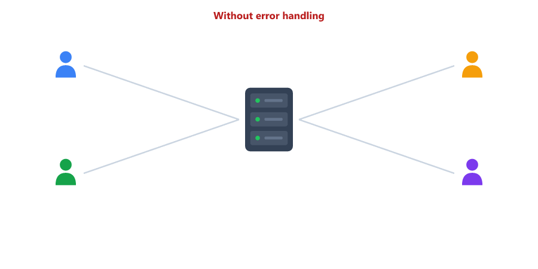
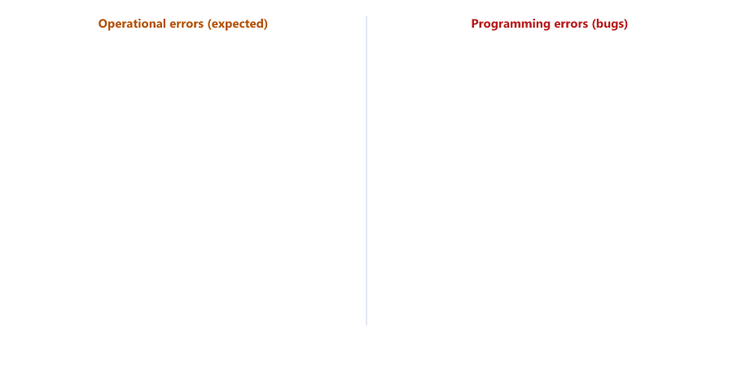
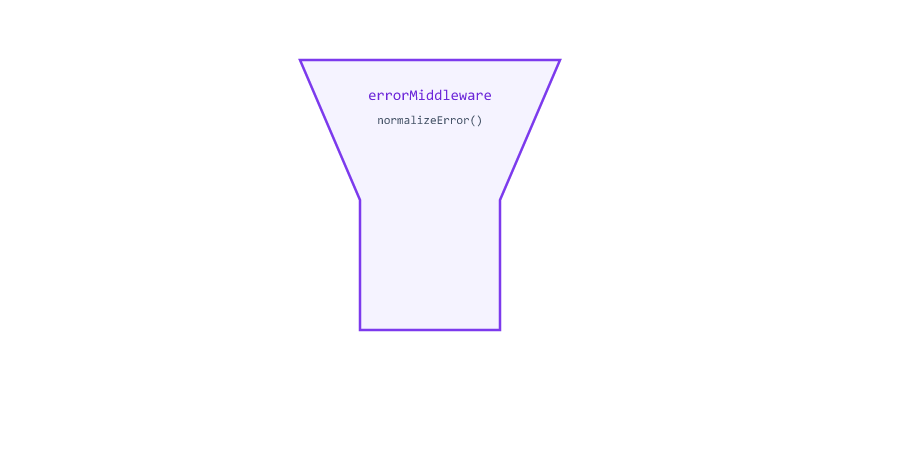
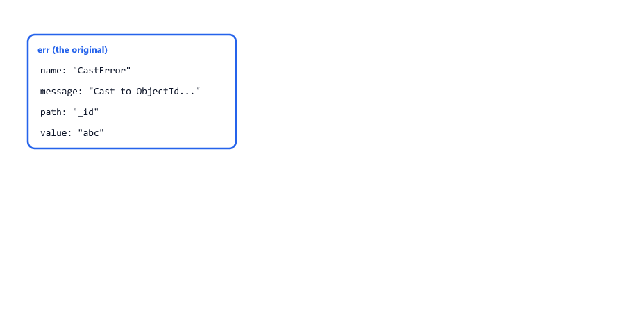
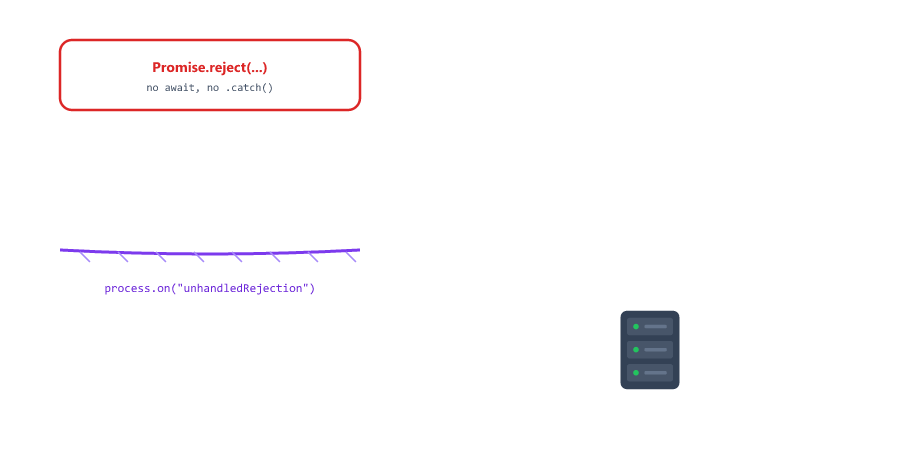
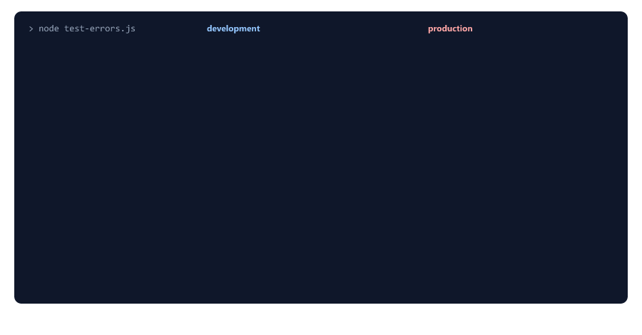

## Table of Contents

* [What is Error Handling](#what-is-error-handling)
* [Types of Errors](#types-of-errors)
* [The Error Object](#the-error-object)
* [Synchronous Errors](#synchronous-errors)
* [try-catch Blocks](#try-catch-blocks)
* [Asynchronous Errors](#asynchronous-errors)
* [Errors That Crash the Server](#errors-that-crash-the-server)
* [How Express Catches Errors](#how-express-catches-errors)
* [catchAsync for Express 4](#catchasync-for-express-4)
* [Custom Error Class](#custom-error-class)
* [Express Error Handling Middleware](#express-error-handling-middleware)
* [Handling Specific Errors](#handling-specific-errors)
* [Development vs Production Responses](#development-vs-production-responses)
* [Unhandled Rejections and Uncaught Exceptions](#unhandled-rejections-and-uncaught-exceptions)
* [Complete Error Handling Example](#complete-error-handling-example)
* [Testing Error Handling](#testing-error-handling)
* [Beginner Mistakes](#beginner-mistakes)
* [Practice Exercises](#practice-exercises)
* [Interview Questions](#interview-questions)

---

## What is Error Handling

Error handling is deciding what happens when something goes wrong

Things can go wrong in many ways

* A user sends invalid data
* A student id does not exist
* The database is down
* A file is missing
* Your code has a bug

| Without error handling                     | With error handling                          |
| ------------------------------------------ | -------------------------------------------- |
| The server crashes, every user is cut off  | The server keeps running                     |
| Users see a stack trace or nothing at all  | Users see a clear message and the right status code |
| Nobody knows what happened                 | The error is logged for the developer        |
| Internal details leak to strangers         | Details are hidden in production             |



You have already handled many errors in this course: 400 for validation (Session 15), 404 for missing students, 409 for duplicates (Session 18), CastError (Session 19). This session collects all of it into one clean system.

---

## Types of Errors

There are two main types of errors

| Operational errors                          | Programming errors (bugs)                   |
| ------------------------------------------- | ------------------------------------------- |
| Expected problems that will happen          | Mistakes in your code                       |
| Invalid input, student not found, duplicate email, wrong password, database down | `user.name` when `user` is null, a typo in a variable, calling something that is not a function |
| Tell the user what went wrong (400, 404, 409 ...) | Show a general "Something went wrong" (500) and log the details |
| You **handle** them                         | You **fix** them                            |



This difference drives the whole system: operational errors are safe to show, bugs are not.

---

## The Error Object

Every error in JavaScript is an object with a `name`, a `message` and a `stack`

```javascript
const tries = [
  () => { const user = null; return user.name; },
  () => notDefined + 1,
  () => JSON.parse("{bad"),
  () => new Array(-1),
  () => { const x = 5; x(); }
];

for (const f of tries) {
  try {
    f();
  } catch (e) {
    console.log(e.name, "|", e.message);
  }
}
```

Output

```text
TypeError | Cannot read properties of null (reading 'name')
ReferenceError | notDefined is not defined
SyntaxError | Expected property name or '}' in JSON at position 1 (line 1 column 2)
RangeError | Invalid array length
TypeError | x is not a function
```

| Built-in error  | When                                          |
| --------------- | --------------------------------------------- |
| `TypeError`     | Using a value the wrong way (`null.name`, calling a number) |
| `ReferenceError` | Using a variable that does not exist         |
| `SyntaxError`   | Text that is not valid code or JSON           |
| `RangeError`    | A number outside the allowed range            |

You create your own with `throw`

```javascript
throw new Error("Student not found");
```

`err.stack` shows where the error happened: the file, line and column, then the functions that led there. It is gold for the developer and dangerous to show to users, because it reveals your folders and code.

---

## Synchronous Errors

Synchronous errors happen immediately, in code that runs line by line

```javascript
app.get("/user", (req, res) => {
  const user = null;
  res.send(user.name); // TypeError
});
```

In Express 5 this error goes straight to the error middleware, which answers 500 (see [How Express Catches Errors](#how-express-catches-errors)). You do not need a try-catch for that.

---

## try-catch Blocks

try-catch lets **you** handle an error in place

```javascript
try {
  // Code that might throw an error
  const data = JSON.parse(text);
  console.log(data);
} catch (error) {
  // Runs only if something above threw
  console.log("Not valid JSON:", error.message);
}
```

Use try-catch when you can do something useful with the error: use a default value, show a better message, or try another way. Otherwise let the error go to the error middleware.

try-catch-finally

```javascript
async function readConfig() {
  let file;
  try {
    file = await fs.promises.open("config.json");
    const text = await file.readFile("utf8");
    return JSON.parse(text);
  } catch (error) {
    console.log("Could not read config:", error.message);
    return {};
  } finally {
    // Always runs: after try, or after catch
    if (file) await file.close();
  }
}
```

`finally` is for cleanup that must happen either way, like closing a file or a database connection (Session 17).

Decide by **type**, not by message text

```javascript
try {
  JSON.parse(text);
} catch (error) {
  if (error.name === "SyntaxError") {
    console.log("Bad JSON");
  } else {
    throw error; // not ours: let someone else handle it
  }
}
```

Comparing `error.message === "..."` breaks as soon as a message changes, for example in a new Node.js version. `throw error` in a catch passes the error on (rethrowing).

---

## Asynchronous Errors

Asynchronous errors happen later, when the work finishes (Session 03). Each async style has its own way

**Callbacks** - the error is the first argument (Session 05)

```javascript
fs.readFile("data.json", "utf8", (err, data) => {
  if (err) {
    console.log("Could not read:", err.code);
    return;
  }
  console.log(data);
});
```

**Promises** - `.catch()`

```javascript
Student.findById(id)
  .then((student) => console.log(student))
  .catch((error) => console.log("Failed:", error.message));
```

**async/await** - try-catch, or let it go up to the caller

```javascript
async function showStudent(id) {
  try {
    const student = await Student.findById(id);
    console.log(student);
  } catch (error) {
    console.log("Failed:", error.message);
  }
}
```

In routes, prefer async/await and let errors reach the error middleware.

---

## Errors That Crash the Server

Some errors are not caught by Express or by your try-catch. They **stop the whole server**, and every user is cut off. We tested each one


**1. Throwing inside a callback**

```javascript
app.get("/callback", (req, res) => {
  fs.readFile("missing.txt", (err, data) => {
    if (err) throw err; // thrown later, nobody is listening
    res.send(data);
  });
});
```

Result: the server stopped with `Error: ENOENT: no such file or directory` and exit code 1.

**2. try-catch around a timer or callback**

```javascript
app.get("/later", (req, res) => {
  try {
    setTimeout(() => {
      throw new Error("thrown later");
    }, 10);
  } catch (e) {
    res.send("caught?"); // never runs
  }
});
```

Result: crash. The try-catch finished long before the timer ran, so it was not there to catch anything.

**3. A promise nobody waits for**

```javascript
app.get("/floating", (req, res) => {
  Promise.reject(new Error("Email service is down")); // no await, no .catch
  res.json({ ok: true });
});
```

Result: the server crashed before the client even got its `{"ok":true}`. Since Node.js 15, an unhandled rejection stops the process.

| Code                                  | Fix                                                |
| ------------------------------------- | -------------------------------------------------- |
| `throw` in a callback                 | Use the promise version (`fs/promises`) with `await`, or call `next(err)` inside the callback |
| try-catch around a timer              | Put the try-catch **inside** the callback          |
| A promise without `await` or `.catch` | Always `await` it (or add `.catch()`)              |

The [safety nets](#unhandled-rejections-and-uncaught-exceptions) later in this session log these and shut down cleanly, but the real fix is in the code.

---

## How Express Catches Errors

Express 5 sends these errors to your error middleware automatically. We tested each one

| In a route                                  | Express 5                     |
| ------------------------------------------- | ----------------------------- |
| `throw` in a normal route                   | Caught → error middleware     |
| `throw` (or a rejected `await`) in an `async` route | Caught → error middleware |
| Returning a rejected promise                | Caught → error middleware     |
| `next(err)`                                 | Caught → error middleware     |
| `throw` inside a callback or timer          | **Not caught: server crashes** |
| A promise without `await`                   | **Not caught: server crashes** |


So inside routes and controllers you can simply write

```javascript
const student = await Student.findById(req.params.id); // errors go to the error middleware
```

and

```javascript
throw new AppError("Student not found", 404); // or: return next(new AppError(...))
```

`throw` and `next(err)` do the same job in an async route. `throw` stops the function by itself, `next()` needs a `return` in front of it.

---

## catchAsync for Express 4

Many existing projects and tutorials use Express 4. Express 4 does **not** catch errors from async functions. We tested it with express@4.22.3

```javascript
app.get("/plain", async (req, res) => {
  throw new Error("async error");
});
```

Result in Express 4: the error middleware never ran, and the whole server crashed with an unhandled rejection.

The fix in Express 4 is a small wrapper that catches the rejected promise and passes it to `next()`

utils/catchAsync.js

```javascript
// Express 4 does not catch errors from async functions.
// This wrapper sends them to next(err) so the error middleware gets them.
// Express 5 does this by itself, so new projects do not need it.
const catchAsync = (fn) => {
  return (req, res, next) => {
    fn(req, res, next).catch(next);
  };
};

module.exports = catchAsync;
```

```javascript
app.get("/wrapped", catchAsync(async (req, res) => {
  throw new Error("async error");
}));
```

Result in Express 4: `500 {"caughtBy":"error handler","message":"async error"}`.

| Code                    | Meaning                                                  |
| ----------------------- | -------------------------------------------------------- |
| `catchAsync(fn)`        | Takes your async route function                          |
| returns `(req, res, next) => ...` | A new route function for Express               |
| `fn(req, res, next)`    | Runs your function, which returns a promise              |
| `.catch(next)`          | If the promise rejects, call `next(err)`                 |

In Express 5 (this course), you do not need it. It does no harm, so you will see it in Sessions 29 and 30 and in many real projects.

---

## Custom Error Class

`new Error("Student not found")` has no status code. A custom error class adds one, so the error middleware knows what to answer

Create utils/AppError.js

```javascript
// An error we expect and want to show to the user, with a status code
class AppError extends Error {
  constructor(message, statusCode) {
    super(message); // sets this.message
    this.name = "AppError";
    this.statusCode = statusCode;
    this.status = `${statusCode}`.startsWith("4") ? "fail" : "error";
    this.isOperational = true; // expected problem, safe to show

    // Leave this constructor out of the stack trace
    Error.captureStackTrace(this, this.constructor);
  }
}

module.exports = AppError;
```

| Code                                  | Meaning                                                   |
| ------------------------------------- | --------------------------------------------------------- |
| `class AppError extends Error`        | AppError is an Error, with extras (like `extends EventEmitter` in Session 08) |
| `super(message)`                      | Runs the Error part first, which sets `message` and `stack` |
| `this.name = "AppError"`              | Logs show `AppError: Student not found` instead of `Error: ...` |
| `this.status`                         | `"fail"` for 4xx (the client's fault), `"error"` for 5xx (the server's fault) |
| `this.isOperational = true`           | Marks it as expected, so it is safe to show in production |
| `Error.captureStackTrace(...)`        | The stack starts where the error was created, not inside the class |

Using it

```javascript
const AppError = require("../utils/AppError");

const getStudent = async (req, res) => {
  const student = await Student.findById(req.params.id);

  if (!student) {
    throw new AppError("Student not found", 404);
  }

  res.status(200).json({ success: true, data: student });
};
```

```javascript
const err = new AppError("Student not found", 404);
console.log(err.name, err.message, err.statusCode, err.status, err instanceof Error);
```

Output

```text
AppError Student not found 404 fail true
```

Benefits

* Every expected error has a status code and a message in one line
* Controllers stay short: no `res.status(404).json(...)` repeated everywhere
* The error middleware can tell expected errors (`isOperational`) from bugs

---

## Express Error Handling Middleware

An error middleware has **four** parameters `(err, req, res, next)` (Session 14). Express calls it when anything above it throws or calls `next(err)`

```javascript
// All routes go here
app.use("/api/students", studentRoutes);

// 404 for routes that do not exist (Express 5: no "*")
app.use((req, res, next) => {
  next(new AppError(`Route ${req.method} ${req.originalUrl} not found`, 404));
});

// Error middleware must be last
app.use(errorMiddleware);
```



| Rule                                 | Why                                                    |
| ------------------------------------ | ------------------------------------------------------ |
| Exactly 4 parameters                 | With 3, Express treats it as normal middleware         |
| After all routes                     | It only receives errors from code above it             |
| The 404 handler right before it      | Unknown routes become a normal AppError                |
| `app.use("*")` or `app.all("*")`     | Crashes at startup in Express 5 (Session 12). Use `app.use((req, res, next) => ...)` |

---

## Handling Specific Errors

Libraries throw their own errors. The error middleware turns each one into an AppError with a clear message. You met most of them in Sessions 18 to 22

| Error                     | How to recognize it               | Status | Message                              |
| ------------------------- | --------------------------------- | ------ | ------------------------------------ |
| Bad id                    | `err.name === "CastError"`        | 400    | `Invalid _id: abc`                   |
| Schema rules failed       | `err.name === "ValidationError"`  | 400    | `Validation failed` + list           |
| Duplicate unique field    | `err.code === 11000`              | 409    | `email "sara@example.com" already exists` |
| Bad JSON body             | `err.type === "entity.parse.failed"` | 400 | `Request body is not valid JSON`     |
| Body too large            | `err.statusCode === 413`, `err.expose` | 413 | `request entity too large`         |
| Invalid JWT               | `err.name === "JsonWebTokenError"` | 401   | `Invalid token. Please log in again.` |
| Expired JWT               | `err.name === "TokenExpiredError"` | 401   | `Your token has expired. Please log in again.` |

A duplicate is 409 Conflict, not 400: the data is valid, it just clashes with existing data (Session 15).

The duplicate key error tells you which field clashed

```text
keyValue: { email: 'sara@example.com' }  keyPattern: { email: 1 }  code: 11000
```

So the message can name the field: `Object.keys(err.keyValue)[0]` is `"email"`.

**Never copy an error with `{ ...err }` before checking it.** Many tutorials write `let error = { ...err }` and then check `error.name`. We tested what the copy keeps

| Original error     | `err.name`          | `{ ...err }.name` |
| ------------------ | ------------------- | ----------------- |
| CastError          | `CastError`         | `undefined`       |
| ValidationError    | `ValidationError`   | `undefined`       |
| Duplicate key      | `MongoServerError`  | `undefined`       |
| `new Error("x")`   | `Error`             | `undefined`, and `message` is lost too |



`name` and `message` are not copied by `...`. With the copy, `error.name === "CastError"` is never true, and a bad id becomes a 500 in production. Always check the **original** `err`.

---

## Development vs Production Responses

The same error should look different to you and to your users

| Mode (NODE_ENV, Session 16) | Expected error (AppError)            | Bug (TypeError ...)                    |
| --------------------------- | ------------------------------------ | -------------------------------------- |
| development                 | Message + stack                      | Real message + stack                   |
| production                  | Message, no stack                    | Only "Something went wrong on the server" |


We tested the bug route `GET /api/debug/bug` (it reads `null.name`)

Development

```json
{
  "success": false,
  "status": "error",
  "message": "Cannot read properties of null (reading 'name')",
  "stack": "TypeError: Cannot read properties of null (reading 'name')\n    at C:\\project\\server.js:40:28\n ..."
}
```

Production

```json
{
  "success": false,
  "status": "error",
  "message": "Something went wrong on the server"
}
```

In both modes the full error is printed in the server terminal with `console.error`, so the developer can still fix it. Session 26 sends these logs to files.

---

## Unhandled Rejections and Uncaught Exceptions

For errors that escape everything (see [Errors That Crash the Server](#errors-that-crash-the-server)), Node.js gives you two last safety nets on the `process` object (Session 07)

| Event                 | Happens when                                       |
| --------------------- | -------------------------------------------------- |
| `uncaughtException`   | A `throw` nobody catches (for example in a callback) |
| `unhandledRejection`  | A rejected promise nobody awaits or catches         |

```javascript
process.on("uncaughtException", (err) => {
  console.error("UNCAUGHT EXCEPTION! Shutting down...");
  console.error(err);
  process.exit(1);
});

process.on("unhandledRejection", (err) => {
  console.error("UNHANDLED REJECTION! Shutting down...");
  console.error(err);
  process.exit(1);
});
```

Output when a promise is rejected without a catch (tested)

```text
UNHANDLED REJECTION! Shutting down...
Error: Database password is wrong
```

Why shut down instead of continuing? After an unexpected error, the program may be half-way through something, and its state is unknown. It is safer to stop and start fresh. On a real server, a process manager or the hosting platform restarts the app automatically.

**Put these at the very top of server.js.** We tested registering the handler 50 ms after a rejection (like the old version of this lesson, which registered it inside `.then()` after connecting): it was too late, and Node.js crashed with the normal error instead.



`server.close()` stops accepting new requests and lets running requests finish, then the callback runs. That is a cleaner stop than `process.exit(1)` alone.

---

## Complete Error Handling Example

Project structure

```text
error-handling-demo/
├── utils/
│   ├── AppError.js
│   └── catchAsync.js        only needed with Express 4
├── middleware/
│   └── errorMiddleware.js
├── models/
│   └── Student.js
├── controllers/
│   └── studentController.js
├── routes/
│   └── studentRoutes.js
├── test-errors.js
├── .env
└── server.js
```

.env

```text
PORT=5000
MONGODB_URI=mongodb://127.0.0.1:27017
DB_NAME=error_demo
NODE_ENV=development
```

utils/AppError.js is shown in [Custom Error Class](#custom-error-class), utils/catchAsync.js in [catchAsync for Express 4](#catchasync-for-express-4).

middleware/errorMiddleware.js

```javascript
const AppError = require("../utils/AppError");

// ---------- Turn known library errors into AppErrors ----------

const handleCastErrorDB = (err) => {
  return new AppError(`Invalid ${err.path}: ${err.value}`, 400);
};

const handleDuplicateFieldsDB = (err) => {
  const field = Object.keys(err.keyValue)[0];
  return new AppError(`${field} "${err.keyValue[field]}" already exists. Please use another value.`, 409);
};

const handleValidationErrorDB = (err) => {
  const error = new AppError("Validation failed", 400);
  error.errors = Object.values(err.errors).map((e) => e.message);
  return error;
};

const handleJWTError = () => new AppError("Invalid token. Please log in again.", 401);

const handleJWTExpiredError = () => new AppError("Your token has expired. Please log in again.", 401);

// Look at the ORIGINAL error and return an AppError when we know what it is
function normalizeError(err) {
  if (err instanceof AppError) return err;
  if (err.type === "entity.parse.failed") return new AppError("Request body is not valid JSON", 400);
  if (err.name === "CastError") return handleCastErrorDB(err);
  if (err.name === "ValidationError") return handleValidationErrorDB(err);
  if (err.code === 11000) return handleDuplicateFieldsDB(err);
  if (err.name === "JsonWebTokenError") return handleJWTError();
  if (err.name === "TokenExpiredError") return handleJWTExpiredError();
  // Errors from Express itself, like a body that is too large (413)
  if (err.expose && err.statusCode < 500) return new AppError(err.message, err.statusCode);
  return err; // unknown error: probably a bug
}

// ---------- Send the response ----------

// Development: show everything, it helps you fix the problem
const sendErrorDev = (err, res) => {
  res.status(err.statusCode).json({
    success: false,
    status: err.status,
    message: err.message,
    errors: err.errors,
    stack: err.stack
  });
};

// Production: show only safe, expected errors
const sendErrorProd = (err, res) => {
  if (err.isOperational) {
    return res.status(err.statusCode).json({
      success: false,
      status: err.status,
      message: err.message,
      errors: err.errors
    });
  }

  // A bug or an unknown error: never show the details to users
  res.status(500).json({
    success: false,
    status: "error",
    message: "Something went wrong on the server"
  });
};

// ---------- The error middleware (four parameters!) ----------

const errorMiddleware = (err, req, res, next) => {
  const error = normalizeError(err);

  // Server problems are logged with the full stack, for the developer
  if (!error.statusCode || error.statusCode >= 500) {
    console.error("ERROR:", err);
  }

  error.statusCode = error.statusCode || 500;
  error.status = error.status || "error";

  if (process.env.NODE_ENV === "production") {
    sendErrorProd(error, res);
  } else {
    sendErrorDev(error, res);
  }
};

module.exports = errorMiddleware;
```

| Part                  | Job                                                            |
| --------------------- | -------------------------------------------------------------- |
| `handle...` functions | Turn one kind of library error into an AppError                |
| `normalizeError()`    | Checks the original error and picks the right handler          |
| `err.expose`          | Express's own client errors (like 413) say they are safe to show |
| `sendErrorDev()`      | Everything, including the stack                                |
| `sendErrorProd()`     | Expected errors only; bugs become a general 500                |
| `console.error`       | Every 500 is logged with its stack for the developer           |

`errors: undefined` is simply left out of the JSON, so only validation errors have an `errors` list.

models/Student.js

```javascript
const mongoose = require("mongoose");

const studentSchema = new mongoose.Schema(
  {
    name: {
      type: String,
      required: [true, "Name is required"],
      trim: true,
      minlength: [2, "Name must be at least 2 characters"]
    },
    age: {
      type: Number,
      required: [true, "Age is required"],
      min: [18, "Age must be at least 18"],
      max: [60, "Age cannot exceed 60"],
      cast: "Age must be a number"
    },
    email: {
      type: String,
      required: [true, "Email is required"],
      unique: true,
      lowercase: true,
      trim: true,
      match: [/^\S+@\S+\.\S+$/, "Please enter a valid email"]
    }
  },
  { timestamps: true }
);

module.exports = mongoose.model("Student", studentSchema);
```

controllers/studentController.js

```javascript
const Student = require("../models/Student");
const AppError = require("../utils/AppError");

// Copy only the fields a client may set (Session 20)
function pickFields(body) {
  const data = {};
  for (const key of ["name", "age", "email"]) {
    if (body[key] !== undefined) {
      data[key] = body[key];
    }
  }
  return data;
}

// GET /api/students
const getAllStudents = async (req, res) => {
  const students = await Student.find().sort("name");
  res.status(200).json({ success: true, count: students.length, data: students });
};

// GET /api/students/:id
const getStudent = async (req, res) => {
  const student = await Student.findById(req.params.id); // bad id → CastError → 400

  if (!student) {
    throw new AppError("Student not found", 404);
  }

  res.status(200).json({ success: true, data: student });
};

// POST /api/students
const createStudent = async (req, res) => {
  // ValidationError → 400, duplicate email → 409, both handled in errorMiddleware
  const student = await Student.create(pickFields(req.body || {}));
  res.status(201).json({ success: true, data: student });
};

// PATCH /api/students/:id
const updateStudent = async (req, res) => {
  const student = await Student.findByIdAndUpdate(req.params.id, pickFields(req.body || {}), {
    returnDocument: "after",
    runValidators: true
  });

  if (!student) {
    throw new AppError("Student not found", 404);
  }

  res.status(200).json({ success: true, data: student });
};

// DELETE /api/students/:id
const deleteStudent = async (req, res) => {
  const student = await Student.findByIdAndDelete(req.params.id);

  if (!student) {
    throw new AppError("Student not found", 404);
  }

  res.status(200).json({ success: true, message: "Student deleted successfully" });
};

module.exports = { getAllStudents, getStudent, createStudent, updateStudent, deleteStudent };
```

No try-catch anywhere. Every controller only describes the happy path and the one expected problem (404).

routes/studentRoutes.js

```javascript
const express = require("express");
const router = express.Router();

const {
  getAllStudents,
  getStudent,
  createStudent,
  updateStudent,
  deleteStudent
} = require("../controllers/studentController");

router.route("/")
  .get(getAllStudents)
  .post(createStudent);

router.route("/:id")
  .get(getStudent)
  .patch(updateStudent)
  .delete(deleteStudent);

module.exports = router;
```

server.js

```javascript
// ---------- Safety nets: the very first code that runs ----------
let server;

process.on("uncaughtException", (err) => {
  console.error("UNCAUGHT EXCEPTION! Shutting down...");
  console.error(err);
  process.exit(1);
});

process.on("unhandledRejection", (err) => {
  console.error("UNHANDLED REJECTION! Shutting down...");
  console.error(err);
  // Let requests that are still running finish, then stop
  if (server) {
    server.close(() => process.exit(1));
  } else {
    process.exit(1);
  }
});

// ---------- The app ----------
require("dotenv").config({ quiet: true });
const express = require("express");
const mongoose = require("mongoose");

const studentRoutes = require("./routes/studentRoutes");
const AppError = require("./utils/AppError");
const errorMiddleware = require("./middleware/errorMiddleware");

const app = express();
const PORT = process.env.PORT || 5000;

app.use(express.json({ limit: "10kb" })); // bodies over 10 kb get 413

app.use("/api/students", studentRoutes);

// Only for this lesson: a route with a bug, to see how bugs are handled
app.get("/api/debug/bug", (req, res) => {
  const student = null;
  res.json({ name: student.name }); // TypeError
});

// 404 for routes that do not exist (Express 5: no "*")
app.use((req, res, next) => {
  next(new AppError(`Route ${req.method} ${req.originalUrl} not found`, 404));
});

// Error middleware: always last
app.use(errorMiddleware);

async function startServer() {
  await mongoose.connect(process.env.MONGODB_URI, { dbName: process.env.DB_NAME });
  console.log("Connected to MongoDB");

  server = app.listen(PORT, (err) => {
    if (err) {
      console.log("Could not start server:", err.message);
      process.exit(1);
    }

    console.log(`Server running on port ${PORT} (${process.env.NODE_ENV} mode)`);
  });
}

startServer(); // if connecting fails, the rejection reaches the safety net
```

| Part                                | Why                                                       |
| ----------------------------------- | --------------------------------------------------------- |
| `let server` at the top             | The safety net needs it to close the server               |
| Safety nets before `require`        | They must exist before anything can fail                  |
| `express.json({ limit: "10kb" })`   | A huge body is refused with 413 before it fills memory    |
| No try-catch in `startServer`       | If the database is down, the rejection reaches the safety net, which logs it and exits |

We tested a database that is not running (`MONGODB_URI` pointing to an unused port)

```text
UNHANDLED REJECTION! Shutting down...
MongooseServerSelectionError: connect ECONNREFUSED 127.0.0.1:27099
```

Remove the `/api/debug/bug` route once you have tested it.

---

## Testing Error Handling

test-errors.js triggers every kind of error

```javascript
const BASE = "http://localhost:5000";

async function send(method, path, body, raw) {
  const res = await fetch(BASE + path, {
    method,
    headers: { "Content-Type": "application/json" },
    body: raw !== undefined ? raw : body ? JSON.stringify(body) : undefined
  });
  const data = await res.json();
  return { status: res.status, data };
}

function show(label, { status, data }) {
  let info = data.message || "";
  if (data.errors) info += " " + JSON.stringify(data.errors);
  if (data.stack) info += " (+ stack)";
  if (data.success) info = "ok";
  console.log(`${label.padEnd(28)} ${status} ${info}`);
}

async function test() {
  const created = await send("POST", "/api/students", { name: "Sara", age: 22, email: "sara@example.com" });
  show("Create Sara", created);
  const id = created.data.data._id;

  show("Unknown route", await send("GET", "/api/teachers"));
  show("Student not found", await send("GET", "/api/students/6ac203b2b7392100f72ccf05"));
  show("Invalid id", await send("GET", "/api/students/abc"));
  show("Validation errors", await send("POST", "/api/students", { name: "S", age: 12, email: "bad" }));
  show("Duplicate email", await send("POST", "/api/students", { name: "Copy", age: 30, email: "sara@example.com" }));
  show("Broken JSON", await send("POST", "/api/students", null, "{bad json"));
  show("Body too large", await send("POST", "/api/students", { name: "x".repeat(20000), age: 20, email: "big@example.com" }));
  show("Wrong type in PATCH", await send("PATCH", "/api/students/" + id, { age: "old" }));
  show("A bug in the code", await send("GET", "/api/debug/bug"));
  show("Delete Sara", await send("DELETE", "/api/students/" + id));
}

test();
```

Start the server in development mode and run the test

```bash
node server.js
node test-errors.js
```

Output (development)

```text
Create Sara                  201 ok
Unknown route                404 Route GET /api/teachers not found (+ stack)
Student not found            404 Student not found (+ stack)
Invalid id                   400 Invalid _id: abc (+ stack)
Validation errors            400 Validation failed ["Name must be at least 2 characters","Age must be at least 18","Please enter a valid email"] (+ stack)
Duplicate email              409 email "sara@example.com" already exists. Please use another value. (+ stack)
Broken JSON                  400 Request body is not valid JSON (+ stack)
Body too large               413 request entity too large (+ stack)
Wrong type in PATCH          400 Invalid age: old (+ stack)
A bug in the code            500 Cannot read properties of null (reading 'name') (+ stack)
Delete Sara                  200 ok
```

Now set `NODE_ENV=production` in .env, restart the server, empty the students collection, and run the test again

Output (production)

```text
Create Sara                  201 ok
Unknown route                404 Route GET /api/teachers not found
Student not found            404 Student not found
Invalid id                   400 Invalid _id: abc
Validation errors            400 Validation failed ["Name must be at least 2 characters","Age must be at least 18","Please enter a valid email"]
Duplicate email              409 email "sara@example.com" already exists. Please use another value.
Broken JSON                  400 Request body is not valid JSON
Body too large               413 request entity too large
Wrong type in PATCH          400 Invalid age: old
A bug in the code            500 Something went wrong on the server
Delete Sara                  200 ok
```



Expected errors look the same in both modes, without the stack in production. Only the bug changes: the real message in development, a safe message in production. Meanwhile the server terminal shows

```text
ERROR: TypeError: Cannot read properties of null (reading 'name')
    at C:\project\server.js:40:28
    ...
```

(paths shortened)

---

## Beginner Mistakes

### Mistake 1

An error middleware with three parameters.

`(err, req, res) => ...` is treated as normal middleware and never receives errors (Session 14). Always write `(err, req, res, next)`.

---

### Mistake 2

Putting the error middleware before the routes.

It only receives errors from code above it. Put it last, after the 404 handler.

---

### Mistake 3

`app.all("*", ...)` or `app.use("*", ...)` for 404.

Crashes at startup in Express 5. Use `app.use((req, res, next) => ...)`.

---

### Mistake 4

Sending `error.message` of every error to the client.

A bug's message and stack reveal your code. In production, show only operational errors.

---

### Mistake 5

`let error = { ...err }` before checking `error.name`.

The copy has no `name` and no `message`. Check the original `err`.

---

### Mistake 6

`throw` inside a callback, or a promise without `await`.

Express cannot catch these, and the server crashes. Use `await` with promise-based functions.

---

### Mistake 7

`next(new AppError(...))` without `return`.

The code below keeps running and may try to send a second response (`ERR_HTTP_HEADERS_SENT`). Write `return next(...)`, or use `throw`.

---

### Mistake 8

Registering `process.on("unhandledRejection")` late.

If it is added after the error happened (for example inside `.then()`), it is too late. Put the safety nets at the very top of server.js.

---

### Mistake 9

A try-catch in every controller that just sends 500.

It hides the real error type (a duplicate becomes 500 instead of 409) and repeats code. Let errors reach the error middleware.

---

### Mistake 10

Answering a duplicate with 400.

The input is valid, it conflicts with existing data. Use 409.

---

## Practice Exercises

### Exercise 1

Add a route `GET /api/students/:id/report` that reads a file `reports/<id>.txt` with `fs/promises`. If the file does not exist (`err.code === "ENOENT"`), throw an `AppError("Report not found", 404)`

### Exercise 2

Add a `handleRateLimit` case: express-rate-limit (Session 14) answers 429 itself, but change its `handler` option to call `next(new AppError("Too many requests, try again later", 429))` so the answer uses your format

### Exercise 3

Create a `NotFoundError` class that extends `AppError` and always uses status 404: `throw new NotFoundError("Student")` should give the message "Student not found"

### Exercise 4

Add the protect middleware from Session 22 to this project, but call `jwt.verify()` **without** a try-catch. Test a bad token and an expired token: the error middleware should answer 401 with the right message

### Exercise 5

Add a request id to every error response: in a middleware, set `req.id = Date.now().toString()`, and include `requestId: req.id` in error responses and logs. Why does this help when users report a problem?

### Exercise 6

Write test cases for an `uncaughtException`: a route that does `setTimeout(() => { throw new Error("late") }, 10)`. Watch the safety net log it and stop the server. Then fix the route

---

## Interview Questions

### What is the difference between operational and programming errors

Operational errors are expected problems (invalid input, not found, database down) that you handle and show. Programming errors are bugs that you fix; users only see a general 500

### How do you handle synchronous errors

With try-catch, or in Express 5 by letting them reach the error middleware

### How do you handle asynchronous errors

Callbacks: check the first err argument. Promises: .catch(). async/await: try-catch, or let the error go to the caller or the error middleware

### Why can't try-catch catch an error thrown in setTimeout

The callback runs later, after the try-catch has already finished

### What is Express error handling middleware

Middleware with 4 parameters (err, req, res, next). Express calls it when a route throws or calls next(err)

### Why must the error handler be the last middleware

It only receives errors from routes and middleware registered before it

### Does Express 5 catch errors in async route handlers

Yes. Express 4 does not, which is why catchAsync wrappers exist

### What does catchAsync do

It wraps an async route and passes a rejected promise to next(err), so Express 4 sends it to the error middleware

### Why create a custom error class

To attach a status code and an isOperational flag, so the error middleware knows what to answer and what is safe to show

### Why hide error details in production

Messages and stacks reveal file paths, code and internal state, which helps attackers

### What is unhandledRejection

The event for a rejected promise that nobody awaited or caught. Since Node.js 15 it crashes the process by default

### What is uncaughtException

The event for a thrown error that nobody caught, for example inside a callback

### Why exit the process after an uncaught exception

The program's state is unknown after an unexpected error. Restarting is safer than continuing; a process manager starts it again

### What status code should a duplicate email get

409 Conflict

---
