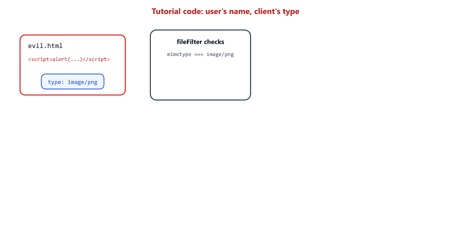
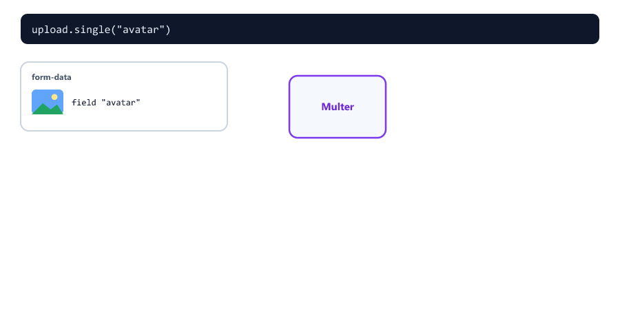
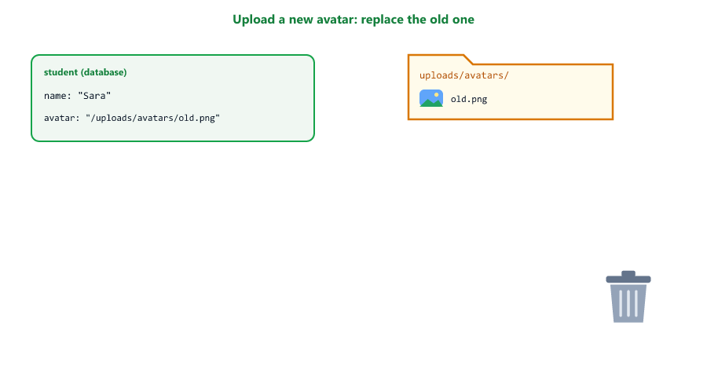
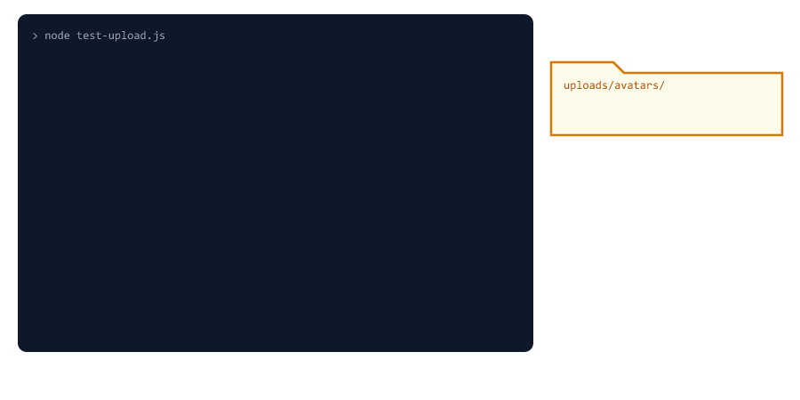

## Table of Contents

* [What is File Upload](#what-is-file-upload)
* [What is Multer](#what-is-multer)
* [Installing Multer](#installing-multer)
* [Basic File Upload](#basic-file-upload)
* [What is in req.file](#what-is-in-reqfile)
* [Never Trust the File Name](#never-trust-the-file-name)
* [Custom File Names](#custom-file-names)
* [File Type Validation](#file-type-validation)
* [Never Trust the File Type](#never-trust-the-file-type)
* [File Size Limits](#file-size-limits)
* [Multiple File Upload](#multiple-file-upload)
* [Serving Uploaded Files](#serving-uploaded-files)
* [Error Handling for Uploads](#error-handling-for-uploads)
* [Saving the File in the Database](#saving-the-file-in-the-database)
* [Complete File Upload API](#complete-file-upload-api)
* [Testing File Upload](#testing-file-upload)
* [Disk or Cloud Storage](#disk-or-cloud-storage)
* [Beginner Mistakes](#beginner-mistakes)
* [Practice Exercises](#practice-exercises)
* [Interview Questions](#interview-questions)

---

## What is File Upload

File upload allows users to send files to your server

Examples of file upload

* Profile picture
* Document upload
* Image gallery
* Resume submission

How file upload works

1. The user picks a file on their computer or phone
2. The browser sends the file inside a request
3. The server receives it and saves it to disk (or cloud storage)
4. The server saves the file's address in the database
5. The server answers with the file's URL


A file cannot be sent as JSON. JSON is text, and a picture is binary data. Files use a different body format: **multipart/form-data**

| Body type             | Content-Type                         | Used for                    | Read in Express by       |
| --------------------- | ------------------------------------ | --------------------------- | ------------------------ |
| JSON                  | `application/json`                   | Normal API data             | `express.json()`         |
| Form                  | `application/x-www-form-urlencoded`  | Simple HTML forms (Session 21) | `express.urlencoded()` |
| Multipart             | `multipart/form-data`                | Forms with files            | Multer                   |

"Multipart" means the body has several parts, one per field, separated by a random line called the **boundary**. This is a real request body with a text field and a file (made with Node.js's `FormData`)

```text
Content-Type: multipart/form-data; boundary=----formdata-undici-066756860306

------formdata-undici-066756860306
Content-Disposition: form-data; name="name"

Sara
------formdata-undici-066756860306
Content-Disposition: form-data; name="avatar"; filename="cat.png"
Content-Type: image/png

(the bytes of the picture)
------formdata-undici-066756860306--
```

Each part says its field `name`. A file part also says its `filename` and its `Content-Type`. Remember this: **both are written by the client**, so they can be anything. You will see why that matters.

---

## What is Multer

Multer is a middleware for handling file uploads in Express

It reads multipart/form-data bodies (Session 14 middleware)

| Multer does                                   | Result                       |
| --------------------------------------------- | ---------------------------- |
| Splits the body into its parts                | -                            |
| Saves each file to disk (or keeps it in memory) | A file in your uploads folder |
| Gives you information about each file         | `req.file` or `req.files`    |
| Puts the text fields in `req.body`            | `req.body.name`              |
| Checks limits (size, number of files)         | A `MulterError` if a limit is broken |

Think of Multer like the post room of a company

* Packages (files) and letters (text fields) arrive in one big delivery
* The post room opens it, stores each package on a shelf, and writes a label
* You get the labels (`req.file`), not the packages themselves

---

## Installing Multer

Create a new project

```bash
mkdir file-upload-api
cd file-upload-api
npm init -y
```

Install packages

```bash
npm install express multer
```

This session uses multer 2 (version 2.4.0 when we tested), which works with Express 5.

---

## Basic File Upload

The simplest possible upload

server.js

```javascript
const express = require("express");
const multer = require("multer");

const app = express();

// Save uploaded files in the folder "uploads"
const upload = multer({ dest: "uploads/" });

// "avatar" is the name of the form field that holds the file
app.post("/upload", upload.single("avatar"), (req, res) => {
  console.log(req.file);
  console.log(req.body);

  res.json({ success: true, file: req.file });
});

app.listen(3000, (err) => {
  if (err) {
    console.log("Could not start server:", err.message);
    return;
  }

  console.log("Server running on port 3000");
});
```

| Code                          | Meaning                                                  |
| ----------------------------- | -------------------------------------------------------- |
| `multer({ dest: "uploads/" })` | Create an upload middleware that saves files in uploads/ (Multer creates the folder) |
| `upload.single("avatar")`     | Expect **one** file in the form field named `avatar`     |
| Before the handler            | Multer runs first, then your handler sees `req.file`     |

Test with curl (macOS, Linux, Git Bash, and Windows Command Prompt)

```bash
curl -X POST http://localhost:3000/upload -F "avatar=@cat.png" -F "name=Sara"
```

`-F` sends a multipart form. `avatar=@cat.png` means "the field avatar contains the file cat.png" (the `@` means "read this file"). In Windows PowerShell, `curl` is a different command; type `curl.exe` instead.

---

## What is in req.file

The terminal shows (tested)

```text
{
  fieldname: 'avatar',
  originalname: 'cat.png',
  encoding: '7bit',
  mimetype: 'image/png',
  path: 'uploads\\cf93525162fdd5d1c13d6823f1b2cc3a',
  destination: 'uploads/',
  filename: 'cf93525162fdd5d1c13d6823f1b2cc3a',
  size: 70
}
[Object: null prototype] { name: 'Sara' }
```


| Property       | Meaning                                         | Who decided it      |
| -------------- | ----------------------------------------------- | ------------------- |
| `fieldname`    | The form field name                             | Client              |
| `originalname` | The file name on the user's computer            | **Client**          |
| `mimetype`     | The type, like `image/png`                      | **Client**          |
| `size`         | Size in bytes                                   | Multer (measured)   |
| `destination`  | The folder                                      | You                 |
| `filename`     | The name on your disk                           | You (or random)     |
| `path`         | Folder + file name                              | Multer              |

Things to notice

* With only `dest`, Multer gives a random name **without an extension**. Safe, but the file does not open by double-clicking. The next sections fix this.
* `path` uses `\\` on Windows and `/` on macOS and Linux (Session 06). Never build a URL from `req.file.path`.
* `req.body` holds the text fields. `[Object: null prototype]` is just a plain object without the usual extras; `req.body.name` works normally.
* If no file was sent, `req.file` is `undefined`, and the request still succeeds. Always check it.

---

## Never Trust the File Name

Many tutorials save files with the user's own file name

```javascript
filename: (req, file, cb) => {
  cb(null, file.originalname); // dangerous
}
```

We tested what goes wrong

| Upload                             | Result                                                       |
| ---------------------------------- | ------------------------------------------------------------ |
| Two users both upload `photo.png`  | The second file **overwrites** the first. User 1 now shows user 2's photo |
| A file named `evil.html`           | Saved as `evil.html`, and served as a web page (see [Never Trust the File Type](#never-trust-the-file-type)) |
| A name with `../` in it            | Multer removed the `../` part, so the file stayed in uploads (good) |
| Names with spaces, `#`, emoji      | Ugly or broken URLs                                          |


The rule: **you** choose the name and the extension. Keep `originalname` only as information, if you need it at all.

---

## Custom File Names

`multer.diskStorage()` lets you choose the folder and the name

```javascript
const multer = require("multer");
const path = require("path");
const crypto = require("crypto");
const fs = require("fs");

// Where avatars are saved (Session 06: build paths from __dirname)
const AVATAR_DIR = path.join(__dirname, "..", "uploads", "avatars");
fs.mkdirSync(AVATAR_DIR, { recursive: true });

// Allowed types. The extension comes from THIS list, never from the user's file name
const IMAGE_TYPES = {
  "image/jpeg": ".jpg",
  "image/png": ".png",
  "image/webp": ".webp"
};

const storage = multer.diskStorage({
  destination: (req, file, cb) => {
    cb(null, AVATAR_DIR);
  },
  filename: (req, file, cb) => {
    // A random, unique name: no overwrites, no strange characters
    cb(null, crypto.randomUUID() + IMAGE_TYPES[file.mimetype]);
  }
});
```

| Code                               | Meaning                                                 |
| ---------------------------------- | ------------------------------------------------------- |
| `destination`, `filename`          | Functions Multer calls for each file                    |
| `cb(null, value)`                  | A callback: first argument is an error (`null` = none), second is the answer (Session 05 style) |
| `fs.mkdirSync(..., { recursive: true })` | With diskStorage you must create the folder yourself (Session 05) |
| `crypto.randomUUID()`              | A random id like `7f25e53d-85c3-4fd7-9ca1-0cfff6757958`. Two uploads never get the same name |
| `IMAGE_TYPES[file.mimetype]`       | The extension comes from our list, so a file can never be saved as `.html` or `.js` |

Saved files now look like `7f25e53d-85c3-4fd7-9ca1-0cfff6757958.png`.

---

## File Type Validation

`fileFilter` decides for each file: accept or reject

```javascript
const fileFilter = (req, file, cb) => {
  if (IMAGE_TYPES[file.mimetype]) {
    cb(null, true); // accept
  } else {
    cb(new AppError("Only JPEG, PNG and WEBP images are allowed", 400), false); // reject
  }
};
```

| Call                             | Result (tested)                                              |
| -------------------------------- | ------------------------------------------------------------ |
| `cb(null, true)`                 | The file is saved                                            |
| `cb(new AppError(...), false)`   | The whole request fails with your error                      |
| `cb(null, false)`                | The file is **silently skipped**. The request still succeeds, `req.file` is just missing |

Use an `AppError` (Session 24), not `new Error(...)`. A plain Error has no status code and no `isOperational`, so the error middleware would answer 500 "Something went wrong" in production instead of a helpful 400.

`fileFilter` runs **before** the file is saved, so rejected files never touch your disk.

---

## Never Trust the File Type

`file.mimetype` comes from the `Content-Type` line the **client** wrote in the request. Anyone can write `image/png` for any file.

We uploaded a file named `evil.html`, containing `<script>alert(document.cookie)</script>`, with the type `image/png`, to the tutorial-style code (user's file name + mimetype check)

| Step                                         | Result                                   |
| -------------------------------------------- | ---------------------------------------- |
| fileFilter checks `file.mimetype`            | `image/png` → accepted                   |
| Saved as                                     | `uploads/evil.html`                      |
| Someone opens `/uploads/evil.html`           | Served as `text/html`, the script **runs** |



That is stored XSS (Session 21): anyone who opens the link runs the attacker's JavaScript on your domain.

Three layers stop it

| Layer                                           | Stops                                               |
| ----------------------------------------------- | --------------------------------------------------- |
| Extension from our MIME list, not the file name | The file is saved as `.png`, so it is served as `image/png`, never as a page |
| `X-Content-Type-Options: nosniff` on uploads    | The browser trusts the type we send and never guesses ("sniffs") it |
| Check the file's first bytes                    | A file that is not really an image is deleted       |

The first bytes of a file reveal its real type. They are called **magic numbers** or the file signature

utils/checkImage.js

```javascript
const fs = require("fs/promises");

// Every real image file starts with the same few bytes ("magic numbers")
const SIGNATURES = {
  "image/png": "89504e47", // ‰PNG
  "image/jpeg": "ffd8ff",
  "image/webp": "52494646" // RIFF
};

// Is the saved file really the type the client said?
async function isRealImage(file) {
  const data = await fs.readFile(file.path);
  const firstBytes = data.toString("hex", 0, 4);
  return firstBytes.startsWith(SIGNATURES[file.mimetype]);
}

module.exports = { isRealImage };
```

`data.toString("hex", 0, 4)` turns the first 4 bytes of the Buffer (Session 05) into hex text. Every PNG starts with `89 50 4e 47`, every JPEG with `ff d8 ff`. The text `<script>` starts with `3c 73 63 72`, so it fails.

---

## File Size Limits

Without a limit, someone can upload a 10 GB file and fill your disk

```javascript
const avatarUpload = multer({
  storage,
  fileFilter,
  limits: {
    fileSize: 2 * 1024 * 1024, // 2 MB
    files: 1
  }
});
```

| Limit        | Meaning                              | Error code when broken |
| ------------ | ------------------------------------ | ---------------------- |
| `fileSize`   | Maximum bytes per file               | `LIMIT_FILE_SIZE`      |
| `files`      | Maximum number of files per request  | `LIMIT_FILE_COUNT`     |
| `fields`     | Maximum number of text fields        | `LIMIT_FIELD_COUNT`    |

`2 * 1024 * 1024` is 2 MB: 1024 bytes = 1 KB, 1024 KB = 1 MB.

Multer stops reading as soon as the limit is passed, and deletes the part that was already written. We tested a 3 MB upload against a 2 MB limit: `MulterError: File too large`, code `LIMIT_FILE_SIZE`, and no file was left in the folder.

Different routes can have different limits: just create a second `multer({...})` with other limits, for example 100 MB for videos.

---

## Multiple File Upload

| Method                                  | Use                                   | Files in             |
| --------------------------------------- | ------------------------------------- | -------------------- |
| `upload.single("avatar")`               | One file in one field                 | `req.file`           |
| `upload.array("photos", 5)`             | Up to 5 files in the same field       | `req.files` (array)  |
| `upload.fields([{ name, maxCount }, ...])` | Different fields                   | `req.files.photo[0]`, `req.files.certificates` |

gallery.js

```javascript
const express = require("express");
const multer = require("multer");
const path = require("path");
const crypto = require("crypto");
const fs = require("fs");

const app = express();

const GALLERY_DIR = path.join(__dirname, "uploads", "gallery");
fs.mkdirSync(GALLERY_DIR, { recursive: true });

const IMAGE_TYPES = { "image/jpeg": ".jpg", "image/png": ".png", "image/webp": ".webp" };

const upload = multer({
  storage: multer.diskStorage({
    destination: (req, file, cb) => cb(null, GALLERY_DIR),
    filename: (req, file, cb) => cb(null, crypto.randomUUID() + IMAGE_TYPES[file.mimetype])
  }),
  fileFilter: (req, file, cb) => cb(null, Boolean(IMAGE_TYPES[file.mimetype])),
  limits: { fileSize: 2 * 1024 * 1024 }
});

// Up to 5 files in the field "photos"
app.post("/gallery", upload.array("photos", 5), (req, res) => {
  res.json({
    count: req.files.length,
    title: req.body.title, // text fields arrive in req.body
    files: req.files.map((f) => ({ original: f.originalname, saved: f.filename, size: f.size }))
  });
});

// Different fields in one form
app.post("/application", upload.fields([
  { name: "photo", maxCount: 1 },
  { name: "certificates", maxCount: 3 }
]), (req, res) => {
  res.json({
    photo: req.files.photo ? req.files.photo[0].filename : null,
    certificates: (req.files.certificates || []).length
  });
});

app.use((err, req, res, next) => {
  res.status(400).json({ code: err.code, message: err.message });
});

module.exports = app;
```



We tested it

| Request                                                         | Answer                                                       |
| --------------------------------------------------------------- | ------------------------------------------------------------ |
| `title=Sports day`, 2 PNGs and 1 `.txt` in `photos`             | `{"count":2,"title":"Sports day","files":[...]}`, the text file was skipped by `cb(null, false)` |
| 6 PNGs in `photos` (max 5)                                      | 400 `LIMIT_UNEXPECTED_FILE`, "Unexpected file field"         |
| 1 file in `photo`, 2 in `certificates`                          | `{"photo":"6f5ccb0c-...png","certificates":2}`               |

Notice: more files than `maxCount` gives `LIMIT_UNEXPECTED_FILE`, the same code as a wrong field name. The files already saved in that request were deleted automatically.

Here the fileFilter uses `cb(null, Boolean(...))`, which silently skips wrong types. In an API, rejecting with a clear message is usually kinder.

---

## Serving Uploaded Files

Saved files are just files in a folder. Use `express.static` (Session 14) to give them URLs

```javascript
// Uploaded files are public at /uploads/...
app.use("/uploads", express.static(path.join(__dirname, "uploads"), {
  setHeaders: (res) => {
    // The browser must trust the file type we send and never guess it
    res.set("X-Content-Type-Options", "nosniff");
  }
}));
```

Now `uploads/avatars/7f25e53d-....png` is at `http://localhost:5000/uploads/avatars/7f25e53d-....png`. We tested it: `200 image/png`.

Build the URL from `req.file.filename`, never from `req.file.path`

```javascript
const url = `/uploads/avatars/${req.file.filename}`;
```

`req.file.path` is a disk path: `C:\project\uploads\avatars\....png` on Windows. Put that in a URL and it breaks.

Save the **relative** URL (`/uploads/avatars/...`) in the database. The front end adds the domain. If your domain changes, nothing in the database has to change.

Everything in uploads is **public**: anyone with the link can open it. Do not put private documents there. For private files, write a route that checks `protect` (Session 22) and sends the file with `res.sendFile()` (Session 12).

---

## Error Handling for Uploads

Multer errors are `MulterError` objects with a `code`. We tested the real codes

| Situation                                  | `err.code`               | `err.message`            |
| ------------------------------------------ | ------------------------ | ------------------------ |
| File larger than `fileSize`                | `LIMIT_FILE_SIZE`        | File too large           |
| More files than `limits.files`             | `LIMIT_FILE_COUNT`       | Too many files           |
| Wrong field name, or more than `maxCount`  | `LIMIT_UNEXPECTED_FILE`  | Unexpected file field    |

Many tutorials check `err.code === "FILE_TOO_LARGE"`. That code does not exist, so the check never matches.

Add a Multer case to the error middleware from Session 24 (middleware/errorMiddleware.js)

```javascript
const handleMulterError = (err) => {
  if (err.code === "LIMIT_FILE_SIZE") {
    return new AppError("File is too large. The maximum is 2 MB", 413);
  }
  if (err.code === "LIMIT_FILE_COUNT") {
    return new AppError("Too many files", 400);
  }
  if (err.code === "LIMIT_UNEXPECTED_FILE") {
    // Also used when an array field gets more files than its maxCount
    return new AppError(`Unexpected file in field "${err.field}" (wrong field name or too many files)`, 400);
  }
  return new AppError(err.message, 400);
};
```

and one line in `normalizeError()`

```javascript
  if (err.name === "MulterError") return handleMulterError(err);
```


413 Payload Too Large is the correct status for a file that is too big. `err.field` tells you which field caused the problem.

Express sends Multer's errors to the error middleware by itself, because `upload.single()` is normal middleware. You do not need the `upload.single("file")(req, res, (err) => ...)` style from old tutorials.

---

## Saving the File in the Database

A real app does not just save a file. It connects it to something: a student's avatar, a product's photo. We add an `avatar` field to the Student model from Session 24

```javascript
    avatar: {
      type: String // a URL path like /uploads/avatars/<file>.png
    }
```

The database stores only the URL. The file itself stays on disk. Databases are bad at storing big files, and disks and file servers are good at it.

Three things to get right



| Situation                                      | Do                                                |
| ---------------------------------------------- | ------------------------------------------------- |
| Something fails after Multer saved the file (bad id, student not found, not a real image) | Delete the new file, or it stays forever with no owner |
| The student already had an avatar              | Delete the old file after the new one is saved    |
| The student or avatar is deleted               | Delete the file too                               |

Files nobody points to are called **orphan files**. They slowly fill your disk. In our tests, after 2 good uploads and 5 failed ones, exactly 1 file was left in the folder.

---

## Complete File Upload API

Project structure (the Session 24 project, plus uploads)

```text
file-upload-api/
├── controllers/
│   ├── studentController.js     from Session 24
│   └── avatarController.js      new
├── middleware/
│   ├── errorMiddleware.js       Session 24 + Multer case
│   └── upload.js                new
├── models/
│   └── Student.js               Session 24 + avatar field
├── routes/
│   └── studentRoutes.js
├── uploads/
│   └── avatars/                 created automatically
├── utils/
│   ├── AppError.js              from Session 24
│   └── checkImage.js            new
├── .env
├── .gitignore
├── server.js
└── test-upload.js
```

Add `uploads/` to .gitignore: uploaded files are data, not code.

```text
node_modules/
.env
uploads/
```

middleware/upload.js

```javascript
const multer = require("multer");
const path = require("path");
const crypto = require("crypto");
const fs = require("fs");
const AppError = require("../utils/AppError");

// Where avatars are saved (Session 06: build paths from __dirname)
const AVATAR_DIR = path.join(__dirname, "..", "uploads", "avatars");
fs.mkdirSync(AVATAR_DIR, { recursive: true });

// Allowed types. The extension comes from THIS list, never from the user's file name
const IMAGE_TYPES = {
  "image/jpeg": ".jpg",
  "image/png": ".png",
  "image/webp": ".webp"
};

const storage = multer.diskStorage({
  destination: (req, file, cb) => {
    cb(null, AVATAR_DIR);
  },
  filename: (req, file, cb) => {
    // A random, unique name: no overwrites, no strange characters
    cb(null, crypto.randomUUID() + IMAGE_TYPES[file.mimetype]);
  }
});

const fileFilter = (req, file, cb) => {
  if (IMAGE_TYPES[file.mimetype]) {
    cb(null, true); // accept
  } else {
    cb(new AppError("Only JPEG, PNG and WEBP images are allowed", 400), false); // reject
  }
};

const avatarUpload = multer({
  storage,
  fileFilter,
  limits: {
    fileSize: 2 * 1024 * 1024, // 2 MB
    files: 1
  }
});

module.exports = { avatarUpload, AVATAR_DIR };
```

utils/checkImage.js is shown in [Never Trust the File Type](#never-trust-the-file-type).

controllers/avatarController.js

```javascript
const fs = require("fs/promises");
const path = require("path");
const Student = require("../models/Student");
const AppError = require("../utils/AppError");
const { AVATAR_DIR } = require("../middleware/upload");
const { isRealImage } = require("../utils/checkImage");

// Delete a file, and ignore it if it is already gone
async function removeFile(filePath) {
  try {
    await fs.unlink(filePath);
  } catch (err) {
    if (err.code !== "ENOENT") throw err;
  }
}

// PATCH /api/students/:id/avatar   (form-data, field "avatar")
const setAvatar = async (req, res) => {
  if (!req.file) {
    throw new AppError('Please send an image in the form field "avatar"', 400);
  }

  let student;
  try {
    // The client chose the type. Check the real first bytes of the file
    if (!(await isRealImage(req.file))) {
      throw new AppError("This file is not a real image", 400);
    }

    student = await Student.findById(req.params.id);
    if (!student) {
      throw new AppError("Student not found", 404);
    }
  } catch (err) {
    await removeFile(req.file.path); // never keep a file when something failed
    throw err;
  }

  const oldAvatar = student.avatar;

  student.avatar = `/uploads/avatars/${req.file.filename}`;
  await student.save();

  // Replace: delete the old picture after the new one is saved
  if (oldAvatar) {
    await removeFile(path.join(AVATAR_DIR, path.basename(oldAvatar)));
  }

  res.status(200).json({ success: true, data: student });
};

// DELETE /api/students/:id/avatar
const deleteAvatar = async (req, res) => {
  const student = await Student.findById(req.params.id);

  if (!student) {
    throw new AppError("Student not found", 404);
  }
  if (!student.avatar) {
    throw new AppError("This student has no avatar", 404);
  }

  await removeFile(path.join(AVATAR_DIR, path.basename(student.avatar)));
  student.avatar = undefined;
  await student.save();

  res.status(200).json({ success: true, message: "Avatar deleted" });
};

module.exports = { setAvatar, deleteAvatar };
```

| Code                                    | Why                                                          |
| --------------------------------------- | ------------------------------------------------------------ |
| `if (!req.file)`                        | No file is not an error for Multer, so we check it           |
| `try { ... } catch (err) { removeFile; throw err; }` | Any problem (not an image, bad id, no student) deletes the new file, then the error continues to the error middleware |
| `throw err` again                       | We only cleaned up. The error middleware still decides the answer (Session 24) |
| `err.code !== "ENOENT"`                 | A file that is already gone is fine; other errors are real problems (Session 05) |
| `path.basename(oldAvatar)`              | Takes only the file name from `/uploads/avatars/abc.png`, so the delete can never leave the avatars folder |
| `student.avatar = undefined`            | Removes the field from the document when saved               |

routes/studentRoutes.js

```javascript
const express = require("express");
const router = express.Router();

const {
  getAllStudents,
  getStudent,
  createStudent,
  updateStudent,
  deleteStudent
} = require("../controllers/studentController");
const { setAvatar, deleteAvatar } = require("../controllers/avatarController");
const { avatarUpload } = require("../middleware/upload");

router.route("/")
  .get(getAllStudents)
  .post(createStudent);

router.route("/:id")
  .get(getStudent)
  .patch(updateStudent)
  .delete(deleteStudent);

// multer runs first and fills req.file, then the controller runs
router.route("/:id/avatar")
  .patch(avatarUpload.single("avatar"), setAvatar)
  .delete(deleteAvatar);

module.exports = router;
```

The avatar is a part of the student, so it gets its own sub-route: `PATCH /api/students/:id/avatar` changes it, `DELETE` removes it (Session 15 nested resources).

server.js

```javascript
// ---------- Safety nets (Session 24) ----------
let server;

process.on("uncaughtException", (err) => {
  console.error("UNCAUGHT EXCEPTION! Shutting down...");
  console.error(err);
  process.exit(1);
});

process.on("unhandledRejection", (err) => {
  console.error("UNHANDLED REJECTION! Shutting down...");
  console.error(err);
  if (server) {
    server.close(() => process.exit(1));
  } else {
    process.exit(1);
  }
});

// ---------- The app ----------
require("dotenv").config({ quiet: true });
const express = require("express");
const mongoose = require("mongoose");
const path = require("path");

const studentRoutes = require("./routes/studentRoutes");
const AppError = require("./utils/AppError");
const errorMiddleware = require("./middleware/errorMiddleware");

const app = express();
const PORT = process.env.PORT || 5000;

app.use(express.json({ limit: "10kb" }));

// Uploaded files are public at /uploads/...
app.use("/uploads", express.static(path.join(__dirname, "uploads"), {
  setHeaders: (res) => {
    // The browser must trust the file type we send and never guess it
    res.set("X-Content-Type-Options", "nosniff");
  }
}));

app.use("/api/students", studentRoutes);

app.use((req, res, next) => {
  next(new AppError(`Route ${req.method} ${req.originalUrl} not found`, 404));
});

app.use(errorMiddleware);

async function startServer() {
  await mongoose.connect(process.env.MONGODB_URI, { dbName: process.env.DB_NAME });
  console.log("Connected to MongoDB");

  server = app.listen(PORT, (err) => {
    if (err) {
      console.log("Could not start server:", err.message);
      process.exit(1);
    }

    console.log(`Server running on port ${PORT}`);
  });
}

startServer();
```

`express.json({ limit: "10kb" })` does not affect uploads: it only reads JSON bodies. Multipart bodies are read by Multer, with Multer's own limits.

---

## Testing File Upload

test-upload.js creates its own test files, so it works on any computer

```javascript
const fs = require("fs");

const BASE = "http://localhost:5000";

// Make a small real PNG (1 x 1 pixel) and a few bad files to upload
const PNG = Buffer.from("iVBORw0KGgoAAAANSUhEUgAAAAEAAAABCAYAAAAfFcSJAAAADUlEQVR42mNk+M9QDwADhgGAWjR9awAAAABJRU5ErkJggg==", "base64");
const BIG = Buffer.concat([PNG, Buffer.alloc(3 * 1024 * 1024)]); // a 3 MB "image"
const HTML = Buffer.from("<script>alert(document.cookie)</script>");

// Send one file in the form field `field`
async function upload(id, field, content, fileName, type) {
  const form = new FormData();
  form.append(field, new Blob([content], { type }), fileName);

  const res = await fetch(`${BASE}/api/students/${id}/avatar`, { method: "PATCH", body: form });
  const data = await res.json();
  return { status: res.status, data };
}

function show(label, { status, data }) {
  const info = data.success ? data.data.avatar : data.message;
  console.log(`${label.padEnd(30)} ${status} ${info}`);
}

async function test() {
  const res = await fetch(`${BASE}/api/students`, {
    method: "POST",
    headers: { "Content-Type": "application/json" },
    body: JSON.stringify({ name: "Sara", age: 22, email: "sara@example.com" })
  });
  const id = (await res.json()).data._id;

  const first = await upload(id, "avatar", PNG, "my photo.png", "image/png");
  show("Upload a real PNG", first);
  show("Upload a second PNG", await upload(id, "avatar", PNG, "new.png", "image/png"));
  show("Too large (3 MB)", await upload(id, "avatar", BIG, "big.png", "image/png"));
  show("Text file", await upload(id, "avatar", "hello", "notes.txt", "text/plain"));
  show("HTML pretending to be PNG", await upload(id, "avatar", HTML, "evil.html", "image/png"));
  show("Wrong field name", await upload(id, "photo", PNG, "cat.png", "image/png"));
  show("Student does not exist", await upload("6ac203b2b7392100f72ccf05", "avatar", PNG, "cat.png", "image/png"));

  const student = await (await fetch(`${BASE}/api/students/${id}`)).json();
  const img = await fetch(BASE + student.data.avatar);
  console.log("GET the avatar URL:", img.status, img.headers.get("content-type"));

  console.log("Files in uploads/avatars:", fs.readdirSync("uploads/avatars").length);
}

test();
```

| New in this script                     | Meaning                                                     |
| -------------------------------------- | ----------------------------------------------------------- |
| `Buffer.from("iVBOR...", "base64")`    | The bytes of a tiny real PNG, written as base64 text        |
| `Buffer.alloc(3 * 1024 * 1024)`        | 3 MB of zero bytes, to make a file that is too large        |
| `new FormData()`                       | Builds a multipart body, like an HTML form with a file      |
| `new Blob([content], { type })`        | Wraps bytes as a file with a type; the third `append` argument is its file name |
| No `Content-Type` header               | fetch sets `multipart/form-data` with the boundary by itself |

Run the server, then the test

```bash
node server.js
node test-upload.js
```

Output (tested; your file names will differ)

```text
Upload a real PNG              200 /uploads/avatars/7f25e53d-85c3-4fd7-9ca1-0cfff6757958.png
Upload a second PNG            200 /uploads/avatars/2157fcda-2313-4b56-8b3f-558ed2f7e8bb.png
Too large (3 MB)               413 File is too large. The maximum is 2 MB
Text file                      400 Only JPEG, PNG and WEBP images are allowed
HTML pretending to be PNG      400 This file is not a real image
Wrong field name               400 Unexpected file in field "photo" (wrong field name or too many files)
Student does not exist         404 Student not found
GET the avatar URL: 200 image/png
Files in uploads/avatars: 1
```



Only 1 file is left: the second avatar replaced the first (old file deleted), and every failed upload was cleaned up.

With curl (replace the id)

```bash
curl -X PATCH http://localhost:5000/api/students/STUDENT_ID/avatar -F "avatar=@cat.png"
```

In PowerShell, use `curl.exe` instead of `curl`.

Using Postman

1. Method `PATCH`, URL `http://localhost:5000/api/students/STUDENT_ID/avatar`
2. Body → **form-data**
3. Key `avatar`, change its type from Text to **File**
4. Choose a picture and click Send

---

## Disk or Cloud Storage

| Storage                    | How                                   | Good for                               |
| -------------------------- | ------------------------------------- | -------------------------------------- |
| Disk (`diskStorage`)       | Files in a folder on your server      | Learning, small apps, one server       |
| Memory (`memoryStorage()`) | The file is in `req.file.buffer`, nothing saved | Sending the file on to a cloud service |
| Cloud (Amazon S3, Cloudinary, ...) | Your server sends the file to a storage service | Real apps, several servers |

Why do real apps move files to the cloud?

* Many hosting platforms delete local files on every restart or deploy
* With several servers, a file saved on server A is missing on server B
* Cloud storage is built for big files, backups and fast delivery

The ideas of this session stay the same: limit the size, check the type, pick your own name, save the URL in the database, and clean up old files.

---

## Beginner Mistakes

### Mistake 1

Using `file.originalname` as the saved name.

Files overwrite each other, and a file named `evil.html` is served as a web page. Generate the name yourself.

---

### Mistake 2

Trusting `file.mimetype`.

The client writes it. Take the extension from your own list, send `nosniff`, and check the first bytes.

---

### Mistake 3

The field name does not match.

`upload.single("avatar")` with a form field called `photo` gives `LIMIT_UNEXPECTED_FILE`.

---

### Mistake 4

Sending the file as JSON or setting `Content-Type: application/json`.

Files need `multipart/form-data`. With fetch and FormData, do not set the Content-Type yourself; fetch adds the boundary.

---

### Mistake 5

Checking `err.code === "FILE_TOO_LARGE"`.

The real code is `LIMIT_FILE_SIZE`.

---

### Mistake 6

Rejecting with `new Error(...)` in fileFilter.

It becomes a 500 in production. Use `new AppError(message, 400)`.

---

### Mistake 7

Building URLs from `req.file.path`.

It contains backslashes on Windows. Use `req.file.filename`.

---

### Mistake 8

Forgetting to delete files.

When a request fails after the upload, or an avatar is replaced, the old file stays forever.

---

### Mistake 9

No size limit.

One upload can fill your disk.

---

### Mistake 10

Committing the uploads folder.

Add `uploads/` to .gitignore.

---

## Practice Exercises

### Exercise 1

Add `DELETE /api/students/:id` cleanup: when a student is deleted, delete their avatar file too

### Exercise 2

Create a documents upload: `POST /api/students/:id/documents` accepts up to 3 PDF files (`application/pdf`, signature `25504446`, which is `%PDF`), max 5 MB each. Save their URLs in a `documents` array on the student with `$push` (Session 18)

### Exercise 3

Add GIF support to the avatar upload. Find the GIF signature (it starts with the text `GIF8`) and add it to `IMAGE_TYPES` and `SIGNATURES`

### Exercise 4

Protect the avatar route with `protect` from Session 22, and only allow a user to change their own avatar

### Exercise 5

Return the full URL in the response: `${req.protocol}://${req.get("host")}${student.avatar}`, but keep saving only the relative path in the database

### Exercise 6

Write a script `clean-orphans.js` that lists every file in uploads/avatars that no student points to, and deletes it

---

## Interview Questions

### What is Multer

Middleware for Express that reads multipart/form-data, saves uploaded files and puts their details in req.file or req.files

### Why can't files be sent as JSON

JSON is text. Files are binary data, so they are sent as multipart/form-data, which has a separate part for each field and file

### What is the difference between single, array and fields

single: one file in one field (req.file). array: many files in one field (req.files array). fields: several named fields (req.files object)

### What is the difference between req.file and req.files

req.file is one file from single(). req.files is an array from array() or an object from fields()

### What is diskStorage

A Multer storage engine that saves files to disk, where you choose the folder and the file name

### Why not use the original file name

Files overwrite each other, and the extension decides how the file is served, so a .html upload could run scripts. Generate a unique name with your own extension

### Can you trust file.mimetype

No. The client writes it. Check the file's first bytes (magic numbers) and choose the extension yourself

### What are magic numbers

The first bytes of a file that identify its real type, for example 89 50 4E 47 for PNG

### How do you limit file size

limits.fileSize in the Multer options. Breaking it gives a MulterError with code LIMIT_FILE_SIZE

### What status code should a file that is too large get

413 Payload Too Large

### How do you serve uploaded files

express.static on the uploads folder, with X-Content-Type-Options: nosniff, and URLs built from the file name

### What should you store in the database for an uploaded file

Its relative URL or path, not the file itself

### What are orphan files

Uploaded files that nothing in the database points to anymore, for example after a failed request or a replaced avatar. They must be deleted

### Why do real apps use cloud storage for uploads

Local files can disappear on restarts and are missing on other servers. Cloud storage keeps them safe and shared

---
