## Table of Contents

* [What is Logging](#what-is-logging)
* [Why Logging is Important](#why-logging-is-important)
* [console.log vs a Logger](#consolelog-vs-a-logger)
* [Types of Logs](#types-of-logs)
* [What is Morgan](#what-is-morgan)
* [Installing Morgan](#installing-morgan)
* [Morgan Log Formats](#morgan-log-formats)
* [Using Morgan in Express](#using-morgan-in-express)
* [Writing Logs to File](#writing-logs-to-file)
* [What is Winston](#what-is-winston)
* [Installing Winston](#installing-winston)
* [Log Levels](#log-levels)
* [Formats in Winston](#formats-in-winston)
* [Transports in Winston](#transports-in-winston)
* [Logging Errors](#logging-errors)
* [What Not to Log](#what-not-to-log)
* [Request IDs](#request-ids)
* [Morgan and Winston Together](#morgan-and-winston-together)
* [Logging When the App Crashes](#logging-when-the-app-crashes)
* [Complete Logging System](#complete-logging-system)
* [Testing the Logs](#testing-the-logs)
* [Reading and Searching Logs](#reading-and-searching-logs)
* [Logs in Production](#logs-in-production)
* [Beginner Mistakes](#beginner-mistakes)
* [Practice Exercises](#practice-exercises)
* [Interview Questions](#interview-questions)

---

## What is Logging

Logging is recording what happens in your application while it runs

Think of it like a diary, or the black box of an airplane: the app writes down what it does, and later you can read exactly what happened

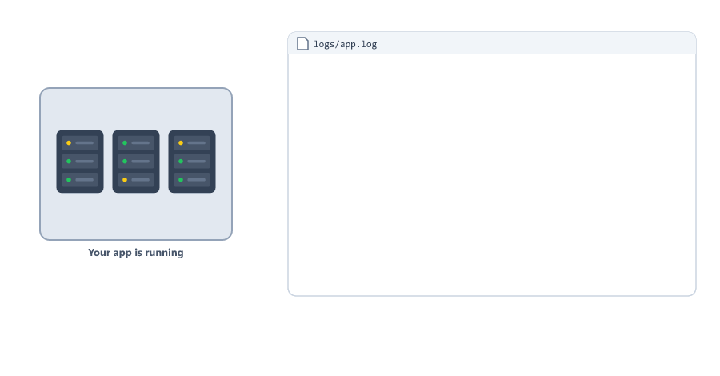

This is a real log line from the project you build in this session

```text
{"level":"info","message":"Student created","requestId":"5e44b032-cb3f-445f-8224-b970b4f7dd5e","studentId":"6ac8c952a7c8959cd2b2870d","timestamp":"2026-10-09T11:00:34.932Z"}
```

| Part          | Answers the question      | Example                        |
| ------------- | ------------------------- | ------------------------------ |
| `timestamp`   | When did it happen?       | `2026-10-09T11:00:34.932Z` (the `Z` means UTC time) |
| `level`       | How important is it?      | `info`, `warn`, `error`        |
| `message`     | What happened?            | `Student created`              |
| Other fields  | What are the details?     | `studentId`, `requestId`       |

Logs help you understand

* What your application is doing
* When errors happen, and why
* Who is using your application
* How long things take
* What needs improvement

---

## Why Logging is Important

Your server runs on a computer you are not watching. When something breaks, the user only sees "Something went wrong on the server" (Session 24). The details are only in your logs.


| Without logging                   | With logging                                |
| --------------------------------- | ------------------------------------------- |
| The app crashes, you do not know why | You open the log and see the error and its stack |
| A user complains, you cannot repeat the problem | You find the user's request and see what happened |
| The same error happens again      | You fix the cause, and can check it is gone |

Benefits of logging

| Use          | Example                                         |
| ------------ | ----------------------------------------------- |
| Debugging    | Find the line of code that threw an error       |
| Monitoring   | See that the app started and is answering requests |
| Security     | Notice many failed logins for one account       |
| Performance  | Find requests that take more than 1 second      |
| Audit        | Know who deleted a student, and when            |

---

## console.log vs a Logger

You have used `console.log` in every session. Why not keep using it?

| You need                         | `console.log`                  | A logger (winston)                     |
| -------------------------------- | ------------------------------ | -------------------------------------- |
| When did it happen?              | No time on the line            | A timestamp on every line              |
| How important is it?             | Every line looks the same      | Levels: `error`, `warn`, `info`, ...   |
| Hide debug lines in production   | Delete them by hand            | Change `LOG_LEVEL` in .env             |
| Keep logs after a restart        | Gone when the terminal closes  | Saved in files                         |
| Errors in their own place        | No                             | A separate `error.log`                 |
| Find all lines of one request    | Very hard                      | Search for its `requestId`             |

`console.log` is still fine for small scripts and quick tests. For a server, use a logger.

In Session 24 the error middleware used `console.error`. In this session you replace it with a logger.

---

## Types of Logs

Different logs for different purposes

| Type             | What is recorded                                  | Usual level | Example                                  |
| ---------------- | ------------------------------------------------- | ----------- | ---------------------------------------- |
| Request logs     | Method, URL, status code, time of every request   | `http`      | `GET /api/students 200 206 - 7.797 ms`   |
| Error logs       | Bugs and crashes, with the stack                  | `error`     | `Cannot read properties of null (reading 'name')` |
| Application logs | Important events: start, connect, create, delete  | `info`      | `Server running on port 5000`, `Student created` |
| Security logs    | Failed logins, fake uploads, access denied        | `warn`      | `Failed login {"email":"sara@example.com","ip":"::1"}` |
| Performance logs | Slow requests or slow database queries            | `warn`      | `Slow request {"url":"/api/report","ms":5100}` |

`::1` is the address of your own computer (localhost, written the IPv6 way).

---

## What is Morgan

Morgan is HTTP request logger middleware for Express (Session 14)

It writes one line for every request

Morgan waits until the response is sent, like the timer you built in Session 14 with `res.on("finish")`. Only then are the status code and the time known.

Why use Morgan

* No need to write request logging code yourself
* Several ready formats
* Can write to the terminal or to a file
* Shows how long each request took

---

## Installing Morgan

Create a new project

```bash
mkdir logging-demo
cd logging-demo
npm init -y
```

Install packages

```bash
npm install express morgan
```

This session uses morgan 1.12.1 (the version we tested).

Create server.js

```javascript
const express = require("express");
const morgan = require("morgan");

const app = express();

// One line for every request
app.use(morgan("tiny"));

app.get("/", (req, res) => {
  res.send("Home Page");
});

app.get("/students", (req, res) => {
  res.json({ students: [] });
});

app.listen(3000, (err) => {
  if (err) {
    console.log("Could not start server:", err.message);
    process.exit(1);
  }
  console.log("Server running on port 3000");
});
```

Open `http://localhost:3000` and `http://localhost:3000/students` in the browser

Output

```text
Server running on port 3000
GET / 200 9 - 2.646 ms
GET /students 200 15 - 1.551 ms
```

`9` and `15` are the size of each response in bytes: `Home Page` has 9 characters, `{"students":[]}` has 15.

---

## Morgan Log Formats

Morgan has five ready formats. We sent the same request, `GET /students`, with each of them.

combined (the most details, the standard format of web servers like Apache)

```text
:remote-addr - :remote-user [:date[clf]] ":method :url HTTP/:http-version" :status :res[content-length] ":referrer" ":user-agent"
```

```text
::1 - - [09/Oct/2026:10:51:54 +0000] "GET /students HTTP/1.1" 200 15 "-" "node"
```

common (combined without the referrer and user agent)

```text
::1 - - [09/Oct/2026:10:51:55 +0000] "GET /students HTTP/1.1" 200 15
```

short

```text
::1 - GET /students HTTP/1.1 200 15 - 1.904 ms
```

tiny (the smallest)

```text
GET /students 200 15 - 1.551 ms
```

dev (colored, for development)

```text
GET /students 200 1.843 ms - 15
```

In `dev`, the time comes first, then the size. The status code gets a color: green for 2xx, cyan for 3xx, yellow for 4xx and red for 5xx.

```text
GET /students 200 1.843 ms - 15
POST /students 201 0.432 ms - 44
GET /students/999 404 1.014 ms - 29
GET /boom 500 6.140 ms - 148
```

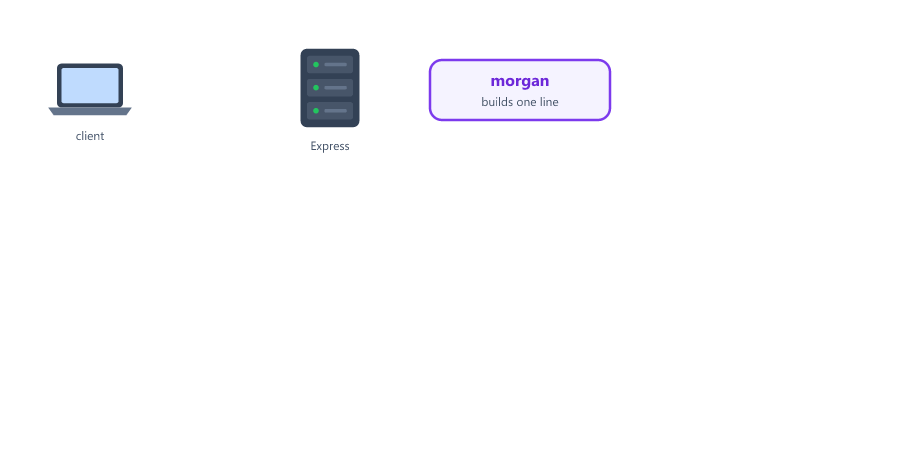

What each token means

| Token                    | Real value             | Meaning                                              |
| ------------------------ | ---------------------- | ---------------------------------------------------- |
| `:remote-addr`           | `::1`                  | Who sent the request (`::1` is your own computer)    |
| `:remote-user`           | `-`                    | Only used with old "basic auth" logins, so usually `-` |
| `:date[clf]`             | `[09/Oct/2026:10:51:54 +0000]` | When (`+0000` is UTC time)                   |
| `:method` `:url`         | `GET /students`        | What was asked for                                   |
| `:http-version`          | `1.1`                  | The HTTP version                                     |
| `:status`                | `200`                  | The status code that was sent                        |
| `:res[content-length]`   | `15`                   | Size of the response in bytes                        |
| `:referrer`              | `-`                    | The page the user came from                          |
| `:user-agent`            | `node`                 | The program that sent it (a browser sends `Mozilla/5.0 (Windows NT 10.0; ...)`) |
| `:response-time`         | `1.551`                | Milliseconds the server needed                       |

Which one to use

| Format     | Use it for                                   |
| ---------- | -------------------------------------------- |
| `dev`      | Your terminal while you develop              |
| `combined` | Log files in production (many tools can read it) |
| `tiny`     | Short lines when you only need the basics    |

Always give a format. `morgan()` with nothing prints two warnings: `morgan deprecated undefined format: specify a format` and `morgan deprecated default format: use combined format`.

---

## Using Morgan in Express

Conditional logging with `skip`

```javascript
// Log only errors (status 400 or higher)
app.use(morgan("dev", {
  skip: (req, res) => res.statusCode < 400
}));

// Log only successful requests
app.use(morgan("dev", {
  skip: (req, res) => res.statusCode >= 400
}));

// Log only POST requests
app.use(morgan("dev", {
  skip: (req, res) => req.method !== "POST"
}));
```

`skip` runs after the response is sent, so `res.statusCode` is the real, final status. With the first example, only `GET /missing 404 0.494 ms - 2` was printed; the 200s were skipped.

Custom tokens

```javascript
// Add a custom token for the user id (req.user comes from protect, Session 22)
morgan.token("userId", (req, res) => {
  return req.user ? req.user.id : "anonymous";
});

// Use it in your own format
app.use(morgan(":method :url :userId :status - :response-time ms"));
```

Output (tested; `/profile` had a middleware that set `req.user`)

```text
GET /students anonymous 200 - 1.730 ms
GET /profile u42 200 - 0.367 ms
```

This works even though `app.use(morgan(...))` comes before the middleware that sets `req.user`. Morgan builds the line at the end of the request, when `req.user` is already there.

More useful tokens

| Token                 | Gives                         |
| --------------------- | ----------------------------- |
| `:date[iso]`          | `2026-10-09T10:52:11.323Z`    |
| `:req[user-agent]`    | Any request header, by name   |
| `:res[content-type]`  | Any response header, by name  |

`immediate: true` writes the line when the request arrives, not when it ends. The status is not known yet, so it shows `-`: `GET /students - -`. It is useful to see requests that crash the server before it can answer.

---

## Writing Logs to File

Log to a file and to the terminal

```javascript
const express = require("express");
const morgan = require("morgan");
const fs = require("fs");
const path = require("path");

const app = express();

// Session 05 and 06: an absolute folder path, created if it is missing
const logDir = path.join(__dirname, "logs");
fs.mkdirSync(logDir, { recursive: true });

// "a" means append: new lines are added at the end, old lines stay
const accessLogStream = fs.createWriteStream(path.join(logDir, "access.log"), { flags: "a" });

app.use(morgan("combined", { stream: accessLogStream })); // to the file
app.use(morgan("dev"));                                   // and to the terminal

app.get("/", (req, res) => {
  res.send("Home");
});

app.listen(3000, (err) => {
  if (err) {
    console.log("Could not start server:", err.message);
    process.exit(1);
  }
  console.log("Server running on port 3000");
});
```

logs/access.log after three requests (two with curl, one with a browser user agent)

```text
::1 - - [09/Oct/2026:10:59:47 +0000] "GET / HTTP/1.1" 200 4 "-" "curl/8.21.0"
::1 - - [09/Oct/2026:10:59:47 +0000] "GET /nothing HTTP/1.1" 404 146 "-" "curl/8.21.0"
::1 - - [09/Oct/2026:10:59:47 +0000] "GET / HTTP/1.1" 200 4 "-" "Mozilla/5.0 (Windows NT 10.0; Win64; x64)"
```

Why `mkdirSync`? `createWriteStream` does not create folders. Without the logs folder the app crashes

```text
Error: ENOENT: no such file or directory, open 'C:\...\logs\access.log'
Emitted 'error' event on WriteStream instance at:
```

It is the Session 08 rule: an `"error"` event that nobody listens to stops the app.

A different setup for each environment

```javascript
if (process.env.NODE_ENV === "production") {
  // Production: full lines in a file
  const accessLogStream = fs.createWriteStream(path.join(logDir, "access.log"), { flags: "a" });
  app.use(morgan("combined", { stream: accessLogStream }));
} else {
  // Development: short colored lines in the terminal
  app.use(morgan("dev"));
}
```

Add `logs/` to .gitignore. Logs are data, not code, and they can contain private information.

Morgan only logs requests. For everything else (server started, student created, errors) you need winston.

---

## What is Winston

Winston is the most used logging library for Node.js

You call it yourself, anywhere in your code: `logger.info("Student created")`

| Feature        | Morgan                         | Winston                                  |
| -------------- | ------------------------------ | ---------------------------------------- |
| What it logs   | HTTP requests, automatically   | Anything you give it                     |
| Log levels     | No                             | Yes, seven                               |
| Destinations   | One stream                     | Many at the same time (transports)       |
| Formats        | Request line formats           | JSON, plain text, colors, your own       |
| File size limits | No                           | Yes (`maxsize`, `maxFiles`)              |

Use both together

* Morgan builds the request line
* Winston saves it, together with all your other logs (you will connect them later in this session)

---

## Installing Winston

```bash
npm install winston
```

This session uses winston 3.19.0 (the version we tested).

logger-demo.js

```javascript
const path = require("path");
const winston = require("winston");

const logger = winston.createLogger({
  level: "info",
  format: winston.format.combine(
    winston.format.timestamp(),
    winston.format.json()
  ),
  transports: [
    new winston.transports.Console(),
    new winston.transports.File({ filename: path.join(__dirname, "logs", "app.log") })
  ]
});

logger.info("Server started", { port: 3000 });
logger.warn("Disk almost full");
logger.error("Database connection failed");
logger.debug("Query details"); // hidden: debug is below "info"
```

Run

```bash
node logger-demo.js
```

Output, in the terminal and in logs/app.log

```text
{"level":"info","message":"Server started","port":3000,"timestamp":"2026-10-09T10:58:50.532Z"}
{"level":"warn","message":"Disk almost full","timestamp":"2026-10-09T10:58:50.534Z"}
{"level":"error","message":"Database connection failed","timestamp":"2026-10-09T10:58:50.534Z"}
```

| Part                                  | Meaning                                                  |
| ------------------------------------- | -------------------------------------------------------- |
| `winston.createLogger({...})`         | Makes your logger                                        |
| `level: "info"`                       | Keep `info` and everything more important                |
| `format`                              | How each line looks                                      |
| `combine(timestamp(), json())`        | Add the time, then write the line as JSON                |
| `transports`                          | Where lines go: here the terminal and a file             |
| `logger.info("Server started", { port: 3000 })` | A message, plus an object with details         |

Winston creates the logs folder by itself (we deleted it before running), unlike `fs.createWriteStream`.

The `debug` line is missing. The next section explains why.

---

## Log Levels

Winston has seven levels. A smaller number means more important.

| Level     | Priority | Use it for                                 | Example                              |
| --------- | -------- | ------------------------------------------ | ------------------------------------ |
| `error`   | 0        | Something failed, someone must fix it      | `Database connection failed`         |
| `warn`    | 1        | Strange or dangerous, but the app works    | `Failed login`, `Fake image rejected` |
| `info`    | 2        | Important normal events                    | `Server running on port 5000`        |
| `http`    | 3        | One line per HTTP request                  | `GET /api/students 200 206 - 7.797 ms` |
| `verbose` | 4        | More detail than usual                     | `Loaded 3 routes`                    |
| `debug`   | 5        | Details you need while fixing a bug        | `Query: { course: 'Node' }`          |
| `silly`   | 6        | Every tiny detail (rarely used)            | -                                    |

The rule: **a logger keeps its level and every level with a smaller number**

`level: "info"` keeps `error`, `warn` and `info`. `http`, `verbose`, `debug` and `silly` are thrown away.

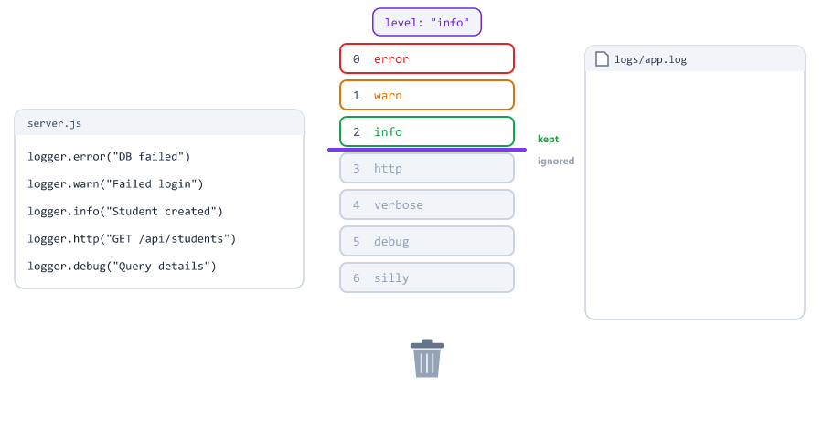

levels-demo.js

```javascript
const winston = require("winston");

const logger = winston.createLogger({
  level: process.env.LOG_LEVEL || "info",
  format: winston.format.simple(),
  transports: [new winston.transports.Console()]
});

logger.error("Database connection failed");
logger.warn("Login failed 5 times for one account");
logger.info("Student created");
logger.http("GET /api/students 200");
logger.verbose("Loaded 3 routes");
logger.debug("Query: { course: 'Node' }");
logger.silly("Every tiny detail");
```

Output with `LOG_LEVEL` not set (so `"info"`)

```text
error: Database connection failed
warn: Login failed 5 times for one account
info: Student created
```

With `LOG_LEVEL=debug`

```text
error: Database connection failed
warn: Login failed 5 times for one account
info: Student created
http: GET /api/students 200
verbose: Loaded 3 routes
debug: Query: { course: 'Node' }
```

With `LOG_LEVEL=error`

```text
error: Database connection failed
```

Set `LOG_LEVEL` in .env, or in the terminal like in Session 16: `$env:LOG_LEVEL="debug"` in PowerShell, `set LOG_LEVEL=debug` in Command Prompt, `LOG_LEVEL=debug node levels-demo.js` in Git Bash.

Which level where

| Environment | Level            | Why                                          |
| ----------- | ---------------- | -------------------------------------------- |
| Development | `debug`          | See everything while you build               |
| Production  | `http` or `info` | Requests and events, without the noise       |
| Hunting a bug in production | `debug` for a short time | Then set it back, debug lines fill the disk fast |

Be careful with spelling. We tried `LOG_LEVEL=Debug` and `LOG_LEVEL=debgu`: winston printed **nothing at all, not even errors**, and gave no warning. The project logger later in this session checks the value at startup.

You can also change the level while the app runs

```javascript
logger.level = "debug";
```

---

## Formats in Winston

A format decides how a line looks. You join several with `combine()`; they run in order.

formats-demo.js logs `logger.info("Student created", { studentId: 7 })` with different formats

| Format                                   | Real output                                              |
| ---------------------------------------- | -------------------------------------------------------- |
| `json()`                                 | `{"level":"info","message":"Student created","studentId":7}` |
| `simple()`                               | `info: Student created {"studentId":7}`                  |
| `combine(timestamp(), json())`           | `{"level":"info","message":"Student created","studentId":7,"timestamp":"2026-10-09T10:58:57.098Z"}` |
| `combine(timestamp({ format: "YYYY-MM-DD HH:mm:ss" }), printf(...))` | `2026-10-09 16:28:57 [info] Student created` |
| `combine(colorize(), simple())`          | `info: Student created {"studentId":7}` with a green `info` |

The printf example

```javascript
const { combine, timestamp, printf } = winston.format;

const myFormat = combine(
  timestamp({ format: "YYYY-MM-DD HH:mm:ss" }),
  printf(({ timestamp, level, message }) => `${timestamp} [${level}] ${message}`)
);
```

`printf` gets one object with every field of the line, and returns the text you want. `const { combine, timestamp, printf } = winston.format;` is destructuring, so you can write `combine(...)` instead of `winston.format.combine(...)`.

| Format                   | What it does                                          |
| ------------------------ | ----------------------------------------------------- |
| `timestamp()`            | Adds the time. Without options: ISO time in UTC (`Z`) |
| `timestamp({ format })`  | Your own time format, in your computer's time zone    |
| `json()`                 | The whole line as one JSON object                     |
| `simple()`               | `level: message {details}`                            |
| `printf(fn)`             | Exactly the text your function returns                |
| `colorize()`             | Colors the level for the terminal                     |
| `errors({ stack: true })`| Keeps the stack of Error objects (next sections)      |

Why JSON for files? Each line is one object, so a program can search and filter it: "all lines with level error", "all lines with this requestId". Plain text is easier to read, so it is nice in the terminal.

A colorize trap. Many tutorials do this

```javascript
combine(
  colorize(),
  printf(({ level, message }) => `[${level.toUpperCase()}] ${message}`)
);
```

Real output (the hidden color codes made visible)

```text
[\x1b[32MINFO\x1b[39M] Student created
```

`colorize()` wraps the level in color codes: `\x1b[32m` means "start green". `toUpperCase()` turns the `m` into `M`, which the terminal reads as a different command. The colors break. Do not change `level` after `colorize()`.

---

## Transports in Winston

A transport is a place where log lines go. One logger can have many.

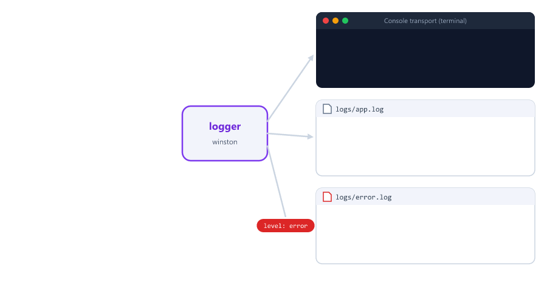

Console transport

```javascript
new winston.transports.Console()
```

File transport

```javascript
new winston.transports.File({ filename: path.join(__dirname, "logs", "app.log") })
```

Each transport can have its own `level` and `format`

```javascript
const logger = winston.createLogger({
  level: "info",
  format: winston.format.combine(winston.format.timestamp(), winston.format.json()),
  transports: [
    // All lines the logger keeps
    new winston.transports.File({ filename: path.join(__dirname, "logs", "combined.log") }),

    // Only error
    new winston.transports.File({ filename: path.join(__dirname, "logs", "error.log"), level: "error" }),

    // warn and error
    new winston.transports.File({ filename: path.join(__dirname, "logs", "warn.log"), level: "warn" })
  ]
});
```

A transport's level filters again: the logger keeps `info` and above, and `error.log` keeps only `error` out of those.

### Limit the file size

A log file grows forever. A busy app can write gigabytes. Tell winston when to start a new file

```javascript
new winston.transports.File({
  filename: path.join(__dirname, "logs", "app.log"),
  maxsize: 5 * 1024 * 1024, // 5 MB, then start a new file
  maxFiles: 5,              // keep 5 files, delete older ones
  tailable: true            // the newest lines are always in app.log
})
```

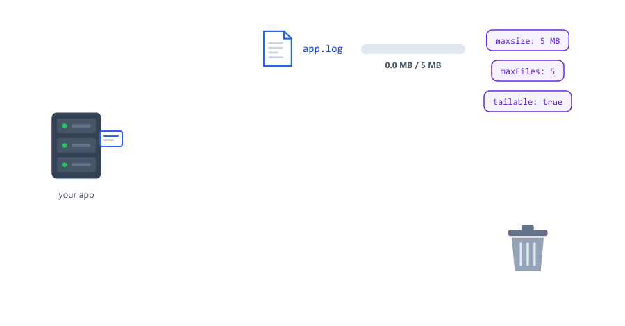

We tested with a tiny `maxsize` of 1 KB and wrote 200 lines

| Option             | Files at the end                         |
| ------------------ | ---------------------------------------- |
| `tailable: true`   | `app.log` (newest), `app1.log`, `app2.log` (oldest) |
| without `tailable` | `app7.log`, `app8.log`, `app9.log` (newest), and no `app.log` at all |

Without `tailable`, the newest file gets a new number every time, so you never know which file to open. Use `tailable: true`.

`maxsize` is checked roughly: our 1 KB files had about 1.7 KB, because lines are written in small groups.

### A new file every day

Another option is one file per day

```bash
npm install winston-daily-rotate-file
```

```javascript
const DailyRotateFile = require("winston-daily-rotate-file");

logger.add(new DailyRotateFile({
  filename: path.join(__dirname, "logs", "application-%DATE%.log"),
  datePattern: "YYYY-MM-DD",
  maxSize: "20m",  // also start a new file after 20 MB
  maxFiles: "14d"  // delete files older than 14 days
}));
```

Files created (tested with version 5.0.0)

```text
logs/application-2026-10-09.log
logs/.72dd8cd95033c7643b0f7df125be54594ef8c3f1-audit.json
```

The hidden `-audit.json` file is how the package remembers which old files to delete. Leave it alone.

`logger.add(transport)` adds a transport after the logger is created. Notice the different spelling: winston's File uses `maxsize`, this package uses `maxSize`.

---

## Logging Errors

To keep the stack of an Error, add `errors({ stack: true })` to the logger's format

```javascript
format: combine(
  timestamp(),
  errors({ stack: true }),
  json()
)
```

Three ways to log an error

errors-demo.js

```javascript
const winston = require("winston");
const { combine, timestamp, errors, json } = winston.format;

const logger = winston.createLogger({
  format: combine(timestamp(), errors({ stack: true }), json()),
  transports: [new winston.transports.Console()]
});

const err = new Error("Database connection failed");

logger.error("Failed to save user", err);
logger.error(err);
logger.error("Failed to save user", { error: err.message });
```

Output (the stack is shortened here)

```text
{"level":"error","message":"Failed to save user Database connection failed","stack":"Error: Database connection failed\n    at Object.<anonymous> (C:\\...\\errors-demo.js:9:13)\n ...","timestamp":"2026-10-09T11:05:29.371Z"}
{"level":"error","message":"Database connection failed","stack":"Error: Database connection failed\n    at Object.<anonymous> (C:\\...\\errors-demo.js:9:13)\n ...","timestamp":"2026-10-09T11:05:29.372Z"}
{"error":"Database connection failed","level":"error","message":"Failed to save user","timestamp":"2026-10-09T11:05:29.372Z"}
```

`errors-demo.js:9:13` means file errors-demo.js, line 9, column 13: the line that created the error.

| Call                                   | Result                                             |
| -------------------------------------- | -------------------------------------------------- |
| `logger.error("text", err)`            | Your text + the error message, and the stack       |
| `logger.error(err)`                    | The error message, and the stack                   |
| `logger.error("text", { error: err.message })` | **No stack**: you will not know which line failed |

The stack is the most useful part: it shows the file and line number. In the project, the error middleware logs it on purpose: `{ requestId, method, url, stack: err.stack }`.

---

## What Not to Log

Logs are read by many people: your team, log services, anyone who gets a copy of a server or a backup. They are often kept for weeks.

Never log

* Passwords (also hashed ones from Session 23)
* Tokens (the JWT from Session 22) and the `Authorization` header
* Secrets from .env (JWT_SECRET, database passwords, API keys)
* Credit card numbers
* Whole request bodies of login, register, password change or payment routes

Be careful with personal data (email, phone, address). When you can, log the user's id instead.

This looks harmless

```javascript
logger.info("Login request", { body: req.body });
```

Real line in app.log

```text
{"body":{"email":"sara@example.com","password":"MySecret123"},"level":"info","message":"Login request","timestamp":"2026-10-09T10:57:16.781Z"}
```

Sara's password is now in a file that many people can read.

If you need the body, hide the secret fields first

```javascript
// Copy an object and hide secret fields before logging it
function hideSecrets(data) {
  const copy = { ...data };
  for (const key of ["password", "newPassword", "token"]) {
    if (copy[key] !== undefined) {
      copy[key] = "[HIDDEN]";
    }
  }
  return copy;
}

logger.info("Login request", { body: hideSecrets(req.body) });
```

```text
{"body":{"email":"sara@example.com","password":"[HIDDEN]"},"level":"info","message":"Login request","timestamp":"2026-10-09T10:57:16.782Z"}
```

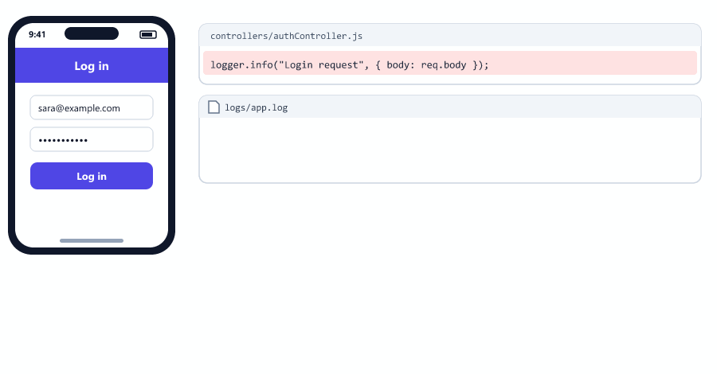

Morgan's formats never log request bodies or the `Authorization` header. They do log the full URL, query string included, so never put secrets in a URL: `GET /api/students?token=eyJhbGci...` puts the token in every request log. Send tokens in the `Authorization` header (Session 22).

Put user text in the details object, not inside the message

```javascript
logger.warn("Failed login for " + email); // user text inside the message
logger.warn("Failed login", { email });   // better: a separate field
```

With JSON, a line break typed by an attacker is saved as `\n` inside the line, so it cannot create a fake new log line (we tested an email with `\n{"level":"info","message":"Admin logged in"}` in it). Separate fields also make searching easier.

---

## Request IDs

A server handles many requests at the same time, so their log lines are mixed together. When one request fails, which lines belong to it?

The answer: give every request its own id, and put it in every log line

middleware/requestId.js

```javascript
const crypto = require("crypto");

// Give every request its own id, so all its log lines can be found together
const requestId = (req, res, next) => {
  req.id = crypto.randomUUID();
  res.set("X-Request-Id", req.id); // the client can see it and report it
  next();
};

module.exports = requestId;
```

* `crypto.randomUUID()` (Session 25) gives a random id like `378a05e1-a3e1-43b0-90fb-61c8f928cd6e`
* `req.id` is available to every middleware, controller and the error middleware after it (Session 14: adding data to req)
* The `X-Request-Id` response header lets the client see it. A frontend can show it on the error screen: "Something went wrong. Error id: 378a05e1..."

Every log line about a request includes it

```javascript
logger.info("Student created", { requestId: req.id, studentId: student._id });
```

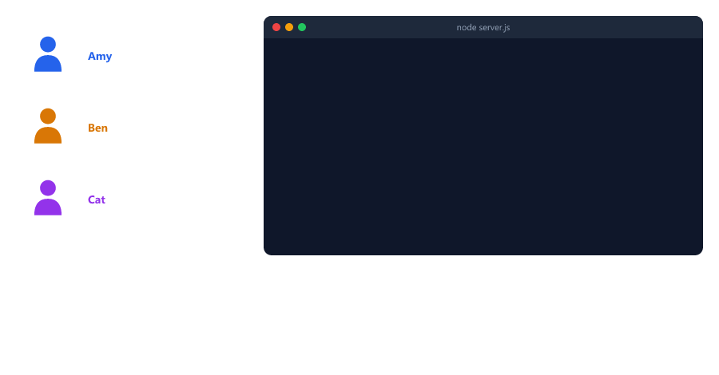

The Session 24 exercise used `Date.now()` as an id. Two requests in the same millisecond would get the same id. `randomUUID()` does not repeat.

---

## Morgan and Winston Together

Morgan builds the request line, and its `stream` option decides where the line goes. Give it a stream that calls winston

middleware/requestLogger.js

```javascript
const morgan = require("morgan");
const logger = require("../utils/logger");

// A new morgan token: :id prints req.id (set by the requestId middleware)
morgan.token("id", (req) => req.id);

// morgan builds the line, winston saves it with the "http" level
const requestLogger = morgan(":id :method :url :status :res[content-length] - :response-time ms", {
  stream: {
    write: (line) => logger.http(line.trim()) // morgan adds "\n" at the end
  }
});

module.exports = requestLogger;
```

A stream only needs a `write` function. Morgan calls `write` with each line.

The trap: many tutorials log morgan's lines with `logger.http(...)` but create the logger with `level: "info"`. `http` (3) is less important than `info` (2), so **every request line is silently thrown away**. We tested it: nothing in the terminal, nothing in the file, and no error.

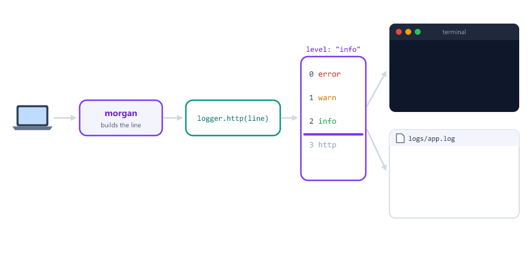

Fix: use `level: "http"` (or lower, like `debug`) when morgan writes with `logger.http`. The project logger uses `"http"` when `LOG_LEVEL` is not set.

One line per request is enough. Some tutorials add morgan to winston, `morgan("dev")` to the terminal, and their own "Request received" middleware. Then every request is logged three times.

---

## Logging When the App Crashes

Session 24's safety nets stop the app with `process.exit(1)` right after printing the error.

With winston, that loses the log. Writing to a file happens in the background (Session 03: file work goes to the thread pool). `process.exit` stops Node at once, and lines still waiting to be written are lost.

We tested a real crash at startup: `app.all("*", ...)`, which throws in Express 5 (Session 12)

| Safety net does                              | Terminal        | error.log (3 runs) |
| -------------------------------------------- | --------------- | ------------------ |
| `logger.error(...)` then `process.exit(1)`   | Shows the error | **Empty, 0 lines** every time |
| `logger.error(...)` then `exitAfterLogs()`   | Shows the error | 1 line every time  |

The error you most need to read was never saved

```javascript
// Wait until every log line is written to the files, then stop
function exitAfterLogs() {
  logger.on("finish", () => process.exit(1));
  logger.end();
  setTimeout(() => process.exit(1), 3000); // never wait more than 3 seconds
}
```

| Line                                        | Meaning                                                  |
| ------------------------------------------- | -------------------------------------------------------- |
| `logger.end()`                              | "No more lines are coming, finish writing"              |
| `logger.on("finish", ...)`                  | The logger is an EventEmitter (Session 08). `finish` comes when everything is written |
| `process.exit(1)` inside it                 | Exit only after the lines are safe                       |
| `setTimeout(..., 3000)`                     | A backup: if writing hangs, still stop after 3 seconds  |

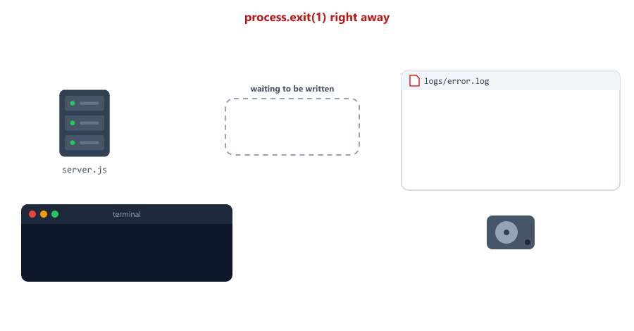

---

## Complete Logging System

Project structure (the Session 25 project, plus logging)

```text
logging-api/
├── controllers/
│   ├── avatarController.js      Session 25 + a warning for fake images
│   └── studentController.js     Session 24 + logs for create and delete
├── logs/                        created automatically
│   ├── app.log
│   └── error.log
├── middleware/
│   ├── errorMiddleware.js       Session 25, console.error → logger
│   ├── requestId.js             new
│   ├── requestLogger.js         new
│   └── upload.js                from Session 25
├── models/
│   └── Student.js               from Session 25
├── routes/
│   └── studentRoutes.js         from Session 25
├── uploads/
├── utils/
│   ├── AppError.js              from Session 24
│   ├── checkImage.js            from Session 25
│   └── logger.js                new
├── .env
├── .gitignore
├── server.js
└── test-logging.js
```

Install the new packages

```bash
npm install morgan winston
```

.env

```text
PORT=5000
MONGODB_URI=mongodb://127.0.0.1:27017
DB_NAME=logging_demo
NODE_ENV=development
LOG_LEVEL=http
```

.gitignore

```text
node_modules/
.env
uploads/
logs/
```

utils/logger.js

```javascript
const path = require("path");
const winston = require("winston");

const { combine, timestamp, errors, json, colorize, printf } = winston.format;

const isProduction = process.env.NODE_ENV === "production";
const LOG_DIR = path.join(__dirname, "..", "logs"); // Session 06: never depend on the cwd
const LOG_LEVEL = process.env.LOG_LEVEL || "http";

// A typo like "Debug" would hide EVERY log line, even errors, so stop early (Session 16)
if (winston.config.npm.levels[LOG_LEVEL] === undefined) {
  console.error(`Invalid LOG_LEVEL "${LOG_LEVEL}". Use error, warn, info, http, verbose, debug or silly`);
  process.exit(1);
}

// How a line looks in the terminal during development: short and colorful
const devFormat = combine(
  colorize(),
  timestamp({ format: "HH:mm:ss" }),
  printf(({ timestamp, level, message, stack, ...meta }) => {
    let line = `${timestamp} ${level}: ${message}`;
    if (Object.keys(meta).length > 0) {
      line += ` ${JSON.stringify(meta)}`;
    }
    if (stack) {
      line += `\n${stack}`; // the stack on its own lines, easy to read
    }
    return line;
  })
);

const logger = winston.createLogger({
  level: LOG_LEVEL, // error 0, warn 1, info 2, http 3, verbose 4, debug 5, silly 6
  format: combine(
    timestamp(),             // "2026-10-09T10:30:00.000Z"
    errors({ stack: true }), // keep the stack of Error objects
    json()                   // one JSON object per line
  ),
  transports: [
    // The terminal: readable in development, JSON in production
    new winston.transports.Console({
      format: isProduction ? json() : devFormat
    }),
    // Every line at the chosen level and above
    new winston.transports.File({
      filename: path.join(LOG_DIR, "app.log"),
      maxsize: 5 * 1024 * 1024, // 5 MB, then start a new file
      maxFiles: 5,              // keep 5 files, delete older ones
      tailable: true            // the newest lines are always in app.log
    }),
    // Only errors, so they are easy to find
    new winston.transports.File({
      filename: path.join(LOG_DIR, "error.log"),
      level: "error",
      maxsize: 5 * 1024 * 1024,
      maxFiles: 5,
      tailable: true
    })
  ]
});

module.exports = logger;
```

| Part                                   | Why                                                       |
| -------------------------------------- | --------------------------------------------------------- |
| `LOG_LEVEL` default `"http"`           | Keeps morgan's request lines (see the trap above)         |
| The `LOG_LEVEL` check                  | A typo would silently hide every line                     |
| Logger format: `timestamp`, `errors`, `json` | Every line in the files is JSON, with time and stack |
| Console format: `devFormat` or `json()` | Easy to read while developing; one JSON line per event in production |
| `printf` with `...meta`                | `meta` collects the other fields, like `requestId` (rest syntax, like `...roles` in Session 22) |
| The stack on its own lines             | In the terminal you can read it like a normal error       |
| Two File transports                    | `app.log` has everything, `error.log` only errors         |
| `maxsize`, `maxFiles`, `tailable`      | At most 5 × 5 MB per log, the newest always in `app.log`  |

Transport formats only change their own copy of the line. The colors and the short time are only in the terminal; the files keep the full ISO time and a plain `level`.

middleware/requestId.js and middleware/requestLogger.js are exactly as shown in [Request IDs](#request-ids) and [Morgan and Winston Together](#morgan-and-winston-together).

middleware/errorMiddleware.js: add the logger at the top

```javascript
const AppError = require("../utils/AppError");
const logger = require("../utils/logger");
```

and replace the error middleware at the bottom (the `handle...` functions, `normalizeError`, `sendErrorDev` and `sendErrorProd` stay the same as in Session 25)

```javascript
const errorMiddleware = (err, req, res, next) => {
  const error = normalizeError(err);

  error.statusCode = error.statusCode || 500;
  error.status = error.status || "error";

  if (error.statusCode >= 500) {
    // A bug or a server problem: save everything needed to fix it
    logger.error(err.message, {
      requestId: req.id,
      method: req.method,
      url: req.originalUrl,
      stack: err.stack
    });
  } else {
    // The client made a mistake: morgan's request line is usually enough
    logger.debug(`${error.statusCode} ${error.message}`, { requestId: req.id });
  }

  if (process.env.NODE_ENV === "production") {
    sendErrorProd(error, res);
  } else {
    sendErrorDev(error, res);
  }
};

module.exports = errorMiddleware;
```

| Status      | Logged as | Why                                                      |
| ----------- | --------- | -------------------------------------------------------- |
| 500 and up  | `error`   | Your bug: message, request, and the full stack           |
| 400 to 499  | `debug`   | The client's mistake. Morgan already logs the status; the reason shows only with `LOG_LEVEL=debug` |

controllers/studentController.js: require the logger, and log the important events

```javascript
const logger = require("../utils/logger");
```

```javascript
// POST /api/students
const createStudent = async (req, res) => {
  // ValidationError → 400, duplicate email → 409, both handled in errorMiddleware
  const student = await Student.create(pickFields(req.body || {}));

  logger.info("Student created", { requestId: req.id, studentId: student._id });

  res.status(201).json({ success: true, data: student });
};
```

```javascript
// DELETE /api/students/:id
const deleteStudent = async (req, res) => {
  const student = await Student.findByIdAndDelete(req.params.id);

  if (!student) {
    throw new AppError("Student not found", 404);
  }

  logger.info("Student deleted", { requestId: req.id, studentId: student._id });

  res.status(200).json({ success: true, message: "Student deleted successfully" });
};
```

Log the id, not the whole student: no personal data in the logs.

controllers/avatarController.js: require the logger, and warn about fake images (a possible attack, Session 25)

```javascript
    if (!(await isRealImage(req.file))) {
      // Someone may be attacking us: worth a warning
      logger.warn("Fake image rejected", {
        requestId: req.id,
        originalName: req.file.originalname,
        claimedType: req.file.mimetype
      });
      throw new AppError("This file is not a real image", 400);
    }
```

In the Session 23 auth project, failed logins are the most important security log

```javascript
  if (!user || !(await user.comparePassword(String(password)))) {
    // Many of these for one email or one IP can mean someone is guessing passwords
    logger.warn("Failed login", { requestId: req.id, email: String(email), ip: req.ip });
    return res.status(401).json({ success: false, message: "Invalid email or password" });
  }
```

```text
16:30:24 warn: Failed login {"requestId":"4e363f5e-f3da-4013-8a64-405d53bcd0e3","email":"sara@example.com","ip":"::1"}
```

The password is never logged, only the email that was tried.

server.js

```javascript
// The logger reads LOG_LEVEL and NODE_ENV, so .env is loaded first
require("dotenv").config({ quiet: true });
const logger = require("./utils/logger");

// ---------- Safety nets (Session 24), now with the logger ----------
let server;

// Wait until every log line is written to the files, then stop
function exitAfterLogs() {
  logger.on("finish", () => process.exit(1));
  logger.end();
  setTimeout(() => process.exit(1), 3000); // never wait more than 3 seconds
}

process.on("uncaughtException", (err) => {
  logger.error("UNCAUGHT EXCEPTION! Shutting down...", err);
  exitAfterLogs();
});

process.on("unhandledRejection", (err) => {
  logger.error("UNHANDLED REJECTION! Shutting down...", err);
  if (server) {
    server.close(exitAfterLogs);
  } else {
    exitAfterLogs();
  }
});

// ---------- The app ----------
const express = require("express");
const mongoose = require("mongoose");
const path = require("path");

const studentRoutes = require("./routes/studentRoutes");
const AppError = require("./utils/AppError");
const requestId = require("./middleware/requestId");
const requestLogger = require("./middleware/requestLogger");
const errorMiddleware = require("./middleware/errorMiddleware");

const app = express();
const PORT = process.env.PORT || 5000;

app.use(requestId);     // first: every log line can use req.id
app.use(requestLogger); // morgan, writes one "http" line per request

app.use(express.json({ limit: "10kb" }));

app.use("/uploads", express.static(path.join(__dirname, "uploads"), {
  setHeaders: (res) => {
    res.set("X-Content-Type-Options", "nosniff");
  }
}));

app.use("/api/students", studentRoutes);

// Only for this lesson: a route with a bug, to see how bugs are logged
app.get("/api/debug/bug", (req, res) => {
  const student = null;
  res.json({ name: student.name }); // TypeError
});

app.use((req, res, next) => {
  next(new AppError(`Route ${req.method} ${req.originalUrl} not found`, 404));
});

app.use(errorMiddleware);

async function startServer() {
  await mongoose.connect(process.env.MONGODB_URI, { dbName: process.env.DB_NAME });
  logger.info("Connected to MongoDB");

  server = app.listen(PORT, (err) => {
    if (err) {
      logger.error("Could not start server", err);
      exitAfterLogs();
      return;
    }

    logger.info(`Server running on port ${PORT} (${process.env.NODE_ENV} mode)`);
  });
}

startServer(); // if connecting fails, the rejection reaches the safety net
```

| Part                                      | Why                                                       |
| ----------------------------------------- | --------------------------------------------------------- |
| dotenv and the logger come first          | The safety nets use the logger, and the logger reads .env |
| `exitAfterLogs()` instead of `process.exit(1)` | The crash message is saved in error.log             |
| `server.close(exitAfterLogs)`             | Finish running requests, then save the logs, then stop    |
| `app.use(requestId)` first                | Every later log line can use `req.id`                     |
| `app.use(requestLogger)` before the routes | Every request gets its line, even 404s and errors       |
| `logger.info` instead of `console.log`    | Start-up messages are saved too                           |

We also tested a database that is not running (`MONGODB_URI` on an unused port): after about 30 seconds, `UNHANDLED REJECTION! Shutting down... connect ECONNREFUSED 127.0.0.1:27099` was saved in error.log, and the app stopped with exit code 1.

Remove the `/api/debug/bug` route once you have tested it.

---

## Testing the Logs

test-logging.js sends a few requests, then finds every line of the failed request

```javascript
const fs = require("fs");

const BASE = "http://localhost:5000";

async function send(method, url, body) {
  const options = { method };
  if (body) {
    options.headers = { "Content-Type": "application/json" };
    options.body = JSON.stringify(body);
  }
  const res = await fetch(BASE + url, options);
  return { status: res.status, id: res.headers.get("x-request-id") };
}

async function test() {
  await send("POST", "/api/students", { name: "Sara", age: 22, email: "sara@example.com" });
  await send("GET", "/api/students");
  await send("GET", "/api/students/abc");
  await send("GET", "/api/nothing");
  const bug = await send("GET", "/api/debug/bug");

  console.log("The bug request got", bug.status, "with X-Request-Id", bug.id);

  // Find every line of that one request in the log file
  const lines = fs.readFileSync("logs/app.log", "utf8").trim().split("\n");
  const found = lines.filter((line) => line.includes(bug.id));

  console.log(`app.log has ${lines.length} lines, ${found.length} are about this request:`);
  for (const line of found) {
    const entry = JSON.parse(line);
    console.log(`  ${entry.level}: ${entry.message}`);
  }
}

test();
```

Run the server, then the test (in a second terminal)

```bash
node server.js
node test-logging.js
```

Output of the test (your ids will differ)

```text
The bug request got 500 with X-Request-Id 378a05e1-a3e1-43b0-90fb-61c8f928cd6e
app.log has 9 lines, 2 are about this request:
  error: Cannot read properties of null (reading 'name')
  http: 378a05e1-a3e1-43b0-90fb-61c8f928cd6e GET /api/debug/bug 500 2013 - 1.437 ms
```

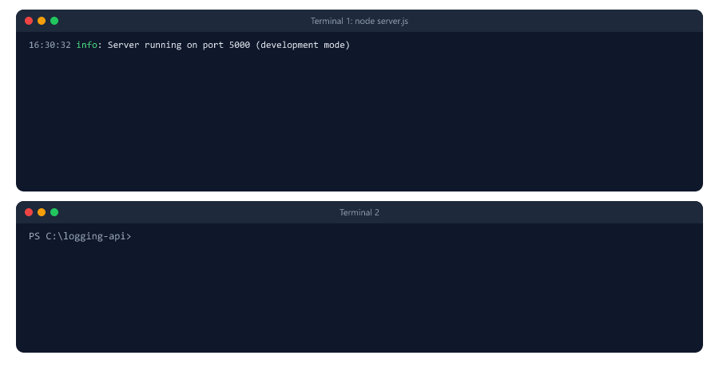

The server terminal (development, the stack is shortened here)

```text
16:30:32 info: Connected to MongoDB
16:30:32 info: Server running on port 5000 (development mode)
16:30:34 info: Student created {"requestId":"5e44b032-cb3f-445f-8224-b970b4f7dd5e","studentId":"6ac8c952a7c8959cd2b2870d"}
16:30:34 http: 5e44b032-cb3f-445f-8224-b970b4f7dd5e POST /api/students 201 194 - 18.627 ms
16:30:34 http: 18d85944-0c2b-4d94-ac03-1bea4c8abf01 GET /api/students 200 206 - 7.797 ms
16:30:34 http: e8c43931-7ef3-41b0-9e41-1de2f5130173 GET /api/students/abc 400 1987 - 2.291 ms
16:30:34 http: a4fd633d-6bd1-43ff-87c7-47d47f6e8349 GET /api/nothing 404 1990 - 0.700 ms
16:30:34 error: Cannot read properties of null (reading 'name') {"requestId":"378a05e1-a3e1-43b0-90fb-61c8f928cd6e","method":"GET","url":"/api/debug/bug"}
TypeError: Cannot read properties of null (reading 'name')
    at C:\...\server.js:59:28
    at Layer.handleRequest (C:\...\node_modules\router\lib\layer.js:152:17)
    ...
16:30:34 http: 378a05e1-a3e1-43b0-90fb-61c8f928cd6e GET /api/debug/bug 500 2013 - 1.437 ms
```

What to notice

* `Student created` comes before its `http` line: morgan writes when the response is finished, so the request line is the last line of each request
* The 500 has the full stack, with the file and line: `server.js:59:28`
* The 400 and 404 only have their `http` line. Their reasons are `debug` lines

logs/error.log has exactly one line: the 500.

With `LOG_LEVEL=debug` in .env, the client errors also show their reason

```text
16:26:32 debug: 400 Invalid _id: abc {"requestId":"57c4f04e-fd50-4e1a-a53d-d461dfaf4968"}
16:26:32 http: 57c4f04e-fd50-4e1a-a53d-d461dfaf4968 GET /api/students/abc 400 1987 - 2.807 ms
16:26:32 debug: 404 Route GET /api/nothing not found {"requestId":"876ff1df-643b-4201-a04d-dd4b25f9fedc"}
16:26:32 http: 876ff1df-643b-4201-a04d-dd4b25f9fedc GET /api/nothing 404 1990 - 0.793 ms
```

With `NODE_ENV=production`, the terminal shows JSON lines, the same as the files

```text
{"level":"info","message":"Server running on port 5000 (production mode)","timestamp":"2026-10-09T10:56:43.425Z"}
{"level":"http","message":"c0aa1330-b8f4-4305-a138-9de9e4929a32 GET /api/students 200 206 - 7.650 ms","timestamp":"2026-10-09T10:56:46.108Z"}
```

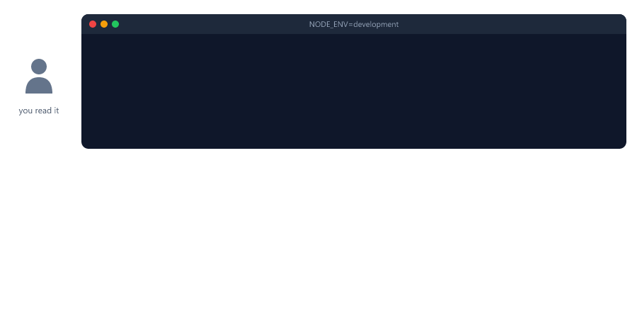

---

## Reading and Searching Logs

Windows PowerShell

```text
Get-Content logs\app.log -Tail 20             the last 20 lines
Get-Content logs\app.log -Wait -Tail 10       keep showing new lines (Ctrl+C to stop)
Select-String "378a05e1" logs\app.log         every line with this request id
Select-String '"level":"error"' logs\app.log  every error line
```

Git Bash, macOS and Linux

```text
tail -n 20 logs/app.log
tail -f logs/app.log
grep "378a05e1" logs/app.log
grep '"level":"error"' logs/app.log
```

`Select-String` and `grep` print each matching line. This is why the request id and the level are written into every line.

In VS Code you can also open the file and press Ctrl+F.

---

## Logs in Production

* **The terminal output is the most important log.** Hosting platforms (Render, Railway, Heroku, Docker) collect everything your app prints and show it in a dashboard. Like uploads in Session 25, local files can be deleted on every deploy. That is why the project prints JSON to the terminal in production.
* **Bigger apps send logs to a log service** (Grafana Loki, Datadog, Elastic, Better Stack, ...) to search many servers at once and get an alert when errors appear.
* **Choose the level:** `http` or `info` in production. Use `debug` only while you hunt a bug.
* **Logs cost space and money.** Levels and file limits keep them small.

---

## Beginner Mistakes

### Mistake 1

Logging passwords, tokens or whole request bodies.

`logger.info("Login", { body: req.body })` saves the password in plain text. Log ids, or use `hideSecrets()`.

---

### Mistake 2

Writing morgan's lines with `logger.http()` while the logger level is `"info"`.

Every request line disappears without an error. Use `level: "http"` or lower.

---

### Mistake 3

A typo in `LOG_LEVEL`.

`LOG_LEVEL=Debug` makes winston log nothing at all, not even errors. Check the value at startup.

---

### Mistake 4

`process.exit(1)` right after `logger.error(...)`.

The process stops before the line is written, so error.log stays empty. Use `exitAfterLogs()`.

---

### Mistake 5

Logging only `err.message`.

Without the stack you do not know which file and line failed. Use `errors({ stack: true })` and log `err` or `err.stack`.

---

### Mistake 6

`level.toUpperCase()` after `colorize()`.

It breaks the color codes. Leave the level as it is.

---

### Mistake 7

`morgan()` without a format.

It prints deprecation warnings. Always give one: `morgan("dev")`.

---

### Mistake 8

`fs.createWriteStream("logs/access.log")` when the logs folder does not exist.

The stream emits an `"error"` event and the app crashes. Create the folder with `fs.mkdirSync(dir, { recursive: true })`.

---

### Mistake 9

Relative log paths like `"logs/app.log"` in a project.

They depend on the folder you start node from (Session 06). Use `path.join(__dirname, ...)`.

---

### Mistake 10

`maxsize` and `maxFiles` without `tailable: true`.

The files are named app7.log, app8.log, app9.log and there is no app.log. Add `tailable: true`.

---

### Mistake 11

Logging every request two or three times.

Morgan to winston, morgan to the terminal, and your own "Request received" middleware. One request line is enough.

---

### Mistake 12

Committing the logs folder.

Add `logs/` to .gitignore.

---

## Practice Exercises

### Exercise 1

Create a logger that writes to three files

* logs/error.log (only errors)
* logs/warn.log (warnings and errors)
* logs/all.log (everything)

Check each file after calling `logger.error`, `logger.warn` and `logger.info` once

### Exercise 2

Log slow requests. Add a middleware that uses `res.on("finish")` (Session 14) and calls `logger.warn("Slow request", { requestId: req.id, url: req.originalUrl, ms })` when a request takes more than 1000 ms. Test it with a route that waits 1.5 seconds: `await new Promise((resolve) => setTimeout(resolve, 1500))`

### Exercise 3

Replace the File transports with winston-daily-rotate-file: one file per day, deleted after 7 days

### Exercise 4

In the Session 23 auth project, add the user id to every request line: a morgan token `userId` that prints `req.user ? req.user.id : "guest"`

### Exercise 5

Create a security log in the Session 23 project: `warn` for failed logins and for 403 "not allowed" answers, `info` for successful logins and password changes. Never log the password

### Exercise 6

Write find-logs.js: `node find-logs.js error` prints the time and message of every line with that level in logs/app.log. Use `JSON.parse` on each line

### Exercise 7

Improve `hideSecrets()` so it also hides `authorization` and `creditCard`, and test it with a body that has all of them

---

## Interview Questions

### What is logging

Recording events of a running application (requests, errors, important actions) with a time and a level, so you can see later what happened

### Why not just use console.log in a server

It has no time, no levels and no files. You cannot hide debug lines in production, and everything is lost when the terminal closes

### What is Morgan

HTTP request logger middleware for Express. It writes one line per request with the method, URL, status code, size and time

### What is the difference between Morgan and Winston

Morgan only logs HTTP requests, automatically. Winston is a general logger with levels, formats and many destinations. They are often used together: morgan builds the request line, winston saves it

### What are the log levels in Winston

error (0), warn (1), info (2), http (3), verbose (4), debug (5), silly (6). A smaller number is more important

### How does the level setting work

A logger keeps its level and every more important level. With `level: "info"`, error, warn and info are saved; http, verbose, debug and silly are ignored

### What is a transport in Winston

A destination for log lines, like the console or a file. One logger can have many, each with its own level and format

### How do you log errors with their stack trace

Add `format.errors({ stack: true })` and pass the Error object: `logger.error("Failed to save user", err)`, or log `err.stack` as a field

### Why are logs often written as JSON

Each line is one object with fields like level, time and requestId, so programs and log services can search and filter them

### What should never be written to logs

Passwords, tokens, the Authorization header, secrets from .env, card numbers and whole login or payment bodies

### What is a request ID

A unique id given to each request, added to every log line and sent back in a header like X-Request-Id, so all lines of one request can be found together

### What is log rotation

Starting a new log file when the current one is too big or too old, and deleting the oldest files, so logs do not fill the disk

### Why can log lines be lost when the app crashes

Files are written in the background. `process.exit()` stops Node at once, before waiting lines are written. Call `logger.end()` and exit on the `finish` event

### Where do logs go in production

Usually to the terminal output (stdout), which the hosting platform collects, and often on to a log service for searching and alerts
