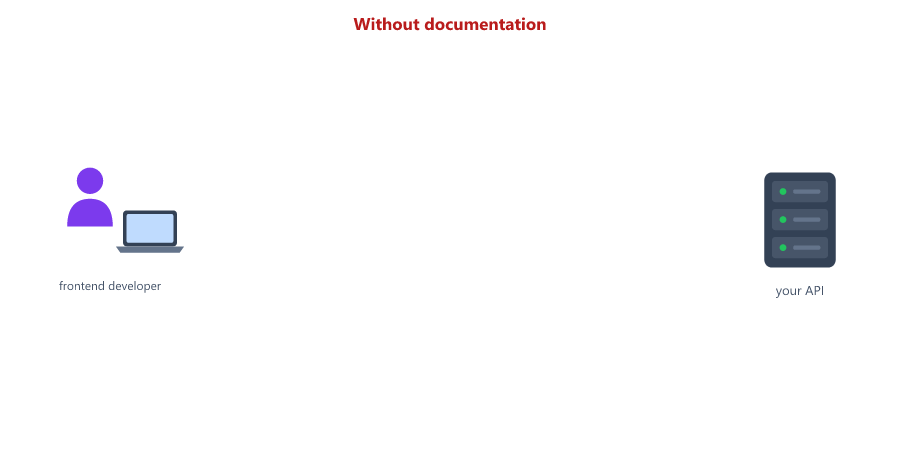
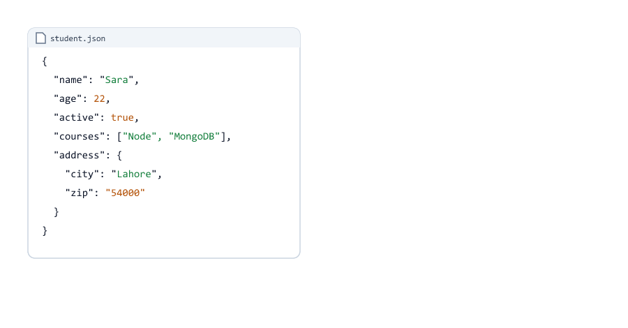
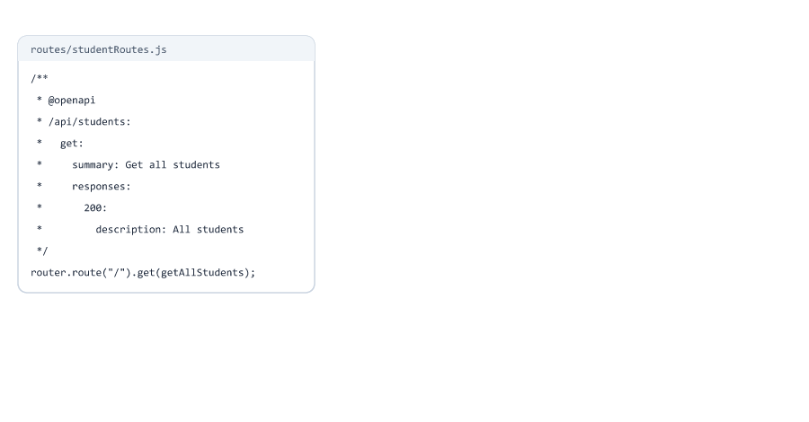
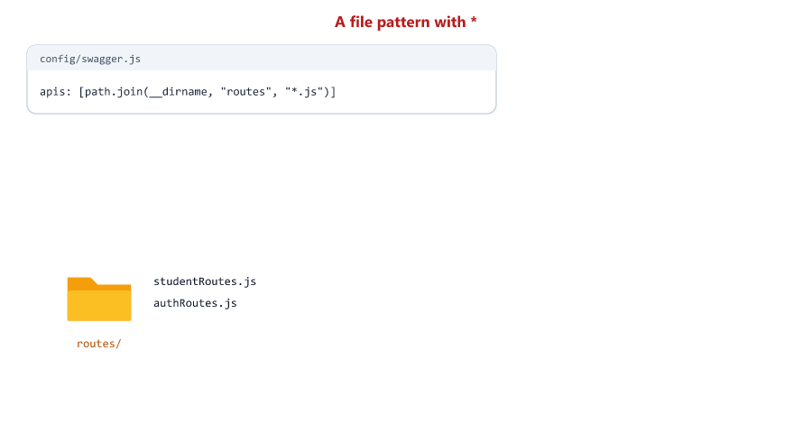
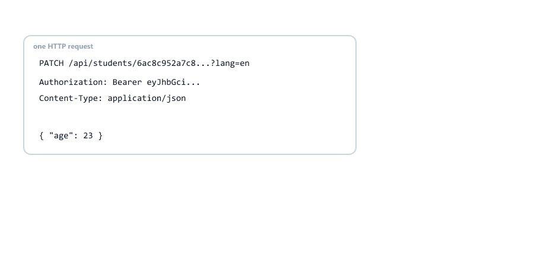
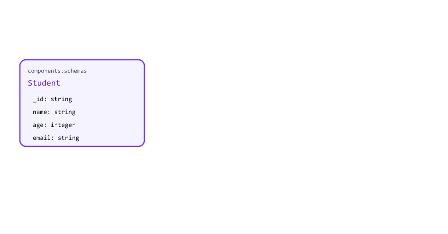
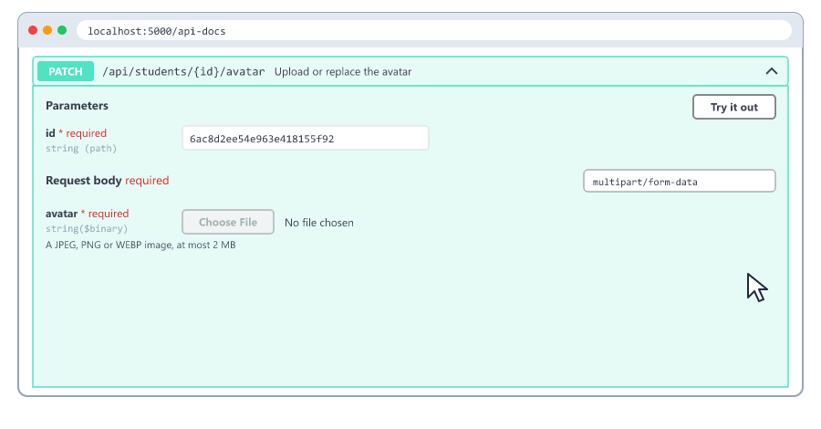
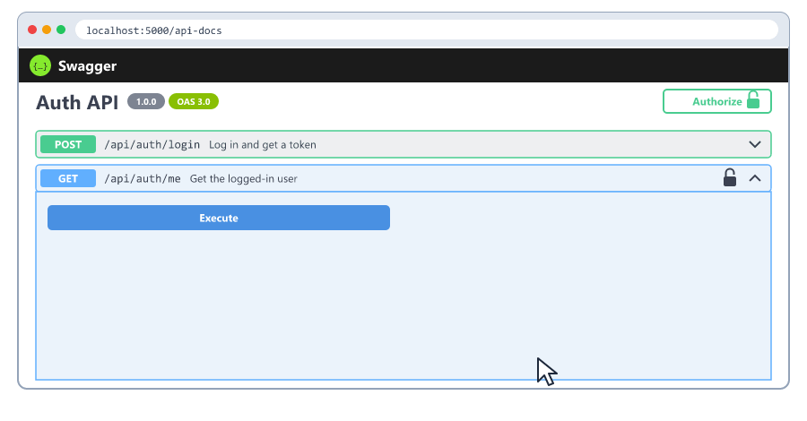
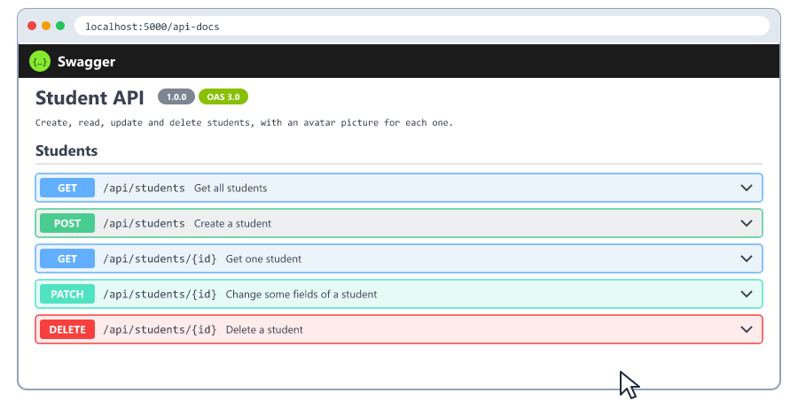
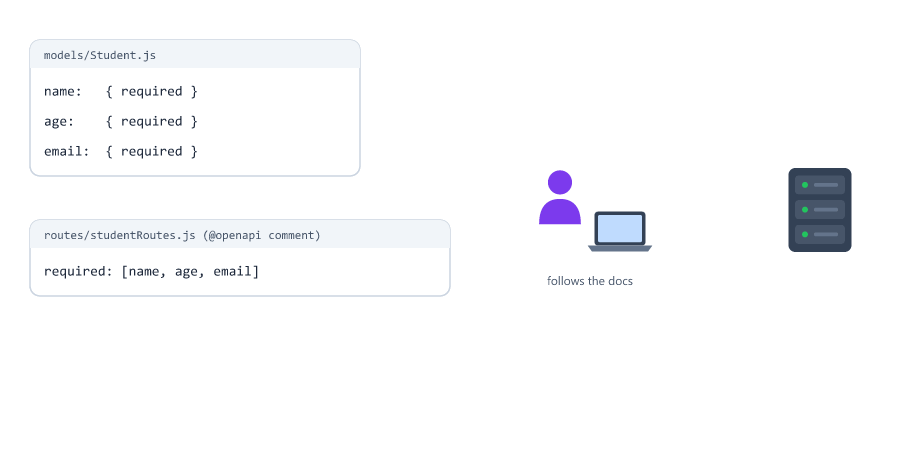

## Table of Contents

* [What is API Documentation](#what-is-api-documentation)
* [Why API Documentation is Important](#why-api-documentation-is-important)
* [What is OpenAPI](#what-is-openapi)
* [What is Swagger](#what-is-swagger)
* [YAML in 5 Minutes](#yaml-in-5-minutes)
* [Installing Swagger](#installing-swagger)
* [Basic Swagger Setup](#basic-swagger-setup)
* [Writing API Documentation](#writing-api-documentation)
* [Documenting Routes](#documenting-routes)
* [Documenting Parameters](#documenting-parameters)
* [Documenting Request Body](#documenting-request-body)
* [Documenting Responses](#documenting-responses)
* [Reusable Schemas and Responses](#reusable-schemas-and-responses)
* [Documenting File Uploads](#documenting-file-uploads)
* [Documenting Protected Routes](#documenting-protected-routes)
* [Complete Documentation Example](#complete-documentation-example)
* [Trying the API in Swagger UI](#trying-the-api-in-swagger-ui)
* [The Raw OpenAPI Document](#the-raw-openapi-document)
* [Keeping Docs Correct](#keeping-docs-correct)
* [Beginner Mistakes](#beginner-mistakes)
* [Practice Exercises](#practice-exercises)
* [Interview Questions](#interview-questions)

---

## What is API Documentation

API documentation explains how to use your API

It tells other developers

* What endpoints exist
* Which HTTP method each one uses
* What to send: parameters and body
* What comes back: the response for success and for each error

Think of it like the menu of a restaurant. The kitchen (your API) can cook many things, but customers only know what to order, and how, because of the menu.



Who reads your API documentation?

* The frontend developer building the web page or phone app
* Your teammates, and you in six months
* Other companies, if your API is public
* Testers (Session 28)

---

## Why API Documentation is Important

| Without documentation                        | With documentation                           |
| -------------------------------------------- | -------------------------------------------- |
| Developers read your code to guess the fields | They see every field, its type and an example |
| They send wrong data and get 400s            | They send the right data the first time      |
| They ask you the same questions again and again | They find the answer themselves          |
| Nobody knows which errors can happen         | Every status code is listed with its meaning |

Example of bad documentation

```text
Endpoint: /students
Method: POST
Send some data
Get something back
```

Example of good documentation (our real API from Sessions 24 to 26)

```text
POST /api/students
Creates a new student

Request body (JSON):
  name   string, required, at least 2 characters      "Sara"
  age    integer, required, 18 to 60                   22
  email  string, required, a valid email, unique       "sara@example.com"

201 Created
  { "success": true, "data": { "_id": "...", "name": "Sara", "age": 22, "email": "sara@example.com", ... } }

400 Bad Request   Validation failed, with an "errors" list
409 Conflict      This email is already used
```

Writing this by hand for every route is slow, and it gets old when the code changes. Tools help.

---

## What is OpenAPI

OpenAPI is a standard format for describing a REST API

The description is one document, written in JSON or YAML, that lists every path, method, parameter, body and response

```yaml
openapi: 3.0.0
info:
  title: Student API
  version: 1.0.0
paths:
  /api/students:
    get:
      summary: Get all students
      responses:
        "200":
          description: All students
```

Because the format is a standard, many tools can read the same document


| Tool                     | What it does with your OpenAPI document           |
| ------------------------ | ------------------------------------------------- |
| Swagger UI               | Shows a web page where you can read and try the API |
| Postman                  | Imports it and creates a request for every route   |
| Code generators          | Create client code (for example for a React app)   |
| Testing tools            | Check that the API really answers like the document says |

OpenAPI was first called "Swagger". In 2015 the format was given to the new OpenAPI Initiative, and in 2016 it was renamed OpenAPI. Version 3.0 (2017) is the one used in this session. You will still see the old name everywhere.

---

## What is Swagger

Today, Swagger is the name of a family of tools for OpenAPI. The one you will use most is **Swagger UI**: it turns an OpenAPI document into an interactive web page.

| Name                  | What it is                                                 |
| --------------------- | ---------------------------------------------------------- |
| OpenAPI               | The format (the rules for the document)                    |
| Your OpenAPI document | The description of YOUR API, in that format                |
| Swagger UI            | A web page that shows any OpenAPI document                 |
| swagger-jsdoc         | An npm package that builds the document from comments in your code |
| swagger-ui-express    | An npm package that serves Swagger UI from your Express app |

In Swagger UI you can

1. See every route in a list, grouped and colored by method
2. Click a route to see its parameters, body and responses
3. Click **Try it out**, change the values, and click **Execute**
4. See the real response, and the curl command that was sent

---

## YAML in 5 Minutes

You will write the documentation in YAML, a format for data like JSON, but with less punctuation. These two are the same data:

```json
{
  "name": "Sara",
  "age": 22,
  "active": true,
  "courses": ["Node", "MongoDB"],
  "address": {
    "city": "Lahore",
    "zip": "54000"
  }
}
```

```yaml
name: Sara
age: 22
active: true
courses:
  - Node
  - MongoDB
address:
  city: Lahore
  zip: "54000"
```



We parsed the YAML with the same library swagger-jsdoc uses, and got exactly the JSON above.

| YAML rule                         | Example                          |
| --------------------------------- | -------------------------------- |
| `key: value` (a space after the colon) | `name: Sara`                |
| Nesting is shown with indentation | `address:` then `  city: Lahore` |
| Use spaces, never tabs            | A tab gives `Plain value cannot start with a tab character` |
| A list item starts with `- `      | `- Node`                         |
| Text needs no quotes...           | `summary: Get all students`      |
| ...but quote text that looks like something else | `zip: "54000"`    |
| `#` starts a comment              | `# this is ignored`              |

Two traps we tested

| You write                                   | YAML reads                        |
| ------------------------------------------- | --------------------------------- |
| `phone: 03001234567`                        | the number `3001234567` (the 0 is gone) |
| `$ref: #/components/schemas/Student`        | `$ref: null` (everything after `#` is a comment!) |
| `$ref: '#/components/schemas/Student'`      | correct: always quote `$ref` values |

---

## Installing Swagger

Two packages

```bash
npm install swagger-ui-express swagger-jsdoc
```

| Package              | Job                                                        |
| -------------------- | ---------------------------------------------------------- |
| `swagger-jsdoc`      | Reads `@openapi` comments in your files and builds the OpenAPI document (a JavaScript object) |
| `swagger-ui-express` | Serves the Swagger UI web page for that document           |

This session uses swagger-ui-express 5.0.1 and swagger-jsdoc 6.3.0 (the versions we tested, with Express 5).

Real output in a new project (`npm install express swagger-ui-express swagger-jsdoc`)

```text
npm warn deprecated glob@11.1.0: Old versions of glob are not supported, and contain widely publicized security vulnerabilities, which have been fixed in the current version. Please update. ...

added 110 packages, and audited 111 packages in 6s

found 0 vulnerabilities
npm warn allow-scripts 1 package has install scripts not yet covered by allowScripts:
npm warn allow-scripts   @scarf/scarf@1.4.0 (postinstall: node ./report.js)
```

Both are warnings, not errors

* `glob` is used inside swagger-jsdoc to find your files. You cannot update it yourself, and the app works
* `@scarf/scarf` comes with Swagger UI and only counts downloads. npm 11 does not run install scripts unless you allow them (you saw this with bcrypt in Session 23), and you do not need this one

---

## Basic Swagger Setup

server.js

```javascript
const path = require("path");
const express = require("express");
const swaggerUi = require("swagger-ui-express");
const swaggerJsdoc = require("swagger-jsdoc");

const app = express();

// Build the OpenAPI document from the info below + the comments in the files listed in "apis"
const swaggerSpec = swaggerJsdoc({
  definition: {
    openapi: "3.0.0",
    info: {
      title: "Hello API",
      version: "1.0.0",
      description: "My first documented API"
    }
  },
  apis: [path.join(__dirname, "server.js")] // this file has the @openapi comments
});

// Show the documentation page at /api-docs
app.use("/api-docs", swaggerUi.serve, swaggerUi.setup(swaggerSpec));

/**
 * @openapi
 * /api/hello:
 *   get:
 *     summary: Say hello
 *     parameters:
 *       - in: query
 *         name: name
 *         schema:
 *           type: string
 *         description: Who to greet
 *         example: Sara
 *     responses:
 *       200:
 *         description: A greeting
 */
app.get("/api/hello", (req, res) => {
  const name = req.query.name || "world";
  res.json({ message: `Hello ${name}` });
});

app.listen(3000, (err) => {
  if (err) {
    console.log("Could not start server:", err.message);
    process.exit(1);
  }
  console.log("Server running on port 3000");
  console.log("Docs at http://localhost:3000/api-docs");
});
```

Run it and open `http://localhost:3000/api-docs`

```text
Server running on port 3000
Docs at http://localhost:3000/api-docs
```

| Part                                       | Meaning                                                  |
| ------------------------------------------ | -------------------------------------------------------- |
| `swaggerJsdoc({ definition, apis })`       | Builds the OpenAPI document (a normal JavaScript object) |
| `definition.openapi: "3.0.0"`              | Which OpenAPI version the document uses                  |
| `definition.info`                          | Title, version and description at the top of the page    |
| `apis`                                     | The files that contain `@openapi` comments               |
| `swaggerUi.serve`                          | Sends the files of the Swagger UI page (JavaScript, CSS) |
| `swaggerUi.setup(swaggerSpec)`             | Sends the page itself, with your document                |

`/api-docs` answers `301` and sends the browser to `/api-docs/` (with a slash). The browser follows by itself.



There is no `servers` list in the definition. Then Swagger UI sends requests to the same address the page came from, so it still works when you change the port. The original version of this lesson used `servers: [{ url: "http://localhost:3000" }]`; we ran the app on port 5000 and every **Try it out** failed:

```text
Failed to fetch.
Possible Reasons:
CORS
Network Failure
URL scheme must be "http" or "https" for CORS request.
```

Add `servers` only when the API runs on a different address than the docs.

Why `path.join(__dirname, ...)` in `apis`? We tested three ways on Windows

| `apis` value                                   | Routes found | Why                                          |
| ---------------------------------------------- | ------------ | -------------------------------------------- |
| `["./routes/*.js"]`                            | 1 from the project folder, **0** from any other folder | Relative to where you start node (Session 06) |
| `[path.join(__dirname, "routes", "*.js")]`     | **0**        | On Windows this is `C:\...\routes\*.js`. The pattern library reads `\` as "the next character is not special", so `\*` means a real star in the file name |
| `[path.join(__dirname, "routes", "studentRoutes.js")]` | 1    | An exact file name: no pattern, works everywhere |



When no file is found there is no error. Swagger UI just says **No operations defined in spec!** List your files by name.

---

## Writing API Documentation

swagger-jsdoc reads special comments. A comment is used only if

1. It starts with `/**` (two stars). We tested: a `/*` comment is skipped
2. It contains `@openapi` (or the older `@swagger`, which also works). Without the tag it is skipped
3. Its file is listed in `apis`

```javascript
/**
 * @openapi
 * /api/students:
 *   get:
 *     summary: Get all students
 *     responses:
 *       200:
 *         description: All students
 */
```

Everything after `@openapi` is YAML. The ` * ` at the start of each line is removed first, so the indentation after it is what counts.

A wrong indentation is a YAML error. swagger-jsdoc prints a report and skips that comment:

```text
Not all input has been taken into account at your final specification.
Here's the report:

 Error in t\docs-yaml.js :
YAMLSyntaxError: All collection items must start at the same column at line 2, column 3:

  get:
  ^^^^…
```

Our test file was `t\docs-yaml.js`. Its comment had `responses:` one space to the left of `summary:`. The route was missing from the page, and the server still started. Always look at the terminal when a route does not show up.

---

## Documenting Routes

Put the comment next to the route, so you see it when you change the route

```javascript
/**
 * @openapi
 * /api/students/{id}:
 *   get:
 *     summary: Get one student
 *     tags: [Students]
 *     parameters:
 *       - in: path
 *         name: id
 *         required: true
 *         schema:
 *           type: string
 *     responses:
 *       200:
 *         description: The student
 *       404:
 *         description: Student not found
 */
router.get("/:id", getStudent);
```

| Line                          | Meaning                                                    |
| ----------------------------- | ---------------------------------------------------------- |
| `/api/students/{id}`          | The **full** path the client calls                          |
| `get:`                        | The method, in lowercase                                   |
| `summary`                     | One short line shown in the list                           |
| `tags: [Students]`            | Groups routes under a heading on the page                  |
| `parameters`                  | The `{id}` in the path (next section)                      |
| `responses`                   | Every status code this route can answer, with a description |

Two path rules

* **Write the full path.** The router is mounted with `app.use("/api/students", router)`, so `router.get("/:id")` is really `/api/students/{id}` (Session 13: router paths are relative). If you write `/{id}`, Swagger UI calls `http://localhost:5000/abc` and gets a 404
* **Write `{id}`, not `:id`.** OpenAPI uses braces. We tested `/api/hello/:id`: Swagger UI sent the text `/api/hello/:id` itself, without the value, and got a 404

---

## Documenting Parameters

An HTTP request can carry data in four places



| Place                 | Example                            | Express (Session 13) | OpenAPI           |
| --------------------- | ---------------------------------- | -------------------- | ----------------- |
| Path                  | `/api/students/6ac8c952...`        | `req.params.id`      | `in: path`        |
| Query string          | `/api/students?page=2&limit=10`    | `req.query.page`     | `in: query`       |
| Headers               | `Authorization: Bearer eyJ...`     | `req.headers`        | `in: header` (or security, see below) |
| Body                  | `{ "name": "Sara" }`               | `req.body`           | `requestBody`     |

Path parameter (always `required: true`)

```yaml
parameters:
  - in: path
    name: id
    required: true
    schema:
      type: string
    description: The student's _id
```

Query parameters, like the list with pages from Session 20

```javascript
/**
 * @openapi
 * /api/students:
 *   get:
 *     summary: Get students, page by page
 *     parameters:
 *       - in: query
 *         name: page
 *         schema:
 *           type: integer
 *           minimum: 1
 *           default: 1
 *         description: Page number
 *       - in: query
 *         name: limit
 *         schema:
 *           type: integer
 *           minimum: 1
 *           maximum: 100
 *           default: 10
 *         description: Students per page (at most 100)
 *       - in: query
 *         name: sort
 *         schema:
 *           type: string
 *           enum: [name, -name, age, -age, createdAt, -createdAt]
 *         description: Sort field. A minus sign means newest or biggest first
 *       - in: query
 *         name: search
 *         schema:
 *           type: string
 *         description: Part of the name, not case-sensitive
 *     responses:
 *       200:
 *         description: One page of students
 */
```

We tested it in Swagger UI: the `default` values were filled in, so **Execute** called `/api/students?page=1&limit=10`, and `sort` was shown as a dropdown with the six `enum` values.

| Keyword            | Meaning                                       |
| ------------------ | --------------------------------------------- |
| `type`             | `string`, `integer`, `number`, `boolean`, `array`, `object` |
| `default`          | The value the server uses when it is missing  |
| `minimum`, `maximum` | Smallest and biggest allowed number         |
| `enum`             | The only allowed values                       |
| `example`          | A value shown in the docs and filled in by Try it out |

Header parameters work for your own headers, like `X-Request-Id`. **Not for `Authorization`.** The OpenAPI rules say a header parameter called `Authorization` is ignored. We tested it: Swagger UI showed a text box, we typed `Bearer <token>`, and the header was not sent. The answer was 401. Tokens are documented with security, in [Documenting Protected Routes](#documenting-protected-routes).

---

## Documenting Request Body

POST, PUT and PATCH send a body. Describe it with `requestBody`

```yaml
requestBody:
  required: true
  content:
    application/json:
      schema:
        type: object
        required:
          - name
          - age
          - email
        properties:
          name:
            type: string
            minLength: 2
            example: Sara
          age:
            type: integer
            minimum: 18
            maximum: 60
            example: 22
          email:
            type: string
            format: email
            example: sara@example.com
```

| Part                         | Meaning                                                 |
| ---------------------------- | ------------------------------------------------------- |
| `content: application/json`  | The body is JSON (the `Content-Type` header)            |
| `required:` list             | Fields the client must send                             |
| `minLength`, `minimum`, `maximum` | The same limits as your Mongoose schema (Session 19) |
| `format: email`              | A hint for readers and tools                            |
| `example`                    | Try it out fills the body with these values             |

With these examples, **Try it out** filled the body with `{ "name": "Sara", "age": 22, "email": "sara@example.com" }`, ready to send.

Keep the limits the same as the model. If the model says age 18 to 60 and the docs say nothing, readers find out only by getting a 400.

---

## Documenting Responses

List every status code the route can send, not only the happy one

```yaml
responses:
  200:
    description: The student
    content:
      application/json:
        schema:
          type: object
          properties:
            success:
              type: boolean
              example: true
            data:
              $ref: '#/components/schemas/Student'
  400:
    description: Invalid id
  404:
    description: Student not found
```

| Code | When (our API, Sessions 24 to 26)                       |
| ---- | ------------------------------------------------------- |
| 200  | OK                                                      |
| 201  | Created (POST)                                          |
| 400  | Bad id (CastError), bad JSON, validation failed, wrong upload |
| 401  | No token or a bad token (Session 22)                    |
| 403  | Logged in, but not allowed (Session 22)                 |
| 404  | Not found                                               |
| 409  | Duplicate email                                         |
| 413  | Body or file too large (Sessions 24 and 25)             |
| 500  | A bug. Usually not listed per route: it can happen anywhere |

`description` is required for every response. `content` is optional: add it when the body matters to the reader.

---

## Reusable Schemas and Responses

Many routes send a student. Write the Student shape once, in `components`, and point to it with `$ref`



```javascript
components: {
  schemas: {
    Student: {
      type: "object",
      properties: {
        _id: { type: "string", example: "6ac8c952a7c8959cd2b2870d" },
        name: { type: "string", example: "Sara" }
        // ...
      }
    }
  }
}
```

```yaml
schema:
  $ref: '#/components/schemas/Student'
```

`#/components/schemas/Student` is a path inside the document: start at the top (`#`), go into `components`, then `schemas`, then `Student`.

`components` is written in the `definition` object of `swaggerJsdoc()`, as normal JavaScript (no YAML needed). It can hold

| Part         | Reuse                                | Point to it with                         |
| ------------ | ------------------------------------ | ---------------------------------------- |
| `schemas`    | Data shapes: Student, Error          | `$ref: '#/components/schemas/Student'`   |
| `parameters` | A parameter used by many routes (the student id) | `- $ref: '#/components/parameters/StudentId'` |
| `responses`  | A whole answer: NotFound, BadRequest | `$ref: '#/components/responses/NotFound'` |
| `securitySchemes` | How to log in (next sections)   | `security:` on a route                   |

A typo in a `$ref` does not stop the server. We tested `$ref: '#/components/schemas/Studnt'`; when the route is opened, Swagger UI shows

```text
Errors
Resolver error at paths./api/hello.get.responses.200.content.application/json.schema.$ref
Could not resolve reference: Could not resolve pointer: /components/schemas/Studnt does not exist in document
```

One more thing we found: Swagger UI shows the `example` of the schema for every response that uses it. When the 400, 404 and 409 answers all used the Error schema, all three showed the example message `"Student not found"`. Give each reusable response its own `example` (see config/swagger.js below).

---

## Documenting File Uploads

The avatar upload from Session 25 is `multipart/form-data`. A file is a `string` with `format: binary`

```yaml
requestBody:
  required: true
  content:
    multipart/form-data:
      schema:
        type: object
        required:
          - avatar
        properties:
          avatar:
            type: string
            format: binary
            description: A JPEG, PNG or WEBP image, at most 2 MB
```

Swagger UI then shows a **Choose File** button. The property name (`avatar`) must be the field name Multer expects: `avatarUpload.single("avatar")`.



We uploaded a PNG with it. Swagger UI sent

```text
curl -X 'PATCH' \
  'http://localhost:5000/api/students/6ac8d0ae8562996b34d1d65d/avatar' \
  -H 'accept: */*' \
  -H 'Content-Type: multipart/form-data' \
  -F 'avatar=@cat.png;type=image/png'
```

and the answer was 200 with `"avatar": "/uploads/avatars/d99a6680-a79e-4b4d-bb85-064a7681e837.png"`.

---

## Documenting Protected Routes

Routes with `protect` (Session 22) need the header `Authorization: Bearer <token>`. In OpenAPI this is a **security scheme**, defined once in `components`

```javascript
components: {
  securitySchemes: {
    bearerAuth: {
      type: "http",
      scheme: "bearer",
      bearerFormat: "JWT"
    }
  }
}
```

Then each protected route says it needs it

```javascript
/**
 * @openapi
 * /api/auth/me:
 *   get:
 *     summary: Get the logged-in user
 *     tags: [Auth]
 *     security:
 *       - bearerAuth: []
 *     responses:
 *       200:
 *         description: The logged-in user
 *       401:
 *         description: No token, or the token is invalid or expired
 */
router.get("/me", protect, getMe);
```

Swagger UI now has an **Authorize** button with a lock. We tested it with the Session 23 auth project:

1. Run `POST /api/auth/login` in Swagger UI and copy the `token` from the answer
2. Click **Authorize**, paste the token (without the word `Bearer`), click **Authorize**, then **Close**
3. Run `GET /api/auth/me`



| Request                   | Answer                                                         |
| ------------------------- | -------------------------------------------------------------- |
| Before Authorize          | `401 { "success": false, "message": "Not logged in. Please send a token." }` |
| After Authorize           | `200 { "success": true, "user": { "id": "6ac8d177...", "name": "Sara", "email": "sara@example.com", "role": "user" } }` |

After Authorize, the curl command had `-H 'Authorization: Bearer eyJhbGci...'`. Swagger UI adds `Bearer ` by itself.

`security: - bearerAuth: []` means "this route needs bearerAuth". The empty list `[]` is for OAuth scopes, which we do not use.

When almost every route is protected, you can write `security` once in the definition, for all routes, and give the public routes `security: []` (an empty list means "no login needed").

---

## Complete Documentation Example

We document the Student API you built in Sessions 24 to 26

Project structure

```text
student-api/
├── config/
│   └── swagger.js               new: the OpenAPI definition
├── controllers/                 from Session 26
├── middleware/                  from Session 26
├── models/
│   └── Student.js               from Session 25
├── routes/
│   └── studentRoutes.js         Session 25 + @openapi comments
├── utils/                       from Session 26
├── .env
└── server.js                    Session 26 + /api-docs
```

Install

```bash
npm install swagger-ui-express swagger-jsdoc
```

config/swagger.js

```javascript
const path = require("path");
const swaggerJsdoc = require("swagger-jsdoc");

const swaggerSpec = swaggerJsdoc({
  definition: {
    openapi: "3.0.0",
    info: {
      title: "Student API",
      version: "1.0.0",
      description: "Create, read, update and delete students, with an avatar picture for each one."
    },
    components: {
      schemas: {
        Student: {
          type: "object",
          properties: {
            _id: { type: "string", example: "6ac8c952a7c8959cd2b2870d" },
            name: { type: "string", example: "Sara" },
            age: { type: "integer", example: 22 },
            email: { type: "string", format: "email", example: "sara@example.com" },
            avatar: { type: "string", example: "/uploads/avatars/7f25e53d-85c3-4fd7-9ca1-0cfff6757958.png" },
            createdAt: { type: "string", format: "date-time" },
            updatedAt: { type: "string", format: "date-time" },
            __v: { type: "integer", example: 0 }
          }
        },
        NewStudent: {
          type: "object",
          required: ["name", "age", "email"],
          properties: {
            name: { type: "string", minLength: 2, example: "Sara" },
            age: { type: "integer", minimum: 18, maximum: 60, example: 22 },
            email: { type: "string", format: "email", example: "sara@example.com" }
          }
        },
        StudentChanges: {
          type: "object",
          description: "Send only the fields you want to change",
          properties: {
            name: { type: "string", minLength: 2, example: "Sara Khan" },
            age: { type: "integer", minimum: 18, maximum: 60, example: 23 },
            email: { type: "string", format: "email", example: "sara.khan@example.com" }
          }
        },
        Error: {
          type: "object",
          properties: {
            success: { type: "boolean", example: false },
            status: { type: "string", example: "fail" },
            message: { type: "string", example: "Student not found" },
            errors: { type: "array", items: { type: "string" }, description: "Only when validation fails" }
          }
        }
      },
      parameters: {
        StudentId: {
          in: "path",
          name: "id",
          required: true,
          schema: { type: "string" },
          description: "The student's _id (24 characters)",
          example: "6ac8c952a7c8959cd2b2870d"
        }
      },
      // Error answers used by many routes. Each has the Error shape from errorMiddleware (Session 24),
      // with its own example, so readers see the real message
      responses: {
        BadRequest: {
          description: "Invalid input: a wrong id, bad JSON or failed validation",
          content: {
            "application/json": {
              schema: { $ref: "#/components/schemas/Error" },
              example: {
                success: false,
                status: "fail",
                message: "Validation failed",
                errors: ["Age must be at least 18", "Please enter a valid email"]
              }
            }
          }
        },
        NotFound: {
          description: "Student not found",
          content: {
            "application/json": {
              schema: { $ref: "#/components/schemas/Error" },
              example: { success: false, status: "fail", message: "Student not found" }
            }
          }
        },
        Conflict: {
          description: "This email is already used",
          content: {
            "application/json": {
              schema: { $ref: "#/components/schemas/Error" },
              example: {
                success: false,
                status: "fail",
                message: "email \"sara@example.com\" already exists. Please use another value."
              }
            }
          }
        }
      }
    }
  },
  // Exact file names: a pattern like "routes/*.js" can find nothing (see below)
  apis: [path.join(__dirname, "..", "routes", "studentRoutes.js")]
});

module.exports = swaggerSpec;
```

| Part                     | Why                                                             |
| ------------------------ | --------------------------------------------------------------- |
| `Student`                | What the API sends back, including `_id`, timestamps and `__v` (Session 19) |
| `NewStudent`             | What POST needs: all three fields are required                  |
| `StudentChanges`         | What PATCH accepts: any of the fields, none required            |
| `Error`                  | The error shape from errorMiddleware (Session 24)               |
| `StudentId`              | The `{id}` parameter, used by four routes                       |
| `responses` with examples | Each error answer shows its real message                       |
| `apis` with one exact file | Works on every computer, from every folder                    |

routes/studentRoutes.js

```javascript
const express = require("express");
const router = express.Router();

const {
  getAllStudents,
  getStudent,
  createStudent,
  updateStudent,
  deleteStudent
} = require("../controllers/studentController");
const { setAvatar, deleteAvatar } = require("../controllers/avatarController");
const { avatarUpload } = require("../middleware/upload");

/**
 * @openapi
 * /api/students:
 *   get:
 *     summary: Get all students
 *     tags: [Students]
 *     responses:
 *       200:
 *         description: All students, sorted by name
 *         content:
 *           application/json:
 *             schema:
 *               type: object
 *               properties:
 *                 success:
 *                   type: boolean
 *                   example: true
 *                 count:
 *                   type: integer
 *                   example: 1
 *                 data:
 *                   type: array
 *                   items:
 *                     $ref: '#/components/schemas/Student'
 *   post:
 *     summary: Create a student
 *     tags: [Students]
 *     requestBody:
 *       required: true
 *       content:
 *         application/json:
 *           schema:
 *             $ref: '#/components/schemas/NewStudent'
 *     responses:
 *       201:
 *         description: The new student
 *         content:
 *           application/json:
 *             schema:
 *               type: object
 *               properties:
 *                 success:
 *                   type: boolean
 *                   example: true
 *                 data:
 *                   $ref: '#/components/schemas/Student'
 *       400:
 *         $ref: '#/components/responses/BadRequest'
 *       409:
 *         $ref: '#/components/responses/Conflict'
 */
router.route("/")
  .get(getAllStudents)
  .post(createStudent);

/**
 * @openapi
 * /api/students/{id}:
 *   parameters:
 *     - $ref: '#/components/parameters/StudentId'
 *   get:
 *     summary: Get one student
 *     tags: [Students]
 *     responses:
 *       200:
 *         description: The student
 *         content:
 *           application/json:
 *             schema:
 *               type: object
 *               properties:
 *                 success:
 *                   type: boolean
 *                   example: true
 *                 data:
 *                   $ref: '#/components/schemas/Student'
 *       400:
 *         $ref: '#/components/responses/BadRequest'
 *       404:
 *         $ref: '#/components/responses/NotFound'
 *   patch:
 *     summary: Change some fields of a student
 *     tags: [Students]
 *     requestBody:
 *       required: true
 *       content:
 *         application/json:
 *           schema:
 *             $ref: '#/components/schemas/StudentChanges'
 *     responses:
 *       200:
 *         description: The updated student
 *         content:
 *           application/json:
 *             schema:
 *               type: object
 *               properties:
 *                 success:
 *                   type: boolean
 *                   example: true
 *                 data:
 *                   $ref: '#/components/schemas/Student'
 *       400:
 *         $ref: '#/components/responses/BadRequest'
 *       404:
 *         $ref: '#/components/responses/NotFound'
 *       409:
 *         $ref: '#/components/responses/Conflict'
 *   delete:
 *     summary: Delete a student
 *     tags: [Students]
 *     responses:
 *       200:
 *         description: Deleted
 *         content:
 *           application/json:
 *             schema:
 *               type: object
 *               properties:
 *                 success:
 *                   type: boolean
 *                   example: true
 *                 message:
 *                   type: string
 *                   example: Student deleted successfully
 *       400:
 *         $ref: '#/components/responses/BadRequest'
 *       404:
 *         $ref: '#/components/responses/NotFound'
 */
router.route("/:id")
  .get(getStudent)
  .patch(updateStudent)
  .delete(deleteStudent);

/**
 * @openapi
 * /api/students/{id}/avatar:
 *   parameters:
 *     - $ref: '#/components/parameters/StudentId'
 *   patch:
 *     summary: Upload or replace the avatar
 *     tags: [Avatars]
 *     requestBody:
 *       required: true
 *       content:
 *         multipart/form-data:
 *           schema:
 *             type: object
 *             required:
 *               - avatar
 *             properties:
 *               avatar:
 *                 type: string
 *                 format: binary
 *                 description: A JPEG, PNG or WEBP image, at most 2 MB
 *     responses:
 *       200:
 *         description: The student with the new avatar URL
 *         content:
 *           application/json:
 *             schema:
 *               type: object
 *               properties:
 *                 success:
 *                   type: boolean
 *                   example: true
 *                 data:
 *                   $ref: '#/components/schemas/Student'
 *       400:
 *         $ref: '#/components/responses/BadRequest'
 *       404:
 *         $ref: '#/components/responses/NotFound'
 *       413:
 *         description: The file is larger than 2 MB
 *         content:
 *           application/json:
 *             schema:
 *               $ref: '#/components/schemas/Error'
 *             example:
 *               success: false
 *               status: fail
 *               message: File is too large. The maximum is 2 MB
 *   delete:
 *     summary: Delete the avatar
 *     tags: [Avatars]
 *     responses:
 *       200:
 *         description: Avatar deleted
 *       404:
 *         $ref: '#/components/responses/NotFound'
 */
// multer runs first and fills req.file, then the controller runs
router.route("/:id/avatar")
  .patch(avatarUpload.single("avatar"), setAvatar)
  .delete(deleteAvatar);

module.exports = router;
```

| Part                                      | Why                                                   |
| ----------------------------------------- | ----------------------------------------------------- |
| One comment per `router.route()`          | All methods of one path are written under that path   |
| `parameters:` directly under the path     | Shared by every method of that path                   |
| `$ref` to components                      | The Student, the errors and the id are written only once |
| `tags: [Students]` and `tags: [Avatars]`  | Two groups on the page                                |
| The 413 has its own `example`             | It uses the Error schema, but its message is different |

server.js

```javascript
// The logger reads LOG_LEVEL and NODE_ENV, so .env is loaded first
require("dotenv").config({ quiet: true });
const logger = require("./utils/logger");

// ---------- Safety nets (Session 24), now with the logger ----------
let server;

// Wait until every log line is written to the files, then stop
function exitAfterLogs() {
  logger.on("finish", () => process.exit(1));
  logger.end();
  setTimeout(() => process.exit(1), 3000); // never wait more than 3 seconds
}

process.on("uncaughtException", (err) => {
  logger.error("UNCAUGHT EXCEPTION! Shutting down...", err);
  exitAfterLogs();
});

process.on("unhandledRejection", (err) => {
  logger.error("UNHANDLED REJECTION! Shutting down...", err);
  if (server) {
    server.close(exitAfterLogs);
  } else {
    exitAfterLogs();
  }
});

// ---------- The app ----------
const express = require("express");
const mongoose = require("mongoose");
const path = require("path");
const swaggerUi = require("swagger-ui-express");

const swaggerSpec = require("./config/swagger");
const studentRoutes = require("./routes/studentRoutes");
const AppError = require("./utils/AppError");
const requestId = require("./middleware/requestId");
const requestLogger = require("./middleware/requestLogger");
const errorMiddleware = require("./middleware/errorMiddleware");

const app = express();
const PORT = process.env.PORT || 5000;

app.use(requestId);     // first: every log line can use req.id

// API documentation, before the request logger so the files of the docs page are not logged
app.use("/api-docs", swaggerUi.serve, swaggerUi.setup(swaggerSpec));
app.get("/api-docs.json", (req, res) => {
  res.json(swaggerSpec); // the raw OpenAPI document, for Postman and other tools
});

app.use(requestLogger); // morgan, writes one "http" line per request

app.use(express.json({ limit: "10kb" }));

app.use("/uploads", express.static(path.join(__dirname, "uploads"), {
  setHeaders: (res) => {
    res.set("X-Content-Type-Options", "nosniff");
  }
}));

app.use("/api/students", studentRoutes);

app.use((req, res, next) => {
  next(new AppError(`Route ${req.method} ${req.originalUrl} not found`, 404));
});

app.use(errorMiddleware);

async function startServer() {
  await mongoose.connect(process.env.MONGODB_URI, { dbName: process.env.DB_NAME });
  logger.info("Connected to MongoDB");

  server = app.listen(PORT, (err) => {
    if (err) {
      logger.error("Could not start server", err);
      exitAfterLogs();
      return;
    }

    logger.info(`Server running on port ${PORT} (${process.env.NODE_ENV} mode)`);
  });
}

startServer(); // if connecting fails, the rejection reaches the safety net
```

| Change from Session 26                         | Why                                                   |
| ---------------------------------------------- | ----------------------------------------------------- |
| `app.use("/api-docs", ...)`                    | The documentation page                                |
| `app.get("/api-docs.json", ...)`               | The raw document, for tools ([see below](#the-raw-openapi-document)) |
| Both before `requestLogger`                    | Opening the docs loads several files; they are not written to your logs (we checked: 0 lines) |
| The `/api/debug/bug` route is gone             | It was only for testing Session 26                    |

The docs also work with `helmet()` (Sessions 14, 29 and 30): we tested Swagger UI and **Try it out** with helmet's default security headers, with no errors.

---

## Trying the API in Swagger UI

Start the server and open `http://localhost:5000/api-docs`



The page shows two groups, Students (5 routes) and Avatars (2 routes), and the four schemas at the bottom.

We ran every route with **Try it out** (tested in Chrome, on a new database)

| Route                                  | What we sent                               | Answer |
| -------------------------------------- | ------------------------------------------ | ------ |
| `POST /api/students`                   | The example body (Sara, 22)                | 201    |
| `POST /api/students`                   | `{ "name": "A", "age": 15, "email": "bad" }` | 400 with 3 errors |
| `GET /api/students`                    | -                                          | 200, `count: 1` |
| `GET /api/students/{id}`               | The example id `6ac8c952a7c8959cd2b2870d`  | 404 Student not found |
| `PATCH /api/students/{id}/avatar`      | Sara's id and a PNG                        | 200 with the avatar URL |
| `PATCH /api/students/{id}`             | `{ "age": 23 }`                            | 200, age 23 |

The 400 answer, in development mode (stack not shown here)

```text
{
  "success": false,
  "status": "fail",
  "message": "Validation failed",
  "errors": [
    "Name must be at least 2 characters",
    "Age must be at least 18",
    "Please enter a valid email"
  ],
  ...
}
```

Under each answer, Swagger UI shows

* **Curl**: the same request as a curl command, to copy into a terminal (in PowerShell use `curl.exe`, Session 25)
* **Request URL**: the full URL that was called
* **Response headers**: including `x-request-id` from Session 26

Swagger UI sends **real** requests. The POST really created Sara in the database. Do not try out a DELETE on a production server.

---

## The Raw OpenAPI Document

`swaggerSpec` is a normal JavaScript object. server.js also sends it as JSON

```text
http://localhost:5000/api-docs.json
```

The start of the answer

```text
{"openapi":"3.0.0","info":{"title":"Student API","version":"1.0.0","description":"Create, read, update and delete students, with an avatar picture for each one."},"components":{...},"paths":{"/api/students":{...},"/api/students/{id}":{...},"/api/students/{id}/avatar":{...}},"tags":[]}
```

Uses

* **Postman**: Import → paste the URL. Postman creates a request for every route
* Give it to the frontend team, or to tools that create code or tests from it
* Save it in your project to see in git what changed in your API

---

## Keeping Docs Correct

Documentation that is wrong is worse than none: people trust it.



* **Keep the comment next to the route.** When you change the route, the docs are right there
* **Use the same limits as the model.** Age 18 to 60 in Mongoose, `minimum: 18, maximum: 60` in the docs
* **Try every route after a change.** Use **Try it out**, or the tests of Session 28
* **Check the terminal** for the `YAMLSyntaxError` report, and the page for `Resolver error`
* **Document errors too.** Readers need to know what a 409 means

Should the docs be public?

| API                                      | Docs                                               |
| ---------------------------------------- | -------------------------------------------------- |
| Public API (other companies use it)      | Public, that is the point                          |
| Private API (only your own frontend)     | Often only in development: wrap the two lines in `if (process.env.NODE_ENV !== "production")` |

The docs page lists every route, so it also helps attackers find them. Your security must never depend on hiding routes, but there is no need to advertise a private API either.

---

## Beginner Mistakes

### Mistake 1

`apis: ["./routes/*.js"]` or `path.join(__dirname, "routes", "*.js")`.

The first depends on the folder you start node from; the second finds nothing on Windows. List the files by name with `path.join(__dirname, ...)`.

---

### Mistake 2

Writing the router path instead of the full path.

`/{id}` instead of `/api/students/{id}`. Swagger UI calls the wrong URL and gets a 404.

---

### Mistake 3

`:id` in the path.

OpenAPI uses `{id}`. With `:id`, Swagger UI sends the text `:id` itself.

---

### Mistake 4

Documenting the token as a header parameter named `Authorization`.

OpenAPI ignores it, so the token is never sent and you always get 401. Use `securitySchemes` and `security`.

---

### Mistake 5

`servers: [{ url: "http://localhost:3000" }]` while the app runs on port 5000.

Every Try it out fails with "Failed to fetch". Leave `servers` out.

---

### Mistake 6

`$ref` without quotes.

`#` starts a YAML comment, so `$ref: #/components/...` becomes `null`. Write `$ref: '#/components/schemas/Student'`.

---

### Mistake 7

Tabs or wrong indentation in the YAML.

The route disappears from the page. Read the `YAMLSyntaxError` report in the terminal.

---

### Mistake 8

Comments with one star (`/*`) or without `@openapi`.

swagger-jsdoc skips them without a warning.

---

### Mistake 9

Documenting only the 200.

Readers do not know what a 400, 404 or 409 means for this route, or what the body looks like.

---

### Mistake 10

One shared error example for every error.

Every error answer shows "Student not found". Give each response its own `example`.

---

### Mistake 11

Forgetting to update the docs after changing a route.

Docs that are wrong are worse than no docs.

---

### Mistake 12

Trying out DELETE (or POST) on a production server.

Try it out sends real requests.

---

## Practice Exercises

### Exercise 1

Add the query parameters of Session 20 to `GET /api/students` (page, limit, sort, search), implement them in getAllStudents, and test them with Try it out

### Exercise 2

Document the Session 23 auth API: register, login, me, change password (PATCH /api/auth/password) and the admin route. Use `bearerAuth` for the protected routes and list the 401 and 403 answers

### Exercise 3

Create a reusable `Unauthorized` response in `components.responses` with a real example, and use it on every protected route

### Exercise 4

Import `http://localhost:5000/api-docs.json` into Postman and run three requests from the created collection

### Exercise 5

Show the docs only in development: wrap the `/api-docs` and `/api-docs.json` lines in an `if`, start the server with `NODE_ENV=production`, and check that `/api-docs` gives your 404 error

### Exercise 6

Change the Student model so `age` can be 16 to 70. What else must change? Update the docs and check the page

---

## Interview Questions

### What is API documentation

A description of how to use an API: its endpoints, methods, parameters, request bodies, responses and errors

### What is OpenAPI

A standard format, in JSON or YAML, for describing a REST API. Many tools can read the same OpenAPI document

### What is the difference between Swagger and OpenAPI

OpenAPI is the format. Swagger is a family of tools for it, like Swagger UI. The format itself was called Swagger before 2016

### What is Swagger UI

A web page that shows an OpenAPI document and lets you send real requests with Try it out

### What do swagger-jsdoc and swagger-ui-express do

swagger-jsdoc builds the OpenAPI document from `@openapi` comments in your files. swagger-ui-express serves the Swagger UI page for that document in an Express app

### What is $ref

A pointer to a part of the document defined somewhere else, like `#/components/schemas/Student`, so a schema, parameter or response is written only once

### What is the difference between a path parameter and a query parameter

A path parameter is part of the path (`/api/students/{id}`) and always required. A query parameter comes after `?` (`?page=2`) and is usually optional

### How do you document a protected route

Define a security scheme (for JWT: `type: http`, `scheme: bearer`) in components.securitySchemes, and add `security: - bearerAuth: []` to the route. Swagger UI then shows an Authorize button

### How do you document a file upload

A requestBody with `multipart/form-data`, and the file as a property with `type: string` and `format: binary`

### What are components in OpenAPI

The reusable parts of the document: schemas, parameters, responses and security schemes

### Why put documentation comments next to the routes

So the docs are changed together with the code and stay correct

### Should API documentation be public

For a public API, yes. For a private API it is often shown only in development. Security must never depend on hiding the docs
