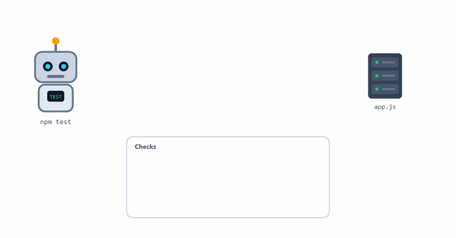
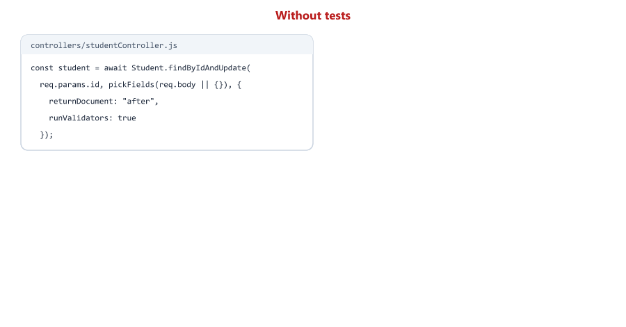
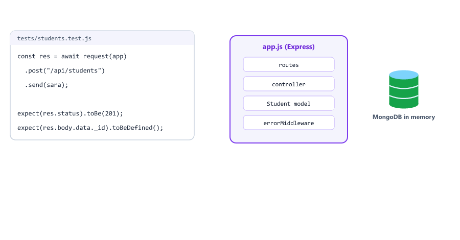
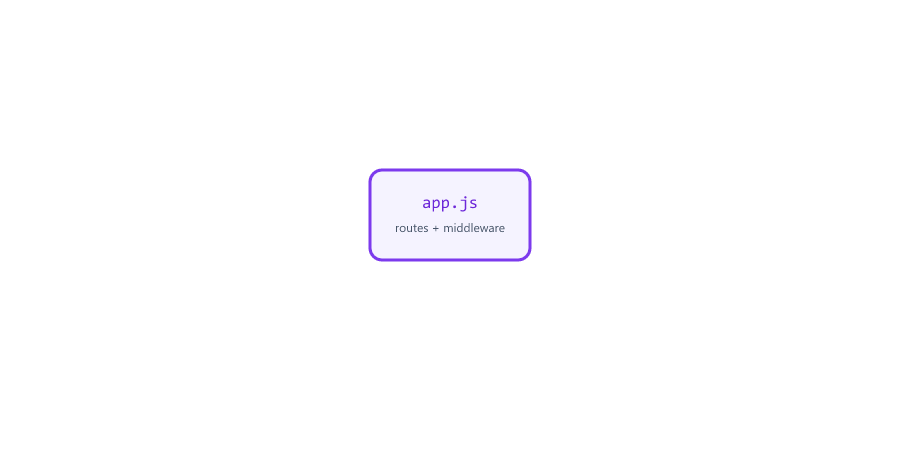
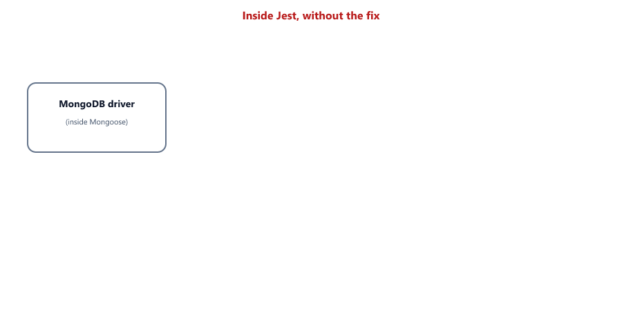
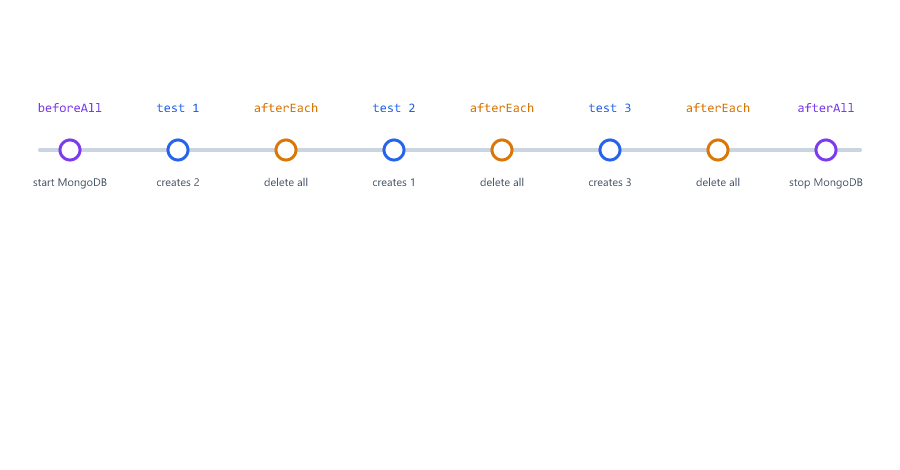
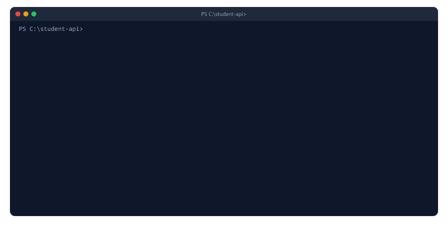
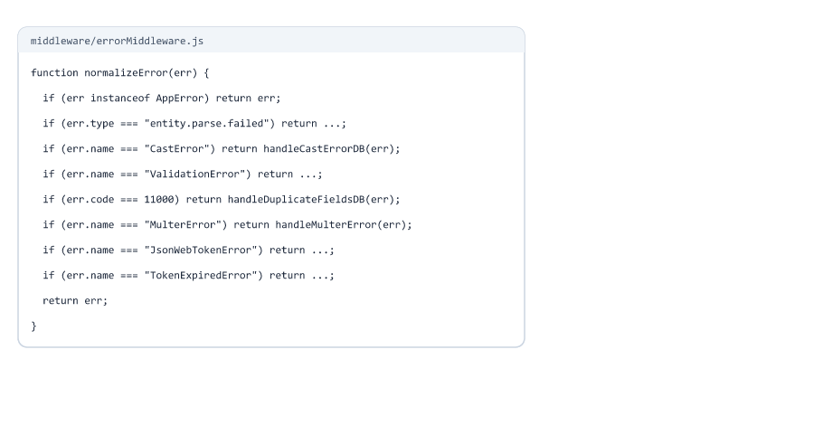
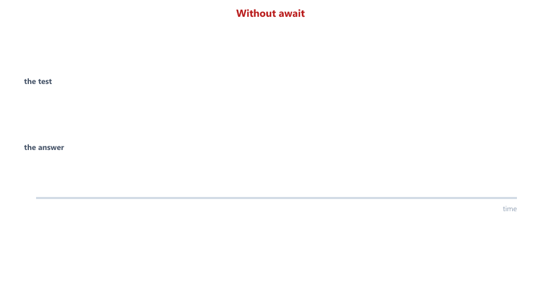

## Table of Contents

* [What is API Testing](#what-is-api-testing)
* [Why Testing is Important](#why-testing-is-important)
* [Types of Tests](#types-of-tests)
* [What is Jest](#what-is-jest)
* [What is Supertest](#what-is-supertest)
* [Installing Jest and Supertest](#installing-jest-and-supertest)
* [Split the App from the Server](#split-the-app-from-the-server)
* [Writing Your First Test](#writing-your-first-test)
* [Reading Test Results](#reading-test-results)
* [Matchers](#matchers)
* [A Test Database in Memory](#a-test-database-in-memory)
* [Before and After Hooks](#before-and-after-hooks)
* [Testing GET Requests](#testing-get-requests)
* [Testing POST Requests](#testing-post-requests)
* [Testing PATCH Requests](#testing-patch-requests)
* [Testing DELETE Requests](#testing-delete-requests)
* [Testing Error Responses](#testing-error-responses)
* [Testing File Uploads](#testing-file-uploads)
* [Unit Tests](#unit-tests)
* [Complete Testing Example](#complete-testing-example)
* [Running Tests](#running-tests)
* [Code Coverage](#code-coverage)
* [Writing Good Tests](#writing-good-tests)
* [Beginner Mistakes](#beginner-mistakes)
* [Practice Exercises](#practice-exercises)
* [Interview Questions](#interview-questions)

---

## What is API Testing

API testing is checking that your API works correctly, with code instead of by hand

Until now you tested by hand: Postman, curl, the test scripts of Sessions 24 to 26, or Try it out (Session 27). You looked at each answer and decided if it was right.

An automated test does the same, but the computer decides:

1. Prepare: put the data you need in the database
2. Send a request to your API
3. Check the answer: status code, body, and the database
4. Report: pass or fail



Example of a test, in words

```text
Test: "answers 409 when the email is already used"
1. Save Sara (sara@example.com) in the database
2. POST /api/students with another student and the same email
3. Expect status 409 and a message that contains "already exists"
```

In this session you write 22 tests like this for the Student API you built in Sessions 24 to 27. They run in about 3 seconds.

---

## Why Testing is Important



| Without tests                                  | With tests                                     |
| ---------------------------------------------- | ---------------------------------------------- |
| You change one line, something else breaks     | You change one line, run `npm test`            |
| A user finds the bug                           | A red FAIL shows exactly what broke            |
| You test everything by hand again (or you don't) | 22 checks in 3 seconds, every time           |
| You are afraid to change old code              | You can improve code safely                    |

Benefits of testing

| Benefit                     | Meaning                                                   |
| --------------------------- | --------------------------------------------------------- |
| Find bugs early             | Before users do                                           |
| No regressions              | Old features that worked keep working                     |
| Safe refactoring            | Like the app.js split below: the tests prove nothing broke |
| Living documentation        | A test like "answers 409 when the email is already used" says how the API behaves |

---

## Types of Tests

| Type             | Tests                                       | Example in this session                     | Speed     |
| ---------------- | ------------------------------------------- | ------------------------------------------- | --------- |
| Unit test        | One small piece of code, alone              | `new AppError("x", 404).status` is `"fail"` | Very fast |
| Integration test | Pieces working together                     | The Student model with a real database      | Fast      |
| API test         | A whole endpoint: route, controller, model, database, error middleware | `POST /api/students` answers 201 | Slower |


The test pyramid is a common advice: many unit tests, fewer integration tests, fewest API (or end-to-end) tests, because the higher tests are slower.

For an API like ours, the logic is mostly "route + validation + database", so API tests give you the most confidence for each line you write. Start there, and add unit tests for helpers with their own logic.

---

## What is Jest

Jest is a testing framework: it finds your test files, runs them and reports the results

```javascript
test("adds 1 + 2 to equal 3", () => {
  expect(1 + 2).toBe(3);
});
```

| Part                     | Meaning                                         |
| ------------------------ | ----------------------------------------------- |
| `test(name, fn)`         | One test. The name says what should happen      |
| `expect(value)`          | The value you check                             |
| `.toBe(3)`               | A matcher: the check itself                     |
| `describe(name, fn)`     | A group of tests (optional)                     |

`test`, `expect` and `describe` are globals: Jest creates them, you do not `require` them.

Jest runs every file whose name ends with `.test.js` (or `.spec.js`), or that is inside a `__tests__` folder. Other files, like `tests/db.js`, are not run as tests.

---

## What is Supertest

Supertest sends HTTP requests to your Express app, inside the test, without starting a server on a port

```javascript
const res = await request(app).get("/api/students");
```

| Supertest                         | Same as                                        |
| --------------------------------- | ---------------------------------------------- |
| `request(app).get(url)`           | A GET request                                  |
| `.post(url).send({ ... })`        | A POST with a JSON body (Content-Type is set for you) |
| `.set("Header", "value")`         | Set a header, like `Authorization` (Session 22) |
| `.attach("avatar", buffer, ...)`  | Upload a file (multipart/form-data, Session 25) |
| `res.status`, `res.body`, `res.headers` | The answer                               |



`request(app)` starts the app on a free, temporary port, sends the request and closes it again. You never call `app.listen()` in a test.

---

## Installing Jest and Supertest

In the Student API project from Sessions 24 to 27

```bash
npm install --save-dev jest supertest mongodb-memory-server
```

`--save-dev` (Session 02) puts them in `devDependencies`: they are needed to test the app, not to run it.

This session uses jest 30.5.2, supertest 7.3.1 and mongodb-memory-server 11.3.0 (the versions we tested).

Real output in a new project (`npm install --save-dev jest supertest`)

```text
npm warn deprecated glob@10.5.0: Old versions of glob are not supported, and contain widely publicized security vulnerabilities, which have been fixed in the current version. Please update. ...

added 320 packages, and audited 321 packages in 9s

19 moderate severity vulnerabilities

To address all issues, run:
  npm audit fix
```

The warnings come from packages inside Jest. Do **not** run `npm audit fix --force` here. We checked what it would do: `Will install jest@25.0.0, which is a breaking change`. It would replace Jest 30 with a five-year-old version. These packages only run on your computer during tests, never on the server.

package.json: the scripts, and the Jest settings

```json
{
  "scripts": {
    "start": "node server.js",
    "test": "jest",
    "test:watch": "jest --watchAll",
    "test:coverage": "jest --coverage"
  },
  "devDependencies": {
    "jest": "^30.5.2",
    "mongodb-memory-server": "^11.3.0",
    "supertest": "^7.3.1"
  },
  "jest": {
    "coveragePathIgnorePatterns": [
      "/node_modules/",
      "/tests/"
    ]
  }
}
```

| Script / setting          | Meaning                                                   |
| ------------------------- | --------------------------------------------------------- |
| `npm test`                | Runs every test once (`test` is special: no `run` needed) |
| `npm run test:watch`      | Runs the tests again every time you save a file          |
| `npm run test:coverage`   | Shows which lines your tests ran                         |
| `"jest": { ... }`         | Jest settings. `coveragePathIgnorePatterns`: do not count the tests themselves in the coverage |

Add `coverage/` to .gitignore: the coverage report is created by the tests.

---

## Split the App from the Server

Supertest needs the Express `app`. Until now, server.js did everything: safety nets, the app, the database connection and `listen()`. Requiring it in a test would connect to your real database and start listening on port 5000.

So we split it in two files (Session 29 uses the same split):

| File        | Contains                                              | Used by            |
| ----------- | ----------------------------------------------------- | ------------------ |
| `app.js`    | The Express app: middleware, routes, error middleware. **Exports** `app` | server.js and the tests |
| `server.js` | dotenv, logger, safety nets, `mongoose.connect`, `app.listen` | `npm start`  |



app.js

```javascript
// The Express app: middleware, routes and error handling. No database, no listen()
const express = require("express");
const path = require("path");
const swaggerUi = require("swagger-ui-express");

const swaggerSpec = require("./config/swagger");
const studentRoutes = require("./routes/studentRoutes");
const AppError = require("./utils/AppError");
const requestId = require("./middleware/requestId");
const requestLogger = require("./middleware/requestLogger");
const errorMiddleware = require("./middleware/errorMiddleware");

const app = express();

app.use(requestId);     // first: every log line can use req.id

// API documentation, before the request logger so the files of the docs page are not logged
app.use("/api-docs", swaggerUi.serve, swaggerUi.setup(swaggerSpec));
app.get("/api-docs.json", (req, res) => {
  res.json(swaggerSpec); // the raw OpenAPI document, for Postman and other tools
});

app.use(requestLogger); // morgan, writes one "http" line per request

app.use(express.json({ limit: "10kb" }));

app.use("/uploads", express.static(path.join(__dirname, "uploads"), {
  setHeaders: (res) => {
    res.set("X-Content-Type-Options", "nosniff");
  }
}));

// A quick check that the app is alive (Session 16)
app.get("/api/health", (req, res) => {
  res.json({ status: "OK" });
});

app.use("/api/students", studentRoutes);

app.use((req, res, next) => {
  next(new AppError(`Route ${req.method} ${req.originalUrl} not found`, 404));
});

app.use(errorMiddleware);

module.exports = app;
```

server.js

```javascript
// The logger reads LOG_LEVEL and NODE_ENV, so .env is loaded first
require("dotenv").config({ quiet: true });
const logger = require("./utils/logger");

// ---------- Safety nets (Session 24), now with the logger ----------
let server;

// Wait until every log line is written to the files, then stop
function exitAfterLogs() {
  logger.on("finish", () => process.exit(1));
  logger.end();
  setTimeout(() => process.exit(1), 3000); // never wait more than 3 seconds
}

process.on("uncaughtException", (err) => {
  logger.error("UNCAUGHT EXCEPTION! Shutting down...", err);
  exitAfterLogs();
});

process.on("unhandledRejection", (err) => {
  logger.error("UNHANDLED REJECTION! Shutting down...", err);
  if (server) {
    server.close(exitAfterLogs);
  } else {
    exitAfterLogs();
  }
});

// ---------- Start: connect to the database, then listen ----------
const mongoose = require("mongoose");
const app = require("./app");

const PORT = process.env.PORT || 5000;

async function startServer() {
  await mongoose.connect(process.env.MONGODB_URI, { dbName: process.env.DB_NAME });
  logger.info("Connected to MongoDB");

  server = app.listen(PORT, (err) => {
    if (err) {
      logger.error("Could not start server", err);
      exitAfterLogs();
      return;
    }

    logger.info(`Server running on port ${PORT} (${process.env.NODE_ENV} mode)`);
  });
}

startServer(); // if connecting fails, the rejection reaches the safety net
```

The new `/api/health` route is a tiny route that only says the app is alive. Hosting companies call routes like this to check your app (Session 16).

We started the real server after the split: `Connected to MongoDB`, `Server running on port 5000`, and `GET /api/health` answered `{"status":"OK"}`. Nothing changed for users.

One more change, in utils/logger.js (Session 26): no log lines during tests

```javascript
  silent: process.env.NODE_ENV === "test", // Jest sets NODE_ENV to "test": no log lines during tests
```

Jest sets `NODE_ENV` to `"test"` by itself (we printed it inside a test). Without this line, every request in a test writes an `http` line to the terminal and to logs/app.log, mixed with your real logs.

---

## Writing Your First Test

tests/health.test.js

```javascript
const request = require("supertest");
const app = require("../app");

test("GET /api/health answers 200 with status OK", async () => {
  const res = await request(app).get("/api/health");

  expect(res.status).toBe(200);
  expect(res.body.status).toBe("OK");
});
```

Run

```bash
npm test
```

Output

```text
PASS tests/health.test.js
  √ GET /api/health answers 200 with status OK (27 ms)

Test Suites: 1 passed, 1 total
Tests:       1 passed, 1 total
Snapshots:   0 total
Time:        0.865 s, estimated 1 s
Ran all test suites.
```

On Windows the tick is `√`; on macOS and Linux it is `✓`.

| Line                                   | Meaning                                         |
| -------------------------------------- | ----------------------------------------------- |
| `require("../app")`                    | Only the app: no database, no port              |
| `async () => { ... }`                  | The test waits for the request with `await` (Session 03) |
| `await request(app).get("/api/health")` | Sends the request and waits for the answer     |
| `expect(res.status).toBe(200)`         | Check 1: the status code                        |
| `expect(res.body.status).toBe("OK")`   | Check 2: the JSON body                          |

---

## Reading Test Results

A failing test tells you what was expected, what was received, and where

We wrote a test with the expectation of the original version of this lesson: a duplicate email gives 400. Our API (Session 24) answers 409. Real output:

```text
FAIL tests/fail-demo.test.js
  × answers 400 when the email is already used (69 ms)

  ● answers 400 when the email is already used

    expect(received).toBe(expected) // Object.is equality

    Expected: 400
    Received: 409

      16 |     .send({ name: "Another Sara", age: 25, email: "sara@example.com" });
      17 |
    > 18 |   expect(res.status).toBe(400);
         |                      ^
      19 | });
      20 |

      at Object.toBe (tests/fail-demo.test.js:18:22)

Test Suites: 1 failed, 1 total
Tests:       1 failed, 1 total
```


| Part                     | Tells you                                       |
| ------------------------ | ----------------------------------------------- |
| `FAIL` / `×`             | Which file and which test failed                |
| `Expected` / `Received`  | What the test wanted and what really happened   |
| `> 18 |` and `^`         | The exact line and column of the check          |

When a test fails, ask: is the code wrong, or is the test wrong? Here the test was wrong: 409 is the right answer for a duplicate.

---

## Matchers

| Matcher                        | Passes when                                   | Example from our tests                        |
| ------------------------------ | --------------------------------------------- | --------------------------------------------- |
| `toBe(x)`                      | Exactly the same value (numbers, text, true/false) | `expect(res.status).toBe(201)`           |
| `toEqual(obj)`                 | Same content (objects and arrays)             | `expect(res.body).toEqual({ success: true, count: 0, data: [] })` |
| `toBeDefined()` / `toBeUndefined()` | The value exists / does not exist        | `expect(res.body.data._id).toBeDefined()`     |
| `toBeNull()`                   | The value is `null`                           | `expect(await Student.findById(id)).toBeNull()` |
| `toMatch(/regex/)`             | Text matches a pattern                        | `expect(res.body.message).toMatch(/already exists/)` |
| `toContain(item)`              | An array contains the item                    | `expect(res.body.errors).toContain("Age must be at least 18")` |
| `toHaveLength(n)`              | An array (or text) has n items                | `expect(res.body.errors).toHaveLength(3)`     |
| `toBeInstanceOf(Class)`        | Made by that class                            | `expect(err).toBeInstanceOf(Error)`           |
| `.not.`                        | The opposite                                  | `expect(createdAt).not.toMatch(/^2000/)`      |

`toBe` vs `toEqual`: two objects with the same content are still two different objects. We tested `expect(res.body).toBe({ status: "OK" })`:

```text
expect(received).toBe(expected) // Object.is equality

If it should pass with deep equality, replace "toBe" with "toStrictEqual"

Expected: {"status": "OK"}
Received: serializes to the same string
```

Use `toEqual` (or `toStrictEqual`) for objects and arrays.

---

## A Test Database in Memory

Tests create and delete students. They must **never** use your real database (Session 17's Atlas cluster with real data).

mongodb-memory-server starts a real MongoDB on your computer, empty, only for the tests, and removes it afterwards.


tests/db.js: three helpers that every test file uses

```javascript
const mongoose = require("mongoose");
const { MongoMemoryServer } = require("mongodb-memory-server");

let mongoServer;

// Start a new, empty MongoDB in memory and connect Mongoose to it
async function connect() {
  mongoServer = await MongoMemoryServer.create();

  // The MongoDB driver (7.7) loads Node's "os" module with import(), which Jest blocks.
  // Giving the driver the module ourselves avoids that
  await mongoose.connect(mongoServer.getUri(), { runtimeAdapters: { os: require("os") } });
}

// Delete every document, so each test starts with an empty database
async function clear() {
  const collections = mongoose.connection.collections;
  for (const name in collections) {
    await collections[name].deleteMany({});
  }
}

// Disconnect and stop the in-memory MongoDB
async function close() {
  await mongoose.disconnect();
  await mongoServer.stop();
}

module.exports = { connect, clear, close };
```

| Function   | When                    | Does                                                     |
| ---------- | ----------------------- | -------------------------------------------------------- |
| `connect`  | Once, before the tests  | Starts MongoDB in memory and connects Mongoose to it     |
| `clear`    | After every test        | Deletes all documents: the next test starts empty        |
| `close`    | Once, after the tests   | Disconnects and stops MongoDB                            |

`mongoose.connection.collections` is an object with one entry per collection. `for (const name in collections)` is a `for...in` loop: it visits every key of an object, here the name of each collection.

The first run downloads MongoDB (about 2 minutes for us; it is saved in `node_modules/.cache/mongodb-memory-server`). After that, starting it takes about a second.

### A Jest trap: Missing required sub-document 'driver'

Without the `runtimeAdapters` option, **every** test failed for us:

```text
MongooseServerSelectionError: Missing required sub-document 'driver' in the client metadata document
```

followed by `Exceeded timeout of 5000 ms for a hook.` for each test.

We traced it: the MongoDB driver (version 7.7, used by Mongoose 9) loads Node's `os` module with `import()`. Jest blocks `import()` unless Node runs with the flag `--experimental-vm-modules`. The driver hides that error and sends the database an empty "who am I" document, and MongoDB refuses the connection. Outside Jest, the same code connected in about a second.



Two fixes, both tested (all tests passed with each):

| Fix                                                       | Notes                                             |
| --------------------------------------------------------- | ------------------------------------------------- |
| `runtimeAdapters: { os: require("os") }` in `mongoose.connect` (our tests/db.js) | Only in the test helper. `npm test` and `npx jest` both work. The option is marked experimental by the driver |
| `"test": "node --experimental-vm-modules node_modules/jest/bin/jest.js"` | No change in code, but every run prints `ExperimentalWarning: VM Modules is an experimental feature`, and plain `npx jest` still fails |

This is a real bug between two packages. When a newer driver or Jest version fixes it, the option is no longer needed. Bugs like this are another reason to run your tests often: they show you at once when an update breaks something.

---

## Before and After Hooks

Hooks are functions Jest runs at fixed moments

```javascript
beforeAll(db.connect, 60000);
afterEach(db.clear);
afterAll(db.close);
```



| Hook          | Runs                                     | We use it to                         |
| ------------- | ---------------------------------------- | ------------------------------------ |
| `beforeAll`   | Once, before the first test of the file  | Start the database                   |
| `beforeEach`  | Before every test                        | (Not needed here) create common data |
| `afterEach`   | After every test                         | Empty the database                   |
| `afterAll`    | Once, after the last test                | Stop the database                    |

We pass the function itself (`db.connect`, no `()`): Jest calls it at the right time and waits for its promise.

The second argument of `beforeAll` is a time limit in milliseconds. Every test and hook has a limit of 5 seconds by default. The first download of MongoDB takes much longer, so `connect` gets 60 seconds.

Hooks at the top of a file apply to every test in the file. Hooks inside a `describe` apply only to the tests in that group.

A setup file is another way. The original version of this lesson had a `tests/setup.js` with these hooks, but never told Jest about it. Jest only runs `*.test.js` files, so setup.js never ran and we got `Exceeded timeout of 5000 ms for a test.` To use a setup file, list it in package.json:

```json
"jest": {
  "setupFilesAfterEnv": ["<rootDir>/tests/setup.js"]
}
```

We tested both. This session uses the three explicit lines in each test file: you see where the database comes from.

---

## Testing GET Requests

tests/students.test.js starts with

```javascript
const request = require("supertest");
const app = require("../app");
const Student = require("../models/Student");
const db = require("./db");

// The first run downloads MongoDB, so give connect() up to 60 seconds
beforeAll(db.connect, 60000);
afterEach(db.clear);
afterAll(db.close);

// A valid student, to copy and change in each test
const sara = { name: "Sara", age: 22, email: "sara@example.com" };
```

Each test **prepares** its own data with the model, **sends** a request, and **checks** the answer

```javascript
describe("GET /api/students", () => {
  test("returns an empty list when there are no students", async () => {
    const res = await request(app).get("/api/students");

    expect(res.status).toBe(200);
    expect(res.body).toEqual({ success: true, count: 0, data: [] });
  });

  test("returns all students sorted by name", async () => {
    await Student.create([
      { name: "Zara", age: 30, email: "zara@example.com" },
      sara
    ]);

    const res = await request(app).get("/api/students");

    expect(res.status).toBe(200);
    expect(res.body.count).toBe(2);
    expect(res.body.data[0].name).toBe("Sara");
    expect(res.body.data[1].name).toBe("Zara");
  });
});
```

Zara is created first, but the API sorts by name (Session 24), so Sara comes first. The test checks the behaviour, not only the status.

One student by id

```javascript
describe("GET /api/students/:id", () => {
  test("returns one student", async () => {
    const student = await Student.create(sara);

    const res = await request(app).get(`/api/students/${student._id}`);

    expect(res.status).toBe(200);
    expect(res.body.data.email).toBe("sara@example.com");
  });

  test("answers 404 for an id that does not exist", async () => {
    const res = await request(app).get("/api/students/6ac8c952a7c8959cd2b2870d");

    expect(res.status).toBe(404);
    expect(res.body.message).toBe("Student not found");
  });

  test("answers 400 for an id that is not an ObjectId", async () => {
    const res = await request(app).get("/api/students/abc");

    expect(res.status).toBe(400);
    expect(res.body.message).toBe("Invalid _id: abc");
  });
});
```

`6ac8c952a7c8959cd2b2870d` is a valid ObjectId that nobody has, so the answer is 404. `abc` is not an ObjectId at all, so Mongoose throws a CastError and the error middleware answers 400 (Session 24). The original version of this lesson expected 500 here: a bug that a test would have shown.

---

## Testing POST Requests

```javascript
describe("POST /api/students", () => {
  test("creates a student and saves it in the database", async () => {
    const res = await request(app)
      .post("/api/students")
      .send({ ...sara, email: "SARA@Example.com" });

    expect(res.status).toBe(201);
    expect(res.body.success).toBe(true);
    expect(res.body.data._id).toBeDefined();
    expect(res.body.data.email).toBe("sara@example.com"); // lowercase: Session 19

    const inDb = await Student.findById(res.body.data._id);
    expect(inDb.name).toBe("Sara");
  });
```

| Check                                | Why                                               |
| ------------------------------------ | ------------------------------------------------- |
| `{ ...sara, email: "SARA@..." }`     | A copy of sara with one field changed (spread, Session 11) |
| The email comes back in lowercase    | The model's `lowercase: true` really works        |
| `Student.findById(...)`              | Not only the answer: the data is really in the database |

Two more POST tests

```javascript
  test("answers 409 when the email is already used", async () => {
    await Student.init(); // wait until the unique index on email exists
    await Student.create(sara);

    const res = await request(app)
      .post("/api/students")
      .send({ ...sara, name: "Another Sara" });

    expect(res.status).toBe(409);
    expect(res.body.message).toMatch(/already exists/);
  });
```

```javascript
  test("ignores fields the client may not set", async () => {
    const res = await request(app)
      .post("/api/students")
      .send({ ...sara, avatar: "/hack.png", createdAt: "2000-01-01" });

    expect(res.status).toBe(201);
    expect(res.body.data.avatar).toBeUndefined();
    expect(res.body.data.createdAt).not.toMatch(/^2000/);
  });
```

`Student.init()` waits until Mongoose has created the indexes of the model (Session 19). The unique email index is what makes the 409 possible; in a brand new database it is built in the background right after connecting.

The second test checks `pickFields` (Session 20): a client cannot set its own avatar or `createdAt`. Security rules deserve tests too.

---

## Testing PATCH Requests

Our API updates with PATCH (Session 20): only the fields that were sent change

```javascript
describe("PATCH /api/students/:id", () => {
  test("changes only the fields that were sent", async () => {
    const student = await Student.create(sara);

    const res = await request(app)
      .patch(`/api/students/${student._id}`)
      .send({ age: 23 });

    expect(res.status).toBe(200);
    expect(res.body.data.age).toBe(23);
    expect(res.body.data.name).toBe("Sara"); // unchanged
  });

  test("runs the validators on update", async () => {
    const student = await Student.create(sara);

    const res = await request(app)
      .patch(`/api/students/${student._id}`)
      .send({ age: 15 });

    expect(res.status).toBe(400);
    expect(res.body.errors).toEqual(["Age must be at least 18"]);
  });
});
```

The second test protects `runValidators: true` (Session 19). If someone removes it, an age of 15 would be saved and this test would fail.

---

## Testing DELETE Requests

```javascript
describe("DELETE /api/students/:id", () => {
  test("deletes the student", async () => {
    const student = await Student.create(sara);

    const res = await request(app).delete(`/api/students/${student._id}`);

    expect(res.status).toBe(200);
    expect(await Student.findById(student._id)).toBeNull();
  });

  test("answers 404 when the student does not exist", async () => {
    const res = await request(app).delete("/api/students/6ac8c952a7c8959cd2b2870d");

    expect(res.status).toBe(404);
  });
});
```

After a delete, look in the database: `findById` gives `null`.

---

## Testing Error Responses

Errors are part of the API. Test them like the happy cases.

```javascript
  test("answers 400 with every validation message", async () => {
    const res = await request(app)
      .post("/api/students")
      .send({ name: "A", age: 15, email: "bad" });

    expect(res.status).toBe(400);
    expect(res.body.message).toBe("Validation failed");
    expect(res.body.errors).toContain("Age must be at least 18");
    expect(res.body.errors).toHaveLength(3);
    expect(await Student.countDocuments()).toBe(0); // nothing was saved
  });
```

```javascript
  test("answers 400 for a body that is not valid JSON", async () => {
    const res = await request(app)
      .post("/api/students")
      .set("Content-Type", "application/json")
      .send('{ "name": "Sara", }');

    expect(res.status).toBe(400);
    expect(res.body.message).toBe("Request body is not valid JSON");
  });
```

```javascript
test("unknown routes answer 404", async () => {
  const res = await request(app).get("/api/nothing");

  expect(res.status).toBe(404);
  expect(res.body.message).toBe("Route GET /api/nothing not found");
});
```

| Error test               | Protects                                          |
| ------------------------ | ------------------------------------------------- |
| Validation               | The model rules and the `errors` list (Session 24) |
| Bad JSON                 | The `entity.parse.failed` case in errorMiddleware (Sessions 18 and 24) |
| Unknown route            | The 404 middleware                                |

To send broken JSON, we give `.send()` a string and set the Content-Type ourselves.

---

## Testing File Uploads

`.attach(field, content, options)` sends a file, like Postman's form-data (Session 25)

tests/avatar.test.js

```javascript
const fs = require("fs");
const path = require("path");
const request = require("supertest");
const app = require("../app");
const Student = require("../models/Student");
const { AVATAR_DIR } = require("../middleware/upload");
const db = require("./db");

beforeAll(db.connect, 60000);
afterEach(db.clear);
afterAll(db.close);

// A real 1 x 1 PNG (Session 25), and a web page that pretends to be one
const PNG = Buffer.from("iVBORw0KGgoAAAANSUhEUgAAAAEAAAABCAYAAAAfFcSJAAAADUlEQVR42mNk+M9QDwADhgGAWjR9awAAAABJRU5ErkJggg==", "base64");
const FAKE = Buffer.from("<script>alert(1)</script>");

const countFiles = () => fs.readdirSync(AVATAR_DIR).length;

test("uploads an avatar, then deletes it", async () => {
  const student = await Student.create({ name: "Sara", age: 22, email: "sara@example.com" });
  const filesBefore = countFiles();

  const upload = await request(app)
    .patch(`/api/students/${student._id}/avatar`)
    .attach("avatar", PNG, { filename: "cat.png", contentType: "image/png" });

  expect(upload.status).toBe(200);
  expect(upload.body.data.avatar).toMatch(/^\/uploads\/avatars\/.+\.png$/);
  expect(countFiles()).toBe(filesBefore + 1);

  // The file can be downloaded with the right type
  const image = await request(app).get(upload.body.data.avatar);
  expect(image.status).toBe(200);
  expect(image.headers["content-type"]).toBe("image/png");

  // Clean up through the API: the file is removed from the disk too
  const remove = await request(app).delete(`/api/students/${student._id}/avatar`);
  expect(remove.status).toBe(200);
  expect(countFiles()).toBe(filesBefore);
});

test("rejects a fake image and keeps no file", async () => {
  const student = await Student.create({ name: "Sara", age: 22, email: "sara@example.com" });
  const filesBefore = countFiles();

  const res = await request(app)
    .patch(`/api/students/${student._id}/avatar`)
    .attach("avatar", FAKE, { filename: "evil.html", contentType: "image/png" });

  expect(res.status).toBe(400);
  expect(res.body.message).toBe("This file is not a real image");
  expect(countFiles()).toBe(filesBefore);
});

test("answers 400 when no file is sent", async () => {
  const student = await Student.create({ name: "Sara", age: 22, email: "sara@example.com" });

  const res = await request(app).patch(`/api/students/${student._id}/avatar`);

  expect(res.status).toBe(400);
  expect(res.body.message).toBe('Please send an image in the form field "avatar"');
});
```

| Part                                         | Meaning                                             |
| -------------------------------------------- | --------------------------------------------------- |
| `.attach("avatar", PNG, { filename, contentType })` | The field name, the bytes, and what the client claims |
| `countFiles()`                               | Counts the files in uploads/avatars before and after |
| `request(app).get(upload.body.data.avatar)`  | Downloads the uploaded file: the URL really works   |
| Delete through the API                       | The test leaves no file behind                      |
| A web page claiming `image/png`              | The magic-number check from Session 25              |

After all 22 tests, uploads/avatars was empty: the tests clean up after themselves.

---

## Unit Tests

A unit test checks one small piece of code, with no request and no database

tests/AppError.test.js

```javascript
const AppError = require("../utils/AppError");

// A unit test: one small piece of code, no server, no database
describe("AppError", () => {
  test("a 404 is a client error: status fail", () => {
    const err = new AppError("Student not found", 404);

    expect(err.message).toBe("Student not found");
    expect(err.statusCode).toBe(404);
    expect(err.status).toBe("fail");
    expect(err.isOperational).toBe(true);
  });

  test("a 500 is a server error: status error", () => {
    expect(new AppError("Database is down", 500).status).toBe("error");
  });

  test("it is a real Error with the name AppError", () => {
    const err = new AppError("x", 400);

    expect(err).toBeInstanceOf(Error);
    expect(err.name).toBe("AppError");
  });
});
```

These run in about 1 millisecond each. Write unit tests for code with its own rules: helpers like `AppError`, `pickFields` or `hideSecrets` (Session 26).

---

## Complete Testing Example

Project structure (the Session 27 project, plus tests)

```text
student-api/
├── config/
│   └── swagger.js
├── controllers/
├── middleware/
├── models/
├── routes/
├── tests/
│   ├── db.js                    the in-memory database helpers
│   ├── health.test.js           first test
│   ├── students.test.js         15 API tests
│   ├── avatar.test.js           3 upload tests
│   └── AppError.test.js         3 unit tests
├── utils/
│   └── logger.js                + silent during tests
├── app.js                       new: the Express app
├── server.js                    now only: connect and listen
└── package.json                 + test scripts
```

tests/students.test.js (complete file)

```javascript
const request = require("supertest");
const app = require("../app");
const Student = require("../models/Student");
const db = require("./db");

// The first run downloads MongoDB, so give connect() up to 60 seconds
beforeAll(db.connect, 60000);
afterEach(db.clear);
afterAll(db.close);

// A valid student, to copy and change in each test
const sara = { name: "Sara", age: 22, email: "sara@example.com" };

describe("GET /api/students", () => {
  test("returns an empty list when there are no students", async () => {
    const res = await request(app).get("/api/students");

    expect(res.status).toBe(200);
    expect(res.body).toEqual({ success: true, count: 0, data: [] });
  });

  test("returns all students sorted by name", async () => {
    await Student.create([
      { name: "Zara", age: 30, email: "zara@example.com" },
      sara
    ]);

    const res = await request(app).get("/api/students");

    expect(res.status).toBe(200);
    expect(res.body.count).toBe(2);
    expect(res.body.data[0].name).toBe("Sara");
    expect(res.body.data[1].name).toBe("Zara");
  });
});

describe("POST /api/students", () => {
  test("creates a student and saves it in the database", async () => {
    const res = await request(app)
      .post("/api/students")
      .send({ ...sara, email: "SARA@Example.com" });

    expect(res.status).toBe(201);
    expect(res.body.success).toBe(true);
    expect(res.body.data._id).toBeDefined();
    expect(res.body.data.email).toBe("sara@example.com"); // lowercase: Session 19

    const inDb = await Student.findById(res.body.data._id);
    expect(inDb.name).toBe("Sara");
  });

  test("answers 400 with every validation message", async () => {
    const res = await request(app)
      .post("/api/students")
      .send({ name: "A", age: 15, email: "bad" });

    expect(res.status).toBe(400);
    expect(res.body.message).toBe("Validation failed");
    expect(res.body.errors).toContain("Age must be at least 18");
    expect(res.body.errors).toHaveLength(3);
    expect(await Student.countDocuments()).toBe(0); // nothing was saved
  });

  test("answers 409 when the email is already used", async () => {
    await Student.init(); // wait until the unique index on email exists
    await Student.create(sara);

    const res = await request(app)
      .post("/api/students")
      .send({ ...sara, name: "Another Sara" });

    expect(res.status).toBe(409);
    expect(res.body.message).toMatch(/already exists/);
  });

  test("answers 400 for a body that is not valid JSON", async () => {
    const res = await request(app)
      .post("/api/students")
      .set("Content-Type", "application/json")
      .send('{ "name": "Sara", }');

    expect(res.status).toBe(400);
    expect(res.body.message).toBe("Request body is not valid JSON");
  });

  test("ignores fields the client may not set", async () => {
    const res = await request(app)
      .post("/api/students")
      .send({ ...sara, avatar: "/hack.png", createdAt: "2000-01-01" });

    expect(res.status).toBe(201);
    expect(res.body.data.avatar).toBeUndefined();
    expect(res.body.data.createdAt).not.toMatch(/^2000/);
  });
});

describe("GET /api/students/:id", () => {
  test("returns one student", async () => {
    const student = await Student.create(sara);

    const res = await request(app).get(`/api/students/${student._id}`);

    expect(res.status).toBe(200);
    expect(res.body.data.email).toBe("sara@example.com");
  });

  test("answers 404 for an id that does not exist", async () => {
    const res = await request(app).get("/api/students/6ac8c952a7c8959cd2b2870d");

    expect(res.status).toBe(404);
    expect(res.body.message).toBe("Student not found");
  });

  test("answers 400 for an id that is not an ObjectId", async () => {
    const res = await request(app).get("/api/students/abc");

    expect(res.status).toBe(400);
    expect(res.body.message).toBe("Invalid _id: abc");
  });
});

describe("PATCH /api/students/:id", () => {
  test("changes only the fields that were sent", async () => {
    const student = await Student.create(sara);

    const res = await request(app)
      .patch(`/api/students/${student._id}`)
      .send({ age: 23 });

    expect(res.status).toBe(200);
    expect(res.body.data.age).toBe(23);
    expect(res.body.data.name).toBe("Sara"); // unchanged
  });

  test("runs the validators on update", async () => {
    const student = await Student.create(sara);

    const res = await request(app)
      .patch(`/api/students/${student._id}`)
      .send({ age: 15 });

    expect(res.status).toBe(400);
    expect(res.body.errors).toEqual(["Age must be at least 18"]);
  });
});

describe("DELETE /api/students/:id", () => {
  test("deletes the student", async () => {
    const student = await Student.create(sara);

    const res = await request(app).delete(`/api/students/${student._id}`);

    expect(res.status).toBe(200);
    expect(await Student.findById(student._id)).toBeNull();
  });

  test("answers 404 when the student does not exist", async () => {
    const res = await request(app).delete("/api/students/6ac8c952a7c8959cd2b2870d");

    expect(res.status).toBe(404);
  });
});

test("unknown routes answer 404", async () => {
  const res = await request(app).get("/api/nothing");

  expect(res.status).toBe(404);
  expect(res.body.message).toBe("Route GET /api/nothing not found");
});
```

Run everything

```bash
npm test -- --verbose
```

`--` passes the rest to Jest; `--verbose` lists every test. Real output:

```text
> student-api@1.0.0 test
> jest --verbose

PASS tests/AppError.test.js
  AppError
    √ a 404 is a client error: status fail (7 ms)
    √ a 500 is a server error: status error (1 ms)
    √ it is a real Error with the name AppError (1 ms)

PASS tests/health.test.js
  √ GET /api/health answers 200 with status OK (65 ms)

PASS tests/avatar.test.js
  √ uploads an avatar, then deletes it (95 ms)
  √ rejects a fake image and keeps no file (18 ms)
  √ answers 400 when no file is sent (11 ms)

PASS tests/students.test.js
  √ unknown routes answer 404 (8 ms)
  GET /api/students
    √ returns an empty list when there are no students (54 ms)
    √ returns all students sorted by name (23 ms)
  POST /api/students
    √ creates a student and saves it in the database (22 ms)
    √ answers 400 with every validation message (20 ms)
    √ answers 409 when the email is already used (11 ms)
    √ answers 400 for a body that is not valid JSON (9 ms)
    √ ignores fields the client may not set (8 ms)
  GET /api/students/:id
    √ returns one student (11 ms)
    √ answers 404 for an id that does not exist (9 ms)
    √ answers 400 for an id that is not an ObjectId (7 ms)
  PATCH /api/students/:id
    √ changes only the fields that were sent (12 ms)
    √ runs the validators on update (11 ms)
  DELETE /api/students/:id
    √ deletes the student (11 ms)
    √ answers 404 when the student does not exist (6 ms)

Test Suites: 4 passed, 4 total
Tests:       22 passed, 22 total
Snapshots:   0 total
Time:        2.783 s, estimated 4 s
Ran all test suites.
```



Without `--verbose`, Jest prints only one line per file.

---

## Running Tests

| Command                                   | Runs                                           |
| ----------------------------------------- | ---------------------------------------------- |
| `npm test`                                | All tests, once                                |
| `npm test -- --verbose`                   | All tests, with every test name                |
| `npx jest tests/students.test.js`         | One file                                       |
| `npx jest -t "409"`                       | Only tests whose name contains "409"           |
| `npm run test:watch`                      | All tests, again on every save (Ctrl+C to stop) |
| `npm run test:coverage`                   | All tests, plus a coverage report              |

`test.only(...)` runs only that test in its file, and `test.skip(...)` skips one. Remove them before you commit.

Why `--watchAll` and not `--watch`? `--watch` only reruns tests for files changed since the last git commit, so it needs git. In a folder without git, Jest says:

```text
--watch is not supported without git/hg, please use --watchAll
```

---

## Code Coverage

Coverage shows which lines of your app were run by the tests

```bash
npm run test:coverage
```

Real output (the 22 tests above)

```text
> student-api@1.0.0 test:coverage
> jest --coverage

PASS tests/AppError.test.js
PASS tests/health.test.js
PASS tests/avatar.test.js
PASS tests/students.test.js
-------------------------|---------|----------|---------|---------|--------------------------
File                     | % Stmts | % Branch | % Funcs | % Lines | Uncovered Line #s
-------------------------|---------|----------|---------|---------|--------------------------
All files                |    82.9 |    48.68 |   81.81 |      85 |
 student-api             |      96 |      100 |      75 |      96 |
  app.js                 |      96 |      100 |      75 |      96 | 20
 student-api/config      |     100 |      100 |     100 |     100 |
  swagger.js             |     100 |      100 |     100 |     100 |
 student-api/controllers |   90.27 |    65.38 |     100 |   91.54 |
  avatarController.js    |      85 |    57.14 |     100 |   87.17 | 14,39,53,64,67
  studentController.js   |   96.87 |       75 |     100 |   96.87 | 51
 student-api/middleware  |   73.33 |    36.84 |   76.47 |   76.62 |
  errorMiddleware.js     |   61.66 |    36.11 |   63.63 |   64.58 | 22-32,46-51,69-79,96,108
  requestId.js           |     100 |      100 |     100 |     100 |
  requestLogger.js       |     100 |      100 |     100 |     100 |
  upload.js              |   94.11 |       50 |     100 |   94.11 | 32
 student-api/models      |     100 |      100 |     100 |     100 |
  Student.js             |     100 |      100 |     100 |     100 |
 student-api/routes      |     100 |      100 |     100 |     100 |
  studentRoutes.js       |     100 |      100 |     100 |     100 |
 student-api/utils       |   74.19 |       50 |   66.66 |   74.19 |
  AppError.js            |     100 |      100 |     100 |     100 |
  checkImage.js          |     100 |      100 |     100 |     100 |
  logger.js              |   55.55 |       40 |       0 |   55.55 | 12-13,21-28
-------------------------|---------|----------|---------|---------|--------------------------

Test Suites: 4 passed, 4 total
Tests:       22 passed, 22 total
Snapshots:   0 total
Time:        3.468 s
Ran all test suites.
```

| Column              | Meaning                                                    |
| ------------------- | ---------------------------------------------------------- |
| `% Stmts`           | Statements that were run                                   |
| `% Branch`          | Both sides of every `if` / `? :` / `||` that were taken    |
| `% Funcs`           | Functions that were called                                 |
| `% Lines`           | Lines that were run                                        |
| `Uncovered Line #s` | The lines no test reached                                  |



Open coverage/lcov-report/index.html in the browser to see your code with the lines in green and red.

What the report tells us here

* errorMiddleware.js lines 22-32 are the Multer errors: we never sent a file that is too large or in the wrong field (Exercise 1)
* errorMiddleware.js lines 46-51 are the checks after the duplicate check (Multer, JWT, unknown errors): every error in our tests was handled before them
* errorMiddleware.js lines 69-79 are the production answer: tests run with `NODE_ENV=test`, so the development answer is used
* logger.js is low because the tests run with `silent`: that is fine
* app.js line 20 is `/api-docs.json`: no test asked for it

Coverage is a guide, not a goal. 100% coverage does not mean the checks are good: a test without any `expect` also "covers" lines. Look for important code that no test reaches.

---

## Writing Good Tests

| Rule                                       | Why                                               |
| ------------------------------------------ | ------------------------------------------------- |
| Each test prepares its own data            | Tests can run in any order, alone or together     |
| Empty the database after each test        | One test's data never breaks another test         |
| A name that says the expected behaviour    | "answers 409 when the email is already used" reads like documentation |
| Prepare, send, check (in that order)       | Easy to read. Also called Arrange, Act, Assert    |
| Test the errors, not only the happy path   | Most bugs hide in the error cases                 |
| Check the database, not only the answer    | The answer can say 201 while nothing was saved    |
| Never use the real database                | Tests delete data                                 |
| A failing test first, then the fix         | When you find a bug, write a test that shows it, then fix the code: the bug cannot come back silently |

---

## Beginner Mistakes

### Mistake 1

Forgetting `await` (or `return`).

```javascript
test("no await: a wrong expectation", () => {
  request(app).get("/api/health").then((res) => {
    expect(res.status).toBe(500); // wrong on purpose
  });
});
```

We ran it alone. Jest said `PASS`, `√ no await: a wrong expectation`, `Tests: 1 passed`, and only afterwards printed `JestAssertionError ... Expected: 500, Received: 200`. The test ended before the answer arrived. Always `await` the request in an `async` test.



---

### Mistake 2

Requiring server.js in tests.

It connects to the real database and listens on a port. Export the app from app.js and require that.

---

### Mistake 3

Using the real database.

Tests delete documents. Use mongodb-memory-server.

---

### Mistake 4

Forgetting `afterAll(db.close)`.

We tested it: the test passed, then Jest printed `Jest did not exit one second after the test run has completed.` and the terminal stayed busy.

---

### Mistake 5

A setup file that Jest does not know.

Without `setupFilesAfterEnv`, tests/setup.js never runs and every test times out.

---

### Mistake 6

Tests that depend on each other.

Test 2 uses the student that test 1 created. Run test 2 alone, or in another order, and it fails. Each test prepares its own data.

---

### Mistake 7

`toBe` for objects and arrays.

Use `toEqual`.

---

### Mistake 8

Testing only the happy path.

Most bugs are in the error cases: 400, 404, 409, bad JSON, bad id.

---

### Mistake 9

Expecting the status code you wish for, not the one the API sends.

The original version of this lesson expected 400 for a duplicate email and 500 for a bad id. Our API sends 409 and 400. Read the failure, then decide if the code or the test is wrong.

---

### Mistake 10

`npm audit fix --force` after installing Jest.

It installs Jest 25 instead of 30.

---

### Mistake 11

`jest --watch` in a folder without git.

Use `--watchAll`.

---

### Mistake 12

Leaving `test.only` in the code.

The other tests of that file are silently skipped.

---

## Practice Exercises

### Exercise 1

Cover the Multer errors: upload a 3 MB file (expect 413 and "File is too large. The maximum is 2 MB") and a file in the field "photo" (expect 400). Check the coverage of errorMiddleware.js again

### Exercise 2

Add the pagination of Session 20 (`?page=2&limit=5`) to GET /api/students. Write the tests first: 12 students, page 2 with limit 5 must return 5 students and `totalPages: 3`. Then write the code until they pass

### Exercise 3

Write tests for the Session 23 auth API: register (201, no password in the answer), login (200 with a token), wrong password (401), GET /api/auth/me with `` .set("Authorization", `Bearer ${token}`) `` (200) and without a token (401)

### Exercise 4

Write a unit test for `hideSecrets()` from Session 26: the password is replaced, the other fields are kept, and the original object is not changed

### Exercise 5

Test that every answer has an `X-Request-Id` header (Session 26), and that two requests get different ids

### Exercise 6

Break the code on purpose: remove `runValidators: true` from updateStudent. Which test fails? Put it back

---

## Interview Questions

### What is API testing

Sending requests to the API from code and checking the status codes, bodies and database changes automatically

### What is Jest

A JavaScript testing framework: it finds test files, runs them, and gives `test`, `expect`, matchers, hooks and coverage

### What is Supertest

A library that sends HTTP requests to an Express app inside a test, without starting a server on a fixed port

### What is the difference between unit, integration and API tests

A unit test checks one small piece of code alone. An integration test checks pieces together, like a model with a database. An API test checks a whole endpoint from request to response

### Why separate app.js and server.js

So tests can use the Express app without connecting to the real database and without listening on a port

### Why use an in-memory database for testing

Tests start from an empty database, run fast, and can never change real data

### What are beforeAll, beforeEach, afterEach and afterAll

Hooks. beforeAll and afterAll run once per file (or describe block), beforeEach and afterEach run around every test

### What is the difference between toBe and toEqual

toBe checks that it is exactly the same value (Object.is). toEqual checks that objects or arrays have the same content

### What happens if you forget await in a test

The test can end before the response arrives and pass, even when the check is wrong

### What is code coverage

The percentage of statements, branches, functions and lines of the app that the tests ran

### Is 100% coverage the goal

No. Coverage shows untested code, but not whether the checks are good. Important code and error cases matter more than the number

### What is a regression

A feature that worked before and breaks after a change. Automated tests catch regressions
