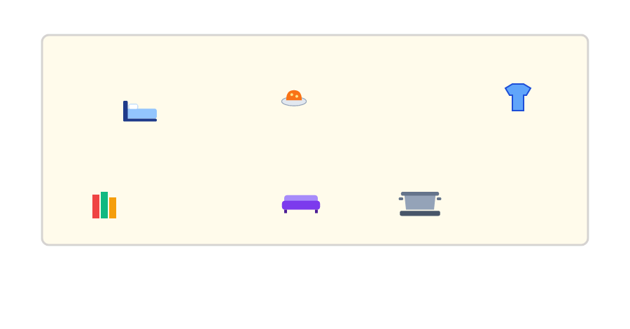
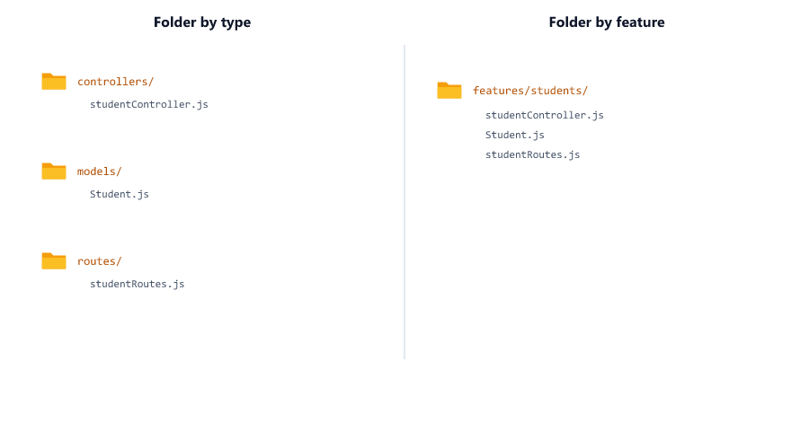
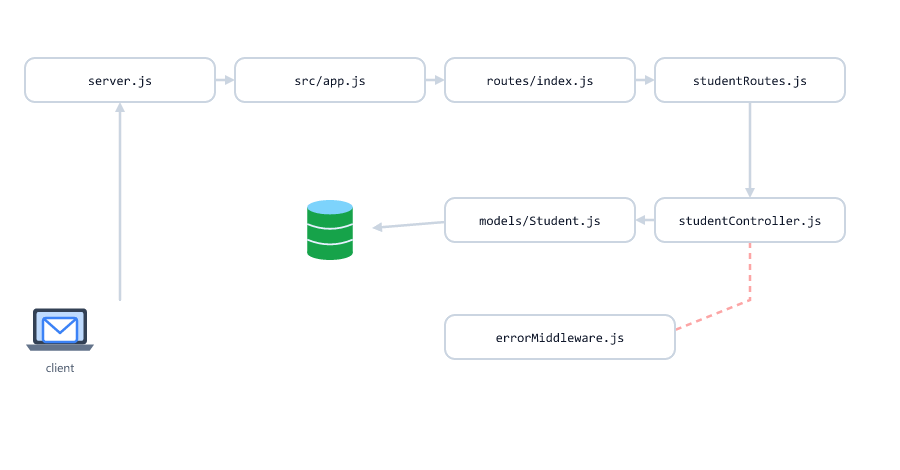
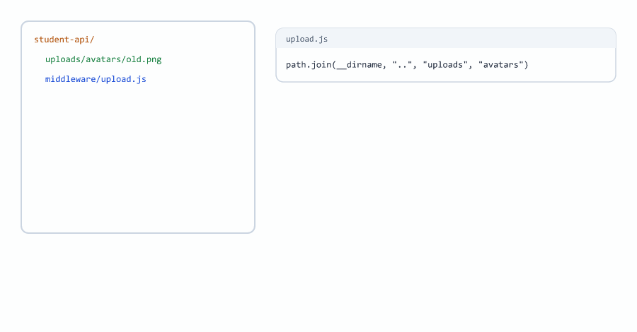
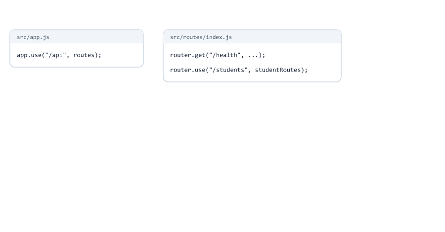
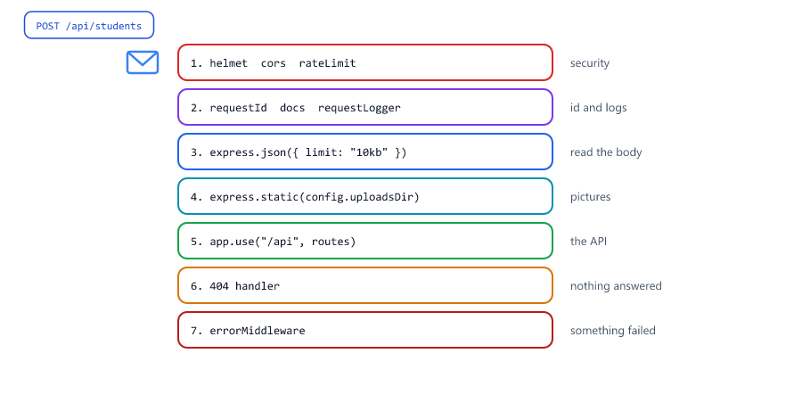
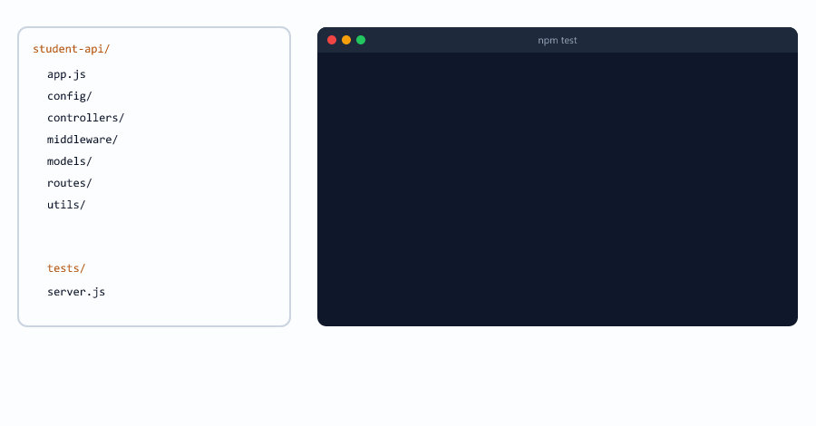
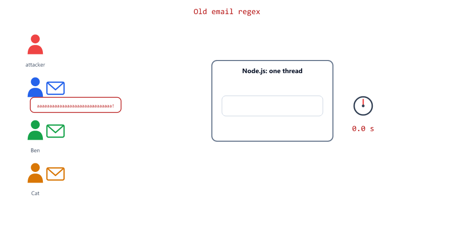

## Table of Contents

* [What is Project Structure](#what-is-project-structure)
* [Why Project Structure Matters](#why-project-structure-matters)
* [One Big File](#one-big-file)
* [Folder by Type](#folder-by-type)
* [Folder by Feature](#folder-by-feature)
* [Where Does This Code Go](#where-does-this-code-go)
* [The Request Journey](#the-request-journey)
* [Moving the Code into src](#moving-the-code-into-src)
* [One Config for Everything](#one-config-for-everything)
* [The Database Connection](#the-database-connection)
* [One Router for the API](#one-router-for-the-api)
* [The App File](#the-app-file)
* [The Server File](#the-server-file)
* [Complete Project Structure](#complete-project-structure)
* [Centralized Error Handling](#centralized-error-handling)
* [Response Helpers](#response-helpers)
* [Constants](#constants)
* [Validators](#validators)
* [catchAsync](#catchasync)
* [Naming Conventions](#naming-conventions)
* [Grow the Structure When You Need It](#grow-the-structure-when-you-need-it)
* [Beginner Mistakes](#beginner-mistakes)
* [Practice Exercises](#practice-exercises)
* [Interview Questions](#interview-questions)

---

## What is Project Structure

Project structure is how you organize your code into files and folders

Think of it like organizing a house

| Bad organization            | Good organization                 |
| --------------------------- | --------------------------------- |
| Everything in one room      | A kitchen, a bedroom, a bathroom  |
| Clothes in the kitchen      | Every thing has its room          |
| You search for everything   | You know where to look            |



Code is the same. When every file has a clear job and a clear place, you find things fast, and so does everyone else.

---

## Why Project Structure Matters

| Without structure                         | With structure                              |
| ----------------------------------------- | ------------------------------------------- |
| One file with thousands of lines          | Small files, each with one job              |
| You scroll and search for everything      | You know which folder to open               |
| The same code is copied in many places    | Shared code lives in one place              |
| New developers are lost                   | New developers understand it in an hour     |
| Hard to test                              | Each piece can be tested (Session 28)       |

| Benefit             | Meaning                                            |
| ------------------- | -------------------------------------------------- |
| Maintainability     | Easy to fix and change                             |
| Scalability         | Easy to add new features                           |
| Teamwork            | Everyone knows where things go                     |
| Reuse               | Write it once, use it everywhere                   |
| Testing             | Small pieces are easy to test                      |

You already used a structure since Session 20: models, controllers, routes and middleware folders. This session explains the rules behind it, and finishes it: a `src` folder, one config file, one router, and helpers.

---

## One Big File

Many projects start like this

```text
project/
├── server.js      (3000 lines: routes, database, validation, errors, everything)
└── package.json
```

Problems

* To change one route you scroll through 3000 lines
* Two developers editing the same file get conflicts in git
* You cannot reuse or test a part on its own
* A small change can break something far away in the same file


The fix is "separation of concerns": each file does one kind of job.

---

## Folder by Type

Group files by what they are. This is what you have done since Session 20

```text
src/
├── controllers/
│   ├── studentController.js
│   └── courseController.js
├── models/
│   ├── Student.js
│   └── Course.js
└── routes/
    ├── studentRoutes.js
    └── courseRoutes.js
```

| Pros                                   | Cons                                         |
| -------------------------------------- | -------------------------------------------- |
| Simple, and most tutorials use it      | A new feature touches several folders        |
| Easy to find "all the models"          | The files of one feature are far apart       |
| Great for small and medium projects    | Gets crowded with 30+ features               |

This is **not** a bad structure. It is the right start for most projects, and the one this course uses.

---

## Folder by Feature

Group files by the part of the app they belong to

```text
src/
└── features/
    ├── students/
    │   ├── studentController.js
    │   ├── studentRoutes.js
    │   ├── Student.js
    │   └── students.test.js
    └── courses/
        ├── courseController.js
        ├── courseRoutes.js
        ├── Course.js
        └── courses.test.js
```

| Pros                                   | Cons                                          |
| -------------------------------------- | --------------------------------------------- |
| Everything of one feature is together  | Shared code (AppError, logger) needs its own place |
| Delete a feature: delete one folder    | More structure than a small project needs     |
| Good for large projects and big teams  | Less common in tutorials                      |



Start with folder by type. Move to folder by feature when the project has many features and the folders become hard to read.

---

## Where Does This Code Go

| The code...                                         | Folder          | Example in our project          |
| --------------------------------------------------- | --------------- | ------------------------------- |
| Reads settings from .env, connects to services      | `config/`       | `index.js`, `database.js`, `swagger.js` |
| Describes the data and its rules                    | `models/`       | `Student.js`                    |
| Connects a URL and method to a function             | `routes/`       | `studentRoutes.js`              |
| Handles one request: reads `req`, sends `res`       | `controllers/`  | `studentController.js`          |
| Runs before (or after) route handlers               | `middleware/`   | `upload.js`, `errorMiddleware.js` |
| A small helper used in many places                  | `utils/`        | `AppError.js`, `logger.js`      |
| Fixed values used in several files                  | `constants/`    | `statusCodes.js` (Session 30)   |
| Work that is not about HTTP (email, payments, ...)  | `services/`     | `emailService.js` (Session 30)  |
| Tests                                               | `tests/`        | `students.test.js`              |


---

## The Request Journey

Every request passes through the files in the same order



| Step | File                              | Does                                            |
| ---- | --------------------------------- | ----------------------------------------------- |
| 1    | `server.js`                       | Has started the app and the database            |
| 2    | `src/app.js`                      | Runs the middleware: security, logging, body parsing |
| 3    | `src/routes/index.js`             | `/api/students` → the student router           |
| 4    | `src/routes/studentRoutes.js`     | `POST /` → `createStudent`                      |
| 5    | `src/controllers/studentController.js` | Picks the fields, calls the model          |
| 6    | `src/models/Student.js`           | Validates and saves in MongoDB                  |
| 7    | `src/middleware/errorMiddleware.js` | Only if something was thrown: the error answer |

When a request misbehaves, this list tells you which file to open.

---

## Moving the Code into src

We now move the Student API from Session 28 into a `src` folder. Code goes in `src`; the project files (`package.json`, `.env`, `server.js`) stay at the top. Session 30 uses the same layout.

The tests from Session 28 are our safety net: if they still pass, nothing broke.

### Step 1: just move the folders

We moved `app.js`, `config`, `controllers`, `middleware`, `models`, `routes` and `utils` into `src/` and started the server

```text
Error: Cannot find module './utils/logger'
Require stack:
- C:\...\student-api\server.js
```

server.js still requires `./utils/logger`, which is now `./src/utils/logger`. The files inside `src` still find each other, because they moved together.

### Step 2: fix the require paths

We changed the requires in server.js (`./src/...`) and in the tests (`../src/...`). The tests passed: `Tests: 22 passed`. Done? No. We looked at the folders:

```text
./src/logs
./src/uploads
./src/uploads/avatars
```

The logs and the uploaded pictures moved **inside** `src`. Why? These paths are built from `__dirname`, the folder of the file itself (Session 06):

```javascript
// src/middleware/upload.js
const AVATAR_DIR = path.join(__dirname, "..", "uploads", "avatars");
```

Before, `__dirname/..` was the project folder. After the move it is `src/`. Worse: we put a picture uploaded before the move into the real `uploads/avatars` folder and asked for it

```text
old avatar after the move: 404 Route GET /uploads/avatars/7f25e53d-old.png not found
```

Every avatar uploaded before the move would be broken for users, and the tests did not notice.



### Step 3: one place for paths and settings

The fix: compute the project folder once, in one file, and let every other file use it. That file is the config.

---

## One Config for Everything

Session 16 introduced a config file. Here it becomes the only file that reads `process.env`

src/config/index.js

```javascript
const path = require("path");

// The project folder: two levels up from src/config/
const rootDir = path.join(__dirname, "..", "..");

// Read .env from the project folder, wherever node was started (Session 16)
require("dotenv").config({ path: path.join(rootDir, ".env"), quiet: true });

const config = {
  env: process.env.NODE_ENV || "development",
  isProduction: process.env.NODE_ENV === "production",
  isTest: process.env.NODE_ENV === "test",
  port: Number(process.env.PORT) || 5000,
  mongodbUri: process.env.MONGODB_URI,
  dbName: process.env.DB_NAME,
  logLevel: process.env.LOG_LEVEL || "http",

  // Folders at the project root. Files use these paths, so moving a file never breaks them
  rootDir,
  uploadsDir: path.join(rootDir, "uploads"),
  logsDir: path.join(rootDir, "logs")
};

module.exports = config;
```

| Part                                  | Why                                                      |
| ------------------------------------- | -------------------------------------------------------- |
| `rootDir`                             | The project folder, computed once from this file's place |
| `dotenv` with `path`                  | .env is found even when node starts in another folder    |
| `Number(process.env.PORT)`            | .env values are always strings (Session 16)              |
| `isProduction`, `isTest`              | Short checks used by the logger and the error middleware |
| `uploadsDir`, `logsDir`               | Absolute paths at the project root                       |

`require("./config")` loads `src/config/index.js`: a folder name finds its `index.js` (Session 04).

Every file now asks `config` instead of reading `process.env` or building paths itself

src/utils/logger.js (the changed lines)

```javascript
const config = require("../config");
```

```javascript
const LOG_LEVEL = config.logLevel;
```

```javascript
  silent: config.isTest, // Jest sets NODE_ENV to "test": no log lines during tests
```

```javascript
      format: config.isProduction ? json() : devFormat
```

```javascript
      filename: path.join(config.logsDir, "app.log"),
```

src/middleware/upload.js (the changed lines)

```javascript
// Where avatars are saved: uploads/avatars in the project folder
const AVATAR_DIR = path.join(config.uploadsDir, "avatars");
```

src/middleware/errorMiddleware.js (the changed line)

```javascript
  if (config.isProduction) {
```

After this, `process.env` appears in only one file: src/config/index.js.


.env.example (Session 16): the list of settings, with safe values, committed to git

```text
# Copy this file to .env and fill in your own values (Session 16)
PORT=5000
MONGODB_URI=mongodb://127.0.0.1:27017
DB_NAME=student_api
NODE_ENV=development
LOG_LEVEL=http
```

---

## The Database Connection

src/config/database.js

```javascript
const mongoose = require("mongoose");
const config = require("./index");
const logger = require("../utils/logger");

async function connectDB() {
  if (!config.mongodbUri) {
    throw new Error("MONGODB_URI is missing in .env");
  }

  await mongoose.connect(config.mongodbUri, { dbName: config.dbName }); // Session 19: dbName
  logger.info("Connected to MongoDB");
}

module.exports = connectDB;
```

| Part                                  | Why                                                       |
| ------------------------------------- | --------------------------------------------------------- |
| The `MONGODB_URI` check               | A clear message instead of a strange Mongoose error        |
| `{ dbName: config.dbName }`           | The right database (Session 19)                           |
| No try/catch, no `process.exit` here  | The error reaches the safety net in server.js, which saves it in the log before stopping (Sessions 24 and 26) |

We tested it with an empty `MONGODB_URI`

```text
error: UNHANDLED REJECTION! Shutting down... MONGODB_URI is missing in .env
Error: MONGODB_URI is missing in .env
    at connectDB (C:\...\src\config\database.js:7:11)
```

The app stopped with exit code 1, and the same message was saved in logs/error.log.

The original version of this lesson connected with `try { ... } catch (error) { console.error(...); process.exit(1); }` and no `dbName`. `process.exit` right after logging can lose the log line (Session 26), and without `dbName` Mongoose uses the wrong database.

---

## One Router for the API

src/routes/index.js

```javascript
const express = require("express");
const studentRoutes = require("./studentRoutes");

// Every /api route in one place. A new resource is one more line here
const router = express.Router();

// A quick check that the app is alive (Session 16)
router.get("/health", (req, res) => {
  res.json({ status: "OK" });
});

router.use("/students", studentRoutes);

module.exports = router;
```

app.js mounts it once: `app.use("/api", routes)`

| URL                    | Path through the routers                          |
| ---------------------- | ------------------------------------------------- |
| `GET /api/health`      | `/api` (app.js) → `/health` (index.js)            |
| `GET /api/students/:id` | `/api` → `/students` (index.js) → `/:id` (studentRoutes.js) |



To add courses later: create `courseRoutes.js` and add one line, `router.use("/courses", courseRoutes);`. app.js does not change.

---

## The App File

src/app.js

```javascript
// The Express app: middleware, routes and error handling. No database, no listen()
const express = require("express");
const helmet = require("helmet");
const cors = require("cors");
const rateLimit = require("express-rate-limit");
const swaggerUi = require("swagger-ui-express");

const config = require("./config");
const swaggerSpec = require("./config/swagger");
const routes = require("./routes");
const AppError = require("./utils/AppError");
const requestId = require("./middleware/requestId");
const requestLogger = require("./middleware/requestLogger");
const errorMiddleware = require("./middleware/errorMiddleware");

const app = express();

// 1. Security (Session 14)
app.use(helmet());
app.use(cors());
app.use("/api", rateLimit({
  windowMs: 15 * 60 * 1000, // 15 minutes
  limit: 100,               // requests per user in that window
  message: { success: false, message: "Too many requests, try again later" }
}));

// 2. Request id, API docs, request logging (Sessions 26 and 27)
app.use(requestId);
app.use("/api-docs", swaggerUi.serve, swaggerUi.setup(swaggerSpec));
app.get("/api-docs.json", (req, res) => {
  res.json(swaggerSpec);
});
app.use(requestLogger);

// 3. Body parsing (Session 24: a small limit)
app.use(express.json({ limit: "10kb" }));

// 4. Uploaded files (Session 25)
app.use("/uploads", express.static(config.uploadsDir, {
  setHeaders: (res) => {
    res.set("X-Content-Type-Options", "nosniff");
  }
}));

// 5. Routes: everything under /api
app.use("/api", routes);

// 6. Not found, then errors: always last
app.use((req, res, next) => {
  next(new AppError(`Route ${req.method} ${req.originalUrl} not found`, 404));
});

app.use(errorMiddleware);

module.exports = app;
```

The order matters: middleware runs from top to bottom (Session 14)



| Order | Middleware                         | Why here                                              |
| ----- | ---------------------------------- | ----------------------------------------------------- |
| 1     | `helmet`, `cors`, `rateLimit`      | Protect every request before any work is done (Session 14) |
| 2     | `requestId`, docs, `requestLogger` | Every log line has an id; docs files are not logged (Sessions 26, 27) |
| 3     | `express.json({ limit: "10kb" })`  | Read the body, refuse huge bodies (Session 24)        |
| 4     | `express.static(config.uploadsDir)` | Serve the pictures (Session 25)                      |
| 5     | `app.use("/api", routes)`          | The API                                               |
| 6     | 404, then `errorMiddleware`        | Only reached when nothing answered, or when something failed |

We checked the headers of `GET /api/health`: helmet added `Content-Security-Policy` and `X-Content-Type-Options: nosniff`, cors added `Access-Control-Allow-Origin: *`, the rate limiter added `X-RateLimit-Limit: 100`, and the `X-Powered-By: Express` header was gone.

Fixed from the original version of this lesson

| Original                                  | Problem                                          |
| ----------------------------------------- | ------------------------------------------------ |
| `app.all("*", ...)` for the 404           | Express 5 crashes at startup: `Missing parameter name at index 1: *` (we tested it again with Express 5.3.0, the newest version when we tested) |
| `AppError` used but not required          | Every unknown URL answers `500 AppError is not defined` instead of 404 (we tested it) |
| `express.json({ limit: "10mb" })`         | Anyone can send 10 MB bodies (Session 24 uses 10kb) |
| `express.static("uploads")`               | Depends on the folder node starts in (Sessions 06 and 25) |
| `max: 100` in rateLimit                   | Still works, but `limit` is the current name (Session 14) |
| morgan only in development                | Session 26 logs every request through winston     |

---

## The Server File

server.js

```javascript
// Settings first: config reads .env, and every other file reads config
const config = require("./src/config");
const logger = require("./src/utils/logger");

// ---------- Safety nets (Session 24) ----------
let server;

// Wait until every log line is written to the files, then stop (Session 26)
function exitAfterLogs() {
  logger.on("finish", () => process.exit(1));
  logger.end();
  setTimeout(() => process.exit(1), 3000); // never wait more than 3 seconds
}

process.on("uncaughtException", (err) => {
  logger.error("UNCAUGHT EXCEPTION! Shutting down...", err);
  exitAfterLogs();
});

process.on("unhandledRejection", (err) => {
  logger.error("UNHANDLED REJECTION! Shutting down...", err);
  if (server) {
    server.close(exitAfterLogs);
  } else {
    exitAfterLogs();
  }
});

// ---------- Start: connect to the database, then listen ----------
const app = require("./src/app");
const connectDB = require("./src/config/database");

async function startServer() {
  await connectDB();

  server = app.listen(config.port, (err) => {
    if (err) {
      logger.error("Could not start server", err);
      exitAfterLogs();
      return;
    }

    logger.info(`Server running on port ${config.port} (${config.env} mode)`);
  });
}

startServer(); // if connecting fails, the rejection reaches the safety net
```

| Part                                  | Why                                                      |
| ------------------------------------- | -------------------------------------------------------- |
| `require("./src/config")` first       | It reads .env before any other file needs a setting      |
| Safety nets before the app            | Errors while loading or starting are caught (Session 24) |
| `await connectDB()` before `listen`   | No requests are accepted before the database is ready    |
| `config.port`, `config.env`           | No `process.env` here either                             |

The original version of this lesson called `connectDB()` without `await` and started listening at once, registered `unhandledRejection` only after `listen`, and printed only `err.name, err.message` (no stack).

We started the finished server from `C:\` (another folder): it connected, `GET /api/health` answered `{"status":"OK"}`, the logs were written to the project's logs folder, and the picture uploaded before the move answered `200 image/png` again.

---

## Complete Project Structure

```text
student-api/
├── src/
│   ├── config/
│   │   ├── index.js              new: every setting and path
│   │   ├── database.js           new: connectDB()
│   │   └── swagger.js            from Session 27
│   ├── controllers/
│   │   ├── avatarController.js
│   │   └── studentController.js
│   ├── middleware/
│   │   ├── errorMiddleware.js    + config.isProduction
│   │   ├── requestId.js
│   │   ├── requestLogger.js
│   │   └── upload.js             + config.uploadsDir
│   ├── models/
│   │   └── Student.js
│   ├── routes/
│   │   ├── index.js              new: all /api routes
│   │   └── studentRoutes.js
│   ├── utils/
│   │   ├── AppError.js
│   │   ├── checkImage.js
│   │   └── logger.js             + config
│   └── app.js                    middleware in a clear order
├── tests/                        from Session 28, requires now ../src/...
├── uploads/                      created automatically
├── logs/                         created automatically
├── .env
├── .env.example
├── .gitignore
├── package.json
└── server.js
```

package.json scripts

```json
{
  "scripts": {
    "start": "node server.js",
    "dev": "node --watch server.js",
    "test": "jest",
    "test:watch": "jest --watchAll",
    "test:coverage": "jest --coverage"
  }
}
```

`npm run dev` restarts the server when you save a file (Session 16: `node --watch`).

The refactor in one command

```text
> student-api@1.0.0 test
> jest

PASS tests/AppError.test.js
PASS tests/health.test.js
PASS tests/avatar.test.js
PASS tests/students.test.js

Test Suites: 4 passed, 4 total
Tests:       22 passed, 22 total
Snapshots:   0 total
Time:        2.506 s, estimated 3 s
Ran all test suites.
```



This is why Session 28 came before this one: big changes to the structure are safe when tests check the behaviour.

---

## Centralized Error Handling

All errors go to one place: `errorMiddleware.js` (Session 24). Controllers only `throw new AppError(message, statusCode)`.

The original version of this lesson had its own error middleware with three bugs, all tested in Session 24:

| Original                                      | What really happens                                  |
| --------------------------------------------- | ---------------------------------------------------- |
| `let error = { ...err }`, then `error.name === "CastError"` | The spread copy loses `name` and `message`, so the check never matches in production |
| Duplicate email → `400`                       | A conflict is `409`                                  |
| `err.errmsg.match(...)` to find the field     | Breaks when the message text changes; `err.keyValue` has the field |
| `AppError` without `this.name`                | Logs show `Error` instead of `AppError`              |

Use the error middleware and AppError from Sessions 24 to 26, as in our project.

---

## Response Helpers

When many controllers send the same kind of answer, a helper keeps the shape identical everywhere. Session 30 uses this one:

src/utils/responseHelper.js

```javascript
// Every successful answer has the same shape: { success: true, message, data }
// Errors do not go through here: throw new AppError(...) and errorMiddleware answers (Session 24)
const success = (res, data, message = "Success", statusCode = 200) => {
  return res.status(statusCode).json({ success: true, message, data });
};

const created = (res, data, message = "Created successfully") => {
  return success(res, data, message, 201);
};

module.exports = { success, created };
```

```javascript
// in a controller
const ResponseHelper = require("../utils/responseHelper");

ResponseHelper.created(res, task, "Task created");
```

The original version had helpers for errors too (`notFound`, `badRequest`, ...). They send the error answer directly and skip the error middleware: no log line, no request id, and a different shape from the errors that AppError produces. Keep one way for errors: `throw new AppError(...)`.

Our Student API does not use a helper: it is small and its answers are already consistent (Session 15). Add a helper when you start a new project, like Session 30.

You can test a helper without a server, with a fake `res` that only remembers what was done to it

tests/responseHelper.test.js

```javascript
const { success, created } = require("../src/utils/responseHelper");

// A fake res: it only remembers what the helper did with it
function fakeRes() {
  const res = {};
  res.status = (code) => {
    res.statusCode = code;
    return res; // so .status(200).json(...) works
  };
  res.json = (body) => {
    res.body = body;
    return res;
  };
  return res;
}

test("success sends 200 with the standard shape", () => {
  const res = fakeRes();
  success(res, { name: "Sara" });

  expect(res.statusCode).toBe(200);
  expect(res.body).toEqual({ success: true, message: "Success", data: { name: "Sara" } });
});

test("created sends 201", () => {
  const res = fakeRes();
  created(res, { name: "Sara" }, "Student created");

  expect(res.statusCode).toBe(201);
  expect(res.body.message).toBe("Student created");
});
```

`return res;` inside `status()` is what makes `res.status(201).json(...)` work: each call returns the same object, so the next call can be chained.

---

## Constants

A constant gives a name to a fixed value used in several places

src/constants/statusCodes.js

```javascript
// Names for the status codes this API uses
const HTTP_STATUS = {
  OK: 200,
  CREATED: 201,
  BAD_REQUEST: 400,
  UNAUTHORIZED: 401,
  FORBIDDEN: 403,
  NOT_FOUND: 404,
  CONFLICT: 409,
  PAYLOAD_TOO_LARGE: 413,
  TOO_MANY_REQUESTS: 429,
  INTERNAL_SERVER_ERROR: 500
};

module.exports = HTTP_STATUS;
```

src/constants/errorMessages.js

```javascript
// Messages used in more than one place: write them once, change them once
const ERROR_MESSAGES = {
  INVALID_CREDENTIALS: "Invalid email or password",
  NOT_LOGGED_IN: "Not logged in. Please send a token.",
  NOT_ALLOWED: "You are not allowed to do this",
  USER_NOT_FOUND: "User not found",
  INVALID_EMAIL: "Please provide a valid email",
  WEAK_PASSWORD: "Password must be 6 to 72 characters"
};

module.exports = ERROR_MESSAGES;
```

| Use a constant when                        | Example                                   |
| ------------------------------------------ | ----------------------------------------- |
| The same text appears in several files     | `"Invalid email or password"` in login and in tests |
| A value has a meaning that a number hides  | `MAX_AVATAR_SIZE` instead of `2097152`    |
| A typo would be a silent bug               | `ROLES.ADMIN` instead of `"admn"`         |

`UPPER_SNAKE_CASE` names tell the reader "this never changes".

Node.js already knows the name of every status code

```javascript
const http = require("http");

http.STATUS_CODES[409]; // "Conflict"
```

Status code constants are optional: every web developer knows what `404` means, and `res.status(404)` is perfectly clear. Use them if your team likes them, but use them everywhere or nowhere.

---

## Validators

Small functions that answer yes or no. Session 30 uses these:

src/utils/validators.js

```javascript
const mongoose = require("mongoose");

// Not a perfect email check, but fast and safe: text@text.text without spaces (Session 20)
const validateEmail = (email) => typeof email === "string" && /^\S+@\S+\.\S+$/.test(email);

// 6 to 72 characters: bcrypt only uses the first 72 bytes (Session 23)
const validatePassword = (password) =>
  typeof password === "string" && password.length >= 6 && password.length <= 72;

// A real ObjectId, like the _id of a document (Session 18)
const validateObjectId = (id) => mongoose.isValidObjectId(id);

// A date text that new Date() understands, like "2026-10-10"
const validateDate = (date) => typeof date === "string" && !Number.isNaN(new Date(date).getTime());

module.exports = { validateEmail, validatePassword, validateObjectId, validateDate };
```

The original version had two serious bugs

**1. A slow email check (ReDoS, Session 20).** It used `/^\w+([\.-]?\w+)*@\w+([\.-]?\w+)*(\.\w{2,3})+$/`. We tested it with 30 letters and a `!`:

```text
31 characters: 8460 ms
31 characters: 9782 ms
31 characters: 9731 ms
```

Almost 10 seconds for one short text. Node runs your JavaScript on one thread (Session 03), so during those seconds the server answers **nobody**. One request can freeze the API for everyone. The same pattern also rejected real emails: `sara+news@example.com` and `a@b.info`.



**2. A crash on missing input.** `validatePassword(undefined)` threw `Cannot read properties of undefined (reading 'length')`. A request without a password would crash into a 500. Every new validator checks `typeof` first.

tests/validators.test.js

```javascript
const { validateEmail, validatePassword, validateObjectId, validateDate } = require("../src/utils/validators");

test("validateEmail", () => {
  expect(validateEmail("sara@example.com")).toBe(true);
  expect(validateEmail("sara+news@example.com")).toBe(true);
  expect(validateEmail("a@b.info")).toBe(true);
  expect(validateEmail("not-an-email")).toBe(false);
  expect(validateEmail(undefined)).toBe(false); // no crash
});

test("validateEmail stays fast on long input (no ReDoS)", () => {
  const start = Date.now();
  validateEmail("a".repeat(100000) + "!");
  expect(Date.now() - start).toBeLessThan(100);
});

test("validatePassword", () => {
  expect(validatePassword("MySecret123")).toBe(true);
  expect(validatePassword("12345")).toBe(false);
  expect(validatePassword("x".repeat(73))).toBe(false);
  expect(validatePassword(undefined)).toBe(false); // no crash
});

test("validateObjectId", () => {
  expect(validateObjectId("6ac8c952a7c8959cd2b2870d")).toBe(true);
  expect(validateObjectId("abc")).toBe(false);
});

test("validateDate", () => {
  expect(validateDate("2026-10-10")).toBe(true);
  expect(validateDate("tomorrow")).toBe(false);
  expect(validateDate(null)).toBe(false);
});
```

The test "stays fast on long input" protects against a slow regex coming back: 100,001 characters must take less than 100 ms.

---

## catchAsync

src/utils/catchAsync.js

```javascript
// Only needed with Express 4: it sends errors of async handlers to next() (Session 24).
// Express 5 does this by itself, so new projects can leave it out.
const catchAsync = (fn) => {
  return (req, res, next) => {
    fn(req, res, next).catch(next);
  };
};

module.exports = catchAsync;
```

Our project uses Express 5, which catches errors of `async` handlers by itself (Session 24), so it does not need catchAsync. You will meet it in older projects and tutorials written for Express 4, including Session 30. With Express 5 it does no harm.

We tested all the helpers of this section with unit tests:

```text
PASS tests/validators.test.js
  √ validateEmail (6 ms)
  √ validateEmail stays fast on long input (no ReDoS) (1 ms)
  √ validatePassword
  √ validateObjectId (1 ms)
  √ validateDate

PASS tests/constants.test.js
  √ every name matches the real status text (1 ms)

PASS tests/responseHelper.test.js
  √ success sends 200 with the standard shape (1 ms)
  √ created sends 201

PASS tests/catchAsync.test.js
  √ catchAsync sends the error of an async function to next() (1 ms)

Test Suites: 4 passed, 4 total
Tests:       9 passed, 9 total
Snapshots:   0 total
Time:        0.69 s, estimated 1 s
Ran all test suites.
```

---

## Naming Conventions

| What                     | Convention              | Example                          |
| ------------------------ | ----------------------- | -------------------------------- |
| Model files              | PascalCase, singular    | `Student.js`                     |
| Class files              | PascalCase              | `AppError.js`                    |
| Other files              | camelCase               | `studentController.js`, `errorMiddleware.js` |
| Test files               | name + `.test.js`       | `students.test.js` (Session 28)  |
| Variables and functions  | camelCase               | `const avatarDir`, `getStudent()` |
| Constants                | UPPER_SNAKE_CASE        | `HTTP_STATUS`, `MAX_SIZE`        |
| Classes                  | PascalCase              | `class AppError`                 |
| Functions                | verb + noun             | `getStudent`, `createStudent`, `connectDB` |
| URLs                     | plural nouns, lowercase | `/api/students`, `/api/students/:id` |
| Collections              | plural, lowercase       | Mongoose makes `students` from the model `Student` (Session 19) |
| Fields in documents      | camelCase               | `firstName`, `createdAt`         |

The original version of this lesson said fields should be snake_case (`user_id`, `created_at`). In JavaScript and MongoDB projects fields are usually camelCase, and Mongoose's `timestamps: true` creates `createdAt` and `updatedAt`. Mixing both styles in one database is the real mistake: pick one, and camelCase fits Node.js best.

URLs describe things, not actions: `POST /api/students`, not `/api/createStudent`. The method already says the action (Session 15).

---

## Grow the Structure When You Need It

Do not create every folder on day one. An empty `services/` folder "just in case" only adds noise.

| Add this                 | When                                                        |
| ------------------------ | ----------------------------------------------------------- |
| `src/` folder            | As soon as there is more than one or two files              |
| `config/`                | When settings are read in more than one file                |
| `services/`              | When a controller does work that is not about HTTP: sending emails, talking to a payment company, uploading to cloud storage. The controller stays short, and the service can be reused and tested alone |
| `constants/`             | When the same fixed value appears in several files          |
| `validation/`            | When validation rules become long (Session 30)              |
| `features/` folders      | When folder by type becomes hard to read (many features)    |

A good structure is one that your team understands. Consistency matters more than any particular layout.

---

## Beginner Mistakes

### Mistake 1

Moving files without fixing `__dirname` paths.

The tests passed, but logs and uploads moved into `src/`, and old pictures gave 404. Keep folder paths in config.

---

### Mistake 2

Reading `process.env` in many files.

Typos and missing values are hard to find. Read it once, in config.

---

### Mistake 3

Starting to listen before the database is connected.

`await connectDB()` first, then `app.listen()`.

---

### Mistake 4

`process.exit(1)` inside `connectDB`.

The log line can be lost (Session 26). Let the error reach the safety net.

---

### Mistake 5

`app.all("*")` for the 404 page.

Express 5 crashes at startup. Use `app.use((req, res, next) => ...)` at the end.

---

### Mistake 6

Copying old helpers without testing them.

The original email regex froze the server for almost 10 seconds, and `validatePassword(undefined)` crashed.

---

### Mistake 7

Response helpers for errors.

They skip the error middleware. Throw AppError instead.

---

### Mistake 8

Creating many empty folders "for later".

Add a folder when it gets its first file.

---

### Mistake 9

Mixing naming styles.

`studentController.js` next to `Course_controller.js`, `createdAt` next to `updated_at`. Pick one style.

---

### Mistake 10

Refactoring without tests.

Run `npm test` before and after moving code.

---

## Practice Exercises

### Exercise 1

Add a Course resource to the student API: `src/models/Course.js` (title, required; credits, 1 to 10), a controller, `courseRoutes.js`, and one line in `routes/index.js`. Write tests for it like Session 28

### Exercise 2

Move the student API to folder by feature: `src/features/students/` (model, controller, routes, test). Keep config, middleware and utils where they are. Run the tests after every step

### Exercise 3

Use `ResponseHelper.success` and `ResponseHelper.created` in the course controller from Exercise 1. Which tests must change, and why?

### Exercise 4

Add `jwtSecret` and `jwtExpiresIn` to config (Session 22), and stop the server with a clear message when `JWT_SECRET` is missing, but only outside tests

### Exercise 5

Write a validator `validateAge(age)` that accepts whole numbers from 18 to 60 only (`Number.isInteger`), with unit tests for `"20"`, `20.5`, `17`, `60` and `undefined`

### Exercise 6

Find every place in the project that reads `process.env`. There should be only one. Then move the file `src/utils/logger.js` to `src/logger.js` and fix everything that breaks

---

## Interview Questions

### Why is project structure important

It makes code easy to find, change, test and share in a team, and it lets the project grow without becoming a mess

### What is the difference between folder by type and folder by feature

Folder by type groups files by kind (controllers, models, routes). Folder by feature groups everything of one feature (students, courses) in one folder

### What is separation of concerns

Each file or layer has one job: routes map URLs, controllers handle requests, models handle data, middleware handles cross-cutting work like errors and logging

### What should be in app.js and what in server.js

app.js creates the Express app with its middleware and routes and exports it. server.js loads the config, sets the safety nets, connects to the database and starts listening. Tests use app.js only

### Why have one config file

Settings are read, converted and checked in one place, and paths are computed once, so other files never read process.env or depend on their own location

### Why can moving a file break a path

Paths built from __dirname are relative to the file's folder. When the file moves, the same code points to a different folder

### What is a services folder for

Business work that is not about HTTP, like sending emails or calling other APIs, so controllers stay small and the work can be reused and tested

### What goes in the utils folder

Small helpers used in many places, like AppError, the logger or validators

### What are constants used for

Fixed values with a name, used in several places, like roles or shared messages, so a typo cannot hide and a change is made once

### Why should response helpers not handle errors

Errors should go through the error middleware, so they are logged, have the same shape and keep the request id. Controllers throw AppError instead

### What naming conventions are common in Node.js projects

camelCase for files, variables, functions and document fields; PascalCase for models and classes; UPPER_SNAKE_CASE for constants; plural lowercase nouns for URLs and collections
