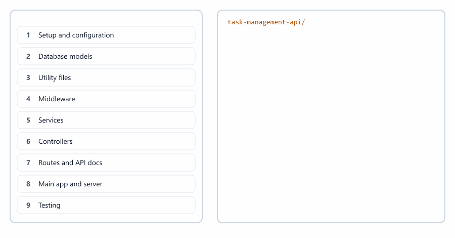
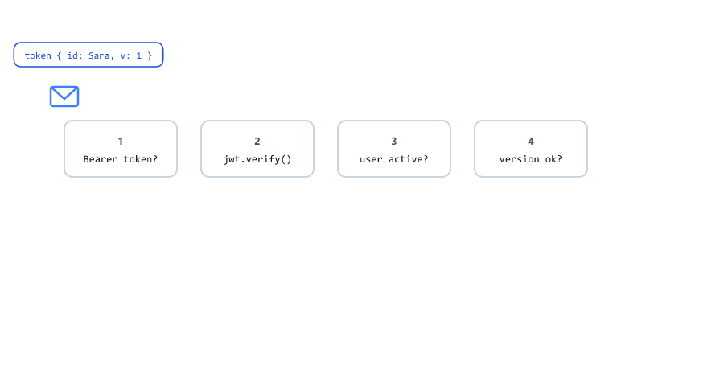
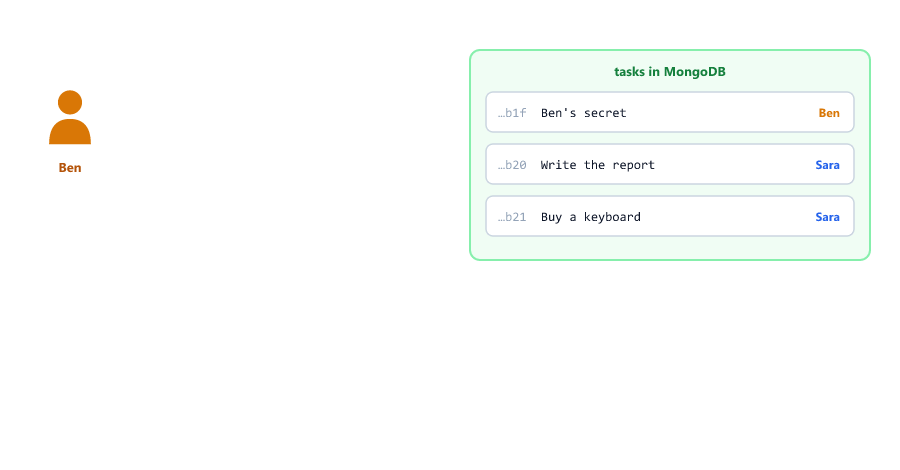
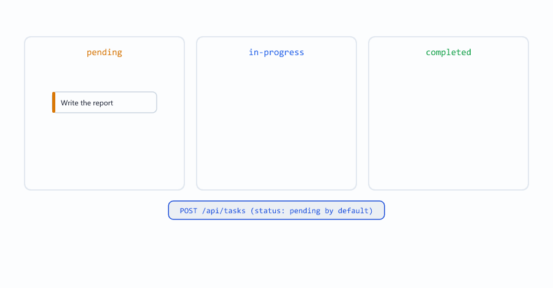
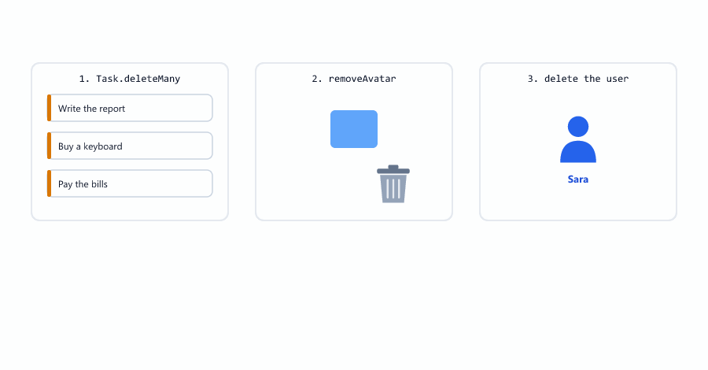
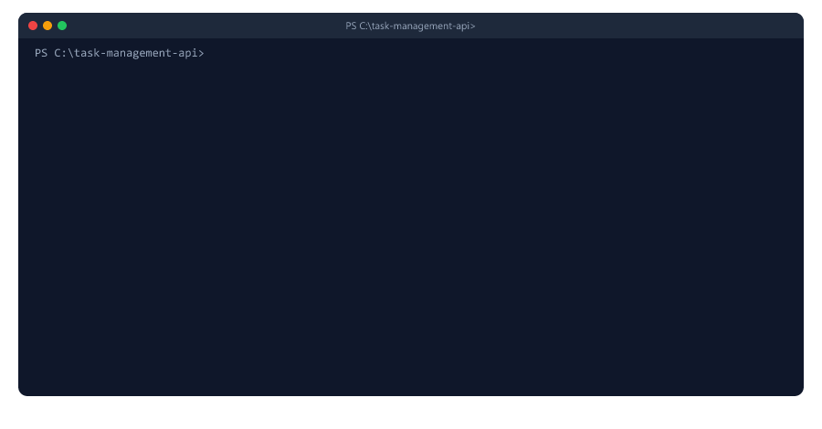
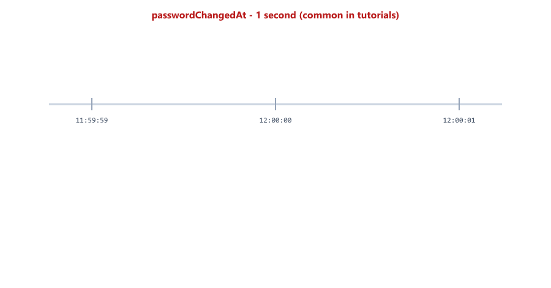
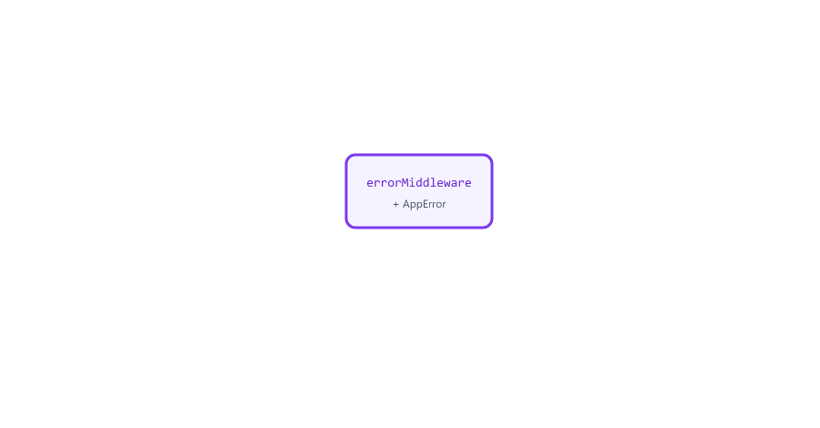

## Table of Contents

* [Project Overview](#project-overview)
* [Project Requirements](#project-requirements)
* [What You Reuse](#what-you-reuse)
* [Project Structure](#project-structure)
* [Step 1 - Setup and Configuration](#step-1---setup-and-configuration)
* [Step 2 - Database Models](#step-2---database-models)
* [Step 3 - Utility Files](#step-3---utility-files)
* [Step 4 - Middleware](#step-4---middleware)
* [Step 5 - Services](#step-5---services)
* [Step 6 - Controllers](#step-6---controllers)
* [Step 7 - Routes and API Docs](#step-7---routes-and-api-docs)
* [Step 8 - Main App and Server](#step-8---main-app-and-server)
* [Step 9 - Testing](#step-9---testing)
* [A Bug the Tests Found](#a-bug-the-tests-found)
* [Running the Project](#running-the-project)
* [API Endpoints Summary](#api-endpoints-summary)
* [Security Checklist](#security-checklist)
* [Before You Deploy](#before-you-deploy)
* [What the Original Version Got Wrong](#what-the-original-version-got-wrong)
* [Practice Exercises](#practice-exercises)
* [Interview Questions](#interview-questions)

---

## Project Overview

We will build a Task Management API: the backend of a to-do app

Users can

* Register and log in
* Create, read, update and delete their own tasks
* Mark tasks as in progress or completed
* Filter tasks by status, page by page
* See statistics: how many tasks in each status, how many are overdue
* Upload a profile picture
* Change their password
* Delete their account

Admins can also see the list of all users.


This project uses what you learned in Sessions 1 to 29. Almost nothing here is new: the new part is putting everything together.

Technologies

| Package                | Used for                         | Session |
| ---------------------- | -------------------------------- | ------- |
| express                | The web server                   | 12      |
| mongoose               | MongoDB models                   | 19      |
| jsonwebtoken           | Login tokens                     | 22      |
| bcryptjs               | Password hashing                 | 23      |
| multer                 | Profile pictures                 | 25      |
| winston, morgan        | Logging                          | 26      |
| swagger-ui-express, swagger-jsdoc | API documentation     | 27      |
| jest, supertest, mongodb-memory-server | Tests            | 28      |
| helmet, cors, express-rate-limit | Security               | 14      |
| dotenv                 | Settings                         | 16      |

---

## Project Requirements

Functional requirements

| Requirement                                  | Route                              |
| -------------------------------------------- | ---------------------------------- |
| Register with name, email and password       | `POST /api/auth/register`          |
| Log in and receive a JWT                     | `POST /api/auth/login`             |
| Create, list, read, update, delete tasks     | `/api/tasks`, `/api/tasks/:id`     |
| Filter by status, page by page               | `GET /api/tasks?status=pending&page=2` |
| Task statistics                              | `GET /api/tasks/stats`             |
| Change password                              | `PATCH /api/auth/password`         |
| Update profile, upload a picture             | `PATCH /api/users/me`, `PATCH /api/users/me/avatar` |
| Delete account (and all its tasks)           | `DELETE /api/users/me`             |
| **Users only ever see their own tasks**      | every task route                   |

Technical requirements

| Requirement                         | How                                                   |
| ----------------------------------- | ----------------------------------------------------- |
| MVC structure in `src/`             | Session 29                                            |
| One config file                     | `src/config/index.js` (Sessions 16 and 29)            |
| Central error handling              | AppError + errorMiddleware (Session 24)               |
| Validation                          | Mongoose rules + a few checks in controllers          |
| Logging with request ids            | winston + morgan (Session 26)                         |
| API documentation                   | Swagger UI at `/api-docs` (Session 27)                |
| Automated tests                     | 31 tests with Jest and Supertest (Session 28)         |
| Correct status codes                | 200, 201, 400, 401, 403, 404, 409, 413, 429           |
| Security                            | hashing, tokens, roles, rate limits, helmet, upload checks |

---

## What You Reuse


| Part of this project                     | Built in Session |
| ---------------------------------------- | ---------------- |
| `src/` structure, config, routes/index.js | 29             |
| AppError, errorMiddleware, safety nets   | 24               |
| Logger, request ids, exitAfterLogs       | 26               |
| Avatar upload with magic-number check    | 25               |
| User model with hashing                  | 22, 23           |
| protect and authorize                    | 22, 23           |
| Pagination and pickFields                | 20               |
| Swagger docs with Authorize              | 27               |
| tests/db.js with the in-memory MongoDB   | 28               |
| responseHelper, validators               | 29               |

Thirteen files are copied from Sessions 28 and 29 **without any change**: they do not know whether the app is about students or tasks. That is the reward of a good structure.

---

## Project Structure

```text
task-management-api/
├── src/
│   ├── config/
│   │   ├── index.js              Session 29 + JWT settings
│   │   ├── database.js           from Session 29
│   │   └── swagger.js            new: docs for this API
│   ├── constants/
│   │   └── taskStatuses.js       new
│   ├── controllers/
│   │   ├── authController.js     new (Sessions 22 and 23)
│   │   ├── taskController.js     new
│   │   └── userController.js     new
│   ├── middleware/
│   │   ├── auth.js               new: protect, authorize
│   │   ├── errorMiddleware.js    from Session 29
│   │   ├── requestId.js          from Session 29
│   │   ├── requestLogger.js      from Session 29
│   │   └── upload.js             from Session 29
│   ├── models/
│   │   ├── Task.js               new
│   │   └── User.js               Session 23 + avatar
│   ├── routes/
│   │   ├── index.js              new routers
│   │   ├── authRoutes.js         new
│   │   ├── taskRoutes.js         new
│   │   └── userRoutes.js         new
│   ├── services/
│   │   └── fileService.js        new
│   ├── utils/
│   │   ├── AppError.js           from Session 29
│   │   ├── checkImage.js         from Session 29
│   │   ├── logger.js             from Session 29
│   │   ├── responseHelper.js     from Session 29
│   │   └── validators.js         from Session 29
│   └── app.js                    from Session 29
├── scripts/
│   ├── make-admin.js             Session 22
│   └── try-api.js                new: a walk through the API
├── tests/
│   ├── db.js                     from Session 28
│   ├── helpers.js                new
│   ├── unit/                     2 files from Session 29
│   └── integration/              auth, tasks, users
├── uploads/                      created automatically
├── logs/                         created automatically
├── .env
├── .env.example
├── .gitignore
├── package.json
└── server.js                     from Session 29
```



---

## Step 1 - Setup and Configuration

```bash
mkdir task-management-api
cd task-management-api
npm init -y
npm install express mongoose dotenv bcryptjs jsonwebtoken multer winston morgan
npm install helmet cors express-rate-limit swagger-ui-express swagger-jsdoc
npm install --save-dev jest supertest mongodb-memory-server
```

Tested versions: express 5.3.0, mongoose 9.11.1, jsonwebtoken 9.0.3, bcryptjs 3.0.3, multer 2.4.0, winston 3.19.0, jest 30.5.2.

package.json scripts

```json
{
  "scripts": {
    "start": "node server.js",
    "dev": "node --watch server.js",
    "test": "jest",
    "test:watch": "jest --watchAll",
    "test:coverage": "jest --coverage"
  }
}
```

No nodemon: `node --watch` (Session 16) does the same. `--watchAll` works without git (Session 28).

.env.example (copy it to .env and fill in real values)

```text
# Copy this file to .env and fill in your own values (Session 16)
NODE_ENV=development
PORT=5000
MONGODB_URI=mongodb://127.0.0.1:27017
DB_NAME=task_manager
# A long random secret. Make one with:
# node -e "console.log(require('crypto').randomBytes(32).toString('hex'))"
JWT_SECRET=change-me
JWT_EXPIRES_IN=7d
LOG_LEVEL=http
```

`JWT_EXPIRES_IN` must have a unit: `7d`, `1h`. A plain number in .env is a string, and `"3600"` means 3.6 seconds (Session 22).

.gitignore

```text
node_modules/
.env
uploads/
logs/
coverage/
```

src/config/index.js: Session 29's config with two JWT settings

```javascript
const path = require("path");

// The project folder: two levels up from src/config/
const rootDir = path.join(__dirname, "..", "..");

// Read .env from the project folder, wherever node was started (Session 16)
require("dotenv").config({ path: path.join(rootDir, ".env"), quiet: true });

const isTest = process.env.NODE_ENV === "test";

const config = {
  env: process.env.NODE_ENV || "development",
  isProduction: process.env.NODE_ENV === "production",
  isTest,
  port: Number(process.env.PORT) || 5000,
  mongodbUri: process.env.MONGODB_URI,
  dbName: process.env.DB_NAME,
  logLevel: process.env.LOG_LEVEL || "http",

  // Session 22. Tests get a fixed secret, so they also run on a computer without .env
  jwtSecret: process.env.JWT_SECRET || (isTest ? "test-secret-only-for-jest" : undefined),
  jwtExpiresIn: process.env.JWT_EXPIRES_IN || "7d",

  // Folders at the project root (Session 29)
  rootDir,
  uploadsDir: path.join(rootDir, "uploads"),
  logsDir: path.join(rootDir, "logs")
};

// Without a secret nobody can log in, so stop at once (Session 16)
if (!config.jwtSecret) {
  console.error("FATAL ERROR: JWT_SECRET is not defined in .env");
  process.exit(1);
}

module.exports = config;
```

| New part                                  | Why                                                    |
| ----------------------------------------- | ------------------------------------------------------ |
| `jwtSecret`, `jwtExpiresIn`               | Every file that signs or checks tokens reads them here |
| The test fallback for `jwtSecret`         | Tests also run on a computer (or a CI server) without .env. It only works when `NODE_ENV` is `test` |
| The `JWT_SECRET` check                    | Without it, every login would fail with a 500 later    |

---

## Step 2 - Database Models

src/constants/taskStatuses.js

```javascript
// Every status a task can have. The model and the controller both use this list
const TASK_STATUSES = ["pending", "in-progress", "completed"];

module.exports = TASK_STATUSES;
```

One list, used by the model (allowed values) and by the controller (checking `?status=`). Change it once and both follow (Session 29).

src/models/Task.js

```javascript
const mongoose = require("mongoose");
const TASK_STATUSES = require("../constants/taskStatuses");

const taskSchema = new mongoose.Schema(
  {
    title: {
      type: String,
      required: [true, "Title is required"],
      trim: true,
      maxlength: [100, "Title cannot be longer than 100 characters"]
    },
    description: {
      type: String,
      trim: true,
      maxlength: [1000, "Description cannot be longer than 1000 characters"]
    },
    status: {
      type: String,
      enum: { values: TASK_STATUSES, message: "Status must be pending, in-progress or completed" },
      default: "pending"
    },
    dueDate: {
      type: Date,
      cast: "Due date must be a valid date" // Session 19
    },
    user: {
      type: mongoose.Schema.Types.ObjectId,
      ref: "User",
      required: true
    }
  },
  { timestamps: true }
);

// Almost every query is "the newest tasks of one user": an index makes it fast
taskSchema.index({ user: 1, createdAt: -1 });

module.exports = mongoose.model("Task", taskSchema);
```

| Part                                   | Meaning                                                  |
| -------------------------------------- | -------------------------------------------------------- |
| `enum: { values, message }`            | Only these statuses, with our own error message          |
| `cast: "Due date must be a valid date"` | A clear message for `"next Friday"` (Session 19)        |
| `user` with `ref: "User"`              | Every task belongs to one user (Session 19)              |
| `taskSchema.index({ user: 1, createdAt: -1 })` | An index for "tasks of one user, newest first". Without it, MongoDB reads every task of every user to find yours |

src/models/User.js

```javascript
const mongoose = require("mongoose");
const bcrypt = require("bcryptjs");

const userSchema = new mongoose.Schema(
  {
    name: {
      type: String,
      required: [true, "Name is required"],
      trim: true,
      minlength: [2, "Name must be at least 2 characters"],
      maxlength: [50, "Name cannot be longer than 50 characters"]
    },
    email: {
      type: String,
      required: [true, "Email is required"],
      unique: true,
      lowercase: true,
      trim: true,
      match: [/^\S+@\S+\.\S+$/, "Please enter a valid email"]
    },
    password: {
      type: String,
      required: [true, "Password is required"],
      minlength: [6, "Password must be at least 6 characters"],
      maxlength: [72, "Password cannot be longer than 72 characters"],
      select: false // never returned by queries unless asked for
    },
    tokenVersion: {
      type: Number,
      default: 0 // +1 at every password change; older tokens stop working
    },
    role: {
      type: String,
      enum: ["user", "admin"],
      default: "user"
    },
    isActive: {
      type: Boolean,
      default: true
    },
    avatar: {
      type: String // a URL path like /uploads/avatars/<file>.png (Session 25)
    }
  },
  { timestamps: true }
);

// Hash the password before saving (Sessions 22 and 23, Mongoose 9: no next)
userSchema.pre("save", async function () {
  if (!this.isModified("password")) {
    return;
  }

  this.password = await bcrypt.hash(this.password, 10);

  // A changed password (not a new user): tokens made with the old version are refused
  if (!this.isNew) {
    this.tokenVersion += 1;
  }
});

// Check a typed password against the saved hash
userSchema.methods.comparePassword = function (enteredPassword) {
  return bcrypt.compare(enteredPassword, this.password);
};

module.exports = mongoose.model("User", userSchema);
```

This is Session 23's model with one addition: an `avatar` field (Session 25). `tokenVersion` logs out old tokens after a password change (Session 23); [A Bug the Tests Found](#a-bug-the-tests-found) shows why it is a version number and not a time.

---

## Step 3 - Utility Files

Copy these from Session 29 without changes

| File                          | Does                                              |
| ----------------------------- | ------------------------------------------------- |
| `src/utils/AppError.js`       | Errors with a status code (Session 24)            |
| `src/utils/logger.js`         | winston logger, reads config (Sessions 26 and 29) |
| `src/utils/checkImage.js`     | Checks the first bytes of an image (Session 25)   |
| `src/utils/responseHelper.js` | `success()` and `created()` (Session 29)          |
| `src/utils/validators.js`     | `validateEmail()` and friends (Session 29)        |

Every successful answer of this API has the shape of `responseHelper`: `{ "success": true, "message": "...", "data": ... }`. Every error has the shape of errorMiddleware: `{ "success": false, "status": "fail", "message": "..." }`.

No `catchAsync`: Express 5 catches errors of `async` handlers by itself (Session 24).

---

## Step 4 - Middleware

Copy from Session 29 without changes: `errorMiddleware.js`, `requestId.js`, `requestLogger.js`, `upload.js`.

errorMiddleware already knows every error this project can throw: validation (400), bad id (400), duplicate email (409), bad or expired token (401), files that are too large (413).

src/middleware/auth.js: protect and authorize from Sessions 22 and 23, now throwing AppError

```javascript
const jwt = require("jsonwebtoken");
const User = require("../models/User");
const AppError = require("../utils/AppError");
const config = require("../config");

// Only let requests with a valid token through (Sessions 22 and 23)
const protect = async (req, res, next) => {
  const header = req.headers.authorization || "";

  // Expected format: "Bearer <token>"
  if (!header.startsWith("Bearer ")) {
    throw new AppError("Not logged in. Please send a token.", 401);
  }
  const token = header.split(" ")[1];

  // A bad or expired token throws here; errorMiddleware turns it into a 401 (Session 24)
  const decoded = jwt.verify(token, config.jwtSecret, { algorithms: ["HS256"] });

  // The user may have been deleted or deactivated after the token was made
  const user = await User.findById(decoded.id);
  if (!user || !user.isActive) {
    throw new AppError("This user no longer exists or is deactivated", 401);
  }

  // A token made before the last password change has an old version number
  if (decoded.v !== user.tokenVersion) {
    throw new AppError("Password was changed. Please log in again.", 401);
  }

  req.user = user;
  next();
};

// Only let some roles through (use after protect)
const authorize = (...roles) => {
  return (req, res, next) => {
    if (!roles.includes(req.user.role)) {
      throw new AppError(`Role "${req.user.role}" is not allowed to do this`, 403);
    }
    next();
  };
};

module.exports = { protect, authorize };
```



| Step | Check                                | Fails with                                          |
| ---- | ------------------------------------ | --------------------------------------------------- |
| 1    | Header starts with `Bearer `         | 401 Not logged in. Please send a token.             |
| 2    | `jwt.verify()`: signature and expiry | 401 Invalid token / Your token has expired (from errorMiddleware) |
| 3    | The user exists and is active        | 401 This user no longer exists or is deactivated    |
| 4    | The token's version is the current one | 401 Password was changed. Please log in again.    |

There is no try/catch around `jwt.verify()` anymore. It throws `JsonWebTokenError` or `TokenExpiredError`, and errorMiddleware turns both into a clear 401 (Session 24). The code is shorter and the messages are the same.

---

## Step 5 - Services

A service holds work that is not about HTTP (Session 29). Here: deleting picture files, which two controller functions need

src/services/fileService.js

```javascript
const fs = require("fs/promises");
const path = require("path");
const { AVATAR_DIR } = require("../middleware/upload");

// Delete a file, and ignore it if it is already gone (Session 25)
async function removeFile(filePath) {
  try {
    await fs.unlink(filePath);
  } catch (err) {
    if (err.code !== "ENOENT") throw err;
  }
}

// Delete an avatar from its URL path, like "/uploads/avatars/abc.png"
function removeAvatar(avatarUrl) {
  // basename keeps only "abc.png", so a path can never leave the avatars folder
  return removeFile(path.join(AVATAR_DIR, path.basename(avatarUrl)));
}

module.exports = { removeFile, removeAvatar };
```

`path.basename()` keeps only the file name. Even if a bad avatar value like `"/uploads/avatars/../../server.js"` ever got into the database, only a file inside the avatars folder could be deleted.

The original version of this lesson had an email service for "forgot password". It used nodemailer, which the course never installs or teaches, and it needs a real mail server. We left it out; see Exercise 2.

---

## Step 6 - Controllers

src/controllers/authController.js

```javascript
const jwt = require("jsonwebtoken");
const User = require("../models/User");
const AppError = require("../utils/AppError");
const ResponseHelper = require("../utils/responseHelper");
const { validateEmail } = require("../utils/validators");
const logger = require("../utils/logger");
const config = require("../config");

// Create a token that says "this is user <id>, password version <v>" (Session 22)
function generateToken(user) {
  return jwt.sign({ id: user._id, v: user.tokenVersion }, config.jwtSecret, { expiresIn: config.jwtExpiresIn });
}

// The user data we send back (never the password)
function publicUser(user) {
  return { id: user._id, name: user.name, email: user.email, role: user.role, avatar: user.avatar };
}

// POST /api/auth/register
const register = async (req, res) => {
  const { name, email, password } = req.body || {};

  // role is NOT taken from the body: everyone who registers is a normal user (Session 22).
  // Bad input → ValidationError 400, used email → 409, both in errorMiddleware
  const user = await User.create({ name, email, password });

  logger.info("User registered", { requestId: req.id, userId: user._id });

  ResponseHelper.created(res, { token: generateToken(user), user: publicUser(user) }, "Registered");
};

// POST /api/auth/login
const login = async (req, res) => {
  const { email, password } = req.body || {};

  // Text only: an object like { "$gt": "" } is refused here (NoSQL injection, Session 22)
  if (!validateEmail(email) || typeof password !== "string") {
    throw new AppError("Please provide an email and a password", 400);
  }

  const user = await User.findOne({ email: email.toLowerCase() }).select("+password");

  // Same message for "no such email" and "wrong password"
  if (!user || !(await user.comparePassword(password))) {
    logger.warn("Failed login", { requestId: req.id, email, ip: req.ip });
    throw new AppError("Invalid email or password", 401);
  }

  if (!user.isActive) {
    throw new AppError("Your account has been deactivated", 403);
  }

  ResponseHelper.success(res, { token: generateToken(user), user: publicUser(user) }, "Logged in");
};

// GET /api/auth/me (protected)
const getMe = (req, res) => {
  ResponseHelper.success(res, publicUser(req.user));
};

// PATCH /api/auth/password (protected, Session 23)
const changePassword = async (req, res) => {
  const { currentPassword, newPassword } = req.body || {};

  if (typeof currentPassword !== "string" || typeof newPassword !== "string") {
    throw new AppError("Please provide currentPassword and newPassword", 400);
  }

  // req.user was loaded without the password (select: false)
  const user = await User.findById(req.user._id).select("+password");

  if (!(await user.comparePassword(currentPassword))) {
    throw new AppError("Current password is wrong", 401);
  }

  user.password = newPassword;
  await user.save(); // validation (6 to 72 characters), hashing and tokenVersion + 1 run here

  ResponseHelper.success(res, { token: generateToken(user) }, "Password changed");
};

module.exports = { register, login, getMe, changePassword, publicUser };
```


| Part                                        | Session | Why                                              |
| ------------------------------------------- | ------- | ------------------------------------------------ |
| `role` is never read from the body          | 22      | Nobody can register as admin                     |
| No `findOne()` before `create()`            | 22      | The unique index answers 409 for a used email, even when two requests arrive at the same moment |
| `validateEmail(email)`, `typeof password`   | 22, 29  | An object like `{ "$gt": "" }` cannot reach the query (NoSQL injection) |
| Same message for wrong email and password   | 22      | Attackers cannot test which emails exist         |
| `logger.warn("Failed login", ...)`          | 26      | Many failed logins can mean an attack            |
| `{ id, v }` in the token                    | 23      | `v` is the password version, checked by protect  |
| `user.save()` for the new password          | 23      | Update queries skip the hashing hook             |

src/controllers/taskController.js

```javascript
const Task = require("../models/Task");
const AppError = require("../utils/AppError");
const ResponseHelper = require("../utils/responseHelper");
const TASK_STATUSES = require("../constants/taskStatuses");

// Copy only the fields a client may set. The owner always comes from the token (Session 20)
function pickFields(body) {
  const data = {};
  for (const key of ["title", "description", "status", "dueDate"]) {
    if (body[key] !== undefined) {
      data[key] = body[key];
    }
  }
  return data;
}

// GET /api/tasks?status=pending&page=1&limit=10
const getTasks = async (req, res) => {
  const filter = { user: req.user._id }; // only my tasks

  if (req.query.status !== undefined) {
    if (!TASK_STATUSES.includes(req.query.status)) {
      throw new AppError(`status must be one of: ${TASK_STATUSES.join(", ")}`, 400);
    }
    filter.status = req.query.status;
  }

  // Pagination (Session 20): page 1 by default, at most 100 per page
  const page = Math.max(1, parseInt(req.query.page) || 1);
  const limit = Math.min(100, Math.max(1, parseInt(req.query.limit) || 10));

  const tasks = await Task.find(filter)
    .sort({ createdAt: -1, _id: -1 }) // newest first; _id breaks ties
    .skip((page - 1) * limit)
    .limit(limit);
  const total = await Task.countDocuments(filter);

  ResponseHelper.success(res, { tasks, page, limit, total, totalPages: Math.ceil(total / limit) });
};

// GET /api/tasks/stats
const getStats = async (req, res) => {
  const stats = { total: 0 };

  for (const status of TASK_STATUSES) {
    stats[status] = await Task.countDocuments({ user: req.user._id, status });
    stats.total += stats[status];
  }

  // Not completed and the due date is in the past (Session 18: $ne, $lt)
  stats.overdue = await Task.countDocuments({
    user: req.user._id,
    status: { $ne: "completed" },
    dueDate: { $lt: new Date() }
  });

  ResponseHelper.success(res, stats);
};

// POST /api/tasks
const createTask = async (req, res) => {
  const task = await Task.create({ ...pickFields(req.body || {}), user: req.user._id });
  ResponseHelper.created(res, task, "Task created");
};

// GET /api/tasks/:id
const getTask = async (req, res) => {
  // _id AND user: the task of someone else is "not found" for you
  const task = await Task.findOne({ _id: req.params.id, user: req.user._id });

  if (!task) {
    throw new AppError("Task not found", 404);
  }

  ResponseHelper.success(res, task);
};

// PATCH /api/tasks/:id
const updateTask = async (req, res) => {
  const task = await Task.findOneAndUpdate(
    { _id: req.params.id, user: req.user._id },
    pickFields(req.body || {}),
    { returnDocument: "after", runValidators: true } // Session 19
  );

  if (!task) {
    throw new AppError("Task not found", 404);
  }

  ResponseHelper.success(res, task, "Task updated");
};

// DELETE /api/tasks/:id
const deleteTask = async (req, res) => {
  const task = await Task.findOneAndDelete({ _id: req.params.id, user: req.user._id });

  if (!task) {
    throw new AppError("Task not found", 404);
  }

  ResponseHelper.success(res, null, "Task deleted");
};

module.exports = { getTasks, getStats, createTask, getTask, updateTask, deleteTask };
```

The most important line of this file: **every query includes `user: req.user._id`**.



| Query                                                 | Meaning                                           |
| ----------------------------------------------------- | ------------------------------------------------- |
| `Task.findById(id)`                                   | Any task, of anyone: **wrong**                    |
| `Task.findOne({ _id: id, user: req.user._id })`       | This task, only if it is mine                     |

Why 404 and not 403 for someone else's task? A 403 would tell Ben that the task exists. 404 tells him nothing.



`runValidators: true` matters here: we tested the original version's status update without it, and `{ "status": "done" }` was saved in the database, although `done` is not in the list.


| Pagination part                          | Why                                                    |
| ---------------------------------------- | ------------------------------------------------------ |
| `parseInt(...) \|\| 1`                   | `?page=abc` becomes page 1 instead of an error         |
| `Math.min(100, ...)`                     | Nobody can ask for a million tasks at once             |
| `.sort({ createdAt: -1, _id: -1 })`      | `_id` decides between tasks created in the same millisecond (Session 20) |
| `totalPages`                             | The frontend can show "page 2 of 3"                    |


`getStats` uses only `countDocuments()`. `{ status: { $ne: "completed" }, dueDate: { $lt: new Date() } }` means "not completed, and the due date is before now" (Session 18).

Express 5 reads `?status[$ne]=pending` as the text key `"status[$ne]"`, not as an object (we tested it), and the status check refuses anything not in the list anyway.

src/controllers/userController.js

```javascript
const User = require("../models/User");
const Task = require("../models/Task");
const AppError = require("../utils/AppError");
const ResponseHelper = require("../utils/responseHelper");
const { isRealImage } = require("../utils/checkImage");
const { removeFile, removeAvatar } = require("../services/fileService");
const { publicUser } = require("./authController");

// GET /api/users (admin only)
const getUsers = async (req, res) => {
  const users = await User.find().sort("name");
  ResponseHelper.success(res, users.map(publicUser));
};

// PATCH /api/users/me: change name or email. Passwords use PATCH /api/auth/password
const updateMe = async (req, res) => {
  const data = {};
  for (const key of ["name", "email"]) {
    if (req.body && req.body[key] !== undefined) {
      data[key] = req.body[key];
    }
  }

  const user = await User.findByIdAndUpdate(req.user._id, data, {
    returnDocument: "after",
    runValidators: true
  });

  ResponseHelper.success(res, publicUser(user), "Profile updated");
};

// PATCH /api/users/me/avatar (form-data, field "avatar"; Session 25)
const setAvatar = async (req, res) => {
  if (!req.file) {
    throw new AppError('Please send an image in the form field "avatar"', 400);
  }

  // The client chose the type. Check the real first bytes of the file
  if (!(await isRealImage(req.file))) {
    await removeFile(req.file.path);
    throw new AppError("This file is not a real image", 400);
  }

  const oldAvatar = req.user.avatar;

  req.user.avatar = `/uploads/avatars/${req.file.filename}`;
  await req.user.save();

  // Replace: delete the old picture after the new one is saved
  if (oldAvatar) {
    await removeAvatar(oldAvatar);
  }

  ResponseHelper.success(res, publicUser(req.user), "Avatar updated");
};

// DELETE /api/users/me: the account, its tasks and its picture
const deleteMe = async (req, res) => {
  await Task.deleteMany({ user: req.user._id });

  if (req.user.avatar) {
    await removeAvatar(req.user.avatar);
  }

  await User.findByIdAndDelete(req.user._id);

  ResponseHelper.success(res, null, "Account deleted");
};

module.exports = { getUsers, updateMe, setAvatar, deleteMe };
```



| Function     | Notes                                                       |
| ------------ | ----------------------------------------------------------- |
| `updateMe`   | Only `name` and `email`. A `password` in the body is ignored: passwords change through `/api/auth/password`, which hashes them |
| `setAvatar`  | Session 25's checks: our own file names and extensions, the size limit, the real first bytes, and the old picture is deleted |
| `deleteMe`   | Tasks first, then the picture, then the user: nothing is left behind |
| `getUsers`   | `users.map(publicUser)`: never send password hashes or token versions |

---

## Step 7 - Routes and API Docs

src/routes/index.js

```javascript
const express = require("express");
const authRoutes = require("./authRoutes");
const taskRoutes = require("./taskRoutes");
const userRoutes = require("./userRoutes");

// Every /api route in one place (Session 29)
const router = express.Router();

// A quick check that the app is alive (Session 16)
router.get("/health", (req, res) => {
  res.json({ status: "OK" });
});

router.use("/auth", authRoutes);
router.use("/tasks", taskRoutes);
router.use("/users", userRoutes);

module.exports = router;
```

src/routes/authRoutes.js

```javascript
const express = require("express");
const rateLimit = require("express-rate-limit");
const { register, login, getMe, changePassword } = require("../controllers/authController");
const { protect } = require("../middleware/auth");

const router = express.Router();

// At most 10 login tries in 15 minutes: guessing passwords becomes very slow (Session 14)
const loginLimiter = rateLimit({
  windowMs: 15 * 60 * 1000,
  limit: 10,
  message: { success: false, message: "Too many login attempts, try again in 15 minutes" }
});

/**
 * @openapi
 * /api/auth/register:
 *   post:
 *     summary: Create an account
 *     tags: [Auth]
 *     security: []
 *     requestBody:
 *       required: true
 *       content:
 *         application/json:
 *           schema:
 *             type: object
 *             required: [name, email, password]
 *             properties:
 *               name:
 *                 type: string
 *                 example: Sara
 *               email:
 *                 type: string
 *                 example: sara@example.com
 *               password:
 *                 type: string
 *                 example: MySecret123
 *     responses:
 *       201:
 *         description: The account and a token
 *       400:
 *         $ref: '#/components/responses/BadRequest'
 *       409:
 *         $ref: '#/components/responses/Conflict'
 */
router.post("/register", register);

/**
 * @openapi
 * /api/auth/login:
 *   post:
 *     summary: Log in and get a token
 *     tags: [Auth]
 *     security: []
 *     requestBody:
 *       required: true
 *       content:
 *         application/json:
 *           schema:
 *             type: object
 *             required: [email, password]
 *             properties:
 *               email:
 *                 type: string
 *                 example: sara@example.com
 *               password:
 *                 type: string
 *                 example: MySecret123
 *     responses:
 *       200:
 *         description: A token (copy it into Authorize) and the user
 *       401:
 *         description: Invalid email or password
 *       429:
 *         description: Too many login attempts
 */
router.post("/login", loginLimiter, login);

/**
 * @openapi
 * /api/auth/me:
 *   get:
 *     summary: The logged-in user
 *     tags: [Auth]
 *     responses:
 *       200:
 *         description: The user
 *       401:
 *         $ref: '#/components/responses/Unauthorized'
 * /api/auth/password:
 *   patch:
 *     summary: Change your password (old tokens stop working)
 *     tags: [Auth]
 *     requestBody:
 *       required: true
 *       content:
 *         application/json:
 *           schema:
 *             type: object
 *             required: [currentPassword, newPassword]
 *             properties:
 *               currentPassword:
 *                 type: string
 *               newPassword:
 *                 type: string
 *     responses:
 *       200:
 *         description: A new token
 *       400:
 *         $ref: '#/components/responses/BadRequest'
 *       401:
 *         description: Current password is wrong
 */
router.get("/me", protect, getMe);
router.patch("/password", protect, changePassword);

module.exports = router;
```

`loginLimiter` allows 10 logins in 15 minutes per user. Someone guessing passwords gets `429 Too many login attempts, try again in 15 minutes` (tested). Register and the other routes still use the general limit from app.js (100 per 15 minutes).

src/routes/taskRoutes.js

```javascript
const express = require("express");
const {
  getTasks,
  getStats,
  createTask,
  getTask,
  updateTask,
  deleteTask
} = require("../controllers/taskController");
const { protect } = require("../middleware/auth");

const router = express.Router();

// Every task route needs a logged-in user
router.use(protect);

/**
 * @openapi
 * /api/tasks:
 *   get:
 *     summary: Your tasks, newest first, page by page
 *     tags: [Tasks]
 *     parameters:
 *       - in: query
 *         name: status
 *         schema:
 *           type: string
 *           enum: [pending, in-progress, completed]
 *       - in: query
 *         name: page
 *         schema:
 *           type: integer
 *           default: 1
 *       - in: query
 *         name: limit
 *         schema:
 *           type: integer
 *           default: 10
 *           maximum: 100
 *     responses:
 *       200:
 *         description: "{ tasks, page, limit, total, totalPages }"
 *       400:
 *         $ref: '#/components/responses/BadRequest'
 *       401:
 *         $ref: '#/components/responses/Unauthorized'
 *   post:
 *     summary: Create a task
 *     tags: [Tasks]
 *     requestBody:
 *       required: true
 *       content:
 *         application/json:
 *           schema:
 *             $ref: '#/components/schemas/TaskInput'
 *     responses:
 *       201:
 *         description: The new task
 *         content:
 *           application/json:
 *             schema:
 *               $ref: '#/components/schemas/Task'
 *       400:
 *         $ref: '#/components/responses/BadRequest'
 *       401:
 *         $ref: '#/components/responses/Unauthorized'
 */
router.route("/")
  .get(getTasks)
  .post(createTask);

/**
 * @openapi
 * /api/tasks/stats:
 *   get:
 *     summary: How many tasks you have in each status, and how many are overdue
 *     tags: [Tasks]
 *     responses:
 *       200:
 *         description: "{ total, pending, in-progress, completed, overdue }"
 *       401:
 *         $ref: '#/components/responses/Unauthorized'
 */
router.get("/stats", getStats); // before /:id, or "stats" would be read as an id (Session 20)

/**
 * @openapi
 * /api/tasks/{id}:
 *   parameters:
 *     - $ref: '#/components/parameters/TaskId'
 *   get:
 *     summary: One of your tasks
 *     tags: [Tasks]
 *     responses:
 *       200:
 *         description: The task
 *       404:
 *         $ref: '#/components/responses/NotFound'
 *   patch:
 *     summary: Change a task, for example mark it completed
 *     tags: [Tasks]
 *     requestBody:
 *       required: true
 *       content:
 *         application/json:
 *           schema:
 *             $ref: '#/components/schemas/TaskInput'
 *     responses:
 *       200:
 *         description: The updated task
 *       400:
 *         $ref: '#/components/responses/BadRequest'
 *       404:
 *         $ref: '#/components/responses/NotFound'
 *   delete:
 *     summary: Delete a task
 *     tags: [Tasks]
 *     responses:
 *       200:
 *         description: Deleted
 *       404:
 *         $ref: '#/components/responses/NotFound'
 */
router.route("/:id")
  .get(getTask)
  .patch(updateTask)
  .delete(deleteTask);

module.exports = router;
```

`router.use(protect)` at the top: every task route needs a token, and no route can forget it.

src/routes/userRoutes.js

```javascript
const express = require("express");
const { getUsers, updateMe, setAvatar, deleteMe } = require("../controllers/userController");
const { protect, authorize } = require("../middleware/auth");
const { avatarUpload } = require("../middleware/upload");

const router = express.Router();

router.use(protect);

/**
 * @openapi
 * /api/users:
 *   get:
 *     summary: All users (admin only)
 *     tags: [Users]
 *     responses:
 *       200:
 *         description: The users
 *       403:
 *         $ref: '#/components/responses/Forbidden'
 * /api/users/me:
 *   patch:
 *     summary: Change your name or email
 *     tags: [Users]
 *     requestBody:
 *       required: true
 *       content:
 *         application/json:
 *           schema:
 *             type: object
 *             properties:
 *               name:
 *                 type: string
 *               email:
 *                 type: string
 *     responses:
 *       200:
 *         description: The updated user
 *       400:
 *         $ref: '#/components/responses/BadRequest'
 *       409:
 *         $ref: '#/components/responses/Conflict'
 *   delete:
 *     summary: Delete your account, your tasks and your picture
 *     tags: [Users]
 *     responses:
 *       200:
 *         description: Deleted
 * /api/users/me/avatar:
 *   patch:
 *     summary: Upload or replace your profile picture
 *     tags: [Users]
 *     requestBody:
 *       required: true
 *       content:
 *         multipart/form-data:
 *           schema:
 *             type: object
 *             required: [avatar]
 *             properties:
 *               avatar:
 *                 type: string
 *                 format: binary
 *                 description: A JPEG, PNG or WEBP image, at most 2 MB
 *     responses:
 *       200:
 *         description: The user with the new avatar URL
 *       400:
 *         $ref: '#/components/responses/BadRequest'
 *       413:
 *         description: The file is larger than 2 MB
 */
router.get("/", authorize("admin"), getUsers);

router.route("/me")
  .patch(updateMe)
  .delete(deleteMe);

router.patch("/me/avatar", avatarUpload.single("avatar"), setAvatar);

module.exports = router;
```

src/config/swagger.js

```javascript
const path = require("path");
const swaggerJsdoc = require("swagger-jsdoc");

// The error shape from errorMiddleware (Session 24), with one example per answer
const errorAnswer = (description, message) => ({
  description,
  content: {
    "application/json": {
      schema: { $ref: "#/components/schemas/Error" },
      example: { success: false, status: "fail", message }
    }
  }
});

const swaggerSpec = swaggerJsdoc({
  definition: {
    openapi: "3.0.0",
    info: {
      title: "Task Management API",
      version: "1.0.0",
      description: "Register, log in, and manage your own tasks. Click Authorize and paste the token from login."
    },
    // Almost every route needs a token; register and login turn this off with security: []
    security: [{ bearerAuth: [] }],
    components: {
      securitySchemes: {
        bearerAuth: { type: "http", scheme: "bearer", bearerFormat: "JWT" }
      },
      schemas: {
        Task: {
          type: "object",
          properties: {
            _id: { type: "string", example: "6acb1f0e8c1d2a0012345678" },
            title: { type: "string", example: "Write the report" },
            description: { type: "string", example: "Two pages about the project" },
            status: { type: "string", enum: ["pending", "in-progress", "completed"], example: "pending" },
            dueDate: { type: "string", format: "date-time", example: "2026-10-20T00:00:00.000Z" },
            user: { type: "string", example: "6acb1f0e8c1d2a0087654321" },
            createdAt: { type: "string", format: "date-time" },
            updatedAt: { type: "string", format: "date-time" }
          }
        },
        TaskInput: {
          type: "object",
          properties: {
            title: { type: "string", maxLength: 100, example: "Write the report" },
            description: { type: "string", maxLength: 1000, example: "Two pages about the project" },
            status: { type: "string", enum: ["pending", "in-progress", "completed"], example: "pending" },
            dueDate: { type: "string", format: "date", example: "2026-10-20" }
          }
        },
        User: {
          type: "object",
          properties: {
            id: { type: "string", example: "6acb1f0e8c1d2a0087654321" },
            name: { type: "string", example: "Sara" },
            email: { type: "string", example: "sara@example.com" },
            role: { type: "string", example: "user" },
            avatar: { type: "string", example: "/uploads/avatars/7f25e53d-85c3-4fd7-9ca1-0cfff6757958.png" }
          }
        },
        Error: {
          type: "object",
          properties: {
            success: { type: "boolean", example: false },
            status: { type: "string", example: "fail" },
            message: { type: "string" },
            errors: { type: "array", items: { type: "string" }, description: "Only when validation fails" }
          }
        }
      },
      parameters: {
        TaskId: { in: "path", name: "id", required: true, schema: { type: "string" }, description: "The task's _id" }
      },
      responses: {
        BadRequest: errorAnswer("Invalid input", "Validation failed"),
        Unauthorized: errorAnswer("No token, or a bad or expired token", "Not logged in. Please send a token."),
        Forbidden: errorAnswer("Your role is not allowed", "Role \"user\" is not allowed to do this"),
        NotFound: errorAnswer("Not found, or it belongs to someone else", "Task not found"),
        Conflict: errorAnswer("This email is already used", "email \"sara@example.com\" already exists. Please use another value.")
      }
    }
  },
  // Exact file names (Session 27: a "*" pattern can find nothing on Windows)
  apis: ["authRoutes.js", "taskRoutes.js", "userRoutes.js"].map((file) => path.join(__dirname, "..", "routes", file))
});

module.exports = swaggerSpec;
```

| Part                                   | Session 27 idea                                    |
| -------------------------------------- | -------------------------------------------------- |
| `security: [{ bearerAuth: [] }]` at the top | Every route needs a token...                  |
| `security: []` on register and login   | ...except these two                                |
| `errorAnswer(description, message)`    | A small function that builds one error answer with its own example |
| Exact file names in `apis`             | A `*` pattern can find nothing on Windows          |

The spec is valid (we checked it with swagger-parser) and has 10 paths. Open `http://localhost:5000/api-docs`, run login, click **Authorize**, paste the token, and try every task route.

---

## Step 8 - Main App and Server

Copy `src/app.js` and `server.js` from Session 29 **without changes**. app.js already does `app.use("/api", routes)`, and our new `routes/index.js` adds `/auth`, `/tasks` and `/users` under it. Also copy `src/config/database.js`.

scripts/make-admin.js (Session 22, now with config)

```javascript
// Usage: node scripts/make-admin.js someone@example.com   (Session 22)
const mongoose = require("mongoose");
const config = require("../src/config");
const User = require("../src/models/User");

async function makeAdmin() {
  const email = process.argv[2];

  if (!email) {
    console.log("Usage: node scripts/make-admin.js <email>");
    return;
  }

  try {
    await mongoose.connect(config.mongodbUri, { dbName: config.dbName });

    const user = await User.findOneAndUpdate(
      { email: email.toLowerCase() },
      { role: "admin" },
      { returnDocument: "after" }
    );

    console.log(user ? `${user.email} is now an admin` : `No user with email ${email}`);
  } finally {
    await mongoose.disconnect();
  }
}

makeAdmin();
```

```text
node scripts/make-admin.js ben@example.com
ben@example.com is now an admin

node scripts/make-admin.js nobody@example.com
No user with email nobody@example.com
```

---

## Step 9 - Testing

Copy `tests/db.js` from Session 28 (with the `runtimeAdapters` line) and the two unit tests from Session 29 into `tests/unit/` (change the requires to `../../src/...`).

tests/helpers.js

```javascript
const request = require("supertest");
const app = require("../src/app");

// Register a user and give back the token: most tests need a logged-in user
async function registerUser(name = "Sara", email = "sara@example.com") {
  const res = await request(app)
    .post("/api/auth/register")
    .send({ name, email, password: "MySecret123" });

  return res.body.data.token;
}

module.exports = { registerUser };
```

tests/integration/auth.test.js

```javascript
const request = require("supertest");
const app = require("../../src/app");
const User = require("../../src/models/User");
const db = require("../db");
const { registerUser } = require("../helpers");

beforeAll(db.connect, 60000);
afterEach(db.clear);
afterAll(db.close);

describe("POST /api/auth/register", () => {
  test("creates a normal user and returns a token", async () => {
    const res = await request(app)
      .post("/api/auth/register")
      .send({ name: "Sara", email: "sara@example.com", password: "MySecret123", role: "admin" });

    expect(res.status).toBe(201);
    expect(res.body.data.token).toBeDefined();
    expect(res.body.data.user.role).toBe("user"); // "role" from the body is ignored
    expect(res.body.data.user.password).toBeUndefined();

    const saved = await User.findOne({ email: "sara@example.com" }).select("+password");
    expect(saved.password).toMatch(/^\$2b\$10\$/); // a bcrypt hash, not the password
  });

  test("answers 409 for an email that is already used", async () => {
    await User.init(); // wait for the unique index on email
    await registerUser();

    const res = await request(app)
      .post("/api/auth/register")
      .send({ name: "Another Sara", email: "sara@example.com", password: "MySecret123" });

    expect(res.status).toBe(409);
  });

  test("answers 400 for a short password", async () => {
    const res = await request(app)
      .post("/api/auth/register")
      .send({ name: "Sara", email: "sara@example.com", password: "123" });

    expect(res.status).toBe(400);
    expect(res.body.errors).toContain("Password must be at least 6 characters");
  });
});

describe("POST /api/auth/login", () => {
  test("returns a token for the right password", async () => {
    await registerUser();

    const res = await request(app)
      .post("/api/auth/login")
      .send({ email: "sara@example.com", password: "MySecret123" });

    expect(res.status).toBe(200);
    expect(res.body.data.token).toBeDefined();
  });

  test("answers 401 for a wrong password", async () => {
    await registerUser();

    const res = await request(app)
      .post("/api/auth/login")
      .send({ email: "sara@example.com", password: "wrong-password" });

    expect(res.status).toBe(401);
    expect(res.body.message).toBe("Invalid email or password");
  });

  test("refuses an object instead of an email (NoSQL injection)", async () => {
    await registerUser();

    const res = await request(app)
      .post("/api/auth/login")
      .send({ email: { $gt: "" }, password: "MySecret123" });

    expect(res.status).toBe(400);
  });
});

describe("protected routes", () => {
  test("GET /api/auth/me works with a token", async () => {
    const token = await registerUser();

    const res = await request(app).get("/api/auth/me").set("Authorization", `Bearer ${token}`);

    expect(res.status).toBe(200);
    expect(res.body.data.email).toBe("sara@example.com");
  });

  test("answers 401 without a token, or with a fake one", async () => {
    const noToken = await request(app).get("/api/auth/me");
    const fake = await request(app).get("/api/auth/me").set("Authorization", "Bearer not.a.token");

    expect(noToken.status).toBe(401);
    expect(fake.status).toBe(401);
    expect(fake.body.message).toBe("Invalid token. Please log in again.");
  });

  test("after a password change, the old token stops working", async () => {
    const oldToken = await registerUser();

    const change = await request(app)
      .patch("/api/auth/password")
      .set("Authorization", `Bearer ${oldToken}`)
      .send({ currentPassword: "MySecret123", newPassword: "NewSecret456" });
    expect(change.status).toBe(200);

    const withOld = await request(app).get("/api/auth/me").set("Authorization", `Bearer ${oldToken}`);
    expect(withOld.status).toBe(401);
    expect(withOld.body.message).toBe("Password was changed. Please log in again.");

    const withNew = await request(app).get("/api/auth/me").set("Authorization", `Bearer ${change.body.data.token}`);
    expect(withNew.status).toBe(200);
  });
});

// Last in this file: the login limiter remembers every login of this file
test("too many logins answer 429", async () => {
  let res;
  for (let i = 0; i < 11; i++) {
    res = await request(app).post("/api/auth/login").send({ email: "x@example.com", password: "guess" + i });
  }

  expect(res.status).toBe(429);
  expect(res.body.message).toBe("Too many login attempts, try again in 15 minutes");
});
```

tests/integration/tasks.test.js

```javascript
const request = require("supertest");
const app = require("../../src/app");
const Task = require("../../src/models/Task");
const db = require("../db");
const { registerUser } = require("../helpers");

beforeAll(db.connect, 60000);
afterEach(db.clear);
afterAll(db.close);

let token; // Sara's token, new for every test
beforeEach(async () => {
  token = await registerUser();
});

// Small helpers: send a request as Sara (or with another token)
const auth = (t = token) => ({ Authorization: `Bearer ${t}` });
const createTask = (body, t) => request(app).post("/api/tasks").set(auth(t)).send(body);

describe("POST /api/tasks", () => {
  test("creates a task for the logged-in user", async () => {
    const res = await createTask({ title: "Write the report", user: "6acb1f0e8c1d2a0012345678" });

    expect(res.status).toBe(201);
    expect(res.body.data.status).toBe("pending"); // the default
    const me = await request(app).get("/api/auth/me").set(auth());
    expect(res.body.data.user).toBe(me.body.data.id); // the owner comes from the token, not the body
  });

  test("answers 400 without a title or with a bad date", async () => {
    const noTitle = await createTask({ description: "No title" });
    const badDate = await createTask({ title: "Report", dueDate: "next Friday" });

    expect(noTitle.status).toBe(400);
    expect(noTitle.body.errors).toEqual(["Title is required"]);
    expect(badDate.body.errors).toEqual(["Due date must be a valid date"]);
  });

  test("answers 401 without a token", async () => {
    const res = await request(app).post("/api/tasks").send({ title: "Report" });
    expect(res.status).toBe(401);
  });
});

describe("GET /api/tasks", () => {
  test("shows only my own tasks", async () => {
    const benToken = await registerUser("Ben", "ben@example.com");
    await createTask({ title: "Sara's task" });
    await createTask({ title: "Ben's task" }, benToken);

    const res = await request(app).get("/api/tasks").set(auth());

    expect(res.body.data.total).toBe(1);
    expect(res.body.data.tasks[0].title).toBe("Sara's task");
  });

  test("pages: 12 tasks, page 2 with 5 per page", async () => {
    for (let i = 1; i <= 12; i++) {
      await createTask({ title: `Task ${i}` });
    }

    const res = await request(app).get("/api/tasks?page=2&limit=5").set(auth());

    expect(res.body.data.tasks).toHaveLength(5);
    expect(res.body.data.total).toBe(12);
    expect(res.body.data.totalPages).toBe(3);
    expect(res.body.data.tasks[0].title).toBe("Task 7"); // newest first: 12..8, then 7..3
  });

  test("filters by status, and refuses an unknown status", async () => {
    await createTask({ title: "A", status: "completed" });
    await createTask({ title: "B" });

    const done = await request(app).get("/api/tasks?status=completed").set(auth());
    const bad = await request(app).get("/api/tasks?status=done").set(auth());

    expect(done.body.data.total).toBe(1);
    expect(bad.status).toBe(400);
    expect(bad.body.message).toBe("status must be one of: pending, in-progress, completed");
  });
});

describe("one task", () => {
  test("another user's task is not found", async () => {
    const benToken = await registerUser("Ben", "ben@example.com");
    const bens = await createTask({ title: "Ben's secret" }, benToken);

    const read = await request(app).get(`/api/tasks/${bens.body.data._id}`).set(auth());
    const change = await request(app).patch(`/api/tasks/${bens.body.data._id}`).set(auth()).send({ title: "Hacked" });
    const remove = await request(app).delete(`/api/tasks/${bens.body.data._id}`).set(auth());

    expect([read.status, change.status, remove.status]).toEqual([404, 404, 404]);
    expect((await Task.findById(bens.body.data._id)).title).toBe("Ben's secret"); // unchanged
  });

  test("mark a task completed, and refuse an unknown status", async () => {
    const task = await createTask({ title: "Report" });
    const url = `/api/tasks/${task.body.data._id}`;

    const done = await request(app).patch(url).set(auth()).send({ status: "completed" });
    const bad = await request(app).patch(url).set(auth()).send({ status: "done" });

    expect(done.status).toBe(200);
    expect(done.body.data.status).toBe("completed");
    expect(bad.status).toBe(400);
    expect(bad.body.errors).toEqual(["Status must be pending, in-progress or completed"]);
  });

  test("delete a task", async () => {
    const task = await createTask({ title: "Report" });
    const url = `/api/tasks/${task.body.data._id}`;

    const first = await request(app).delete(url).set(auth());
    const second = await request(app).delete(url).set(auth());

    expect(first.status).toBe(200);
    expect(second.status).toBe(404);
  });
});

test("GET /api/tasks/stats counts my tasks", async () => {
  await createTask({ title: "A" });
  await createTask({ title: "B", status: "in-progress" });
  await createTask({ title: "C", status: "completed" });
  await createTask({ title: "D", dueDate: "2020-01-01" }); // pending and in the past

  const res = await request(app).get("/api/tasks/stats").set(auth());

  expect(res.body.data).toEqual({ total: 4, pending: 2, "in-progress": 1, completed: 1, overdue: 1 });
});
```

tests/integration/users.test.js

```javascript
const fs = require("fs");
const path = require("path");
const request = require("supertest");
const app = require("../../src/app");
const User = require("../../src/models/User");
const Task = require("../../src/models/Task");
const { AVATAR_DIR } = require("../../src/middleware/upload");
const db = require("../db");
const { registerUser } = require("../helpers");

beforeAll(db.connect, 60000);
afterEach(db.clear);
afterAll(db.close);

// A real 1 x 1 PNG (Session 25), and a web page that pretends to be one
const PNG = Buffer.from("iVBORw0KGgoAAAANSUhEUgAAAAEAAAABCAYAAAAfFcSJAAAADUlEQVR42mNk+M9QDwADhgGAWjR9awAAAABJRU5ErkJggg==", "base64");
const FAKE = Buffer.from("<script>alert(1)</script>");

const auth = (token) => ({ Authorization: `Bearer ${token}` });
const avatarFile = (url) => path.join(AVATAR_DIR, path.basename(url));
const uploadAvatar = (token, content, filename) =>
  request(app).patch("/api/users/me/avatar").set(auth(token)).attach("avatar", content, { filename, contentType: "image/png" });

test("PATCH /api/users/me changes the name, but never the password", async () => {
  const token = await registerUser();

  const res = await request(app)
    .patch("/api/users/me")
    .set(auth(token))
    .send({ name: "Sara Khan", password: "hacked" });

  expect(res.status).toBe(200);
  expect(res.body.data.name).toBe("Sara Khan");

  const login = await request(app).post("/api/auth/login").send({ email: "sara@example.com", password: "MySecret123" });
  expect(login.status).toBe(200); // the old password still works
});

test("avatar: upload, replace (the old file is deleted), and refuse a fake image", async () => {
  const token = await registerUser();

  const first = await uploadAvatar(token, PNG, "me.png");
  expect(first.status).toBe(200);
  expect(fs.existsSync(avatarFile(first.body.data.avatar))).toBe(true);

  const second = await uploadAvatar(token, PNG, "new.png");
  expect(fs.existsSync(avatarFile(first.body.data.avatar))).toBe(false); // replaced
  expect(fs.existsSync(avatarFile(second.body.data.avatar))).toBe(true);

  const filesBefore = fs.readdirSync(AVATAR_DIR).length;
  const fake = await uploadAvatar(token, FAKE, "evil.html");
  expect(fake.status).toBe(400);
  expect(fs.readdirSync(AVATAR_DIR).length).toBe(filesBefore); // the fake file was removed

  // Clean up: deleting the account deletes the picture (next test)
  await request(app).delete("/api/users/me").set(auth(token));
});

test("DELETE /api/users/me deletes the account, its tasks and its picture", async () => {
  const token = await registerUser();
  await request(app).post("/api/tasks").set(auth(token)).send({ title: "Report" });
  const upload = await uploadAvatar(token, PNG, "me.png");

  const res = await request(app).delete("/api/users/me").set(auth(token));

  expect(res.status).toBe(200);
  expect(await User.countDocuments()).toBe(0);
  expect(await Task.countDocuments()).toBe(0);
  expect(fs.existsSync(avatarFile(upload.body.data.avatar))).toBe(false);

  const after = await request(app).get("/api/auth/me").set(auth(token));
  expect(after.status).toBe(401); // the token of a deleted user is useless
});

test("GET /api/users is for admins only", async () => {
  const saraToken = await registerUser();
  const adminToken = await registerUser("Admin", "admin@example.com");
  await User.updateOne({ email: "admin@example.com" }, { role: "admin" }); // like scripts/make-admin.js

  const asUser = await request(app).get("/api/users").set(auth(saraToken));
  const asAdmin = await request(app).get("/api/users").set(auth(adminToken));

  expect(asUser.status).toBe(403);
  expect(asAdmin.status).toBe(200);
  expect(asAdmin.body.data).toHaveLength(2);
});
```

| Test file          | Protects                                                         |
| ------------------ | ---------------------------------------------------------------- |
| auth.test.js       | Hashing, no admin by register, 409, NoSQL injection, old tokens after a password change, the login limiter |
| tasks.test.js      | Ownership (Ben gets 404 three times), pagination, status rules, stats |
| users.test.js      | No password change through the profile, picture replace and cleanup, account deletion, admin only list |

Run them

```bash
npm test -- --verbose
```

```text
> task-management-api@1.0.0 test
> jest --verbose

PASS tests/unit/responseHelper.test.js
  √ success sends 200 with the standard shape (7 ms)
  √ created sends 201 (1 ms)

PASS tests/unit/validators.test.js
  √ validateEmail (4 ms)
  √ validateEmail stays fast on long input (no ReDoS)
  √ validatePassword
  √ validateObjectId (1 ms)
  √ validateDate

PASS tests/integration/users.test.js
  √ PATCH /api/users/me changes the name, but never the password (249 ms)
  √ avatar: upload, replace (the old file is deleted), and refuse a fake image (134 ms)
  √ DELETE /api/users/me deletes the account, its tasks and its picture (118 ms)
  √ GET /api/users is for admins only (185 ms)

PASS tests/integration/auth.test.js
  √ too many logins answer 429 (43 ms)
  POST /api/auth/register
    √ creates a normal user and returns a token (161 ms)
    √ answers 409 for an email that is already used (167 ms)
    √ answers 400 for a short password (7 ms)
  POST /api/auth/login
    √ returns a token for the right password (162 ms)
    √ answers 401 for a wrong password (171 ms)
    √ refuses an object instead of an email (NoSQL injection) (91 ms)
  protected routes
    √ GET /api/auth/me works with a token (86 ms)
    √ answers 401 without a token, or with a fake one (10 ms)
    √ after a password change, the old token stops working (232 ms)

PASS tests/integration/tasks.test.js
  √ GET /api/tasks/stats counts my tasks (105 ms)
  POST /api/tasks
    √ creates a task for the logged-in user (170 ms)
    √ answers 400 without a title or with a bad date (108 ms)
    √ answers 401 without a token (86 ms)
  GET /api/tasks
    √ shows only my own tasks (188 ms)
    √ pages: 12 tasks, page 2 with 5 per page (166 ms)
    √ filters by status, and refuses an unknown status (102 ms)
  one task
    √ another user's task is not found (175 ms)
    √ mark a task completed, and refuse an unknown status (90 ms)
    √ delete a task (101 ms)

Test Suites: 5 passed, 5 total
Tests:       31 passed, 31 total
Snapshots:   0 total
Time:        3.806 s, estimated 4 s
Ran all test suites.
```



The 429 test is listed first, but Jest runs tests in the order they are written: it really runs last, after the other logins of the file.

After the run, uploads/avatars is empty: the tests delete the pictures they upload.

---

## A Bug the Tests Found

When we first built this project, Session 23 used the approach found in many tutorials: save the time of the password change (`passwordChangedAt`) and refuse tokens whose `iat` is older. The test "after a password change, the old token stops working" **failed**: the old token still worked.

The cause: a JWT's `iat` only counts **whole seconds**. To keep the new token valid, the change time was saved one second early (`Date.now() - 1000`). So a token made less than a second before the change looked "newer" than the change, and was still accepted.

We measured it: register, change the password, then use the old token, 10 times each

| Password changed                  | Old token accepted (time check) | With tokenVersion |
| --------------------------------- | --------------------------------------- | ----------------- |
| Right after the token was made    | **9 of 10**                             | 0 of 10           |
| 1.1 seconds after                 | 0 of 10                                 | 0 of 10           |



The fix, now used in Session 23 and here, is exact and simpler: a version number

* The user has `tokenVersion`, starting at 0
* Every token stores the version it was made with: `jwt.sign({ id, v: user.tokenVersion }, ...)`
* A password change adds 1 (in the save hook)
* `protect` refuses a token whose version is not the current one

This is why tests matter: the problem only happens within one second, so you would almost never see it by trying the API by hand. In real life it matters: someone changes their password because a token was stolen, and the thief keeps access.

---

## Running the Project

You need MongoDB: a local server, or the Atlas URI in `.env` (Session 17). Then

```bash
npm run dev
```

```text
19:59:06 info: Connected to MongoDB
19:59:06 info: Server running on port 5000 (development mode)
```

scripts/try-api.js walks through the API like a client app

```javascript
// Walks through the API like a real client. Start the server first: npm start
const BASE = "http://localhost:5000/api";

async function send(method, path, body, token) {
  const headers = { "Content-Type": "application/json" };
  if (token) headers.Authorization = `Bearer ${token}`;

  const res = await fetch(BASE + path, { method, headers, body: body ? JSON.stringify(body) : undefined });
  return { status: res.status, body: await res.json() };
}

function show(label, { status, body }, detail = body.message) {
  console.log(`${label.padEnd(36)} ${status}  ${detail}`);
}

async function main() {
  const sara = await send("POST", "/auth/register", { name: "Sara", email: "sara@example.com", password: "MySecret123" });
  show("Register Sara", sara, sara.body.data.user.email);
  const token = sara.body.data.token;

  const ben = await send("POST", "/auth/register", { name: "Ben", email: "ben@example.com", password: "BenSecret1" });
  show("Register Ben", ben, ben.body.data.user.email);

  show("Login with a wrong password", await send("POST", "/auth/login", { email: "sara@example.com", password: "nope" }));

  const t1 = await send("POST", "/tasks", { title: "Write the report", dueDate: "2026-10-20" }, token);
  show("Sara creates a task", t1, `${t1.body.data.title} (${t1.body.data.status})`);
  await send("POST", "/tasks", { title: "Buy a new keyboard" }, token);
  await send("POST", "/tasks", { title: "Pay the bills", dueDate: "2020-01-01" }, token);

  show("Create a task without a title", await send("POST", "/tasks", { description: "?" }, token));

  const list = await send("GET", "/tasks?limit=2", null, token);
  show("Sara lists her tasks (2 per page)", list, `${list.body.data.tasks.length} of ${list.body.data.total}, ${list.body.data.totalPages} pages`);

  const done = await send("PATCH", `/tasks/${t1.body.data._id}`, { status: "completed" }, token);
  show("Mark the report completed", done, done.body.data.status);

  show("Ben reads Sara's task", await send("GET", `/tasks/${t1.body.data._id}`, null, ben.body.data.token));
  show("No token", await send("GET", "/tasks"));

  const stats = await send("GET", "/tasks/stats", null, token);
  show("Sara's stats", stats, JSON.stringify(stats.body.data));
}

main();
```

Run it in a second terminal (on an empty database)

```bash
node scripts/try-api.js
```

Real output

```text
Register Sara                        201  sara@example.com
Register Ben                         201  ben@example.com
Login with a wrong password          401  Invalid email or password
Sara creates a task                  201  Write the report (pending)
Create a task without a title        400  Validation failed
Sara lists her tasks (2 per page)    200  2 of 3, 2 pages
Mark the report completed            200  completed
Ben reads Sara's task                404  Task not found
No token                             401  Not logged in. Please send a token.
Sara's stats                         200  {"total":3,"pending":2,"in-progress":0,"completed":1,"overdue":1}
```

The server terminal at the same time (ids shortened)

```text
19:59:10 info: User registered {"requestId":"dee45418-...","userId":"6aca4bb6c94ec834ff986b1e"}
19:59:10 http: dee45418-... POST /api/auth/register 201 334 - 92.268 ms
19:59:10 warn: Failed login {"requestId":"f7462013-...","email":"sara@example.com","ip":"::1"}
19:59:10 http: f7462013-... POST /api/auth/login 401 324 - 73.332 ms
19:59:10 http: 92fa437f-... POST /api/tasks 201 286 - 6.205 ms
19:59:10 http: 1e7e9f1b-... GET /api/tasks/6aca4bb6c94ec834ff986b20 404 388 - 3.677 ms
```

Register and login take about 70 to 90 ms: that is bcrypt working (Session 23). Task requests take 3 to 10 ms.

---

## API Endpoints Summary

Auth

| Method | URL                       | Token | Does                         |
| ------ | ------------------------- | ----- | ---------------------------- |
| POST   | `/api/auth/register`      | no    | Create an account, get a token |
| POST   | `/api/auth/login`         | no    | Get a token (10 tries per 15 minutes) |
| GET    | `/api/auth/me`            | yes   | The logged-in user           |
| PATCH  | `/api/auth/password`      | yes   | Change password, get a new token |

Tasks (all need a token, and only touch your own tasks)

| Method | URL                       | Does                                       |
| ------ | ------------------------- | ------------------------------------------ |
| GET    | `/api/tasks`              | List: `?status=`, `?page=`, `?limit=`      |
| POST   | `/api/tasks`              | Create                                     |
| GET    | `/api/tasks/stats`        | Counts per status, and overdue             |
| GET    | `/api/tasks/:id`          | One task                                   |
| PATCH  | `/api/tasks/:id`          | Change fields, for example `{ "status": "completed" }` |
| DELETE | `/api/tasks/:id`          | Delete                                     |

Users (all need a token)

| Method | URL                       | Does                                       |
| ------ | ------------------------- | ------------------------------------------ |
| GET    | `/api/users`              | All users (admin only)                     |
| PATCH  | `/api/users/me`           | Change name or email                       |
| PATCH  | `/api/users/me/avatar`    | Upload a picture (form-data, field `avatar`) |
| DELETE | `/api/users/me`           | Delete account, tasks and picture          |

Other: `GET /api/health`, `GET /api-docs`, `GET /api-docs.json`, `GET /uploads/avatars/<file>`

What each status code means in this API



| Code | When                                                       |
| ---- | ---------------------------------------------------------- |
| 400  | Validation failed, bad id, bad JSON, unknown status, not a real image |
| 401  | No token, bad or expired token, old token, wrong password  |
| 403  | Deactivated account, or the role is not allowed            |
| 404  | Not found, or it belongs to someone else                   |
| 409  | Email already used                                         |
| 413  | Picture larger than 2 MB, or a body larger than 10 kb      |
| 429  | Too many requests or login attempts                        |

---

## Security Checklist

| Protection                                     | Where                         | Session |
| ---------------------------------------------- | ----------------------------- | ------- |
| Passwords hashed with bcrypt, never returned   | User model, `publicUser()`    | 22, 23  |
| Tokens expire, use HS256 only                  | `generateToken`, `protect`    | 22      |
| Old tokens die after a password change         | `tokenVersion`                | 23      |
| Deleted or deactivated users are locked out    | `protect`                     | 22      |
| Roles cannot be chosen by the client           | `register`                    | 22      |
| Users see only their own tasks                 | `user: req.user._id` in every query | 30 |
| Only allowed fields are saved                  | `pickFields`                  | 20      |
| Text only in login (no NoSQL injection)        | `validateEmail`, `typeof`     | 22      |
| No slow regular expressions (ReDoS)            | `validators.js`               | 20, 29  |
| Uploads: size limit, own names, real image check, nosniff | upload.js, checkImage.js, app.js | 25 |
| Login brute force slowed down                  | `loginLimiter`                | 14      |
| Security headers, CORS, rate limit             | app.js                        | 14      |
| Small body limit                               | `express.json({ limit: "10kb" })` | 24  |
| No secrets or passwords in logs                | logger calls                  | 26      |
| Error details hidden in production             | errorMiddleware               | 24      |

---

## Before You Deploy

| Do this                                       | Why                                                    |
| --------------------------------------------- | ------------------------------------------------------ |
| `NODE_ENV=production`                         | Errors hide their details, logs are JSON (Sessions 24, 26) |
| A long random `JWT_SECRET`                    | `node -e "console.log(require('crypto').randomBytes(32).toString('hex'))"` |
| MongoDB Atlas, with Network Access set        | Session 17                                             |
| Set the variables in the hosting dashboard, not in a committed .env | Session 16                       |
| `app.set("trust proxy", 1)` behind a proxy    | Hosting platforms put a proxy in front of your app. Without it, `req.ip` is the proxy's address for every user, so all users share one rate limit counter |
| Pictures in cloud storage                     | Many hosts delete local files on every deploy (Session 25) |
| Keep the docs private if the API is private   | Session 27                                             |
| Run `npm test` before every deploy            | Session 28                                             |

---

## What the Original Version Got Wrong

The first version of this lesson would not have run. Everything below was tested.

| Original                                       | What really happened                                    |
| ---------------------------------------------- | ------------------------------------------------------- |
| `pre("save", async function (next) { ... next() })` | Every registration crashed: `TypeError: next is not a function` (Mongoose 9) |
| `require("express-validator")`, `require("nodemailer")`, `require("validator")` | `Cannot find module`: none of them was in the install commands, and the course never teaches them |
| `app.all("*", ...)` for the 404                | Express 5 crashes at startup (Sessions 12 and 29)       |
| `mongoose.connect(\`${MONGODB_URI}/${DB_NAME}\`)` | With the original URI ending in `/`, the data went to a database called `"/task_manager"`; with an Atlas URI with options, to `"test"` |
| Status update without `runValidators`          | `{ "status": "done" }` was saved                         |
| Profile upload: `upload.single()` called inside an async controller | An error inside the callback is not caught: we tested it, and the whole server crashed (exit code 1) |
| Upload names from the user's file extension, types from the client | A web page could be uploaded as a "picture" (Session 25) |
| `User.findOne({ email })` in login             | NoSQL injection with `{ "$gt": "" }` (Session 22)       |
| `{ ...err }` in errorMiddleware, duplicates as 400 | Wrong answers in production, 409 expected (Session 24) |
| Email regex from validators.js                 | Up to 10 seconds for 31 characters (Session 29)         |
| `{ new: true }`, `JWT_EXPIRE`                  | Deprecated option; the course uses `JWT_EXPIRES_IN`     |
| Tests without a database                       | Every test timed out (Session 28)                       |
| Logging and Swagger in the requirements        | Neither was in the code                                 |
| Deleting an account                            | Left its tasks and picture behind                       |

---

## Practice Exercises

### Exercise 1

Add categories: a `Category` model (name, owner), a `category` field on tasks (`ref: "Category"`), routes for categories, and `?category=` in GET /api/tasks. A user may only use their own categories. Write the tests first

### Exercise 2

Forgot password: `POST /api/auth/forgot-password` creates a random token with `crypto.randomBytes(32).toString("hex")`, saves only its SHA-256 hash with an expiry of 10 minutes, and `POST /api/auth/reset-password/:token` sets the new password. Put the sending in `src/services/emailService.js`; for now, it may write the link to the terminal in development only (never in production, and never into log files: Session 26)

### Exercise 3

Search: `GET /api/tasks?search=report` finds tasks whose title contains the text, not case-sensitive. Escape the text first (Session 20: escapeRegex)

### Exercise 4

Sorting: `?sort=dueDate` or `?sort=-createdAt`, with an allow-list of fields (Session 20)

### Exercise 5

Let admins deactivate a user: `PATCH /api/users/:id/deactivate` (admin only) sets `isActive: false`. Test that the user's token stops working at once

### Exercise 6

Deploy the API: MongoDB Atlas plus a hosting platform (Render, Railway, or similar). Go through [Before You Deploy](#before-you-deploy), then run scripts/try-api.js against the real URL (change `BASE`)

---

## Interview Questions

### Walk me through a request to POST /api/tasks

helmet, cors and the rate limiter run first, then the request id and the request logger, then express.json. The router sends it to taskRoutes, protect checks the token and loads the user, createTask copies the allowed fields, sets the owner from the token and calls Task.create. Mongoose validates and saves, and responseHelper sends 201. If anything throws, errorMiddleware sends the error answer

### How do you make sure users only see their own tasks

Every query includes the owner: `Task.findOne({ _id: id, user: req.user._id })`. The owner always comes from the token, never from the request body

### Why answer 404 and not 403 for someone else's task

403 would confirm that the task exists. 404 reveals nothing

### How do you log out old tokens after a password change

Store a version number on the user, put it in every token, add 1 at every password change, and refuse tokens with an old version in the protect middleware

### Why is runValidators important in findOneAndUpdate

Update queries skip the schema validation by default, so invalid values like an unknown status would be saved

### What happens when a user deletes their account

Their tasks are deleted, their picture file is deleted, then the user. Their token stops working because protect cannot find the user

### Why are there unit tests and integration tests

Unit tests check small helpers like validators quickly and alone. Integration tests send real requests through the whole app with a real (in-memory) database

### Why does the login route have its own rate limiter

To make password guessing very slow: 10 tries per 15 minutes instead of the general 100 requests

### Why does the structure from Session 29 pay off here

Thirteen files were copied without any change, because config, logging, errors and uploads do not depend on what the app is about

### What would you add before a real launch

Production settings and a strong secret, Atlas, cloud storage for pictures, trust proxy behind the host's proxy, email-based password reset, and monitoring of the logs
