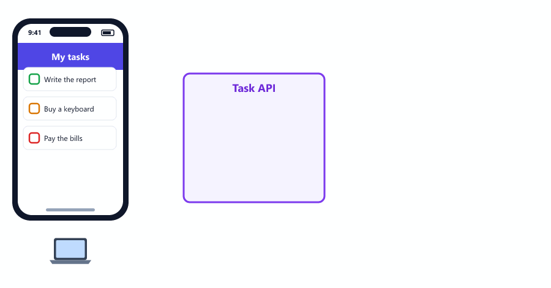

# Node.js Learning Path

A free, beginner-friendly course that takes you from your first line of Node.js to a complete, tested REST API.

There are **30 short sessions**. Each one is a single page you can read right here on GitHub. You learn one idea at a time, run real code, and build up to a final project: a **Task Management API** with Node.js, Express and MongoDB.

---

## Table of Contents

* [Who This Course Is For](#who-this-course-is-for)
* [What You Need](#what-you-need)
* [How to Use This Course](#how-to-use-this-course)
* [Course Outline](#course-outline)
* [Final Project](#final-project)
* [Tools You Will Learn](#tools-you-will-learn)
* [What You Will Be Able to Do](#what-you-will-be-able-to-do)
* [Repository Structure](#repository-structure)
* [Feedback](#feedback)

---

## Who This Course Is For

* Complete beginners to backend development
* Frontend developers who want to build their own APIs
* Students who want a clear, step-by-step path

No backend experience is needed.

---

## What You Need

| You need                   | Details                                                                 |
| -------------------------- | ----------------------------------------------------------------------- |
| Basic JavaScript           | Variables, functions, arrays, objects, `if` and loops                   |
| Node.js 24 (LTS) or newer  | Session 01 shows how to install it                                      |
| A code editor              | [VS Code](https://code.visualstudio.com/) is recommended                |
| A terminal                 | PowerShell or Git Bash on Windows, Terminal on macOS and Linux          |
| MongoDB (from Session 17)  | A free [MongoDB Atlas](https://www.mongodb.com/atlas) account or a local install. Session 17 shows both |

---

## How to Use This Course

**1. Open the first session.** Read it on GitHub, or download the course to read offline

```bash
git clone https://github.com/mohin-sheikh/nodejs-learning-path.git
cd nodejs-learning-path
```

**2. Go in order.** Every session builds on the ones before it.

**3. Type the code yourself.** Make a practice folder, type each example (do not copy and paste), run it, and compare your result with the output shown in the session.

**4. Practice before moving on.** Finish the exercises at the end of each session.

### What is inside each session

Every session has

* Simple explanations, one idea at a time
* Code examples that were run and tested, with the real output
* Practice exercises

Most sessions also have

* Animated diagrams that show how things work
* Common beginner mistakes, and how to fix them
* Interview questions to check your understanding

### How long it takes

Plan for **1 to 2 hours per session**. At one session a day, with time for practice, most learners finish in **4 to 6 weeks**.

---

## Course Outline

### Part 1: Getting Started

| #  | Session                                                   | You will learn                                         |
| -- | --------------------------------------------------------- | ------------------------------------------------------ |
| 01 | [Introduction to Node.js](01-introduction-to-nodejs.md)   | What Node.js is, how to install it, and running a file |
| 02 | [Project Setup and npm](02-project-setup-and-npm.md)      | `package.json`, installing packages, npm scripts       |
| 03 | [How Node.js Works](03-how-nodejs-works.md)               | The event loop, callbacks, promises, `async`/`await`   |
| 04 | [Modules and Imports](04-modules-and-imports.md)          | Splitting code into files with `require` and `module.exports` |

### Part 2: Core Modules

| #  | Session                                                     | You will learn                                     |
| -- | ----------------------------------------------------------- | -------------------------------------------------- |
| 05 | [File System Module](05-file-system-module.md)              | Reading and writing files, folders and JSON        |
| 06 | [Path Module](06-path-module.md)                            | Building file paths that work on every computer    |
| 07 | [OS Module](07-os-module.md)                                | System information and the `process` object        |
| 08 | [Events and EventEmitter](08-events-and-eventemitter.md)    | Creating and listening to your own events          |

### Part 3: Building Servers

| #  | Session                                                           | You will learn                                        |
| -- | ----------------------------------------------------------------- | ----------------------------------------------------- |
| 09 | [HTTP Module](09-http-module.md)                                  | How the web works, and a server with no framework     |
| 10 | [Building Your First Server](10-building-your-first-server.md)    | Routes, JSON responses and status codes               |
| 11 | [CRUD with Dummy Data](11-crud-operations-dummy-data.md)          | Create, read, update and delete data in memory        |

### Part 4: Express.js

| #  | Session                                                                       | You will learn                                     |
| -- | ----------------------------------------------------------------------------- | -------------------------------------------------- |
| 12 | [Introduction to Express.js](12-introduction-to-expressjs.md)                 | Your first Express 5 server                        |
| 13 | [Express Routing](13-express-routing.md)                                      | URL parameters, query strings and routers          |
| 14 | [Middleware](14-middleware.md)                                                | Code that runs before your routes                  |
| 15 | [Building REST APIs with Express](15-building-rest-apis-with-express.md)      | REST rules, validation and a clean response format |
| 16 | [Environment Variables](16-environment-variables-and-dotenv.md)               | Keeping settings and secrets in a `.env` file      |

### Part 5: Databases

| #  | Session                                                             | You will learn                                     |
| -- | ------------------------------------------------------------------- | -------------------------------------------------- |
| 17 | [MongoDB Introduction](17-mongodb-introduction.md)                  | Documents, collections, Atlas, Compass and mongosh |
| 18 | [MongoDB CRUD Operations](18-mongodb-crud-operations.md)            | Saving and finding data with the MongoDB driver    |
| 19 | [Mongoose](19-mongoose.md)                                          | Schemas, models, validation and relationships      |
| 20 | [Express + MongoDB CRUD API](20-express-mongodb-crud-api.md)        | A complete API with search, filters and pages      |
| 21 | [MVC Architecture](21-mvc-architecture.md)                          | Organizing code into models, views and controllers |

### Part 6: Security

| #  | Session                                                                 | You will learn                                         |
| -- | ----------------------------------------------------------------------- | ------------------------------------------------------ |
| 22 | [Authentication with JWT](22-authentication-using-jwt.md)               | Register, log in, protected routes and user roles      |
| 23 | [Password Hashing with bcrypt](23-password-hashing-using-bcrypt.md)     | Storing passwords safely and changing them             |

### Part 7: Production Skills

| #  | Session                                                                         | You will learn                                     |
| -- | ------------------------------------------------------------------------------- | -------------------------------------------------- |
| 24 | [Error Handling](24-error-handling.md)                                          | Catching errors so the server never crashes        |
| 25 | [File Uploads with Multer](25-file-uploads.md)                                  | Uploading and checking files safely                |
| 26 | [Logging](26-logging.md)                                                        | Useful logs with winston and morgan                |
| 27 | [API Documentation](27-api-documentation.md)                                    | Interactive docs with Swagger                      |
| 28 | [Testing APIs](28-testing-apis.md)                                              | Automated tests with Jest and Supertest            |
| 29 | [Project Structure Best Practices](29-project-structure-best-practices.md)      | A clean folder layout that grows with your app     |

### Part 8: Final Project

| #  | Session                                                     | You will learn                                     |
| -- | ----------------------------------------------------------- | -------------------------------------------------- |
| 30 | [Mini Project: Task Management API](30-mini-project.md)     | Putting everything together in one real project    |

---

## Final Project

In Session 30 you build the backend of a to-do app, step by step, using everything from Sessions 1 to 29.



Users can

* Register and log in
* Create, read, update and delete their own tasks
* Filter tasks by status, page by page
* See statistics, such as how many tasks are overdue
* Upload a profile picture
* Change their password and delete their account

The project also has

* Password hashing, login tokens and user roles
* Central error handling and logging
* Interactive API documentation at `/api-docs`
* 31 automated tests

---

## Tools You Will Learn

| Tool                                        | What it is for            | Session |
| ------------------------------------------- | ------------------------- | ------- |
| Node.js and npm                             | Running JavaScript on a server, installing packages | 01, 02 |
| Express                                     | Building web servers and APIs | 12 |
| dotenv                                      | Loading settings from a `.env` file | 16 |
| MongoDB and Mongoose                        | Storing data              | 17 to 19 |
| EJS                                         | Building HTML pages       | 21      |
| jsonwebtoken, bcryptjs                      | Login and passwords       | 22, 23  |
| Multer                                      | File uploads              | 25      |
| winston, morgan                             | Logging                   | 26      |
| swagger-jsdoc, swagger-ui-express           | API documentation         | 27      |
| Jest, Supertest, mongodb-memory-server      | Testing                   | 28      |
| helmet, cors, express-rate-limit            | Security                  | 14, 29  |

All code was tested with Node.js 24, Express 5 and Mongoose 9.

---

## What You Will Be Able to Do

After this course you will be able to

* Explain how Node.js works, including the event loop
* Build REST APIs with Express
* Store and query data in MongoDB
* Add sign-up, login and user roles
* Handle errors, file uploads and logging the right way
* Document and test your APIs
* Organize a project the way professional teams do

---

## Repository Structure

```text
nodejs-learning-path/
├── 01-introduction-to-nodejs.md     one file per session
├── 02-project-setup-and-npm.md
├── ...
├── 30-mini-project.md
├── images/                          animated diagrams, one folder per session
└── README.md
```

---

## Feedback

Found a mistake, or a part that is hard to understand? Please [open an issue](https://github.com/mohin-sheikh/nodejs-learning-path/issues) or send a pull request.

The code in this course is written for learning. Before putting an app online, read the security checklist and "Before You Deploy" in [Session 30](30-mini-project.md).

---

**Ready? Start with [Session 01: Introduction to Node.js](01-introduction-to-nodejs.md).**
